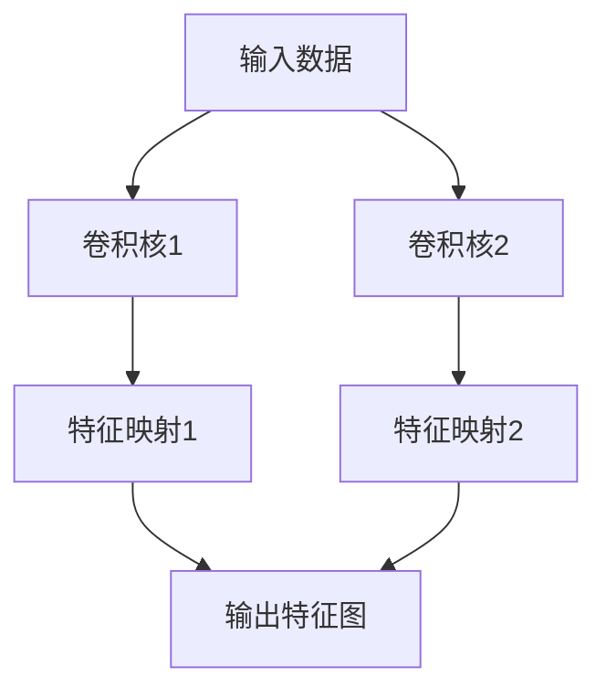
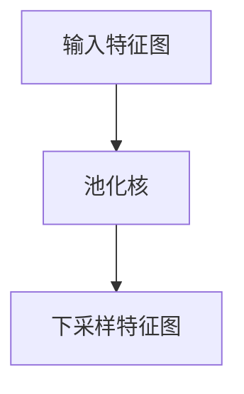
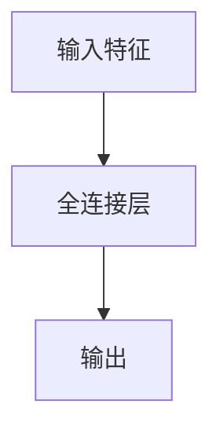
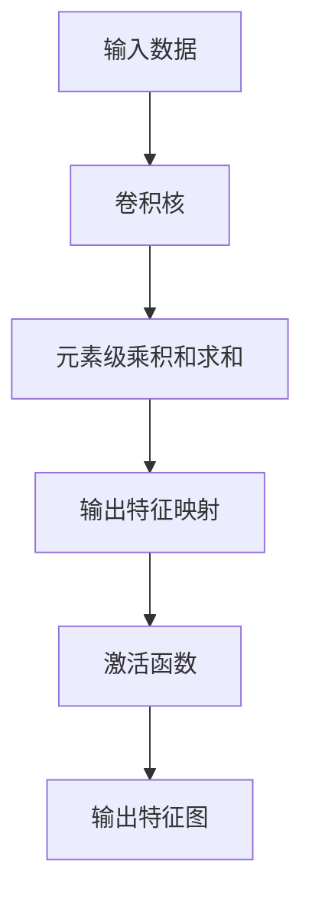
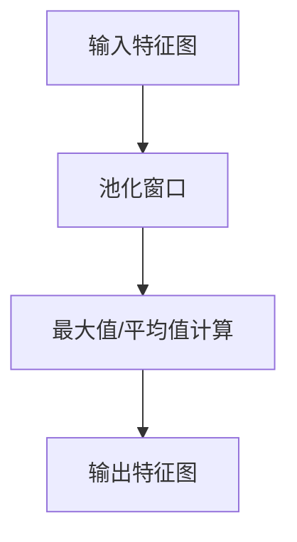
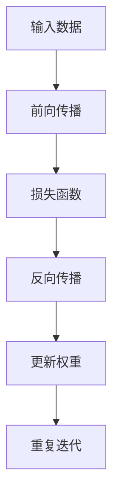

# 卷积神经网络(Convolutional Neural Networks) - 原理与代码实例讲解

## 1.背景介绍

### 1.1 神经网络简介

神经网络是一种受生物神经系统启发而设计的机器学习模型,旨在模拟人类大脑对信息的处理方式。传统的神经网络通过对输入数据进行加权求和和非线性变换,在多层网络中传递和处理信息,最终得到输出结果。

### 1.2 图像处理的挑战

在图像处理和计算机视觉领域,传统的神经网络在处理高维度图像数据时存在一些挑战:

- 参数过多:全连接层会导致参数过多,计算复杂度高
- 缺乏平移不变性:神经网络对图像的平移敏感
- 局部连接问题:无法有效捕捉图像的局部特征关系

### 1.3 卷积神经网络的产生

为了解决上述挑战,卷积神经网络(Convolutional Neural Networks, CNN)应运而生。CNN借鉴了生物视觉系统的分层次局部连接和权值共享的思想,通过卷积操作和池化操作,能够更好地捕捉图像的局部特征和空间关系,从而在图像识别、目标检测等计算机视觉任务中取得了巨大成功。

## 2.核心概念与联系

### 2.1 卷积层

卷积层是CNN的核心组成部分,它通过一个或多个卷积核(kernel)在输入数据上进行卷积操作,提取局部特征。卷积核就是一个小矩阵,通过在输入数据上滑动并进行元素级乘积和求和,得到输出特征映射。

卷积操作具有三个关键优势:

1. 局部连接:每个神经元只与输入数据的局部区域相连,减少了参数数量
2. 权值共享:同一卷积核的权重在整个输入数据上共享,进一步减少参数数量
3. 平移不变性:无论图像在什么位置,卷积核可以检测到同样的特征模式



### 2.2 池化层

池化层通常跟在卷积层之后,对卷积层的输出进行下采样,减小数据量并实现一定程度的平移不变性和噪声抑制。常用的池化操作包括最大池化(Max Pooling)和平均池化(Average Pooling)。



### 2.3 全连接层

在CNN的最后几层通常是全连接层,用于将前面卷积层和池化层提取的高级特征映射到最终的输出,如分类或回归任务。全连接层的每个神经元与前一层的所有神经元相连。



## 3.核心算法原理具体操作步骤

### 3.1 卷积操作

卷积操作是CNN中最关键的步骤,它通过卷积核在输入数据上滑动并进行元素级乘积和求和,提取局部特征。具体步骤如下:

1. 初始化卷积核权重,通常使用随机初始化或预训练的权重
2. 将卷积核在输入数据上滑动,对应元素相乘并求和
3. 将求和结果存储在输出特征映射的对应位置
4. 重复步骤2和3,直到卷积核在整个输入数据上滑动完毕
5. 对输出特征映射进行激活函数处理,如ReLU
6. 重复上述步骤,使用多个卷积核提取不同的特征



### 3.2 池化操作

池化操作通常在卷积层之后进行,目的是减小数据量并实现一定程度的平移不变性和噪声抑制。常用的池化操作包括最大池化和平均池化。

1. 最大池化(Max Pooling):在池化窗口内选取最大值作为输出
2. 平均池化(Average Pooling):在池化窗口内计算平均值作为输出

具体步骤如下:

1. 设定池化窗口大小,如2x2
2. 将池化窗口在输入特征图上滑动
3. 根据池化类型(最大值或平均值)计算池化窗口内的输出值
4. 将输出值存储在输出特征图的对应位置
5. 重复步骤2到4,直到池化窗口在整个输入特征图上滑动完毕



### 3.3 前向传播和反向传播

CNN的训练过程遵循反向传播算法,通过前向传播和反向传播来更新网络权重,最小化损失函数。

1. 前向传播:
   - 输入数据通过卷积层、池化层和全连接层传递
   - 在每一层进行相应的操作,如卷积、池化、激活函数等
   - 计算最终输出和损失函数值

2. 反向传播:
   - 计算损失函数关于输出的梯度
   - 利用链式法则,逐层计算梯度,进行反向传播
   - 更新每一层的权重和偏置,使用优化算法如SGD、Adam等

3. 重复上述过程,直到模型收敛或达到预设的迭代次数



## 4.数学模型和公式详细讲解举例说明

### 4.1 卷积操作数学模型

卷积操作可以用数学公式表示为:

$$
S(i, j) = (I * K)(i, j) = \sum_{m}\sum_{n}I(i+m, j+n)K(m, n)
$$

其中:

- $I$是输入数据
- $K$是卷积核
- $S$是输出特征映射
- $m$和$n$是卷积核的索引

例如,对于一个3x3的卷积核和5x5的输入数据,卷积操作的过程如下:

$$
\begin{bmatrix}
1 & 0 & 1 & 0 & 1\\
0 & 1 & 0 & 1 & 0\\
1 & 0 & 1 & 0 & 1\\
0 & 1 & 0 & 1 & 0\\
1 & 0 & 1 & 0 & 1
\end{bmatrix}
*
\begin{bmatrix}
1 & 1 & 1\\
1 & 1 & 1\\
1 & 1 & 1
\end{bmatrix}
=
\begin{bmatrix}
5 & 3 & 5\\
3 & 5 & 3\\
5 & 3 & 5
\end{bmatrix}
$$

### 4.2 池化操作数学模型

最大池化和平均池化可以用数学公式表示为:

最大池化:
$$
\text{max\_pool}(X)_{i, j} = \max_{m, n}X_{i+m, j+n}
$$

平均池化:
$$
\text{avg\_pool}(X)_{i, j} = \frac{1}{mn}\sum_{m}\sum_{n}X_{i+m, j+n}
$$

其中:

- $X$是输入特征图
- $m$和$n$是池化窗口的索引
- $i$和$j$是输出特征图的索引

例如,对于一个2x2的池化窗口和4x4的输入特征图,最大池化和平均池化的过程如下:

最大池化:
$$
\begin{bmatrix}
1 & 3 & 2 & 4\\
5 & 6 & 7 & 8\\
9 & 1 & 2 & 3\\
4 & 5 & 6 & 7
\end{bmatrix}
\xrightarrow{\text{max\_pool}}
\begin{bmatrix}
6 & 8\\
9 & 6
\end{bmatrix}
$$

平均池化:
$$
\begin{bmatrix}
1 & 3 & 2 & 4\\
5 & 6 & 7 & 8\\
9 & 1 & 2 & 3\\
4 & 5 & 6 & 7
\end{bmatrix}
\xrightarrow{\text{avg\_pool}}
\begin{bmatrix}
3.5 & 5.5\\
4.5 & 4.5
\end{bmatrix}
$$

## 5.项目实践：代码实例和详细解释说明

以下是使用PyTorch实现卷积神经网络的代码示例,用于手写数字识别任务。

### 5.1 导入必要的库

```python
import torch
import torch.nn as nn
import torchvision
import torchvision.transforms as transforms
```

### 5.2 定义卷积神经网络模型

```python
class ConvNet(nn.Module):
    def __init__(self):
        super(ConvNet, self).__init__()
        self.conv1 = nn.Conv2d(1, 10, kernel_size=5)
        self.conv2 = nn.Conv2d(10, 20, kernel_size=5)
        self.pool = nn.MaxPool2d(2, 2)
        self.fc1 = nn.Linear(320, 50)
        self.fc2 = nn.Linear(50, 10)

    def forward(self, x):
        x = self.pool(nn.functional.relu(self.conv1(x)))
        x = self.pool(nn.functional.relu(self.conv2(x)))
        x = x.view(-1, 320)
        x = nn.functional.relu(self.fc1(x))
        x = self.fc2(x)
        return x
```

- `nn.Conv2d`定义了卷积层,第一个参数是输入通道数,第二个参数是输出通道数,第三个参数是卷积核大小
- `nn.MaxPool2d`定义了最大池化层,第一个参数是池化窗口大小,第二个参数是步长
- `nn.Linear`定义了全连接层,第一个参数是输入特征数,第二个参数是输出特征数
- `forward`函数定义了模型的前向传播过程

### 5.3 加载数据集

```python
transform = transforms.Compose([transforms.ToTensor(), transforms.Normalize((0.5,), (0.5,))])
trainset = torchvision.datasets.MNIST(root='./data', train=True, download=True, transform=transform)
testset = torchvision.datasets.MNIST(root='./data', train=False, download=True, transform=transform)
trainloader = torch.utils.data.DataLoader(trainset, batch_size=4, shuffle=True)
testloader = torch.utils.data.DataLoader(testset, batch_size=4, shuffle=False)
```

- 使用`torchvision.datasets.MNIST`加载手写数字数据集
- `transforms.ToTensor`将图像转换为张量
- `transforms.Normalize`对图像进行归一化处理
- `torch.utils.data.DataLoader`创建数据加载器,用于批量加载数据

### 5.4 训练模型

```python
model = ConvNet()
criterion = nn.CrossEntropyLoss()
optimizer = torch.optim.SGD(model.parameters(), lr=0.001, momentum=0.9)

for epoch in range(10):
    running_loss = 0.0
    for i, data in enumerate(trainloader, 0):
        inputs, labels = data
        optimizer.zero_grad()
        outputs = model(inputs)
        loss = criterion(outputs, labels)
        loss.backward()
        optimizer.step()
        running_loss += loss.item()
        if i % 2000 == 1999:
            print('[%d, %5d] loss: %.3f' % (epoch + 1, i + 1, running_loss / 2000))
            running_loss = 0.0

print('Finished Training')
```

- 创建模型实例`model`
- 定义损失函数`criterion`为交叉熵损失
- 定义优化器`optimizer`为随机梯度下降(SGD)
- 进行多个epoch的训练
- 每个epoch遍历训练数据集
- 计算前向传播输出和损失函数
- 反向传播更新模型参数
- 打印训练过程中的损失值

### 5.5 评估模型

```python
correct = 0
total = 0
with torch.no_grad():
    for data in testloader:
        images, labels = data
        outputs = model(images)
        _, predicted = torch.max(outputs.data, 1)
        total += labels.size(0)
        correct += (predicted == labels).sum().item()

print('Accuracy of the network on the