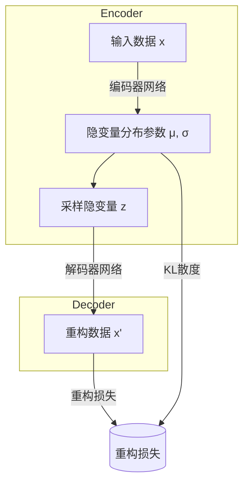

# 变分自编码器 (Variational Autoencoders, VAE) 原理与代码实例讲解

## 1. 背景介绍

### 1.1 自编码器简介

自编码器(Autoencoder)是一种无监督学习的神经网络模型,其目标是通过神经网络将输入数据压缩编码为低维的隐藏层表示,然后再将该隐藏层表示解码还原为与输入数据尽可能接近的输出。自编码器可以学习到数据的紧致表示,从而实现降维和特征提取。

传统自编码器存在一些局限性,例如学到的特征表示可能过于局部化,难以捕捉数据的全局结构。为了解决这个问题,变分自编码器(Variational Autoencoder, VAE)应运而生。

### 1.2 变分自编码器概述

变分自编码器是一种生成模型,它在自编码器的基础上引入了隐变量(Latent Variable)和变分推理(Variational Inference)的概念。VAE假设输入数据是由一些潜在的、不可观测的隐变量生成的,它通过最大化边际似然函数来学习隐变量的概率分布,从而捕捉数据的整体结构和规律。

与传统自编码器相比,VAE具有以下优势:

1. **生成能力**: VAE可以从学习到的隐变量分布中采样,生成新的数据样本。
2. **平滑的数据表示**: VAE学习到的隐变量空间是连续的,因此可以通过在隐空间中进行插值来生成平滑变化的数据。
3. **鲁棒性**: VAE对噪声和缺失数据具有一定的鲁棒性。

VAE已被广泛应用于图像生成、语音合成、机器翻译等领域。接下来,我们将深入探讨VAE的核心概念、算法原理和实现细节。

## 2. 核心概念与联系

### 2.1 生成模型与隐变量

VAE属于生成模型的范畴。生成模型旨在学习数据的潜在分布,从而能够生成新的样本。在VAE中,我们假设观测数据 $\boldsymbol{x}$ 是由一些潜在的、不可观测的隐变量 $\boldsymbol{z}$ 生成的。具体来说,VAE定义了以下生成过程:

$$
\begin{aligned}
p_{\theta}(\boldsymbol{x}, \boldsymbol{z}) &=p_{\theta}(\boldsymbol{x} | \boldsymbol{z}) p_{\theta}(\boldsymbol{z}) \\
&=p_{\theta}(\boldsymbol{x} | \boldsymbol{z}) p(\boldsymbol{z})
\end{aligned}
$$

其中:

- $p_{\theta}(\boldsymbol{x} | \boldsymbol{z})$ 是解码器(Decoder),它定义了在给定隐变量 $\boldsymbol{z}$ 的条件下,生成观测数据 $\boldsymbol{x}$ 的概率分布。
- $p(\boldsymbol{z})$ 是隐变量的先验分布,通常假设为标准正态分布 $\mathcal{N}(\boldsymbol{0}, \boldsymbol{I})$。
- $\theta$ 表示解码器的参数。

### 2.2 变分推理

在VAE中,我们无法直接观测到隐变量 $\boldsymbol{z}$,因此需要根据观测数据 $\boldsymbol{x}$ 来推断隐变量的分布 $p_{\theta}(\boldsymbol{z} | \boldsymbol{x})$。然而,由于解码器 $p_{\theta}(\boldsymbol{x} | \boldsymbol{z})$ 的复杂性,直接计算 $p_{\theta}(\boldsymbol{z} | \boldsymbol{x})$ 是非常困难的。

为了解决这个问题,VAE采用了变分推理(Variational Inference)的方法。具体来说,我们引入一个近似的、可以高效计算的概率分布 $q_{\phi}(\boldsymbol{z} | \boldsymbol{x})$,称为变分分布(Variational Distribution),来近似真实的后验分布 $p_{\theta}(\boldsymbol{z} | \boldsymbol{x})$。变分分布 $q_{\phi}(\boldsymbol{z} | \boldsymbol{x})$ 由编码器(Encoder)网络参数化,其中 $\phi$ 表示编码器的参数。

### 2.3 证据下界

为了学习VAE的参数 $\theta$ 和 $\phi$,我们需要最大化观测数据 $\boldsymbol{x}$ 的边际对数似然 $\log p_{\theta}(\boldsymbol{x})$。然而,由于涉及到隐变量的积分,直接最大化 $\log p_{\theta}(\boldsymbol{x})$ 是困难的。

VAE的核心思想是通过最大化证据下界(Evidence Lower Bound, ELBO)来间接最大化 $\log p_{\theta}(\boldsymbol{x})$。ELBO可以表示为:

$$
\begin{aligned}
\mathcal{L}(\theta, \phi ; \boldsymbol{x}) &=\mathbb{E}_{q_{\phi}(\boldsymbol{z} | \boldsymbol{x})}\left[\log p_{\theta}(\boldsymbol{x} | \boldsymbol{z})\right]-D_{\mathrm{KL}}\left(q_{\phi}(\boldsymbol{z} | \boldsymbol{x}) \| p(\boldsymbol{z})\right) \\
&\leq \log p_{\theta}(\boldsymbol{x})
\end{aligned}
$$

其中:

- 第一项 $\mathbb{E}_{q_{\phi}(\boldsymbol{z} | \boldsymbol{x})}\left[\log p_{\theta}(\boldsymbol{x} | \boldsymbol{z})\right]$ 是重构项(Reconstruction Term),它衡量了在给定隐变量 $\boldsymbol{z}$ 的条件下,解码器重构观测数据 $\boldsymbol{x}$ 的能力。
- 第二项 $D_{\mathrm{KL}}\left(q_{\phi}(\boldsymbol{z} | \boldsymbol{x}) \| p(\boldsymbol{z})\right)$ 是KL散度项(KL Divergence Term),它衡量了变分分布 $q_{\phi}(\boldsymbol{z} | \boldsymbol{x})$ 与隐变量先验分布 $p(\boldsymbol{z})$ 之间的差异。

通过最大化ELBO,我们可以同时优化解码器参数 $\theta$ 和编码器参数 $\phi$,从而学习到合适的隐变量分布和生成模型。

## 3. 核心算法原理具体操作步骤

### 3.1 VAE的基本架构

VAE的基本架构由两部分组成:编码器(Encoder)和解码器(Decoder)。

**编码器**:编码器是一个神经网络,它将输入数据 $\boldsymbol{x}$ 映射到隐变量 $\boldsymbol{z}$ 的分布参数。通常,编码器会输出隐变量的均值 $\boldsymbol{\mu}$ 和标准差 $\boldsymbol{\sigma}$,从而参数化一个高斯分布 $\mathcal{N}(\boldsymbol{\mu}, \boldsymbol{\sigma}^2\boldsymbol{I})$。在训练过程中,我们从该高斯分布中采样隐变量 $\boldsymbol{z}$。

**解码器**:解码器是另一个神经网络,它将隐变量 $\boldsymbol{z}$ 映射回原始数据空间,生成重构数据 $\boldsymbol{x}^{\prime}$。解码器的输出通常是观测数据 $\boldsymbol{x}$ 的分布参数,例如对于连续数据,可以输出高斯分布的均值和标准差。

下图展示了VAE的基本架构:

### 3.2 训练过程

VAE的训练过程可以概括为以下步骤:

1. **前向传播**:将输入数据 $\boldsymbol{x}$ 输入到编码器,获得隐变量分布参数 $\boldsymbol{\mu}$ 和 $\boldsymbol{\sigma}$。然后从该分布中采样隐变量 $\boldsymbol{z}$。
2. **解码**:将采样的隐变量 $\boldsymbol{z}$ 输入到解码器,获得重构数据 $\boldsymbol{x}^{\prime}$。
3. **计算损失函数**:计算重构损失 $\log p_{\theta}(\boldsymbol{x} | \boldsymbol{z})$ 和KL散度损失 $D_{\mathrm{KL}}\left(q_{\phi}(\boldsymbol{z} | \boldsymbol{x}) \| p(\boldsymbol{z})\right)$,并将它们相加作为总损失函数。
4. **反向传播**:计算损失函数对编码器和解码器参数的梯度,并使用优化器(如Adam)更新参数。

需要注意的是,由于隐变量 $\boldsymbol{z}$ 是从一个随机分布中采样的,因此在反向传播时需要使用重参数技巧(Reparameterization Trick)来估计梯度。

### 3.3 生成新样本

训练完成后,VAE可以用于生成新的样本。生成过程如下:

1. 从隐变量的先验分布 $p(\boldsymbol{z})$ 中采样一个隐变量 $\boldsymbol{z}$。
2. 将采样的隐变量 $\boldsymbol{z}$ 输入到解码器,获得生成的数据样本 $\boldsymbol{x}^{\prime}$。

由于隐变量空间是连续的,我们还可以通过在隐空间中进行插值来生成平滑变化的数据样本。

## 4. 数学模型和公式详细讲解举例说明

在上一节中,我们介绍了VAE的核心概念和算法原理。现在,我们将更深入地探讨VAE的数学模型和公式。

### 4.1 VAE的生成过程

如前所述,VAE定义了以下生成过程:

$$
\begin{aligned}
p_{\theta}(\boldsymbol{x}, \boldsymbol{z}) &=p_{\theta}(\boldsymbol{x} | \boldsymbol{z}) p_{\theta}(\boldsymbol{z}) \\
&=p_{\theta}(\boldsymbol{x} | \boldsymbol{z}) p(\boldsymbol{z})
\end{aligned}
$$

其中:

- $p_{\theta}(\boldsymbol{x} | \boldsymbol{z})$ 是解码器,它定义了在给定隐变量 $\boldsymbol{z}$ 的条件下,生成观测数据 $\boldsymbol{x}$ 的概率分布。对于连续数据,通常假设 $p_{\theta}(\boldsymbol{x} | \boldsymbol{z})$ 是一个高斯分布,即:

$$
p_{\theta}(\boldsymbol{x} | \boldsymbol{z})=\mathcal{N}\left(\boldsymbol{x} ; f_{\theta}(\boldsymbol{z}), \sigma^{2} \boldsymbol{I}\right)
$$

其中 $f_{\theta}(\boldsymbol{z})$ 是解码器网络的输出,表示观测数据 $\boldsymbol{x}$ 的均值,而 $\sigma^{2}$ 是固定的方差。

- $p(\boldsymbol{z})$ 是隐变量的先验分布,通常假设为标准正态分布 $\mathcal{N}(\boldsymbol{0}, \boldsymbol{I})$。

### 4.2 变分推理和证据下界

由于无法直接计算后验分布 $p_{\theta}(\boldsymbol{z} | \boldsymbol{x})$,VAE引入了变分分布 $q_{\phi}(\boldsymbol{z} | \boldsymbol{x})$ 来近似它。通常,我们假设变分分布也是一个高斯分布,即:

$$
q_{\phi}(\boldsymbol{z} | \boldsymbol{x})=\mathcal{N}\left(\boldsymbol{z} ; \boldsymbol{\mu}_{\phi}(\boldsymbol{x}), \operatorname{diag}\left(\boldsymbol{\sigma}_{\phi}^{2}(\boldsymbol{x})\right)\right)
$$

其中 $\boldsymbol{\mu}_{\phi}(\boldsymbol{x})$ 和 $\boldsymbol{\sigma}_{\phi}^{2}(\boldsymbol{x})$ 分别是编码器网络输出的均值和方差。

为了学习