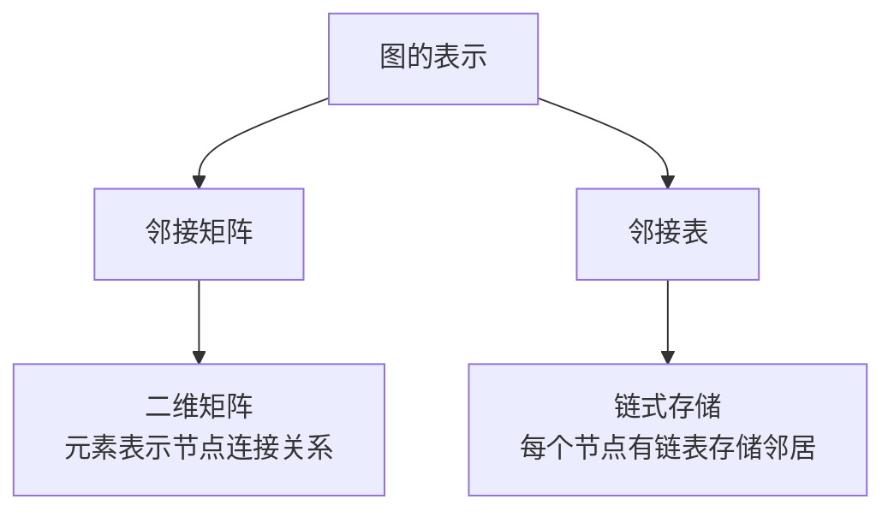
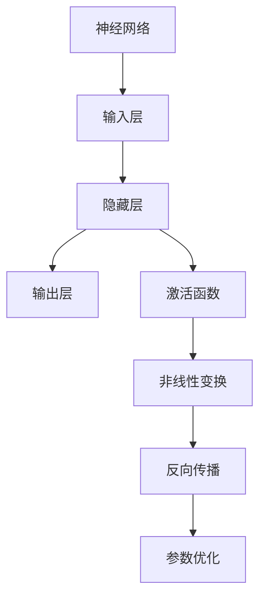
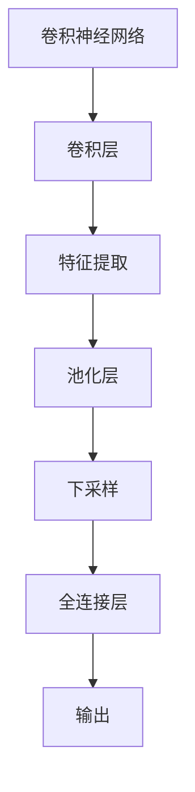
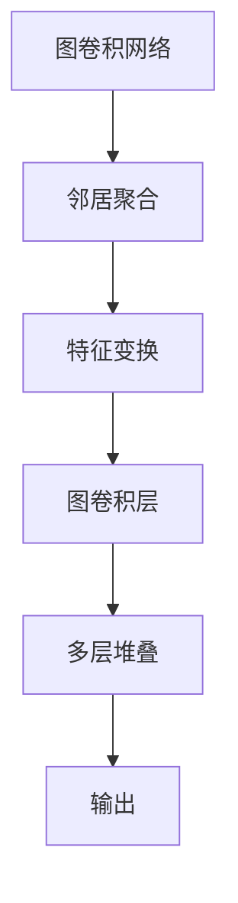
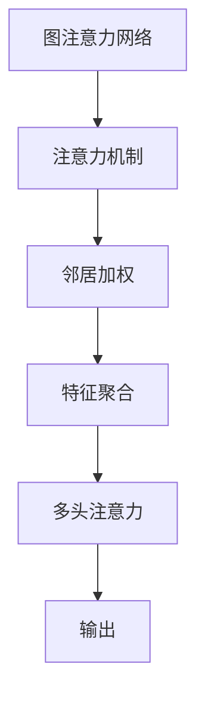
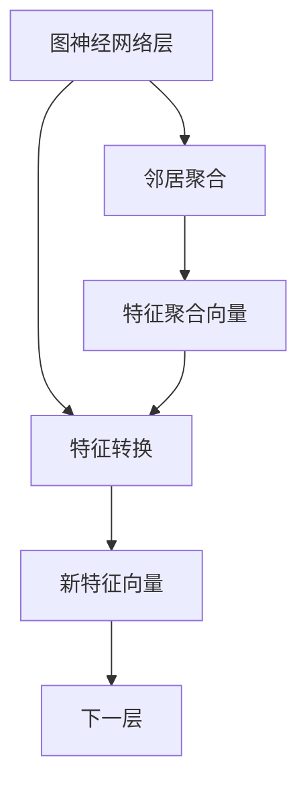

# 图神经网络 原理与代码实例讲解

## 1.背景介绍

### 1.1 图数据的重要性

在现实世界中,许多复杂的系统都可以用图的形式来表示和建模。图是一种非常通用和强大的数据结构,可以自然地描述物体之间的相互关系和拓扑结构。例如,社交网络可以用图来表示用户之间的关系;交通网络可以用图来表示路径和节点之间的连接;分子结构可以用图来表示原子之间的化学键;知识图谱可以用图来表示概念和实体之间的关系等。

随着数据的快速增长,图数据在许多领域扮演着越来越重要的角色,成为了大数据时代的核心数据结构之一。然而,由于图数据的非欧几里德性质和复杂拓扑结构,传统的机器学习算法很难直接应用于图数据。因此,如何高效地表示和处理图数据,从而挖掘图数据中蕴含的丰富模式和知识,成为了当前人工智能领域的一个重要挑战。

### 1.2 图神经网络的兴起

为了解决上述挑战,近年来图神经网络(Graph Neural Networks, GNNs)作为一种新型的深度学习架构应运而生,并迅速成为了图数据挖掘的研究热点。图神经网络是一种将神经网络与图数据结构相结合的新型神经网络模型,它可以直接对图数据进行端到端的学习,自动提取图数据中的拓扑结构信息和节点/边的特征信息,并将其融合到下游的机器学习任务中。

图神经网络的核心思想是通过迭代的邻居聚合和特征转换操作,在图的节点上传播和更新特征信息,从而学习到节点的嵌入表示。这种嵌入表示不仅包含了节点自身的特征信息,还融合了节点所在图拓扑结构的上下文信息,因此能够更好地捕捉图数据的本质特征。基于这种节点级别的嵌入表示,图神经网络可以解决诸如节点分类、链接预测、图分类等各种图相关的下游任务。

图神经网络凭借其强大的表示能力和良好的泛化性能,在诸多领域取得了卓越的成绩,例如社交网络分析、计算机视觉、自然语言处理、生物信息学、交通预测、知识图谱推理等,成为了当前图数据挖掘的主流方法之一。本文将全面介绍图神经网络的基本原理、核心算法、实现细节和应用案例,为读者提供一个系统的认识和实践指南。

## 2.核心概念与联系

在深入探讨图神经网络的细节之前,我们首先需要理解一些基本概念和相关联的技术。

### 2.1 图的表示

在计算机中,图通常用邻接矩阵或邻接表的形式来表示。邻接矩阵是一种二维矩阵,其中每个元素表示两个节点之间是否存在边。邻接表则是一种链式存储结构,每个节点都有一个链表,用于存储与该节点相邻的节点。

### 2.2 神经网络

神经网络是一种受生物神经系统启发的机器学习模型,由多层神经元组成。每个神经元接收来自前一层的输入,经过激活函数的非线性变换后,将输出传递给下一层。通过反向传播算法对网络参数进行优化训练,神经网络可以学习到输入数据的内在特征表示。

### 2.3 卷积神经网络

卷积神经网络(Convolutional Neural Networks, CNNs)是一种专门用于处理网格结构数据(如图像)的神经网络。它通过卷积操作在局部区域提取特征,并通过池化操作对特征进行下采样,从而捕捉输入数据的空间和结构信息。卷积神经网络在计算机视觉等领域取得了巨大成功。

### 2.4 图卷积网络

受到卷积神经网络在处理网格结构数据的启发,研究者们提出了图卷积网络(Graph Convolutional Networks, GCNs),将卷积操作推广到了图结构数据。图卷积网络通过在图的邻域上进行特征聚合和变换,从而捕捉图数据的拓扑结构信息。图卷积网络是图神经网络的一种重要分支,为后来的图神经网络发展奠定了基础。

### 2.5 图注意力网络

图注意力网络(Graph Attention Networks, GATs)是另一种广为人知的图神经网络模型。它借鉴了注意力机制的思想,通过为每个节点的邻居分配不同的注意力权重,从而自适应地选择更重要的邻居进行特征聚合。图注意力网络能够捕捉图数据中更加细粒度的结构信息,在许多任务上表现出色。

上述概念和技术为图神经网络的发展奠定了基础,图神经网络在这些基础上进行了创新和扩展,形成了一个蓬勃发展的新兴研究领域。接下来,我们将深入探讨图神经网络的核心算法原理和实现细节。

## 3.核心算法原理具体操作步骤

图神经网络的核心思想是在图的节点上进行特征传播和转换,从而学习到节点的嵌入表示。这个过程通常包括以下几个关键步骤:

### 3.1 邻居聚合

在每一层的图神经网络中,每个节点的特征向量都会被更新。更新的方式是,首先从该节点的邻居节点收集特征信息,然后将这些信息进行聚合。

具体地,对于一个节点 $v$,我们从它的邻居节点 $\mathcal{N}(v)$ 中收集特征向量 $\{\mathbf{h}_u^{(l-1)}, u \in \mathcal{N}(v)\}$,其中 $l$ 表示当前层数,$(l-1)$ 表示上一层。然后,我们使用一个可微分的邻居聚合函数 $\textrm{AGGREGATE}$ 将这些特征向量聚合成一个综合向量 $\mathbf{h}_{\mathcal{N}(v)}^{(l-1)}$:

$$\mathbf{h}_{\mathcal{N}(v)}^{(l-1)} = \textrm{AGGREGATE}\left(\left\{\mathbf{h}_u^{(l-1)}, u \in \mathcal{N}(v)\right\}\right)$$

常见的聚合函数包括均值、求和、最大池化等。

### 3.2 特征转换

在完成邻居聚合之后,我们需要将当前节点的特征向量 $\mathbf{h}_v^{(l-1)}$ 与邻居聚合向量 $\mathbf{h}_{\mathcal{N}(v)}^{(l-1)}$ 进行组合,并通过一个可微分的更新函数 $\textrm{UPDATE}$ 来计算该节点在当前层的新特征向量 $\mathbf{h}_v^{(l)}$:

$$\mathbf{h}_v^{(l)} = \textrm{UPDATE}\left(\mathbf{h}_v^{(l-1)}, \mathbf{h}_{\mathcal{N}(v)}^{(l-1)}\right)$$

常见的更新函数包括多层感知机(MLP)、门控循环单元(GRU)等。

### 3.3 层间传播

上述邻居聚合和特征转换的过程会在图神经网络的每一层重复进行,从而实现特征在整个图上的层层传播。在最后一层,每个节点的特征向量 $\mathbf{h}_v^{(L)}$ 就是该节点的最终嵌入表示,其中 $L$ 表示网络的总层数。

通过上述迭代的邻居聚合和特征转换操作,图神经网络能够在图的节点上传播和更新特征信息,从而学习到节点的嵌入表示。这种嵌入表示不仅包含了节点自身的特征信息,还融合了节点所在图拓扑结构的上下文信息,因此能够更好地捕捉图数据的本质特征。

不同的图神经网络模型主要在于它们采用了不同的邻居聚合函数和特征转换函数。例如,图卷积网络(GCN)使用了基于拉普拉斯矩阵的特殊卷积操作作为聚合函数;图注意力网络(GAT)则采用了自注意力机制来自适应地为邻居分配不同的权重。我们将在后面的章节中介绍一些具体的图神经网络模型及其实现细节。

## 4.数学模型和公式详细讲解举例说明

在上一节中,我们概括性地介绍了图神经网络的核心算法原理。在这一节中,我们将通过一个具体的图神经网络模型——图卷积网络(GCN),来详细讲解图神经网络的数学模型和公式推导过程。

### 4.1 图卷积网络(GCN)

图卷积网络(GCN)是一种经典的图神经网络模型,它将卷积操作从欧几里得数据(如图像)推广到了非欧几里得的图结构数据。GCN的核心思想是在图的邻域上进行特征聚合和变换,从而捕捉图数据的拓扑结构信息。

#### 4.1.1 图卷积的定义

在欧几里得空间中,卷积操作可以用卷积核在局部邻域上对输入数据进行加权求和来定义。类似地,在图上进行卷积操作也需要在节点的邻域上对特征进行加权求和。

具体地,对于一个节点 $v$,我们定义其 $l$ 层的输出特征向量 $\mathbf{h}_v^{(l)}$ 为:

$$\mathbf{h}_v^{(l)} = \sigma\left(\sum_{u \in \mathcal{N}(v)} \frac{1}{\sqrt{d_v d_u}} \mathbf{W}^{(l)} \mathbf{h}_u^{(l-1)}\right)$$

其中:

- $\mathcal{N}(v)$ 表示节点 $v$ 的邻居集合;
- $d_v$ 和 $d_u$ 分别表示节点 $v$ 和 $u$ 的度数,用于归一化;
- $\mathbf{W}^{(l)}$ 是当前层的可训练权重矩阵,用于特征转换;
- $\sigma(\cdot)$ 是非线性激活函数,如 ReLU。

上式中的 $\frac{1}{\sqrt{d_v d_u}}$ 项是一种常见的归一化方式,可以防止梯度爆炸或者消失。

#### 4.1.2 基于拉普拉斯矩阵的图卷积

上面的图卷积定义还存在一些问题,例如缺乏空间关系的描述、无法处理无向图等。为了解决这些问题,GCN 提出了一种基于拉普拉斯矩阵的图卷积形