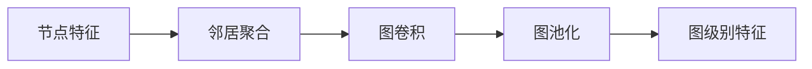

# 图神经网络(Graph Neural Networks) - 原理与代码实例讲解

## 1. 背景介绍

### 1.1 图神经网络的兴起

近年来,随着深度学习技术的快速发展,图神经网络(Graph Neural Networks, GNNs)作为一种新兴的深度学习模型,在处理图结构数据方面表现出了卓越的性能。图神经网络能够有效地学习图结构数据中的节点特征和拓扑结构信息,并广泛应用于社交网络分析、推荐系统、生物信息学等诸多领域。

### 1.2 图结构数据的特点

与传统的结构化数据(如表格数据)和非结构化数据(如文本、图像)不同,图结构数据具有以下独特的特点:

1. 节点之间存在复杂的拓扑结构关系。
2. 节点可能携带丰富的属性信息。
3. 图的结构和规模可能是动态变化的。

这些特点使得传统的机器学习模型难以直接应用于图结构数据,因此需要专门设计针对图数据的深度学习模型。

### 1.3 图神经网络的优势

图神经网络相比于传统的机器学习方法,在处理图结构数据时具有以下优势:

1. 能够自动学习节点的特征表示。
2. 能够捕捉节点之间的复杂拓扑结构关系。
3. 具有较强的泛化能力,可以处理未见过的图结构。

正是由于这些优势,图神经网络受到了学术界和工业界的广泛关注,并在多个领域取得了突破性的进展。

## 2. 核心概念与联系

### 2.1 图的基本概念

在介绍图神经网络之前,我们首先需要了解图的一些基本概念:

- 节点(Node):图中的基本单元,表示实体对象。
- 边(Edge):连接两个节点,表示节点之间的关系。
- 属性(Attribute):节点或边上附加的信息,用于描述其特征。

一个图$G$可以表示为 $G=(V, E)$,其中$V$表示节点集合,$E$表示边集合。

### 2.2 图神经网络的核心思想

图神经网络的核心思想是通过迭代地聚合节点的邻居信息来更新节点的特征表示,从而学习到节点的高级特征表示。具体而言,图神经网络主要包含以下几个关键组件:

1. 节点特征(Node Features):每个节点都有一个特征向量,用于表示节点的属性信息。
2. 邻居聚合(Neighborhood Aggregation):通过聚合节点的邻居信息来更新节点的特征表示。
3. 图卷积(Graph Convolution):类似于卷积神经网络中的卷积操作,在图上进行特征提取和传播。
4. 图池化(Graph Pooling):将图的节点特征聚合为图级别的特征表示。

下图展示了图神经网络的核心思想和组件之间的关系:

### 2.3 图卷积的类型

图卷积是图神经网络中的核心操作,它将节点的特征与其邻居的特征进行聚合,从而更新节点的特征表示。目前主要有以下几种图卷积的类型:

1. 谱卷积(Spectral Convolution):基于图的拉普拉斯矩阵的特征分解,在频域上定义卷积操作。
2. 空间卷积(Spatial Convolution):直接在图的空间域上定义卷积操作,通过聚合节点的邻居信息来更新节点特征。
3. 注意力机制(Attention Mechanism):引入注意力机制来自适应地聚合邻居信息,赋予不同邻居不同的重要性。

不同类型的图卷积各有优缺点,可以根据具体任务和数据特点来选择合适的图卷积方式。

## 3. 核心算法原理具体操作步骤

### 3.1 空间图卷积

空间图卷积是图神经网络中最常用的卷积操作,它直接在图的空间域上定义卷积操作。具体步骤如下:

1. 对于图中的每个节点$v_i$,获取其邻居节点集合$N(v_i)$。
2. 将节点$v_i$的特征向量$h_i$与其邻居节点的特征向量$h_j$进行聚合,得到节点$v_i$的新特征向量$h'_i$:

$$h'_i = \sigma(\sum_{j \in N(v_i)} \frac{1}{c_{ij}} W h_j + b)$$

其中,$\sigma$是激活函数,$W$是权重矩阵,$b$是偏置项,$c_{ij}$是归一化常数(如度数)。

3. 重复步骤1和2,直到所有节点的特征向量都更新完毕。

通过多次迭代地执行空间图卷积,可以逐层提取节点的高级特征表示。

### 3.2 图注意力网络

图注意力网络(Graph Attention Networks, GATs)是一种引入注意力机制的图神经网络,它可以自适应地聚合邻居信息。具体步骤如下:

1. 对于图中的每个节点$v_i$,获取其邻居节点集合$N(v_i)$。
2. 计算节点$v_i$与其邻居节点$v_j$之间的注意力权重$\alpha_{ij}$:

$$\alpha_{ij} = \frac{\exp(\text{LeakyReLU}(a^T[Wh_i || Wh_j]))}{\sum_{k \in N(v_i)} \exp(\text{LeakyReLU}(a^T[Wh_i || Wh_k]))}$$

其中,$a$是注意力向量,$W$是权重矩阵,$||$表示拼接操作。

3. 利用注意力权重$\alpha_{ij}$对邻居节点的特征向量进行加权聚合,得到节点$v_i$的新特征向量$h'_i$:

$$h'_i = \sigma(\sum_{j \in N(v_i)} \alpha_{ij} W h_j)$$

4. 重复步骤1到3,直到所有节点的特征向量都更新完毕。

通过引入注意力机制,图注意力网络可以自适应地聚合邻居信息,赋予不同邻居不同的重要性,提高了模型的表达能力。

### 3.3 图池化

图池化是将节点级别的特征聚合为图级别特征的操作,常用于图分类任务。以最简单的平均池化为例,具体步骤如下:

1. 对于图$G$中的所有节点$\{v_1, v_2, ..., v_n\}$,获取它们的特征向量$\{h_1, h_2, ..., h_n\}$。
2. 对所有节点的特征向量进行平均,得到图级别的特征向量$h_G$:

$$h_G = \frac{1}{n} \sum_{i=1}^n h_i$$

3. 将图级别的特征向量$h_G$用于后续的图分类任务。

除了平均池化,还有其他类型的图池化操作,如最大池化、注意力池化等,可以根据具体任务来选择合适的池化方式。

## 4. 数学模型和公式详细讲解举例说明

### 4.1 图卷积的数学模型

图卷积的数学模型可以用以下公式来表示:

$$H^{(l+1)} = \sigma(D^{-\frac{1}{2}} A D^{-\frac{1}{2}} H^{(l)} W^{(l)})$$

其中:
- $H^{(l)}$表示第$l$层的节点特征矩阵,形状为$N \times F^{(l)}$,其中$N$是节点数,$F^{(l)}$是第$l$层的特征维度。
- $A$是图的邻接矩阵,形状为$N \times N$,表示节点之间的连接关系。
- $D$是度矩阵,形状为$N \times N$,对角线上的元素为节点的度数。
- $W^{(l)}$是第$l$层的权重矩阵,形状为$F^{(l)} \times F^{(l+1)}$。
- $\sigma$是激活函数,如ReLU。

通过这个公式,我们可以看到图卷积实际上是将节点的特征与其邻居的特征进行聚合,并通过权重矩阵进行特征变换。

举个例子,假设我们有一个包含4个节点的图,邻接矩阵$A$和度矩阵$D$如下:

$$A = \begin{bmatrix}
0 & 1 & 0 & 1 \\
1 & 0 & 1 & 0 \\
0 & 1 & 0 & 1 \\
1 & 0 & 1 & 0
\end{bmatrix}, D = \begin{bmatrix}
2 & 0 & 0 & 0 \\
0 & 2 & 0 & 0 \\
0 & 0 & 2 & 0 \\
0 & 0 & 0 & 2
\end{bmatrix}$$

假设初始节点特征矩阵$H^{(0)}$为:

$$H^{(0)} = \begin{bmatrix}
1 & 0 \\
0 & 1 \\
1 & 1 \\
0 & 0
\end{bmatrix}$$

经过一次图卷积后,新的节点特征矩阵$H^{(1)}$为:

$$H^{(1)} = \sigma(D^{-\frac{1}{2}} A D^{-\frac{1}{2}} H^{(0)} W^{(0)})$$

其中$W^{(0)}$是第0层的权重矩阵。通过这个例子,我们可以直观地看到图卷积是如何聚合邻居信息并更新节点特征的。

### 4.2 图注意力网络的数学模型

图注意力网络的数学模型可以用以下公式来表示:

$$h'_i = \sigma(\sum_{j \in N(v_i)} \alpha_{ij} W h_j)$$

$$\alpha_{ij} = \frac{\exp(\text{LeakyReLU}(a^T[Wh_i || Wh_j]))}{\sum_{k \in N(v_i)} \exp(\text{LeakyReLU}(a^T[Wh_i || Wh_k]))}$$

其中:
- $h_i$表示节点$v_i$的特征向量。
- $N(v_i)$表示节点$v_i$的邻居节点集合。
- $W$是权重矩阵,用于特征变换。
- $a$是注意力向量,用于计算注意力权重。
- $\alpha_{ij}$是节点$v_i$与邻居节点$v_j$之间的注意力权重。
- $\sigma$是激活函数,如ReLU。

通过引入注意力机制,图注意力网络可以自适应地为不同的邻居节点分配不同的权重,从而更好地聚合邻居信息。

举个例子,假设我们有一个包含3个节点的图,节点特征向量分别为:

$$h_1 = \begin{bmatrix}
1 \\
0
\end{bmatrix}, h_2 = \begin{bmatrix}
0 \\
1
\end{bmatrix}, h_3 = \begin{bmatrix}
1 \\
1
\end{bmatrix}$$

假设节点$v_1$的邻居节点集合为$N(v_1) = \{v_2, v_3\}$,我们要计算节点$v_1$的新特征向量$h'_1$。

首先,计算注意力权重:

$$\alpha_{12} = \frac{\exp(\text{LeakyReLU}(a^T[Wh_1 || Wh_2]))}{\exp(\text{LeakyReLU}(a^T[Wh_1 || Wh_2])) + \exp(\text{LeakyReLU}(a^T[Wh_1 || Wh_3]))}$$

$$\alpha_{13} = \frac{\exp(\text{LeakyReLU}(a^T[Wh_1 || Wh_3]))}{\exp(\text{LeakyReLU}(a^T[Wh_1 || Wh_2])) + \exp(\text{LeakyReLU}(a^T[Wh_1 || Wh_3]))}$$

然后,利用注意力权重对邻居节点的特征向量进行加权聚合:

$$h'_1 = \sigma(\alpha_{12} W h_2 + \alpha_{13} W h_3)$$

通过这个例子,我们可以看到图注意力网络是如何自适应地聚合邻居信息,并更新节点特征的。

## 5. 项目实践:代码实