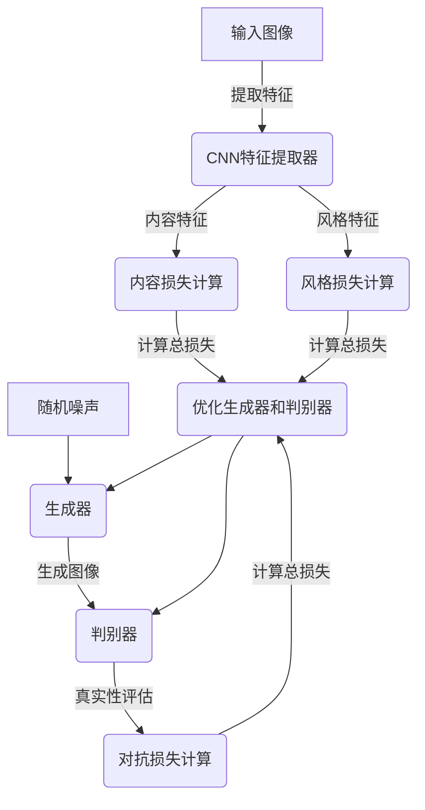

# 基于生成对抗网络的图像风格迁移在线服务平台开发

## 1. 背景介绍

### 1.1 图像风格迁移概述

图像风格迁移是一种将一种图像风格迁移到另一种图像上的技术。它可以将一幅内容图像(如风景照片)与一种特定的艺术风格(如梵高的画作)相结合,生成一幅保留了原始内容但采用新艺术风格的图像。这种技术广泛应用于数字艺术创作、图像增强、视频特效等领域。

### 1.2 生成对抗网络(GAN)

生成对抗网络(Generative Adversarial Networks, GAN)是一种由两个神经网络组成的机器学习模型架构。一个是生成器(Generator),另一个是判别器(Discriminator)。生成器从随机噪声中生成假的数据样本,而判别器则尝试区分真实数据和生成器生成的假数据。两个网络相互对抗,最终达到生成器生成的假数据无法被判别器识别的状态。GAN在图像生成、风格迁移等任务中表现出色。

### 1.3 项目背景与意义

随着人工智能和深度学习技术的不断发展,图像风格迁移已经成为一个热门研究领域。然而,大多数现有的解决方案都需要用户在本地环境中安装各种依赖库和框架,操作复杂且效率低下。因此,开发一个基于Web的在线服务平台,可以让用户无需安装任何软件,只需上传图像即可快速获得风格迁移结果,极大地提高了用户体验。

## 2. 核心概念与联系

### 2.1 卷积神经网络(CNN)

卷积神经网络(Convolutional Neural Network, CNN)是一种专门用于处理图像数据的深度神经网络。它通过卷积、池化等操作自动提取图像的特征,并进行分类或其他任务。CNN在图像识别、目标检测等领域有着广泛的应用。

在图像风格迁移任务中,CNN通常被用于提取内容图像和风格图像的特征,这些特征将被用于后续的风格迁移过程。

### 2.2 生成对抗网络(GAN)

如前所述,生成对抗网络由生成器和判别器组成。在图像风格迁移中,生成器的目标是生成一幅新图像,使其保留原始内容图像的内容特征,同时融合了风格图像的风格特征。判别器则负责评估生成图像的质量,判断它是否真实地融合了内容和风格特征。

生成器和判别器相互对抗,生成器不断努力生成更加逼真的图像以欺骗判别器,而判别器则不断提高识别能力以区分真伪。这种对抗训练过程最终使生成器能够生成高质量的风格迁移图像。

### 2.3 损失函数

在训练GAN进行图像风格迁移时,需要定义一个损失函数来衡量生成图像与期望结果之间的差异。通常使用的损失函数包括:

1. **对抗损失(Adversarial Loss)**: 衡量判别器对生成图像的真实性评估。
2. **内容损失(Content Loss)**: 衡量生成图像与原始内容图像在内容特征上的差异。
3. **风格损失(Style Loss)**: 衡量生成图像与风格图像在风格特征上的差异。

通过最小化这些损失函数,可以使生成图像在保留内容特征的同时,最大程度地融合了目标风格特征。

### 2.4 mermaid流程图

上图展示了基于GAN的图像风格迁移的核心流程。首先,输入的内容图像和风格图像通过CNN提取特征。然后,使用这些特征计算内容损失和风格损失。同时,生成器从随机噪声生成图像,判别器对生成图像的真实性进行评估,并计算对抗损失。最后,将这三种损失相加作为总损失,并使用优化算法(如Adam)优化生成器和判别器的参数,使总损失最小化。

## 3. 核心算法原理具体操作步骤

### 3.1 数据预处理

在开始训练之前,需要对输入的内容图像和风格图像进行预处理,包括:

1. **调整图像大小**: 将图像调整到统一的大小,以满足网络输入要求。
2. **标准化像素值**: 将像素值缩放到[-1, 1]的范围内,这是GAN训练的常见做法。

### 3.2 特征提取

使用预训练的CNN(如VGG19)提取内容图像和风格图像的特征。

1. **内容特征提取**: 从CNN的某一层获取内容图像的特征张量,用于计算内容损失。
2. **风格特征提取**: 从CNN的多个层获取风格图像的特征张量,用于计算风格损失。通常使用Gram矩阵来表示风格特征。

### 3.3 损失函数计算

计算内容损失、风格损失和对抗损失:

1. **内容损失**: 使用均方误差(MSE)计算生成图像特征与内容图像特征之间的差异。
2. **风格损失**: 使用均方误差计算生成图像特征的Gram矩阵与风格图像特征的Gram矩阵之间的差异。
3. **对抗损失**: 使用交叉熵损失函数计算判别器对真实图像和生成图像的判别结果。

### 3.4 模型训练

使用优化算法(如Adam)优化生成器和判别器的参数,使总损失最小化。具体步骤如下:

1. 初始化生成器和判别器的参数。
2. 对每个批次的训练数据:
    a. 从随机噪声生成图像。
    b. 计算内容损失、风格损失和对抗损失。
    c. 计算总损失。
    d. 计算生成器和判别器的梯度。
    e. 使用优化算法更新生成器和判别器的参数。
3. 重复步骤2,直到模型收敛或达到最大迭代次数。

### 3.5 图像生成

训练完成后,可以使用生成器从随机噪声生成风格迁移图像。具体步骤如下:

1. 准备内容图像和目标风格图像。
2. 使用预训练的CNN提取内容图像和风格图像的特征。
3. 从随机噪声开始,使用生成器生成初始图像。
4. 计算生成图像与内容图像的内容损失,以及生成图像与风格图像的风格损失。
5. 使用优化算法(如L-BFGS)最小化内容损失和风格损失,生成最终的风格迁移图像。

## 4. 数学模型和公式详细讲解举例说明

### 4.1 内容损失

内容损失用于保持生成图像与原始内容图像在内容特征上的相似性。它通常使用均方误差(MSE)来计算:

$$J_{\text{content}}(G) = \frac{1}{2} \sum_{i,j} (F_{ij}^l - P_{ij}^l)^2$$

其中:
- $F^l$是生成图像经过CNN的第$l$层后的特征张量
- $P^l$是内容图像经过CNN的第$l$层后的特征张量
- $i,j$是特征张量的空间坐标

通常选择CNN中较浅的层(如relu4_2)作为内容特征层,因为这些层捕获了图像的低级语义信息,如边缘和纹理等。

### 4.2 风格损失

风格损失用于使生成图像具有目标风格图像的风格特征。它通过计算生成图像特征和风格图像特征的Gram矩阵之间的差异来实现:

$$J_{\text{style}}(G) = \sum_l w_l E_l$$

$$E_l = \frac{1}{4N_l^2M_l^2} \sum_{i,j} (G_{ij}^l - A_{ij}^l)^2$$

其中:
- $G^l$是生成图像经过CNN的第$l$层后的特征张量
- $A^l$是风格图像经过CNN的第$l$层后的特征张量
- $N_l$和$M_l$分别是特征张量的高度和宽度
- $G_{ij}^l$和$A_{ij}^l$是特征张量的Gram矩阵元素,定义为:
  $$G_{ij}^l = \sum_k F_{ik}^l F_{jk}^l$$
- $w_l$是第$l$层的权重,用于控制不同层对风格损失的贡献

通常选择CNN中较深的层(如relu1_1、relu2_1等)作为风格特征层,因为这些层捕获了图像的高级语义信息,如颜色分布和纹理模式等。

### 4.3 对抗损失

对抗损失用于训练生成器生成逼真的图像,以欺骗判别器。它通常使用二元交叉熵损失函数来计算:

$$J_{\text{adv}}(G, D) = \mathbb{E}_{\mathbf{x} \sim p_{\text{data}}(x)}[\log D(\mathbf{x})] + \mathbb{E}_{\mathbf{z} \sim p_{\mathbf{z}}(z)}[\log(1 - D(G(\mathbf{z})))]$$

其中:
- $D$是判别器
- $G$是生成器
- $\mathbf{x}$是真实图像样本
- $\mathbf{z}$是随机噪声向量
- $p_{\text{data}}(x)$是真实图像的数据分布
- $p_{\mathbf{z}}(z)$是随机噪声的分布,通常是高斯分布或均匀分布

判别器$D$的目标是最大化这个损失函数,以正确区分真实图像和生成图像。而生成器$G$的目标是最小化这个损失函数,以生成足够逼真的图像欺骗判别器。

### 4.4 总损失函数

为了同时优化内容损失、风格损失和对抗损失,我们将它们相加得到总损失函数:

$$J_{\text{total}}(G, D) = \alpha J_{\text{content}}(G) + \beta J_{\text{style}}(G) + \gamma J_{\text{adv}}(G, D)$$

其中$\alpha$、$\beta$和$\gamma$是用于权衡不同损失项的超参数。

在训练过程中,我们交替优化判别器$D$和生成器$G$:

1. 固定生成器$G$,最小化判别器$D$的损失函数$J_{\text{adv}}(G, D)$,以提高判别器的判别能力。
2. 固定判别器$D$,最小化生成器$G$的总损失函数$J_{\text{total}}(G, D)$,以生成更加逼真的图像。

通过这种对抗训练过程,生成器和判别器不断提高,最终生成器能够生成高质量的风格迁移图像。

### 4.5 示例

假设我们有一幅内容图像$\mathbf{c}$和一幅风格图像$\mathbf{s}$,我们希望将$\mathbf{s}$的风格迁移到$\mathbf{c}$上,生成一幅新图像$\mathbf{g}$。

1. 使用预训练的VGG19网络提取特征:
   - 从relu4_2层提取$\mathbf{c}$的内容特征$P^l$
   - 从relu1_1、relu2_1等层提取$\mathbf{s}$的风格特征$A^l$

2. 初始化生成图像$\mathbf{g}$为随机噪声,计算其特征$F^l$。

3. 计算内容损失:
   $$J_{\text{content}}(\mathbf{g}) = \frac{1}{2} \sum_{i,j} (F_{ij}^l - P_{ij}^l)^2$$

4. 计算风格损失:
   $$J_{\text{style}}(\mathbf{g}) = \sum_l w_l E_l$$
   $$E_l = \frac{1}{4N_l^2M_l^2} \sum_{i,j} (G_{ij}^l - A_{ij}^l)^2$$

5. 使用优化算法(如L-BFGS)