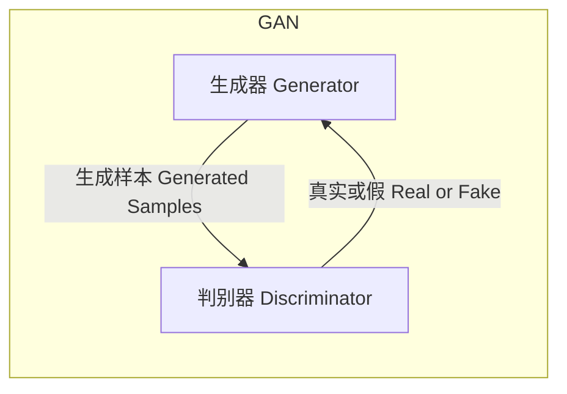
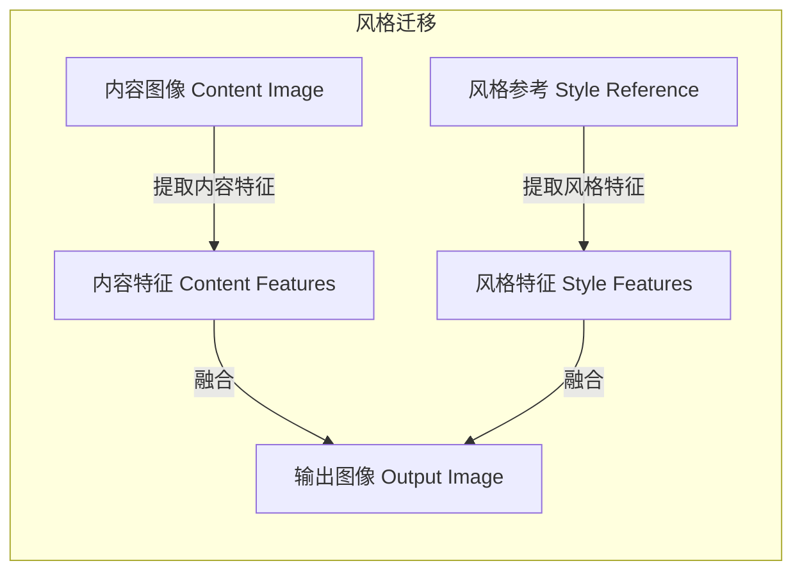
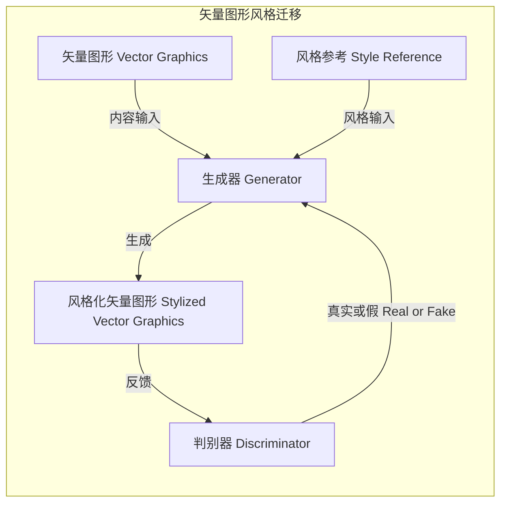

# 基于生成对抗网络的高质量矢量图风格迁移生成

## 1. 背景介绍

### 1.1 矢量图形的重要性

在当代数字时代,矢量图形在各个领域都扮演着重要角色。它们广泛应用于图标设计、插画绘制、徽标创作等多个领域。与传统的位图不同,矢量图形由数学方程式描述,可以在不失真的情况下任意缩放,非常适合高分辨率显示和印刷。

### 1.2 矢量图形创作的挑战

尽管矢量图形具有诸多优势,但创作高质量的矢量图形仍然是一项艰巨的任务。专业设计师需要耗费大量时间和精力来绘制每一个细节。而对于非专业人士来说,创作矢量图形更是一个巨大的挑战。

### 1.3 风格迁移的概念

风格迁移是一种将某种艺术风格应用到内容图像上的技术,使得生成的图像同时保留了内容信息和风格特征。近年来,基于深度学习的风格迁移技术取得了长足进展,在图像、视频等多个领域获得了广泛应用。

### 1.4 生成对抗网络在风格迁移中的应用

生成对抗网络(Generative Adversarial Networks, GANs)是一种强大的深度学习模型,可以生成逼真的图像数据。通过将GANs应用于风格迁移任务,我们可以生成高质量的矢量图形,同时赋予它们特定的艺术风格。这种方法不仅可以提高矢量图形的创作效率,还能为设计师提供无限的创意灵感。

## 2. 核心概念与联系

### 2.1 生成对抗网络(GANs)

生成对抗网络是一种由生成器(Generator)和判别器(Discriminator)组成的深度学习架构。生成器的目标是生成逼真的数据样本,而判别器则负责区分生成的样本和真实样本。通过生成器和判别器之间的对抗训练,GANs可以学习到数据的真实分布,并生成高质量的样本数据。



### 2.2 风格迁移

风格迁移是一种将某种艺术风格应用到内容图像上的技术。它通常包括以下两个步骤:

1. 提取内容图像的内容特征和风格参考图像的风格特征。
2. 将提取的内容特征和风格特征融合,生成同时具有原始内容和目标风格的图像。



### 2.3 将GANs应用于矢量图形风格迁移

通过将GANs应用于矢量图形风格迁移任务,我们可以获得以下优势:

1. **高质量生成**: GANs能够生成逼真、细节丰富的矢量图形。
2. **灵活的风格控制**: 通过改变风格参考,我们可以赋予矢量图形不同的艺术风格。
3. **高效的创作流程**: 与传统的手工绘制相比,这种方法可以大大提高矢量图形的创作效率。



## 3. 核心算法原理具体操作步骤

### 3.1 数据准备

在训练GANs进行矢量图形风格迁移之前,我们需要准备以下数据:

1. **矢量图形数据集**: 一组用于提取内容特征的矢量图形样本。
2. **风格参考图像集**: 一组用于提取风格特征的艺术作品或参考图像。

这些数据集通常需要进行预处理,例如裁剪、调整大小和归一化等操作,以满足模型的输入要求。

### 3.2 特征提取

为了将内容特征和风格特征融合到一起,我们需要先从输入数据中提取这两种特征。通常采用预训练的卷积神经网络(CNN)作为特征提取器,例如VGG-19或Inception-v3等。

1. **内容特征提取**: 将矢量图形输入到CNN中,在中间层获取内容特征张量。
2. **风格特征提取**: 将风格参考图像输入到CNN中,在不同层获取风格特征张量,并计算格拉姆矩阵(Gram Matrix)作为风格表示。

### 3.3 生成器架构

生成器的目标是生成同时具有目标内容和风格的矢量图形。一种常见的架构是使用编码器-解码器结构,其中编码器提取输入图像的特征表示,而解码器则根据这些特征生成输出图像。

生成器的输入包括:

1. 内容图像的内容特征张量
2. 风格参考图像的风格特征张量

生成器将这两种特征融合,并生成风格化的矢量图形输出。

### 3.4 判别器架构

判别器的目标是区分生成的矢量图形和真实的矢量图形样本。它通常采用CNN分类器的架构,输入是图像数据,输出是真实或假的概率分数。

### 3.5 损失函数

为了训练GANs模型,我们需要定义合适的损失函数。常见的损失函数包括:

1. **对抗损失**:衡量生成器欺骗判别器的能力和判别器区分真伪的能力。
2. **内容损失**:衡量生成图像与输入内容图像之间的内容相似性。
3. **风格损失**:衡量生成图像与风格参考图像之间的风格相似性。

通过最小化这些损失函数,我们可以训练生成器生成同时保留内容和风格特征的矢量图形。

### 3.6 训练过程

训练GANs进行矢量图形风格迁移通常包括以下步骤:

1. 从数据集中采样内容图像和风格参考图像。
2. 使用预训练的CNN提取内容特征和风格特征。
3. 将内容特征和风格特征输入到生成器,生成风格化的矢量图形。
4. 将生成的矢量图形和真实样本输入到判别器,计算对抗损失。
5. 计算内容损失和风格损失。
6. 反向传播,更新生成器和判别器的参数。
7. 重复上述过程,直到模型收敛。

在训练过程中,生成器和判别器会相互对抗,生成器试图生成更加逼真的矢量图形来欺骗判别器,而判别器则努力区分真伪样本。这种对抗训练过程最终会使生成器学习到生成高质量矢量图形的能力。

## 4. 数学模型和公式详细讲解举例说明

### 4.1 内容损失

内容损失衡量生成图像与输入内容图像之间的内容相似性。通常采用预训练的CNN作为损失网络,计算两个图像在特定层的特征映射之间的均方差。

设$\phi_l(x)$表示图像$x$在CNN的第$l$层的特征映射,内容损失可以定义为:

$$L_{content}(G, C) = \frac{1}{2} \sum_{i,j} (G_{ij}^l - C_{ij}^l)^2$$

其中$G$是生成器输出的图像,$C$是内容输入图像,$G_{ij}^l$和$C_{ij}^l$分别表示两个图像在第$l$层的第$(i,j)$个特征映射位置。

通过最小化内容损失,我们可以确保生成图像保留了原始内容图像的内容信息。

### 4.2 风格损失

风格损失衡量生成图像与风格参考图像之间的风格相似性。它基于格拉姆矩阵(Gram Matrix)的计算,格拉姆矩阵可以捕捉图像的纹理和风格信息。

设$\phi_l(x)$表示图像$x$在CNN的第$l$层的特征映射,其格拉姆矩阵$G_l^{\phi}(x)$定义为:

$$G_l^{\phi}(x)_{i,j} = \sum_k \phi_l(x)_{i,k} \phi_l(x)_{j,k}$$

其中$i$和$j$是特征映射的索引,$k$是特征映射的空间位置索引。

风格损失可以定义为生成图像和风格参考图像的格拉姆矩阵之间的均方差:

$$L_{style}(G, S) = \sum_l w_l \frac{1}{N_l^2M_l^2} \sum_{i,j} (G_l^{\phi}(G)_{i,j} - G_l^{\phi}(S)_{i,j})^2$$

其中$G$是生成器输出的图像,$S$是风格参考图像,$w_l$是第$l$层的权重,$N_l$和$M_l$分别是第$l$层特征映射的高度和宽度。

通过最小化风格损失,我们可以使生成图像具有与风格参考图像相似的纹理和风格特征。

### 4.3 对抗损失

对抗损失是GANs中的核心损失函数,它衡量生成器欺骗判别器的能力和判别器区分真伪样本的能力。

设$D(x)$表示判别器对输入$x$的真实性评分,对抗损失可以定义为:

$$L_{adv}(G, D) = \mathbb{E}_{x \sim p_{data}(x)}[\log D(x)] + \mathbb{E}_{z \sim p_z(z)}[\log (1 - D(G(z)))]$$

其中$p_{data}(x)$是真实数据分布,$p_z(z)$是生成器的输入噪声分布。

第一项是判别器对真实样本的损失,第二项是判别器对生成样本的损失。通过最小化这个损失函数,判别器可以学习区分真伪样本,而生成器则可以生成更加逼真的样本来欺骗判别器。

在训练过程中,生成器和判别器会相互对抗,最终达到一种动态平衡,使生成器学习到数据的真实分布。

### 4.4 总体损失函数

为了同时考虑内容、风格和对抗损失,我们可以构建一个加权总体损失函数:

$$L_{total}(G, D, C, S) = \alpha L_{content}(G, C) + \beta L_{style}(G, S) + \gamma L_{adv}(G, D)$$

其中$\alpha$、$\beta$和$\gamma$是用于平衡不同损失项的权重系数。

在训练过程中,我们需要最小化生成器的总体损失函数,同时最大化判别器的对抗损失:

$$G^* = \arg\min_G \max_D L_{total}(G, D, C, S)$$

通过这种对抗训练策略,我们可以获得同时保留内容信息、风格特征并且具有高质量的矢量图形生成结果。

## 5. 项目实践: 代码实例和详细解释说明

在这一部分,我们将提供一个基于PyTorch实现的代码示例,演示如何使用GANs进行矢量图形风格迁移。该示例包括数据加载、模型定义、训练过程和可视化结果等多个部分。

### 5.1 导入必要的库

```python
import torch
import torch.nn as nn
import torchvision.transforms as transforms
import torchvision.datasets as datasets
from torch.utils.data import DataLoader
import matplotlib.pyplot as plt
```

### 5.2 数据加载

我们首先定义一个自定义的数据集类,用于加载矢量图形和风格参考图像。

```python
class VectorStyleDataset(torch.utils.data.Dataset):
    def __init__(self, content_dir, style_dir, transform=None):
        self.content_images = sorted(os.listdir(content_dir))
        self.style_images = sorted(os.listdir(style_dir))
        self.content_dir = content_dir
        self.style_dir = style_dir