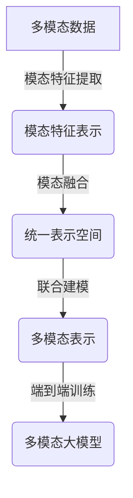
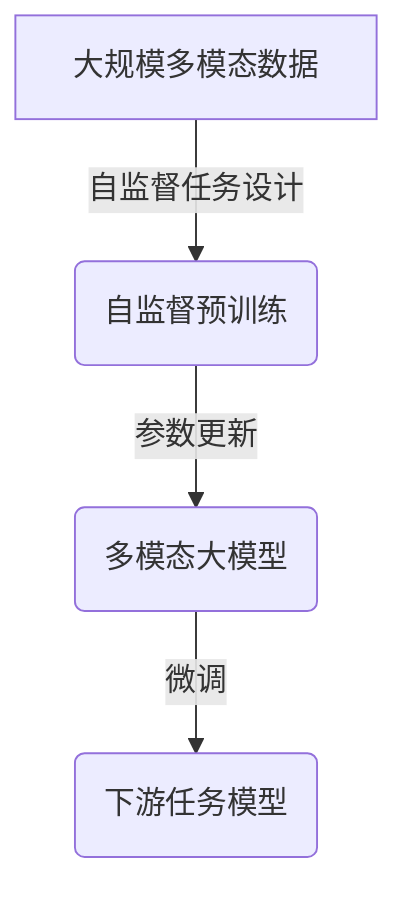
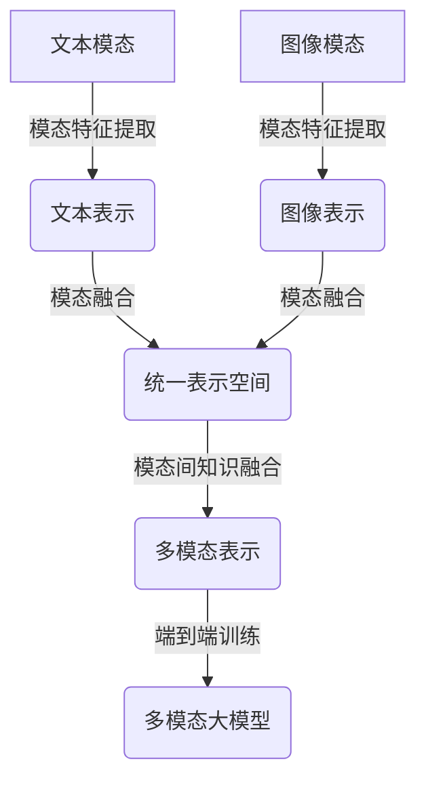
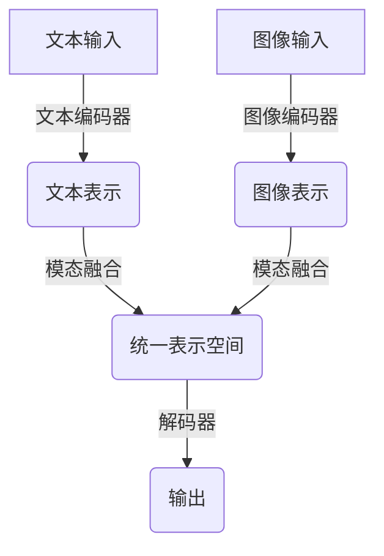
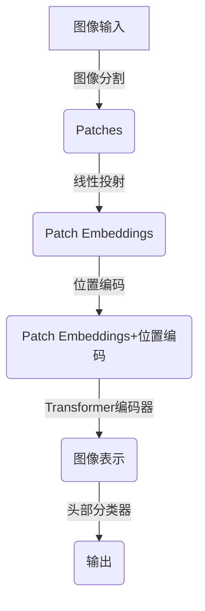
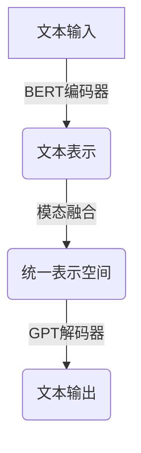

# 多模态大模型：技术原理与实战 从0到1部署多模态大模型

## 1.背景介绍

### 1.1 人工智能的发展历程

人工智能(Artificial Intelligence, AI)是当代科技发展的重要领域,其目标是使机器能够模仿人类的认知功能,如学习、推理、感知和行为能力。人工智能的发展经历了几个重要阶段:

- 早期阶段(1950s-1960s):人工智能的理论基础得到建立,诞生了专家系统、机器学习等概念。
- 知识驱动时代(1970s-1980s):发展基于规则的专家系统和知识库系统。
- 统计学习时代(1990s-2000s):机器学习算法取得突破,如支持向量机、决策树等。
- 深度学习时代(2010s-至今):受益于大数据和算力提升,深度神经网络在计算机视觉、自然语言处理等领域取得突破性进展。

### 1.2 多模态人工智能的兴起

传统的人工智能系统通常专注于单一模态数据,如文本、图像或语音。然而,现实世界的数据通常是多模态的,包含不同形式的信息。多模态人工智能(Multimodal AI)旨在整合来自不同模态的信息,以更好地理解和处理复杂的现实世界问题。

多模态人工智能的兴起源于以下几个原因:

1. 数据多样性:现实世界数据通常包含文本、图像、视频、语音等多种模态,需要能够处理多模态数据的智能系统。
2. 人类认知模式:人类认知过程是多模态的,我们通过整合视觉、听觉、触觉等不同感官信息来理解世界。
3. 任务复杂性:许多现实世界任务需要综合不同模态的信息,如视觉问答、多模态对话系统等。
4. 技术进步:深度学习、大规模预训练模型等技术进步为多模态人工智能的发展奠定了基础。

### 1.3 多模态大模型的重要性

多模态大模型(Multimodal Large Models)是指能够同时处理多种模态数据(如文本、图像、视频等)的大规模预训练模型。这些模型通过在海量多模态数据上进行预训练,学习到跨模态的表示和知识,从而具备强大的多模态理解和生成能力。

多模态大模型在以下方面具有重要意义:

1. 提高人工智能系统的理解和生成能力,更好地模拟人类的多模态认知过程。
2. 支持更复杂的多模态任务,如视觉问答、多模态对话、多模态内容生成等。
3. 促进不同模态之间的知识迁移,提高模型的泛化能力和数据利用效率。
4. 为发展通用人工智能(Artificial General Intelligence, AGI)奠定基础。

## 2.核心概念与联系

### 2.1 多模态表示学习

多模态表示学习(Multimodal Representation Learning)是多模态人工智能的核心概念之一。它旨在从不同模态的数据中学习到统一的表示空间,使得不同模态的信息可以在该空间中进行融合和交互。

多模态表示学习通常包括以下几个步骤:

1. 模态特征提取:使用专门的编码器(如CNN for 图像,Transformer for 文本)从每个模态中提取特征表示。
2. 模态融合:将不同模态的特征表示融合到统一的表示空间中,常用方法包括拼接、注意力机制等。
3. 联合建模:在统一的表示空间中对不同模态的信息进行联合建模,捕获模态间的交互和关系。
4. 端到端训练:使用监督或自监督的方式,端到端地优化多模态表示,使其能够支持下游的多模态任务。

多模态表示学习是实现多模态大模型的关键技术,能够有效地融合和利用多模态信息,提高模型的理解和生成能力。

### 2.2 自监督预训练

自监督预训练(Self-Supervised Pretraining)是训练多模态大模型的一种有效范式。它通过设计自监督任务(如遮挡语言模型、遮挡图像模型等),利用大规模未标注的多模态数据对模型进行预训练,使模型学习到有效的多模态表示。

自监督预训练的优势包括:

1. 利用大规模未标注数据,避免了人工标注的成本和瓶颈。
2. 学习到通用的多模态表示,可以支持多种下游任务。
3. 通过预训练捕获模态间的关系和知识,提高了模型的泛化能力。

常见的自监督预训练策略包括:

- 遮挡自编码(Masked Autoencoding):在输入数据中随机遮挡部分信息,训练模型预测被遮挡的部分。
- 对比学习(Contrastive Learning):通过最大化正样本对的相似度,最小化负样本对的相似度,学习discriminative的表示。
- 自监督任务设计:设计与下游任务相关的自监督任务,引导模型学习到有用的知识和表示。

自监督预训练为训练大规模多模态模型提供了可行的途径,是多模态大模型发展的关键技术。

### 2.3 模态间知识融合

模态间知识融合(Cross-Modal Knowledge Fusion)是多模态大模型的另一个核心概念。它指的是在统一的表示空间中,充分利用不同模态之间的互补信息和关联知识,实现模态间的知识融合和迁移。

模态间知识融合的主要挑战包括:

1. 模态异构性:不同模态的数据具有不同的统计特性和表示形式,需要解决模态间的异构性问题。
2. 模态关联建模:需要建模不同模态之间的关联和交互,捕获跨模态的知识和规律。
3. 知识迁移:如何实现不同模态之间的知识迁移,提高模型的泛化能力和数据利用效率。

常见的模态间知识融合方法包括:

- 注意力机制:使用自注意力或跨模态注意力机制,捕获不同模态之间的相关性。
- 对比学习:通过设计跨模态的对比学习任务,学习discriminative的跨模态表示。
- 知识蒸馏:利用知识蒸馏技术,从单模态专家模型中迁移知识到多模态模型。

有效的模态间知识融合是实现强大多模态大模型的关键,能够充分利用多模态数据中的互补信息和关联知识,提高模型的理解和生成能力。

## 3.核心算法原理具体操作步骤

### 3.1 Transformer编码器-解码器架构

Transformer编码器-解码器架构是构建多模态大模型的常用框架。它由两个主要部分组成:

1. **Transformer编码器(Encoder)**:用于从输入数据(如文本、图像等)中提取特征表示。
2. **Transformer解码器(Decoder)**:根据编码器的输出和目标任务,生成所需的输出(如文本、图像等)。

Transformer编码器和解码器都采用了自注意力(Self-Attention)机制,能够有效地捕获长距离依赖关系。此外,编码器和解码器之间通过交叉注意力(Cross-Attention)机制实现信息交互。

多模态大模型通常采用统一的Transformer编码器-解码器架构,用于处理不同模态的输入和输出。不同模态的数据首先被各自的模态编码器编码,然后在统一的表示空间中进行融合和交互,最后由解码器生成所需的输出。

### 3.2 Vision Transformer

Vision Transformer(ViT)是一种用于图像处理的Transformer模型,它将图像分割为多个patches(图像块),并将每个patch投射到一个向量空间,作为Transformer的输入。ViT能够直接从图像数据中学习到有效的表示,避免了手工设计卷积核的需求。

ViT的具体操作步骤如下:

1. 图像分割:将输入图像分割为多个固定大小的patches(如16x16像素)。
2. 线性投射:将每个patch投射到一个固定维度的向量空间,形成patch embeddings。
3. 位置编码:为每个patch embedding添加位置编码,赋予位置信息。
4. Transformer编码器:将patch embeddings输入到标准的Transformer编码器中,获得图像的表示。
5. 头部分类器:在Transformer编码器的输出上添加一个小的前馈网络,用于下游任务(如图像分类)。

ViT在大规模数据集上预训练后,能够学习到强大的图像表示能力,成为多模态大模型中常用的图像编码器。

### 3.3 BERT和GPT

BERT(Bidirectional Encoder Representations from Transformers)和GPT(Generative Pre-trained Transformer)是两种广泛使用的自然语言处理(NLP)预训练模型,它们基于Transformer架构,能够有效地捕获文本数据中的上下文信息和语义关系。

**BERT**的核心思想是使用"遮挡语言模型"(Masked Language Modeling)和"下一句预测"(Next Sentence Prediction)两个自监督任务对模型进行预训练。BERT采用双向Transformer编码器,能够同时利用上下文的左右信息。

**GPT**则是一种基于单向Transformer解码器的生成式语言模型。GPT通过"因果语言模型"(Causal Language Modeling)任务进行预训练,学习预测下一个单词的能力。GPT擅长于文本生成任务。

在多模态大模型中,BERT和GPT常被用作文本编码器和解码器,与其他模态(如图像、视频)的编码器和解码器进行交互和融合。通过预训练和微调,BERT和GPT能够为多模态大模型提供强大的文本理解和生成能力。

### 3.4 注意力机制

注意力机制(Attention Mechanism)是Transformer架构中的核心组件,也是多模态大模型实现模态融合和交互的关键技术。注意力机制能够自适应地捕获输入序列中不同位置之间的依赖关系,并动态地分配注意力权重。

在多模态大模型中,注意力机制主要应用于以下几个方面:

1. **自注意力(Self-Attention)**:在单个模态内部,捕获同一模态中不同位置之间的依赖关系。
2. **交叉注意力(Cross-Attention)**:捕获不同模态之间的相关性和依赖关系,实现模态间的信息交互。
3. **多头注意力(Multi-Head Attention)**:通过多个注意力头并行计算,捕获不同的依赖关系模式。

注意力机制使得多模态大模型能够灵活地融合和建模不同模态之间的关系,是