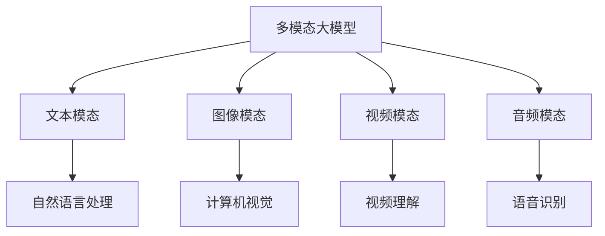
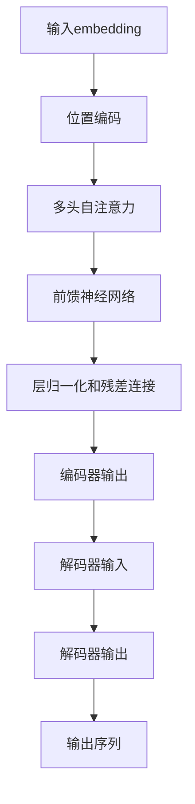
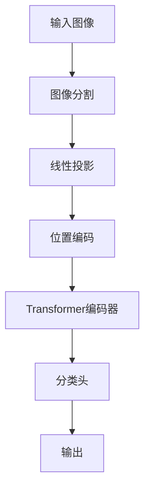
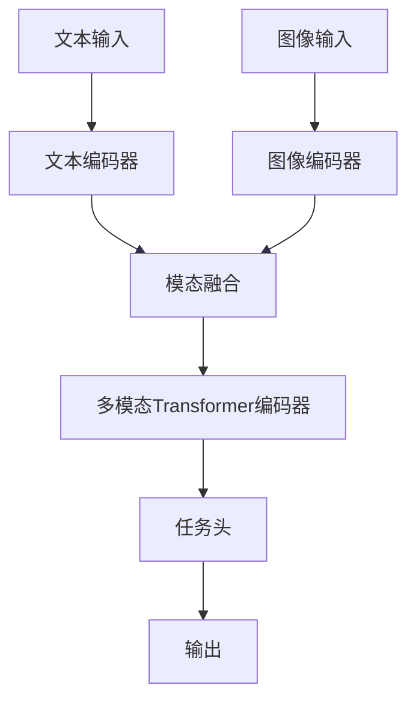
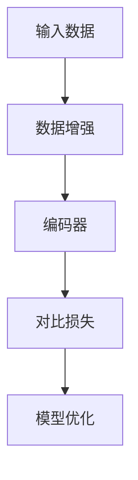

# 多模态大模型：技术原理与实战 国内多模态大模型介绍

## 1.背景介绍

### 1.1 人工智能的发展历程

人工智能(Artificial Intelligence, AI)是当代科技发展的前沿领域,自20世纪50年代诞生以来,已经经历了几个重要的发展阶段。最初的人工智能系统主要依赖规则和逻辑推理,但受到知识库有限和缺乏学习能力的限制。随后,基于统计学习理论的机器学习算法开始兴起,特别是在大数据时代的推动下,机器学习在语音识别、图像识别等领域取得了突破性进展。

### 1.2 深度学习的兴起

2012年,深度学习(Deep Learning)在ImageNet大赛中展现出卓越的图像识别能力,开启了人工智能发展的新纪元。深度学习能够自主从海量数据中学习特征表示,在计算机视觉、自然语言处理等领域取得了令人瞩目的成就。然而,传统的深度学习模型主要关注单一模态数据,如文本或图像,难以充分利用多种模态数据之间的相关性和互补性。

### 1.3 多模态学习的兴起

为了更好地模拟人类对多种感官信息的综合理解能力,多模态学习(Multimodal Learning)应运而生。多模态学习旨在从不同模态的数据(如文本、图像、视频、音频等)中学习跨模态的表示,捕捉不同模态之间的内在联系,从而提高人工智能系统的理解和决策能力。

### 1.4 大模型时代的到来

近年来,benefiting from大规模计算资源、海量训练数据和创新的模型架构,大规模预训练语言模型(如GPT、BERT)和大规模视觉模型(如DALL-E、Stable Diffusion)取得了突破性进展。这些大模型展现出了强大的泛化能力,可以在多个下游任务中表现出色。然而,这些模型仍然局限于单一模态,无法充分利用多模态数据的优势。

## 2.核心概念与联系

### 2.1 多模态大模型的定义

多模态大模型(Multimodal Large Model)是指能够同时处理多种模态数据(如文本、图像、视频、音频等)的大规模预训练模型。它们旨在从海量的多模态数据中学习跨模态的表示,捕捉不同模态之间的内在联系,从而提高人工智能系统的理解和决策能力。

### 2.2 多模态融合

多模态融合是多模态大模型的核心挑战,它需要有效地将不同模态的信息融合在一起,捕捉模态之间的相关性和互补性。常见的融合策略包括:

1. **早期融合**:在输入层将不同模态的特征拼接或连接。
2. **晚期融合**:分别对每个模态进行编码,然后将编码后的特征进行融合。
3. **层级融合**:在不同网络层级进行模态融合。
4. **注意力融合**:使用注意力机制动态调节不同模态的重要性。

### 2.3 跨模态理解与推理

多模态大模型的目标是实现跨模态的理解和推理能力,例如从图像和文本中理解场景、从视频和音频中理解事件、从多模态输入中回答问题等。这需要模型能够捕捉不同模态之间的语义关联,并进行有效的推理和决策。

### 2.4 迁移学习与少样本学习

由于多模态数据的采集和标注成本较高,多模态大模型通常需要在大规模预训练数据集上进行预训练,然后在特定任务上进行微调(fine-tuning)。这种迁移学习策略可以有效地利用预训练模型的知识,加速新任务的学习过程。另外,由于标注数据的稀缺性,多模态大模型还需要具备强大的少样本学习能力。

### 2.5 多任务学习

多模态大模型通常需要同时处理多个不同的任务,如图像分类、文本生成、视频描述等。多任务学习(Multi-task Learning)旨在利用不同任务之间的相关性,共享模型参数和知识表示,提高模型的泛化能力和效率。

## 3.核心算法原理具体操作步骤

### 3.1 Transformer 模型

Transformer 是多模态大模型的核心架构之一,它基于自注意力(Self-Attention)机制,能够有效地捕捉序列数据中的长程依赖关系。Transformer 模型的主要操作步骤如下:

1. **输入embedding**:将不同模态的输入数据(如文本、图像等)转换为对应的embedding向量表示。
2. **位置编码**:为每个embedding向量添加位置信息,以保留输入序列的位置信息。
3. **多头自注意力**:计算每个embedding向量与其他向量的注意力权重,捕捉不同位置之间的依赖关系。
4. **前馈神经网络**:对注意力输出进行非线性变换,提取高级特征表示。
5. **层归一化和残差连接**:使用层归一化和残差连接提高模型的稳定性和收敛性。
6. **编码器-解码器架构**:对于序列生成任务,Transformer 采用编码器-解码器架构,编码器捕捉输入序列的表示,解码器根据编码器输出生成目标序列。

### 3.2 Vision Transformer

Vision Transformer(ViT)是将 Transformer 架构应用于计算机视觉任务的一种方法。ViT 将图像分割为多个patch(图像块),并将每个patch投影为一个embedding向量,然后将这些向量输入到 Transformer 编码器中进行处理。ViT 的主要操作步骤如下:

1. **图像分割**:将输入图像分割为多个patch。
2. **线性投影**:将每个patch投影为一个embedding向量。
3. **位置编码**:为每个embedding向量添加位置信息。
4. **Transformer 编码器**:将embedding序列输入到 Transformer 编码器中,捕捉patch之间的关系。
5. **分类头**:对编码器输出进行分类或其他视觉任务。

### 3.3 多模态 Transformer

多模态 Transformer 是将 Transformer 架构扩展到多模态数据的一种方法。它能够同时处理不同模态的输入数据,并捕捉模态之间的相关性。多模态 Transformer 的主要操作步骤如下:

1. **模态特征提取**:使用专门的编码器(如CNN、RNN等)从不同模态的输入数据中提取特征表示。
2. **模态融合**:将不同模态的特征表示进行融合,可以采用早期融合、晚期融合或层级融合等策略。
3. **多模态 Transformer 编码器**:将融合后的多模态特征输入到 Transformer 编码器中,捕捉模态之间的关系。
4. **任务头**:根据不同的下游任务(如分类、生成等),设计相应的任务头对编码器输出进行处理。

### 3.4 对比学习

对比学习(Contrastive Learning)是一种有效的自监督学习方法,它通过最大化相似样本之间的相似性,最小化不相似样本之间的相似性,来学习有区分性的表示。对比学习在多模态大模型的预训练中发挥着重要作用,可以帮助模型从大规模无标注数据中学习有效的跨模态表示。对比学习的主要操作步骤如下:

1. **数据增强**:对输入数据进行不同的增强操作(如裁剪、旋转、噪声添加等),生成相似样本对和不相似样本对。
2. **编码器**:将增强后的样本输入到编码器(如 Transformer 编码器)中,获得对应的表示向量。
3. **对比损失**:计算相似样本对的表示向量之间的相似性,以及不相似样本对的表示向量之间的不相似性,构建对比损失函数。
4. **模型优化**:通过优化对比损失函数,使得编码器能够学习到有区分性的跨模态表示。

## 4.数学模型和公式详细讲解举例说明

### 4.1 自注意力机制

自注意力(Self-Attention)是 Transformer 模型的核心机制,它能够捕捉序列数据中任意两个位置之间的依赖关系。给定一个输入序列 $X = (x_1, x_2, \dots, x_n)$,自注意力的计算过程如下:

1. **查询、键和值投影**:将输入序列分别投影到查询(Query)、键(Key)和值(Value)空间,得到 $Q = XW_Q$, $K = XW_K$, $V = XW_V$。
2. **注意力计算**:计算查询和键之间的相似性得分,并通过 Softmax 函数归一化,得到注意力权重 $\alpha_{ij} = \frac{e^{q_i^T k_j}}{\sum_{l=1}^n e^{q_i^T k_l}}$。
3. **加权求和**:将注意力权重与值向量相乘并求和,得到注意力输出 $o_i = \sum_{j=1}^n \alpha_{ij} v_j$。

自注意力机制可以用以下公式表示:

$$
\text{Attention}(Q, K, V) = \text{softmax}\left(\frac{QK^T}{\sqrt{d_k}}\right)V
$$

其中 $d_k$ 是缩放因子,用于防止内积值过大导致梯度饱和。

### 4.2 多头自注意力

为了捕捉不同子空间的依赖关系,Transformer 引入了多头自注意力(Multi-Head Self-Attention)机制。多头自注意力将查询、键和值分别投影到多个子空间,并在每个子空间中计算自注意力,最后将所有子空间的注意力输出进行拼接。多头自注意力的计算过程如下:

1. **线性投影**:将查询、键和值分别投影到 $h$ 个子空间,得到 $Q^i, K^i, V^i$ (其中 $i=1,2,\dots,h$)。
2. **自注意力计算**:在每个子空间中计算自注意力 $\text{head}_i = \text{Attention}(Q^i, K^i, V^i)$。
3. **拼接**:将所有子空间的注意力输出拼接,得到多头自注意力输出 $\text{MultiHead}(Q, K, V) = \text{Concat}(\text{head}_1, \text{head}_2, \dots, \text{head}_h)W^O$。

多头自注意力可以用以下公式表示:

$$
\begin{aligned}
\text{MultiHead}(Q, K, V) &= \text{Concat}(\text{head}_1, \dots, \text{head}_h)W^O \\
\text{where}\  \text{head}_i &= \text{Attention}(QW_i^Q, KW_i^K, VW_i^V)
\end{aligned}
$$

其中 $W_i^Q, W_i^K, W_i^V$ 和 $W^O$ 是可学习的线性投影矩阵。

### 4.3 对比损失函数

对比