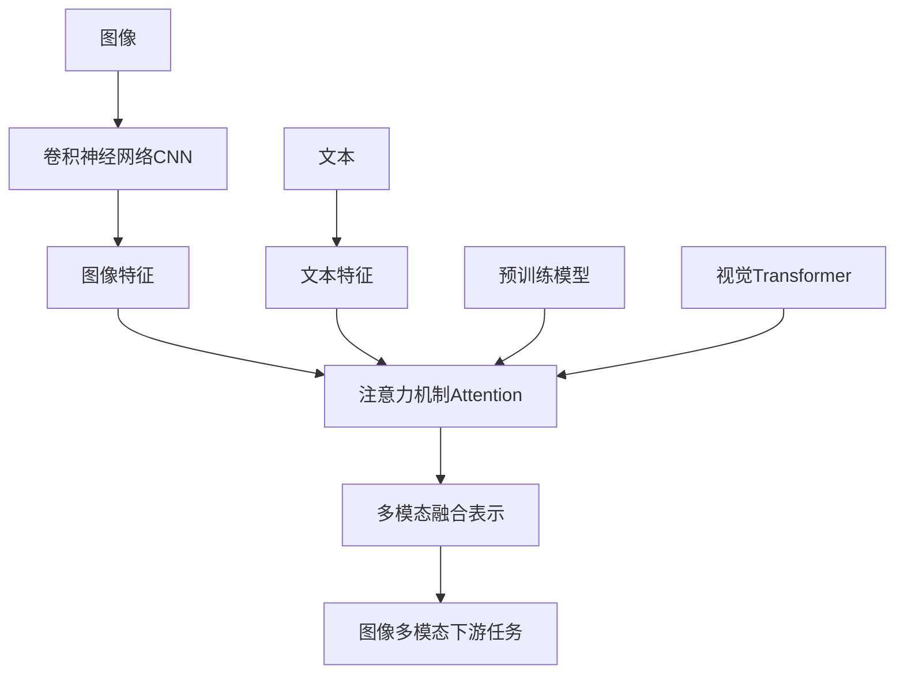

# 多模态大模型：技术原理与实战 图像多模态技术

## 1. 背景介绍

### 1.1 多模态大模型概述
多模态大模型是一种能够处理和理解多种形式信息的人工智能模型。它可以同时处理文本、图像、音频等不同模态的数据,并在这些模态之间建立联系,从而获得更全面、更准确的对世界的理解。近年来,随着深度学习技术的发展和计算能力的提升,多模态大模型取得了长足的进步,在许多任务上达到了甚至超越了人类的水平。

### 1.2 图像多模态技术的重要性
在多模态大模型中,图像多模态技术占据着重要的地位。人类获取外界信息很大一部分来自视觉,图像蕴含着丰富的语义信息。图像多模态技术旨在让机器能够像人一样"看懂"图片,理解图片中的内容,并将其与其他模态的信息(如文本)关联起来。这项技术在图像识别、图像描述、视觉问答等任务中有着广泛的应用。

### 1.3 图像多模态技术的发展历程
图像多模态技术的发展可以追溯到早期的图像识别和分类任务。随着卷积神经网络(CNN)的出现和发展,计算机视觉领域取得了巨大的突破。进入多模态时代后,研究者们开始探索如何将图像与文本等其他模态的信息结合起来,先后提出了一系列图文匹配、图像描述生成、视觉问答等任务和模型。如今,图像多模态已成为多模态大模型的重要组成部分。

## 2. 核心概念与联系

### 2.1 卷积神经网络(CNN)
卷积神经网络是图像多模态的基石。它通过卷积和池化等操作,可以自动提取图像中的特征,将图像转化为计算机可以理解的表示。CNN在图像识别、目标检测等任务上取得了巨大成功,奠定了图像多模态的基础。

### 2.2 注意力机制(Attention Mechanism)  
注意力机制让模型能够学会关注输入数据中的重要部分。在图像多模态任务中,注意力机制可以帮助模型找到图像中与文本查询最相关的区域,提升图文匹配的精度。Transformer 模型中的自注意力机制更进一步,让模型能够自动学习不同模态之间的对齐和关联。

### 2.3 预训练模型(Pretrained Models)
预训练模型是先在大规模数据集上进行无监督或自监督的预训练,再针对具体任务进行微调的模型。预训练模型能够学习到丰富的通用特征表示,大大减少了下游任务所需的标注数据。在图像多模态领域,常用的预训练模型有 CLIP、ViLT、ALBEF 等。

### 2.4 视觉 Transformer(Vision Transformer) 
视觉 Transformer 将 NLP 领域成功的 Transformer 架构引入了计算机视觉。它将图像分割成小块,然后将其看作一个序列输入到 Transformer 中,让模型能够处理图像中的长程依赖。视觉 Transformer 在图像分类、目标检测等任务上取得了很好的效果。

### 2.5 Mermaid 流程图
下图展示了图像多模态技术中各个核心概念之间的联系:



## 3. 核心算法原理与具体操作步骤

### 3.1 图像特征提取
第一步是使用卷积神经网络从图像中提取特征。具体步骤如下:
1) 将图像输入到预训练的 CNN 模型中
2) 图像经过一系列卷积、ReLU激活、池化等操作  
3) 最后一个卷积层的输出即为图像的特征表示

### 3.2 文本特征提取
对于文本数据,通常使用词嵌入(如 Word2Vec、GloVe)或预训练语言模型(如 BERT)来获取词的分布式表示,然后将词向量序列输入到 RNN、Transformer 等模型中学习整个句子的特征表示。

### 3.3 多模态特征融合
图像特征和文本特征提取出来后,需要进行跨模态的特征融合,常见的融合方式有:
1) 简单拼接:直接将图像特征和文本特征拼接成一个更长的向量
2) 注意力融合:通过注意力机制学习图像区域和文本词之间的对齐
3) Transformer 融合:使用多头自注意力机制建模图文特征之间的关系

### 3.4 目标函数与训练
根据具体任务的不同,选择合适的目标函数(如交叉熵、对比学习损失等)对模型进行端到端的训练。在 Transformer 模型中,通常使用掩码语言建模、图文匹配、图文对比学习等预训练任务。

## 4. 数学模型和公式详细讲解举例说明

### 4.1 卷积操作
卷积操作是 CNN 的核心,其数学表达式为:
$$ h_{i,j} = \sum_{m=0}^{k-1} \sum_{n=0}^{k-1} w_{m,n} \cdot x_{i+m, j+n} $$
其中 $h_{i,j}$ 为输出特征图在 $(i,j)$ 位置的值,$x$ 为输入特征图,$w$ 为卷积核,$k$ 为卷积核大小。

例如,假设输入特征图 $x$ 和卷积核 $w$ 分别为:
$$
x=
\begin{bmatrix}
1 & 2 & 3 \\
4 & 5 & 6 \\
7 & 8 & 9
\end{bmatrix},
w = 
\begin{bmatrix}
1 & 0 \\
0 & 1
\end{bmatrix}
$$
则卷积后的输出特征图 $h$ 为:
$$
h=
\begin{bmatrix}
1\times1+2\times0+4\times0+5\times1 & 2\times1+3\times0+5\times0+6\times1 \\
4\times1+5\times0+7\times0+8\times1 & 5\times1+6\times0+8\times0+9\times1
\end{bmatrix}
=
\begin{bmatrix}
6 & 8 \\
12 & 14
\end{bmatrix}
$$

### 4.2 注意力机制
注意力分数的计算公式为:
$$ \alpha_{ij} = \frac{\exp(e_{ij})}{\sum_k \exp(e_{ik})} $$
其中 $e_{ij}$ 表示查询 $q_i$ 与键 $k_j$ 的相似度,通常为它们的点积:
$$ e_{ij} = q_i^T k_j $$

例如,假设查询向量 $q$ 和键矩阵 $K$ 分别为:
$$
q=
\begin{bmatrix}
1 \\ 2
\end{bmatrix},
K=
\begin{bmatrix}
1 & 2 & 3 \\
4 & 5 & 6
\end{bmatrix}
$$
则它们的注意力分数为:
$$
\begin{aligned}
e &= q^T K = 
\begin{bmatrix}
1 & 2
\end{bmatrix}
\begin{bmatrix}
1 & 2 & 3 \\
4 & 5 & 6
\end{bmatrix}
=
\begin{bmatrix}
9 & 12 & 15
\end{bmatrix} \\
\alpha &= \text{softmax}(e) = \text{softmax}(
\begin{bmatrix}
9 & 12 & 15
\end{bmatrix})
=
\begin{bmatrix}
0.09 & 0.24 & 0.67
\end{bmatrix}
\end{aligned}
$$

### 4.3 对比学习损失
对比学习通过拉近相似样本的距离,推开不相似样本的距离来学习数据的特征表示。以 InfoNCE 损失为例,其数学表达式为:
$$ \mathcal{L}_{\text{InfoNCE}} = -\log \frac{\exp(f(x)^T f(x^+) / \tau)}{\exp(f(x)^T f(x^+) / \tau) + \sum_{x^-} \exp(f(x)^T f(x^-) / \tau)} $$
其中 $x$ 为锚点样本,$x^+$ 为正样本,$x^-$ 为负样本,$f$ 为编码器网络,$\tau$ 为温度超参数。

例如,假设有一批图像-文本对 $(x_i, y_i)$,我们希望学习它们的特征表示 $f(x_i)$ 和 $g(y_i)$,使得匹配的图文对特征距离尽可能近,不匹配的图文对特征距离尽可能远。对于第 $i$ 个图像 $x_i$,以其对应的文本 $y_i$ 为正样本,其他文本为负样本,优化如下损失函数:
$$ \mathcal{L}_i = -\log \frac{\exp(f(x_i)^T g(y_i) / \tau)}{\exp(f(x_i)^T g(y_i) / \tau) + \sum_{j \neq i} \exp(f(x_i)^T g(y_j) / \tau)} $$

## 5. 项目实践：代码实例和详细解释说明

下面以 PyTorch 为例,展示如何实现一个简单的图文匹配模型。该模型使用预训练的 CNN 提取图像特征,预训练的 BERT 提取文本特征,然后通过对比学习损失函数来学习图文的对齐。

```python
import torch
import torch.nn as nn
import torch.nn.functional as F
from transformers import BertModel
from torchvision.models import resnet50

class ImageEncoder(nn.Module):
    def __init__(self):
        super().__init__()
        self.cnn = resnet50(pretrained=True)
        self.cnn.fc = nn.Identity()
        
    def forward(self, x):
        return self.cnn(x)

class TextEncoder(nn.Module):
    def __init__(self):
        super().__init__()
        self.bert = BertModel.from_pretrained('bert-base-uncased')
        
    def forward(self, input_ids, attention_mask):
        outputs = self.bert(input_ids, attention_mask=attention_mask)
        return outputs.pooler_output

class ImageTextMatching(nn.Module):
    def __init__(self):
        super().__init__()
        self.image_encoder = ImageEncoder()
        self.text_encoder = TextEncoder()
        self.logit_scale = nn.Parameter(torch.ones([]) * 4.6052)
        
    def forward(self, batch):
        image_features = self.image_encoder(batch['image'])
        text_features = self.text_encoder(batch['input_ids'], batch['attention_mask'])
        
        image_features = F.normalize(image_features, dim=-1)
        text_features = F.normalize(text_features, dim=-1)
        
        logits = self.logit_scale * image_features @ text_features.t()
        labels = torch.arange(len(logits)).to(logits.device)
        
        loss_i = F.cross_entropy(logits, labels)
        loss_t = F.cross_entropy(logits.t(), labels)
        loss = (loss_i + loss_t) / 2
        
        return loss
```

代码解释:
- `ImageEncoder` 使用 ResNet-50 作为骨干网络,去掉最后的全连接层,提取图像特征。
- `TextEncoder` 使用 BERT 作为骨干网络,使用 [CLS] 标记的输出作为整个句子的特征表示。
- `ImageTextMatching` 将图像编码器和文本编码器结合在一起,使用对比学习损失函数优化。
- 在 `forward` 方法中,我们首先提取图像特征和文本特征,然后将它们 L2 归一化。
- 计算图文特征之间的点积相似度,构造对比学习的正负样本对。
- 使用交叉熵损失函数优化,将匹配的图文对相似度最大化,不匹配的最小化。

## 6. 实际应用场景

图像多模态技术在许多领域都有广泛的应用,例如:
- 搜索引擎:根据用户输入的文本查询,检索与之相关的图片。
- 智能问答:根据图像内容回答用户的提问,如"图中有什么动物?"。
- 自动图像描述:为给定的图像生成自然语言描述。
- 医学影像分析:将医学影像与病历、报告等文本信息结合,辅助诊断和