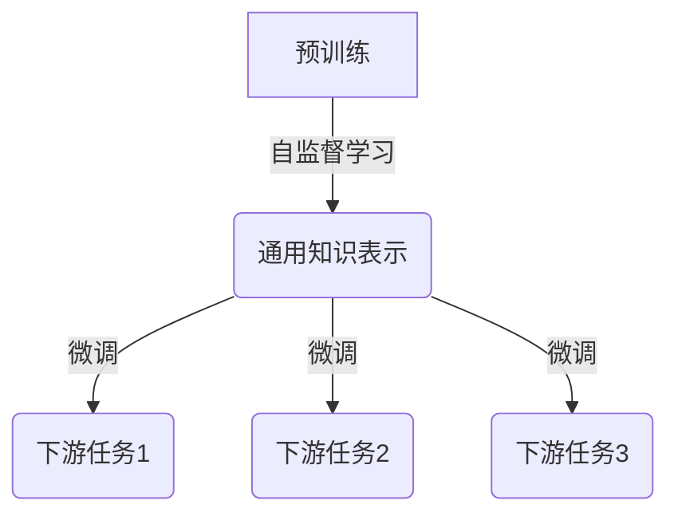
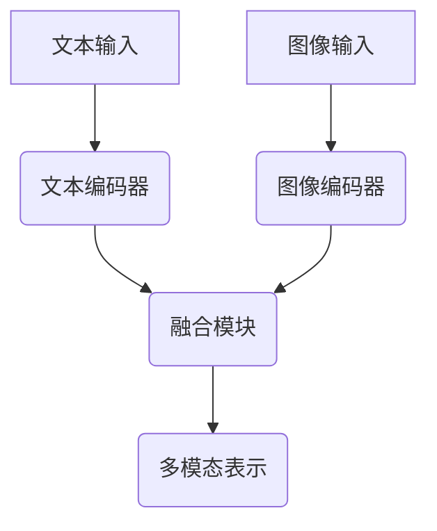
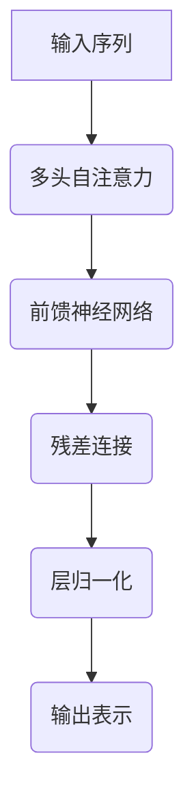
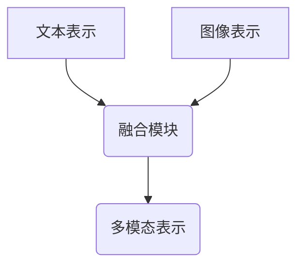

# 多模态大模型：技术原理与实战 大模型+多模态产生的化学反应

## 1.背景介绍

### 1.1 人工智能的发展历程

人工智能(Artificial Intelligence, AI)的概念可以追溯到上世纪50年代。在过去的几十年里,AI经历了几个重要的发展阶段,从早期的专家系统和符号主义,到机器学习和深度学习的兴起。近年来,由于计算能力的飞速提升、海量数据的积累以及算法的创新,AI取得了长足的进步,在多个领域展现出超越人类的能力。

### 1.2 大模型的兴起

在这一背景下,大模型(Large Model)应运而生。大模型是指具有数十亿甚至上百亿参数的巨大神经网络模型。这些模型通过在海量数据上进行预训练,学习到丰富的知识表示,并可以通过微调(Fine-tuning)等方式适应各种下游任务。

代表性的大模型包括OpenAI的GPT系列、Google的BERT、DeepMind的Gopher等。这些模型在自然语言处理、计算机视觉、推理等多个领域展现出卓越的性能,推动了AI的发展。

### 1.3 多模态大模型的崛起

然而,现实世界是多模态的,包含文本、图像、视频、音频等多种信息形式。单一模态的大模型难以充分捕捉这种多样性。因此,多模态大模型(Multimodal Large Model)应运而生,旨在融合并理解来自不同模态的信息。

多模态大模型通过统一的架构,学习多种模态之间的相关性和交互,实现了模态之间的无缝融合。这使得模型能够更好地理解和表示复杂的多模态数据,为诸多应用场景提供了强大的支持。

代表性的多模态大模型包括OpenAI的CLIP、Google的Flamingo、Meta的Data2Vec等。这些模型展现出了在多模态任务上的卓越表现,开辟了AI发展的新领域。

## 2.核心概念与联系

### 2.1 预训练与微调

预训练(Pre-training)和微调(Fine-tuning)是大模型的核心概念。预训练阶段是在海量无监督数据上进行自监督学习,获取通用的知识表示。微调阶段则是在特定任务的有监督数据上进行进一步训练,使模型适应具体的下游任务。

预训练和微调的分离,使得大模型能够在预训练阶段学习到丰富的知识,而在微调阶段快速适应新的任务,从而实现了知识的高效迁移和泛化。这一范式大大提高了模型的学习效率和性能。



### 2.2 多模态融合

多模态大模型的核心挑战在于如何有效地融合不同模态的信息。常见的融合方式包括:

1. **早期融合**: 将不同模态的输入在底层进行拼接,然后输入到统一的模型中进行联合建模。
2. **晚期融合**: 对每种模态单独建模,然后在高层将不同模态的表示进行融合。
3. **交互式融合**: 不同模态之间进行交互,相互影响和调节对方的表示。

不同的融合策略各有优缺点,需要根据具体任务和数据特点进行选择和设计。



### 2.3 自监督学习

由于多模态数据的标注成本极高,多模态大模型通常采用自监督学习(Self-Supervised Learning)的方式进行预训练。常见的自监督学习策略包括:

1. **蒙版语言模型**(Masked Language Modeling): 随机掩蔽部分文本,模型需要预测被掩蔽的词语。
2. **对比学习**(Contrastive Learning): 通过最大化正样本对之间的相似性,最小化正负样本对之间的相似性,学习有区分性的表示。
3. **自监督任务构建**: 人工设计一些代理任务,例如图像文本匹配、视频问答等,引导模型学习多模态关联。

自监督学习使得模型能够从大量未标注的多模态数据中学习有用的知识表示,为下游任务提供强大的基础。

## 3.核心算法原理具体操作步骤

### 3.1 Transformer架构

多模态大模型通常采用Transformer架构,该架构最早被提出用于机器翻译任务,后来广泛应用于自然语言处理和计算机视觉等领域。

Transformer的核心是自注意力(Self-Attention)机制,它能够捕捉输入序列中任意两个位置之间的关系,从而建模长距离依赖。多头注意力(Multi-Head Attention)进一步提高了模型的表示能力。



### 3.2 模态融合策略

在多模态大模型中,需要设计合理的策略将不同模态的表示进行融合。常见的融合策略包括:

1. **拼接融合**(Concatenation Fusion): 将不同模态的表示沿着特征维度拼接,然后输入到后续的Transformer层进行建模。
2. **门控融合**(Gated Fusion): 通过学习一个门控机制,动态调节不同模态表示的重要性。
3. **交互融合**(Interactive Fusion): 不同模态的表示相互作用,通过交叉注意力机制进行信息交换。

不同的融合策略可以根据任务需求进行选择和组合,以获得最佳的多模态表示。



### 3.3 预训练目标

多模态大模型的预训练目标通常包括以下几个方面:

1. **蒙版语言模型**(Masked Language Modeling): 预测被掩蔽的文本词语,学习文本表示。
2. **图像文本对比**(Image-Text Contrastive Learning): 最大化正样本对(图像和对应文本描述)之间的相似性,最小化负样本对之间的相似性。
3. **视觉问答**(Visual Question Answering): 根据图像内容回答相关问题,学习图像和文本之间的关联。
4. **视频理解**(Video Understanding): 预测视频中的动作、事件等,学习时序信息的建模。

通过这些预训练目标,模型可以学习到多模态之间的相关性,为下游任务奠定基础。

### 3.4 微调与迁移

在完成预训练后,多模态大模型可以通过微调的方式适应特定的下游任务。常见的微调策略包括:

1. **全模型微调**(Full Model Fine-tuning): 对整个模型的所有参数进行微调,适应新的任务。
2. **前馈适配器**(Feed-Forward Adapter): 只微调一些小的适配器模块,保持大部分参数不变。
3. **prompt学习**(Prompt Learning): 通过设计合适的prompt,引导模型生成所需的输出。

不同的微调策略需要根据具体任务、数据量和计算资源进行权衡选择。合理的微调可以有效地将预训练知识迁移到新的任务上,提高模型的泛化能力。

## 4.数学模型和公式详细讲解举例说明

### 4.1 自注意力机制

自注意力机制是Transformer架构的核心,它能够捕捉输入序列中任意两个位置之间的关系。给定一个输入序列 $X = (x_1, x_2, \dots, x_n)$,自注意力的计算过程如下:

$$
\begin{aligned}
Q &= XW^Q \\
K &= XW^K \\
V &= XW^V \\
\text{Attention}(Q, K, V) &= \text{softmax}\left(\frac{QK^T}{\sqrt{d_k}}\right)V
\end{aligned}
$$

其中 $Q$、$K$、$V$ 分别表示查询(Query)、键(Key)和值(Value)的线性投影,它们通过不同的权重矩阵 $W^Q$、$W^K$、$W^V$ 从输入 $X$ 计算得到。$d_k$ 是缩放因子,用于防止点积过大导致的梯度饱和问题。

自注意力机制通过计算查询 $Q$ 与所有键 $K$ 的点积,得到一个注意力分数矩阵。该矩阵经过 softmax 函数归一化后,与值 $V$ 相乘,即可得到加权后的输出表示。

### 4.2 多头注意力

为了进一步提高表示能力,Transformer采用了多头注意力(Multi-Head Attention)机制。多头注意力将输入序列通过不同的线性投影,分别计算多个注意力头,然后将它们的输出拼接起来。

$$
\begin{aligned}
\text{MultiHead}(Q, K, V) &= \text{Concat}(\text{head}_1, \dots, \text{head}_h)W^O \\
\text{where } \text{head}_i &= \text{Attention}(QW_i^Q, KW_i^K, VW_i^V)
\end{aligned}
$$

其中 $W_i^Q$、$W_i^K$、$W_i^V$ 是第 $i$ 个注意力头对应的线性投影矩阵,而 $W^O$ 是一个可学习的输出权重矩阵,用于将多个注意力头的输出拼接后进行线性变换。

多头注意力机制允许模型从不同的表示子空间捕捉不同的相关性,提高了模型的表示能力和泛化性。

### 4.3 对比学习目标

对比学习(Contrastive Learning)是多模态大模型预训练中常用的一种自监督学习方法。它的目标是最大化正样本对之间的相似性,最小化正负样本对之间的相似性,从而学习到有区分性的表示。

给定一个正样本对 $(x, x^+)$ 和一组负样本 $\{x^-_i\}$,对比学习的目标函数可以表示为:

$$
\mathcal{L}_\text{contrast} = -\log \frac{\exp(\text{sim}(f(x), f(x^+)) / \tau)}{\sum_{x^-} \exp(\text{sim}(f(x), f(x^-)) / \tau)}
$$

其中 $f(\cdot)$ 表示编码器函数,将输入映射到表示空间; $\text{sim}(\cdot, \cdot)$ 是相似性度量函数,如点积相似性; $\tau$ 是一个温度超参数,用于调节相似性分数的尺度。

对比学习目标函数通过最大化正样本对的相似性分数,最小化正样本与负样本之间的相似性分数,从而学习到有区分性的表示。这种自监督学习方式不需要人工标注,可以利用大量未标注的多模态数据进行预训练。

### 4.4 视觉问答任务

视觉问答(Visual Question Answering, VQA)是多模态大模型预训练中常用的一种代理任务。给定一个图像 $I$ 和一个相关的问题 $Q$,模型需要根据图像内容回答问题。

视觉问答任务的目标函数可以表示为:

$$
\mathcal{L}_\text{VQA} = -\log P(A | I, Q; \theta)
$$

其中 $A$ 是正确答案, $\theta$ 是模型参数。模型需要最大化正确答案的条件概率,即最小化上述目标函数。

视觉问答任务要求模型理解图像和文本之间的复杂关系,捕捉它们之间的相关性。通过预训练这种代理任务,多模态大模型可以学习到有效的多模态表示,为下游任务奠定基础。

## 5.项目实践:代码实例和详细解释说明

以下是一个基于PyTorch实现的简化版多模态大模型代码示例,用于图像-文本检索任务。

### 5.1 数据准备

```python
import torch
from torch.utils.data