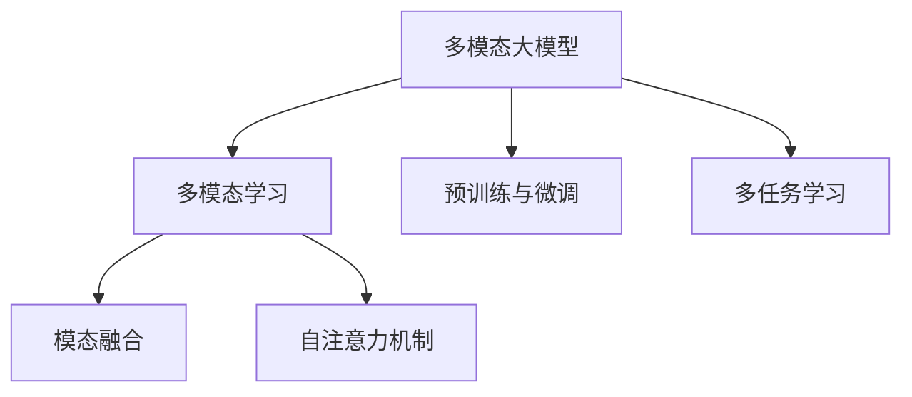

# 多模态大模型：技术原理与实战 工具和算法框架介绍

## 1. 背景介绍

### 1.1 人工智能的发展历程

人工智能的发展经历了几个重要阶段。早期的人工智能系统主要集中在特定领域的专家系统和基于规则的系统。随着机器学习算法的发展,尤其是深度学习的兴起,人工智能系统在语音识别、计算机视觉等领域取得了重大突破。

### 1.2 大模型的兴起

近年来,随着计算能力的提高和大量数据的积累,大模型(Large Model)开始崭露头角。这些大模型通过预训练技术在海量数据上学习通用的表示,然后针对特定任务进行微调,展现出了强大的泛化能力。

代表性的大模型包括 GPT(Generative Pre-trained Transformer)、BERT(Bidirectional Encoder Representations from Transformers)等,它们在自然语言处理领域取得了卓越的成绩。随后,大模型的概念也逐渐扩展到计算机视觉、多模态等其他领域。

### 1.3 多模态大模型的重要性

在现实世界中,信息通常以多种形式存在,如文本、图像、视频、音频等。单一模态的人工智能系统难以充分理解和处理这些多样化的信息。因此,多模态大模型(Multimodal Large Model)应运而生,旨在融合并处理多种模态的信息,实现更加智能和通用的人工智能系统。

多模态大模型具有广阔的应用前景,如智能助手、内容理解和生成、多媒体分析等,将为人机交互、信息处理等领域带来革命性的变革。

## 2. 核心概念与联系

### 2.1 多模态学习

多模态学习(Multimodal Learning)是指从多种模态的数据中学习知识表示和建模的过程。常见的模态包括文本、图像、视频、音频等。多模态学习旨在捕捉和融合不同模态之间的关联,以获得更加丰富和全面的信息表示。

### 2.2 模态融合

模态融合(Modal Fusion)是多模态学习的核心挑战之一。它涉及如何有效地将来自不同模态的信息融合在一起,以捕捉它们之间的相关性和互补性。常见的模态融合方法包括早期融合、晚期融合和混合融合等。

### 2.3 自注意力机制

自注意力机制(Self-Attention Mechanism)是transformer模型的核心组件,它允许模型捕捉输入序列中任意两个位置之间的关系,从而更好地建模长距离依赖。自注意力机制在自然语言处理、计算机视觉等领域表现出色,也是多模态大模型的关键技术之一。

### 2.4 预训练与微调

预训练(Pre-training)和微调(Fine-tuning)是训练大模型的常用范式。预训练阶段在大量无标注数据上学习通用的表示,而微调阶段则在特定任务的标注数据上进行进一步调整,以适应特定任务。这种范式有助于提高模型的泛化能力和训练效率。

### 2.5 多任务学习

多任务学习(Multi-task Learning)是指在同一个模型中同时学习多个相关任务,利用不同任务之间的相关性来提高模型的泛化能力和鲁棒性。多模态大模型通常需要处理多种模态下的多个任务,因此多任务学习是一种重要的训练范式。

### 2.6 概念关系图

以下是上述核心概念之间的关系图:

## 3. 核心算法原理具体操作步骤

### 3.1 Transformer 模型

Transformer 是一种基于自注意力机制的序列到序列模型,它在机器翻译、文本生成等任务中表现出色。Transformer 的核心组件包括编码器(Encoder)和解码器(Decoder),它们都由多个相同的层组成,每层包含多头自注意力子层和前馈网络子层。

1. **输入嵌入**:将输入序列(如文本)转换为嵌入向量表示。
2. **位置编码**:由于自注意力机制没有捕捉序列顺序的能力,因此需要添加位置编码来保留位置信息。
3. **多头自注意力**:计算查询(Query)、键(Key)和值(Value)之间的注意力权重,捕捉序列中任意两个位置之间的关系。
4. **残差连接和层归一化**:通过残差连接和层归一化来增强模型的稳定性和收敛性。
5. **前馈网络**:对每个位置的表示进行独立的全连接变换,提供额外的非线性建模能力。
6. **解码器掩码**:在解码器中,使用掩码机制来防止注意力机制关注到未来的位置,确保生成的输出序列是因果的。

Transformer 模型通过自注意力机制捕捉长距离依赖关系,并通过编码器-解码器架构实现序列到序列的转换,在自然语言处理任务中取得了卓越的成绩。

### 3.2 Vision Transformer (ViT)

Vision Transformer (ViT) 是将 Transformer 模型应用于计算机视觉任务的一种方法。ViT 将图像分割为多个patch(图像块),并将每个patch投影到一个向量空间,作为 Transformer 的输入。ViT 的操作步骤如下:

1. **图像分割**:将输入图像分割成多个patch,每个patch代表图像的一个局部区域。
2. **线性投影**:将每个patch投影到一个固定维度的向量空间,作为 Transformer 的输入。
3. **位置嵌入**:为每个patch添加位置嵌入,以保留空间位置信息。
4. **Transformer 编码器**:将投影后的patch序列输入 Transformer 编码器,捕捉patch之间的关系。
5. **分类头**:在 Transformer 编码器的输出上添加一个分类头,用于执行图像分类或其他视觉任务。

ViT 通过直接将图像patch作为输入,利用 Transformer 的自注意力机制捕捉图像中不同区域之间的长距离依赖关系,在图像分类、目标检测等计算机视觉任务中表现出色。

### 3.3 多模态 Transformer

多模态 Transformer 旨在融合和处理多种模态的输入,如文本、图像、视频等。它的核心思想是将不同模态的输入投影到一个共享的向量空间,然后使用 Transformer 架构捕捉不同模态之间的交互和关系。多模态 Transformer 的操作步骤如下:

1. **模态特征提取**:对每种模态的输入,使用相应的特征提取器(如BERT for文本、ViT for图像)提取特征表示。
2. **模态投影**:将不同模态的特征投影到一个共享的向量空间,使得不同模态的表示具有相同的维度。
3. **模态融合**:将投影后的不同模态表示拼接或求和,形成一个融合的多模态表示。
4. **多模态 Transformer**:将融合的多模态表示输入 Transformer 模型,捕捉不同模态之间的交互和关系。
5. **任务头**:在 Transformer 的输出上添加相应的任务头,如分类头、检测头等,用于执行特定的多模态任务。

多模态 Transformer 通过将不同模态的输入映射到一个共享的向量空间,并利用 Transformer 的自注意力机制捕捉模态之间的交互关系,实现了对多种模态信息的有效融合和建模。

### 3.4 预训练与微调

预训练和微调是训练大模型的常用范式。预训练阶段旨在在大量无标注数据上学习通用的表示,而微调阶段则在特定任务的标注数据上进一步调整模型,使其适应特定任务。

1. **预训练**:
   - 自监督预训练:利用大量无标注数据,设计自监督任务(如掩码语言模型、图像去噪自编码器等)进行预训练,学习通用的表示。
   - 多任务预训练:在多个相关任务上同时预训练,利用任务之间的相关性提高模型的泛化能力。

2. **微调**:
   - 特定任务微调:在预训练模型的基础上,使用特定任务的标注数据进行微调,调整模型参数以适应该任务。
   - 多任务微调:同时在多个相关任务上进行微调,提高模型的泛化能力和鲁棒性。

预训练和微调的范式可以应用于自然语言处理、计算机视觉、多模态等不同领域的大模型。通过预训练学习通用的表示,再结合微调适应特定任务,可以显著提高模型的性能和训练效率。

## 4. 数学模型和公式详细讲解举例说明

### 4.1 自注意力机制

自注意力机制是 Transformer 模型的核心组件,它允许模型捕捉输入序列中任意两个位置之间的关系。给定一个输入序列 $X = (x_1, x_2, \dots, x_n)$,自注意力机制的计算过程如下:

1. 计算查询(Query)、键(Key)和值(Value)向量:

$$
Q = XW^Q, K = XW^K, V = XW^V
$$

其中 $W^Q, W^K, W^V$ 分别是查询、键和值的投影矩阵。

2. 计算注意力权重:

$$
\text{Attention}(Q, K, V) = \text{softmax}\left(\frac{QK^T}{\sqrt{d_k}}\right)V
$$

其中 $d_k$ 是缩放因子,用于防止内积值过大导致梯度饱和。

3. 多头自注意力:为了捕捉不同的子空间关系,多头自注意力将注意力机制独立运行多次,然后将结果拼接:

$$
\text{MultiHead}(Q, K, V) = \text{Concat}(\text{head}_1, \dots, \text{head}_h)W^O
$$

其中 $\text{head}_i = \text{Attention}(QW_i^Q, KW_i^K, VW_i^V)$,表示第 $i$ 个注意力头,共有 $h$ 个注意力头。$W_i^Q, W_i^K, W_i^V$ 是对应的投影矩阵,而 $W^O$ 是一个可学习的线性变换。

通过自注意力机制,Transformer 模型可以捕捉输入序列中任意两个位置之间的关系,从而更好地建模长距离依赖。

### 4.2 多模态融合

多模态融合是将不同模态的信息有效融合的关键步骤。常见的融合方法包括早期融合、晚期融合和混合融合等。

1. **早期融合**:在特征提取阶段,将不同模态的原始输入拼接或求和,然后通过一个共享的特征提取器提取融合的特征表示。早期融合的优点是可以捕捉模态之间的相互作用,但缺点是难以处理异构模态。

2. **晚期融合**:对每种模态单独提取特征,然后将不同模态的特征表示拼接或求和,作为后续任务的输入。晚期融合的优点是可以处理异构模态,但缺点是难以捕捉模态之间的相互作用。

3. **混合融合**:结合早期融合和晚期融合的优点,在不同层次进行融合。例如,可以先对每种模态单独提取特征,然后在中间层进行融合,最后在输出层进行另一次融合。混合融合可以在不同层次捕捉模态之间的交互关系。

给定两种模态 $X$ 和 $Y$,混合融合的公式可以表示为:

$$
f(X, Y) = g(h(X), h(Y), X, Y)
$$

其中 $h(\cdot)$ 表示单模态特征提取器,而 $g(\cdot)$ 表示融合函数,如拼接或求和等。

通过合理的多模态融合策略,可以有效地捕捉和利用不同模态之间的相关性和互补性,从而提高多模态模型的性能。

## 5. 项目实践:代码实例和详细解释说明

在这一部分,我们将介绍如何使用 PyT