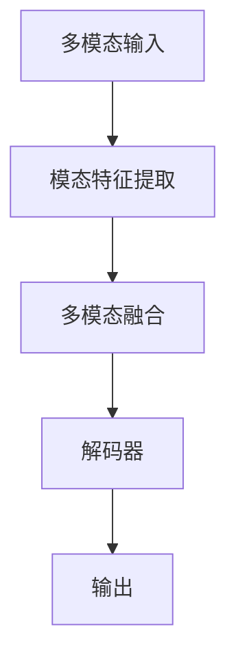

# 多模态大模型：技术原理与实战应用背景

## 1.背景介绍

### 1.1 人工智能发展历程

人工智能(Artificial Intelligence, AI)是当代科技发展的核心驱动力,其发展历程可以追溯到20世纪50年代。在过去几十年中,人工智能经历了几次重大突破,催生了机器学习、深度学习等重要技术,极大推动了人工智能的发展。

### 1.2 大模型兴起

近年来,benefitting from大规模数据、算力硬件和算法创新,大模型(Large Model)开始兴起并逐步占据主导地位。大模型通过在海量数据上进行训练,能够学习丰富的知识和技能,展现出惊人的泛化能力。以GPT-3、BERT等自然语言大模型为代表,大模型在自然语言处理、计算机视觉等领域取得了卓越的成绩。

### 1.3 多模态大模型兴起

随着多模态学习(Multimodal Learning)的兴起,多模态大模型(Multimodal Large Model)开始引起广泛关注。多模态大模型能够同时处理来自不同模态(如文本、图像、视频等)的数据,实现跨模态的知识融合与迁移。这使得多模态大模型在多个领域具有广阔的应用前景。

## 2.核心概念与联系

### 2.1 多模态学习

多模态学习是指机器同时从多个模态(如文本、图像、语音等)中学习知识的过程。多模态学习的核心思想是利用不同模态之间的相关性,实现跨模态的知识融合和迁移,从而提高模型的泛化能力。

### 2.2 多模态表示学习

多模态表示学习(Multimodal Representation Learning)是多模态学习的核心技术,旨在学习一种统一的表示空间,将不同模态的数据映射到该空间中,从而实现跨模态的知识融合。常见的多模态表示学习方法包括:

- 共享表示空间(Shared Representation Space)
- 对齐表示空间(Aligned Representation Space)
- 协调表示空间(Coordinated Representation Space)

### 2.3 多模态融合

多模态融合(Multimodal Fusion)是多模态学习的另一核心技术,旨在将来自不同模态的特征进行融合,从而提高模型的表现能力。常见的多模态融合方法包括:

- 早期融合(Early Fusion)
- 晚期融合(Late Fusion)
- 混合融合(Hybrid Fusion)

### 2.4 多模态迁移学习

多模态迁移学习(Multimodal Transfer Learning)是指利用一个模态的知识来改善另一个模态的学习效果。这种技术可以缓解数据不足的问题,提高模型的泛化能力。

### 2.5 多模态大模型架构

多模态大模型通常采用编码器-解码器(Encoder-Decoder)架构,其中编码器用于提取不同模态的特征表示,解码器则负责融合不同模态的特征并生成所需的输出。常见的多模态大模型架构包括:

- Transformer架构
- 双流架构(Two-Stream Architecture)
- 融合架构(Fusion Architecture)

## 3.核心算法原理具体操作步骤

### 3.1 多模态预训练

多模态大模型通常采用预训练与微调(Pre-training and Fine-tuning)的范式。在预训练阶段,模型在大规模多模态数据集上进行自监督学习,学习到通用的多模态表示。在微调阶段,模型在特定任务的数据集上进行进一步训练,实现知识迁移。

#### 3.1.1 自监督预训练目标

常见的多模态预训练目标包括:

- 掩码语言模型(Masked Language Modeling, MLM)
- 图像文本对比(Image-Text Contrastive)
- 视频文本对比(Video-Text Contrastive)
- 多模态对比(Multimodal Contrastive)

#### 3.1.2 预训练算法

- BERT: 掩码语言模型 + 下一句预测
- ViLBERT: 掩码语言模型 + 图像文本对比
- VideoBERT: 掩码语言模型 + 视频文本对比
- UNITER: 掩码语言模型 + 图像文本对比 + 图像区域标注
- LXMERT: 掩码语言模型 + 图像文本对比 + 视觉问答

### 3.2 多模态融合算法

多模态融合算法负责将来自不同模态的特征进行融合,以捕获跨模态的相关性。常见的多模态融合算法包括:

#### 3.2.1 注意力融合

使用注意力机制对不同模态的特征进行加权融合。

$$
\begin{aligned}
\mathbf{h}^{fused} &= \sum_{m=1}^M \alpha_m \mathbf{h}_m \\
\alpha_m &= \text{softmax}(\mathbf{q}^\top \mathbf{W}_m \mathbf{h}_m)
\end{aligned}
$$

其中 $\mathbf{h}_m$ 是第 $m$ 个模态的特征, $\mathbf{q}$ 是查询向量, $\mathbf{W}_m$ 是可学习的权重矩阵。

#### 3.2.2 门控融合

使用门控机制对不同模态的特征进行选择性融合。

$$
\begin{aligned}
\mathbf{g}_m &= \sigma(\mathbf{W}_g [\mathbf{h}_m; \mathbf{h}_{ctx}] + \mathbf{b}_g) \\
\mathbf{h}^{fused} &= \sum_{m=1}^M \mathbf{g}_m \odot \mathbf{h}_m
\end{aligned}
$$

其中 $\mathbf{h}_{ctx}$ 是上下文向量, $\mathbf{W}_g$ 和 $\mathbf{b}_g$ 是可学习的权重和偏置, $\sigma$ 是激活函数, $\odot$ 表示元素乘积。

#### 3.2.3 外积融合

通过计算不同模态特征的外积来捕获它们之间的相关性。

$$
\mathbf{h}^{fused} = \mathbf{h}_1 \otimes \mathbf{h}_2 \otimes \cdots \otimes \mathbf{h}_M
$$

其中 $\otimes$ 表示张量外积运算。

### 3.3 多模态知识迁移

多模态知识迁移是指利用一个模态的知识来改善另一个模态的学习效果。常见的多模态知识迁移方法包括:

#### 3.3.1 注意力迁移

使用注意力机制从一个模态的特征中提取相关知识,并将其传递到另一个模态的特征中。

#### 3.3.2 对抗迁移

通过对抗训练,使得两个模态的特征分布尽可能相似,从而实现知识迁移。

#### 3.3.3 正则化迁移

在目标模态的损失函数中加入一个正则化项,使其特征与源模态的特征保持一致性。

## 4.数学模型和公式详细讲解举例说明

### 4.1 多模态表示学习

多模态表示学习的目标是学习一种统一的表示空间,将不同模态的数据映射到该空间中,从而实现跨模态的知识融合。常见的多模态表示学习方法包括共享表示空间、对齐表示空间和协调表示空间。

#### 4.1.1 共享表示空间

共享表示空间(Shared Representation Space)是最直接的多模态表示学习方法。它假设存在一个共享的潜在空间,不同模态的数据可以映射到该空间中。具体来说,对于每个模态 $m$,我们定义一个编码器 $f_m$,将该模态的输入 $\mathbf{x}_m$ 映射到共享空间中:

$$
\mathbf{z}_m = f_m(\mathbf{x}_m)
$$

然后,我们可以使用一个解码器 $g$ 从共享空间中重构原始输入:

$$
\hat{\mathbf{x}}_m = g(\mathbf{z}_m)
$$

在训练过程中,我们最小化重构损失,例如均方误差:

$$
\mathcal{L}_{rec} = \sum_m \|\mathbf{x}_m - \hat{\mathbf{x}}_m\|^2
$$

这种方法的优点是简单直观,但缺点是假设了所有模态共享相同的表示空间,这可能过于严格。

#### 4.1.2 对齐表示空间

对齐表示空间(Aligned Representation Space)是一种更加灵活的多模态表示学习方法。它允许不同模态有自己的表示空间,但要求这些表示空间之间存在某种对应关系。具体来说,对于每个模态 $m$,我们定义一个编码器 $f_m$ 和一个解码器 $g_m$:

$$
\mathbf{z}_m = f_m(\mathbf{x}_m), \quad \hat{\mathbf{x}}_m = g_m(\mathbf{z}_m)
$$

然后,我们引入一个对齐函数 $\phi$,将不同模态的表示对齐到一个共享空间中:

$$
\mathbf{u}_m = \phi(\mathbf{z}_m)
$$

在训练过程中,我们最小化重构损失和对齐损失:

$$
\begin{aligned}
\mathcal{L}_{rec} &= \sum_m \|\mathbf{x}_m - \hat{\mathbf{x}}_m\|^2 \\
\mathcal{L}_{align} &= \sum_{m,n} d(\mathbf{u}_m, \mathbf{u}_n)
\end{aligned}
$$

其中 $d(\cdot, \cdot)$ 是一个测度两个表示之间距离的函数,例如余弦距离或欧几里得距离。对齐损失的作用是使得不同模态的表示在共享空间中尽可能接近。

#### 4.1.3 协调表示空间

协调表示空间(Coordinated Representation Space)是一种更加通用的多模态表示学习方法。它不要求不同模态共享相同的表示空间,也不要求它们的表示空间存在显式的对应关系。相反,它通过一个协调函数 $\psi$,将不同模态的表示协调到一个共享空间中:

$$
\mathbf{v} = \psi(\mathbf{z}_1, \mathbf{z}_2, \ldots, \mathbf{z}_M)
$$

协调函数 $\psi$ 可以是任意的函数,例如前馈神经网络或注意力机制。在训练过程中,我们最小化协调损失:

$$
\mathcal{L}_{coord} = d(\mathbf{v}, \mathbf{y})
$$

其中 $\mathbf{y}$ 是目标表示,例如下游任务的标签。协调损失的作用是使得协调后的表示 $\mathbf{v}$ 能够很好地完成下游任务。

### 4.2 多模态融合

多模态融合是将来自不同模态的特征进行融合的过程,以捕获跨模态的相关性。常见的多模态融合方法包括注意力融合、门控融合和外积融合。

#### 4.2.1 注意力融合

注意力融合使用注意力机制对不同模态的特征进行加权融合。具体来说,对于 $M$ 个模态,我们有 $M$ 个特征向量 $\{\mathbf{h}_1, \mathbf{h}_2, \ldots, \mathbf{h}_M\}$。我们定义一个查询向量 $\mathbf{q}$,并计算每个模态特征与查询向量的相关性分数:

$$
\alpha_m = \text{softmax}(\mathbf{q}^\top \mathbf{W}_m \mathbf{h}_m)
$$

其中 $\mathbf{W}_m$ 是可学习的权重矩阵。然后,我们将不同模态的特征按照相关性分数进行加权求和,得到融合后的特征:

$$
\mathbf{h}^{fused} = \sum_{m=1}^M \alpha_m \mathbf{h}_m
$$

注意力融合的优点是可以自适应地为不同模态分配不同的权重,从而更好地捕获跨模态的相关性。

#### 4.2.2 门控融合

门控融合使用门控机制对不同模态的特征进行选择性融合。具体来说,对于每个模态 $m$,我们计算一个门控向量 $\mathbf{g}_m$,用于控制该模态特征 $\mathbf{h}_m$ 的重要性:

$$