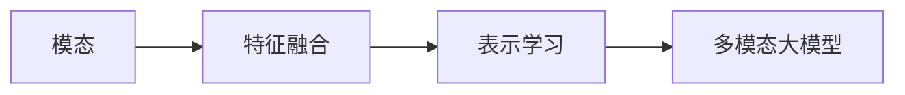

## 1. 背景介绍

随着人工智能技术的飞速发展，多模态大模型已经成为了研究和应用的热点。这类模型通过整合不同类型的数据（如文本、图像、声音等），能够更好地理解和表达人类的复杂交流方式。在自然语言处理（NLP）、计算机视觉（CV）和语音识别等领域，多模态大模型展现出了卓越的性能。本文将深入探讨多模态大模型的技术原理，并结合实战案例，讲解如何进行提示学习与指令微调。

## 2. 核心概念与联系

多模态大模型涉及的核心概念包括模态、特征融合、表示学习等。模态指的是数据的类型，如文本、图像、声音等。特征融合是指将不同模态的数据特征结合起来，以便模型能够统一处理和学习。表示学习则是指模型学习如何将原始数据转换为更加有用的表示（即特征向量）的过程。



## 3. 核心算法原理具体操作步骤

多模态大模型的核心算法原理包括模态编码器、交叉模态注意力机制和联合嵌入空间学习。具体操作步骤如下：

1. **模态编码器**：为每种模态设计特定的编码器，将原始数据转换为特征向量。
2. **交叉模态注意力机制**：通过注意力机制，使模型能够关注到不同模态间的相关信息。
3. **联合嵌入空间学习**：将不同模态的特征向量映射到同一嵌入空间，以便进行有效的信息融合。

## 4. 数学模型和公式详细讲解举例说明

以交叉模态注意力机制为例，其数学模型可以表示为：

$$
\text{Attention}(Q, K, V) = \text{softmax}\left(\frac{QK^T}{\sqrt{d_k}}\right)V
$$

其中，$Q$、$K$、$V$ 分别代表查询（Query）、键（Key）和值（Value），$d_k$ 是键的维度。通过这个公式，模型能够计算不同模态之间的相互关注权重。

## 5. 项目实践：代码实例和详细解释说明

以一个简单的文本和图像融合模型为例，代码实例可能如下：

```python
# 文本编码器
text_encoder = TextEncoder(...)
# 图像编码器
image_encoder = ImageEncoder(...)
# 特征融合层
fusion_layer = FusionLayer(...)

# 输入文本和图像数据
text_input = ...
image_input = ...
# 编码
text_features = text_encoder(text_input)
image_features = image_encoder(image_input)
# 融合
fused_features = fusion_layer(text_features, image_features)
```

详细解释说明：文本编码器和图像编码器分别处理输入的文本和图像数据，将它们转换为特征向量。特征融合层则将这两种特征向量结合起来，生成一个融合后的特征表示。

## 6. 实际应用场景

多模态大模型在许多场景中都有应用，例如：

- **图文匹配**：在社交媒体中自动标注图片与相关文本。
- **视频理解**：分析视频内容并生成描述性文本。
- **语音视觉导航**：结合语音指令和视觉信息，指导机器人导航。

## 7. 工具和资源推荐

- **TensorFlow** 和 **PyTorch**：两个流行的深度学习框架，支持多模态模型的开发。
- **Hugging Face Transformers**：提供了多种预训练的多模态模型。
- **Datasets**：如 MS COCO、Flickr30k 等，用于多模态模型的训练和测试。

## 8. 总结：未来发展趋势与挑战

多模态大模型的未来发展趋势包括更深层次的模态融合、更强大的跨模态推理能力以及更高效的训练方法。同时，这些模型面临的挑战包括数据集的多样性和规模、模型的泛化能力以及计算资源的需求。

## 9. 附录：常见问题与解答

- **Q1**: 多模态模型的训练数据如何获取？
- **A1**: 可以通过公开的数据集，或者自行收集并标注。

- **Q2**: 如何评估多模态模型的性能？
- **A2**: 通常通过特定任务的准确率、召回率等指标进行评估。

作者：禅与计算机程序设计艺术 / Zen and the Art of Computer Programming