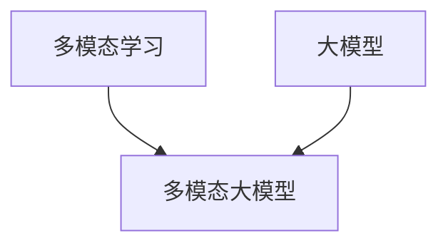

# 多模态大模型：技术原理与实战部署流程

## 1. 背景介绍

### 1.1 多模态大模型的兴起
近年来,随着人工智能技术的飞速发展,多模态大模型(Multimodal Large Models)成为了学术界和工业界的研究热点。多模态大模型通过融合文本、图像、音频等不同模态的数据,可以实现更加智能和自然的人机交互。无论是在问答系统、对话助手,还是内容生成等领域,多模态大模型都展现出了巨大的应用前景。

### 1.2 多模态大模型面临的挑战
尽管多模态大模型取得了令人瞩目的成就,但在实际应用中仍然面临诸多挑战:
1. 海量异构数据的处理和融合
2. 模型训练的计算资源消耗巨大
3. 推理部署的工程难度高
4. 模型的可解释性和可控性有待提高

本文将围绕多模态大模型的技术原理和实战部署流程展开深入探讨,为读者提供全面系统的认识和实操指南。

## 2. 核心概念与联系

### 2.1 多模态学习
多模态学习(Multimodal Learning)是指利用不同模态(如文本、图像、音频等)的数据进行联合建模和学习的方法。通过挖掘不同模态数据之间的内在联系,多模态学习可以获得比单一模态更加丰富和准确的信息表示。

### 2.2 大模型
大模型(Large Models)是指参数量达到亿级甚至千亿级的超大规模机器学习模型。得益于海量训练数据和强大计算力的支持,大模型在 NLP、CV 等领域取得了显著的性能提升。代表性的大模型包括 GPT-3、BERT、CLIP 等。

### 2.3 多模态大模型 
多模态大模型是多模态学习和大模型的结合,旨在构建能够处理文本、图像、音频等多种模态数据的超大规模模型。通过对不同模态数据的联合建模,多模态大模型可以学习到更加通用和鲁棒的数据表示,从而在跨模态的理解和生成任务上取得突破性进展。

### 2.4 核心概念关系图
下图展示了多模态学习、大模型以及多模态大模型三者之间的关系:



## 3. 核心算法原理与具体操作步骤

### 3.1 多模态预训练
多模态大模型的核心是利用海量多模态数据进行预训练,学习不同模态之间的对齐和融合。主要的预训练方法包括:

#### 3.1.1 对比学习
对比学习通过最大化正样本对的相似度和最小化负样本对的相似度,来学习不同模态数据的对齐表示。具体步骤如下:
1. 构建正负样本对
2. 计算正负样本对的相似度
3. 优化对比损失函数
4. 迭代训练直至收敛

#### 3.1.2 掩码语言建模
掩码语言建模通过随机掩码输入文本的部分token,然后预测被掩码的token,来学习文本的上下文表示。在多模态场景下,可以将图像等其他模态信息融入到文本表示中,实现跨模态的掩码预测。

#### 3.1.3 多模态对齐
多模态对齐旨在学习不同模态数据之间的语义对应关系。主要方法包括:
- 多模态注意力:通过注意力机制动态建模不同模态之间的交互
- 多模态融合:通过特征拼接、交互等操作将不同模态的特征融合为统一的表示

### 3.2 多模态微调
在完成预训练后,多模态大模型需要在下游任务上进行微调,以适应特定的应用场景。微调过程通常包括:
1. 根据任务构建输入和输出格式
2. 冻结部分预训练参数,只微调输出层或少量参数
3. 在标注数据上进行训练,优化任务目标
4. 评估模型性能,进行超参数调优

## 4. 数学模型和公式详细讲解举例说明

### 4.1 对比学习损失函数
对比学习的目标是最大化正样本对的相似度,最小化负样本对的相似度。常用的损失函数包括InfoNCE损失和对比损失。

以InfoNCE损失为例,其数学形式如下:

$$
\mathcal{L}_{\text{InfoNCE}} = -\log \frac{\exp(sim(q, k_+)/\tau)}{\exp(sim(q, k_+)/\tau) + \sum_{k_-}\exp(sim(q, k_-)/\tau)}
$$

其中,$q$表示查询样本(如文本),$k_+$表示正样本(如对应的图像),$k_-$表示负样本。$sim(·,·)$表示相似度度量函数,常用的有内积、余弦相似度等。$\tau$是温度超参数,用于控制softmax分布的平滑度。

举例说明:假设我们有一个文本查询"一只可爱的小猫",以及一张对应的小猫图像作为正样本,另外采样了99张其他图像作为负样本。我们希望最大化文本和小猫图像的相似度,最小化文本和其他图像的相似度。通过优化InfoNCE损失函数,模型可以学习到文本和图像的对齐表示。

### 4.2 多模态注意力
多模态注意力用于建模不同模态之间的交互,其数学形式如下:

$$
\begin{aligned}
\mathbf{Q} &= \mathbf{W}_q\mathbf{M}_q \\
\mathbf{K} &= \mathbf{W}_k\mathbf{M}_k \\
\mathbf{V} &= \mathbf{W}_v\mathbf{M}_v \\
\mathbf{Attention}(\mathbf{Q}, \mathbf{K}, \mathbf{V}) &= \text{softmax}(\frac{\mathbf{Q}\mathbf{K}^T}{\sqrt{d}})\mathbf{V}
\end{aligned}
$$

其中,$\mathbf{M}_q$、$\mathbf{M}_k$、$\mathbf{M}_v$分别表示查询、键、值矩阵,通常来自不同模态的特征。$\mathbf{W}_q$、$\mathbf{W}_k$、$\mathbf{W}_v$是对应的投影矩阵。$d$是特征维度,用于缩放点积结果。

举例说明:在视觉问答任务中,我们可以将问题文本作为查询,将图像特征作为键和值。通过注意力机制,模型可以根据问题动态关注图像的不同区域,从而得到问题的答案。

## 5. 项目实践:代码实例和详细解释说明

下面我们以PyTorch为例,演示如何实现一个简单的多模态对比学习模型。

### 5.1 数据准备

```python
import torch
from torch.utils.data import Dataset, DataLoader

class MultimodalDataset(Dataset):
    def __init__(self, text_data, image_data):
        self.text_data = text_data
        self.image_data = image_data
        
    def __len__(self):
        return len(self.text_data)
    
    def __getitem__(self, idx):
        text = self.text_data[idx]
        image = self.image_data[idx]
        return text, image

# 加载数据集
dataset = MultimodalDataset(text_data, image_data)
dataloader = DataLoader(dataset, batch_size=64, shuffle=True)
```

这里我们定义了一个`MultimodalDataset`类,用于加载文本和图像数据对。然后使用`DataLoader`生成批次数据。

### 5.2 模型定义

```python
import torch.nn as nn
import torch.nn.functional as F

class ContrastiveLearner(nn.Module):
    def __init__(self, text_encoder, image_encoder, hidden_dim, temperature):
        super().__init__()
        self.text_encoder = text_encoder
        self.image_encoder = image_encoder
        self.text_proj = nn.Linear(text_encoder.output_dim, hidden_dim)
        self.image_proj = nn.Linear(image_encoder.output_dim, hidden_dim)
        self.temperature = temperature
        
    def forward(self, text, image):
        text_feat = self.text_encoder(text)
        image_feat = self.image_encoder(image)
        text_embed = self.text_proj(text_feat)
        image_embed = self.image_proj(image_feat)
        
        # 计算相似度矩阵
        sim_matrix = torch.matmul(text_embed, image_embed.t())
        sim_matrix /= self.temperature
        
        # 计算对比损失
        labels = torch.arange(sim_matrix.size(0)).to(sim_matrix.device)
        loss = F.cross_entropy(sim_matrix, labels)
        
        return loss
```

这里我们定义了一个`ContrastiveLearner`类,包含文本编码器、图像编码器以及对应的投影层。在前向传播中,我们分别对文本和图像进行编码,然后计算它们的相似度矩阵。接着使用交叉熵损失函数计算对比损失。

### 5.3 训练流程

```python
from tqdm import tqdm

model = ContrastiveLearner(text_encoder, image_encoder, hidden_dim=128, temperature=0.07)
optimizer = torch.optim.Adam(model.parameters(), lr=1e-4)

num_epochs = 10
for epoch in range(num_epochs):
    model.train()
    total_loss = 0
    for text_batch, image_batch in tqdm(dataloader):
        optimizer.zero_grad()
        loss = model(text_batch, image_batch)
        loss.backward()
        optimizer.step()
        total_loss += loss.item()
    
    avg_loss = total_loss / len(dataloader)
    print(f"Epoch {epoch+1}/{num_epochs}, Loss: {avg_loss:.4f}")
    
print("Training finished!")
```

在训练流程中,我们遍历数据集的每个批次,计算对比损失并进行梯度反向传播和参数更新。每个epoch结束后,输出当前的平均损失值。

## 6. 实际应用场景

多模态大模型可以应用于各种需要跨模态理解和生成的场景,例如:

### 6.1 智能问答
用户可以通过文本或语音提出问题,系统根据图像、视频等多模态信息生成回答。

### 6.2 内容生成
根据文本描述自动生成对应的图像、音频等多模态内容,实现创意设计和内容创作的自动化。

### 6.3 跨模态检索
用文本检索相关的图像和视频,或者用图像检索相关的文本,实现跨模态信息的高效索引和查找。

### 6.4 多模态对话
在对话系统中引入图像、视频等多模态信息,实现更加自然和交互的人机对话体验。

## 7. 工具和资源推荐

### 7.1 数据集
- MSCOCO:大规模图像标注数据集,包含丰富的图像和文本描述数据。
- Flickr30K:包含31,783张图像及其对应的文本描述。
- CLIP:OpenAI发布的4亿个图文对数据集,用于训练多模态对比学习模型。

### 7.2 开源工具
- PyTorch:流行的深度学习框架,提供了灵活的模型构建和训练功能。
- HuggingFace Transformers:提供了多种预训练语言模型和跨模态模型,可以方便地进行微调和推理。
- OpenAI CLIP:基于对比学习的多模态预训练模型,可以用于图文对齐、跨模态检索等任务。

### 7.3 教程和文章
- 《Multimodal Machine Learning: A Survey and Taxonomy》:全面综述了多模态机器学习的任务、方法和应用。
- 《Multimodal Learning with Transformers》:介绍了如何使用Transformer架构进行多模态学习。
- 《Contrastive Language-Image Pre-training》:CLIP模型的原论文,详细描述了对比学习在多模态预训练中的应用。

## 8. 总结:未来发展趋势与挑战

### 8.1 发展趋势
- 模型规模不断增大:未来多模态大模型的参数量有望突破万亿级别,以支持更加复杂和广泛的应用场景。
- 训练数据更加多样化:不局限于文本和图像,未来还将引入视频、3D、体感等更多模态的数据。
- 端到端的多模态学习:摆脱人工特征提取,直接从原始多模态数据中进行端到端的表示学习。
- 更加通用和鲁棒的表示:旨在学习可迁移、可复用的多模态表示,以适应不同领域和任务的需求。

### 