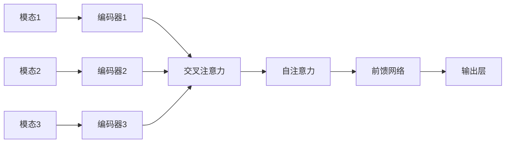

# 多模态学习 (Multimodal Learning)

## 1. 背景介绍

### 1.1 多模态学习的定义与意义

多模态学习(Multimodal Learning)是一种利用多种不同模态数据进行机器学习的方法。模态(Modality)是指数据的类型或来源,如文本、图像、音频、视频等。多模态学习旨在通过融合和利用不同模态数据之间的互补信息,来提高机器学习模型的性能和泛化能力。

在现实世界中,人类通过多种感官(如视觉、听觉、触觉等)来感知和理解周围的环境。类似地,多模态学习试图模拟人类的感知方式,通过综合利用多种模态数据,使机器能够更全面、更准确地理解和分析复杂的现实问题。

### 1.2 多模态学习的发展历程

多模态学习的研究可以追溯到20世纪90年代,早期主要集中在音视频数据的融合上。随着深度学习的兴起,尤其是卷积神经网络(CNN)和循环神经网络(RNN)等模型的广泛应用,多模态学习得到了快速发展。

近年来,随着大数据和计算能力的提升,以及注意力机制、对抗学习等新技术的出现,多模态学习取得了显著进展。一些代表性的工作包括:

- 多模态表示学习:如多模态自编码器、多模态注意力机制等,用于学习不同模态数据的联合表示。
- 多模态融合:如多模态Transformer、多模态图神经网络等,用于融合不同模态数据的特征。
- 多模态对齐:如多模态对抗学习、多模态循环神经网络等,用于实现不同模态数据之间的对齐。
- 多模态推理:如多模态知识图谱、多模态问答等,利用多模态信息进行复杂推理。

### 1.3 多模态学习的应用场景

多模态学习在许多领域都有广泛应用,包括:

- 计算机视觉:如图像描述、视觉问答、图像检索等。
- 自然语言处理:如多模态情感分析、多模态机器翻译、多模态对话系统等。
- 语音识别:如音视频语音识别、说话人识别等。
- 医学影像分析:如多模态医学图像融合、多模态疾病诊断等。
- 智能交通:如自动驾驶、交通场景理解等。

多模态学习正在成为人工智能的重要研究方向之一,有望进一步提升机器智能,拓展人工智能的应用边界。

## 2. 核心概念与联系

### 2.1 多模态数据

多模态数据是指来自不同来源或类型的数据,常见的模态包括:

- 文本:如文档、评论、对话等。
- 图像:如照片、图表、医学影像等。
- 音频:如语音、音乐、环境声等。
- 视频:如影片、监控画面等。
- 传感器数据:如GPS、加速度计、脑电图等。

不同模态数据具有不同的特点和表示方式,如文本是离散的符号序列,图像是连续的像素网格,音频是时间序列信号等。如何有效地表示和融合不同模态数据是多模态学习的核心问题之一。

### 2.2 多模态表示学习

多模态表示学习(Multimodal Representation Learning)是指学习不同模态数据的联合表示,使其能够在一个公共的语义空间中进行比较和融合。常用的方法包括:

- 多模态自编码器:通过重构损失来学习不同模态数据的低维表示,如变分自编码器、对抗自编码器等。
- 多模态注意力机制:通过注意力权重来对齐不同模态数据的关键区域或时刻,如多模态Transformer、多模态图注意力网络等。
- 多模态对比学习:通过最大化不同模态数据之间的互信息来学习其联合表示,如对比语言-图像预训练(CLIP)等。

### 2.3 多模态融合

多模态融合(Multimodal Fusion)是指综合利用不同模态数据的特征,生成一个更全面、更准确的预测或决策。常用的融合策略包括:

- 早期融合:直接拼接不同模态数据的原始特征,再输入到模型中学习。
- 晚期融合:先对不同模态数据分别建模,再将各自的预测结果进行融合。
- 中间融合:在模型的中间层对不同模态数据的特征进行融合,如多模态注意力融合、多模态门控融合等。

不同的融合策略适用于不同的任务和数据类型,需要根据具体情况进行选择和设计。

### 2.4 多模态对齐

多模态对齐(Multimodal Alignment)是指将不同模态数据映射到一个共享的语义空间,使其在语义层面上达成一致。常用的方法包括:

- 多模态对抗学习:通过对抗训练来最小化不同模态数据在共享空间中的分布差异,如多模态对抗生成网络等。
- 多模态循环神经网络:通过循环神经网络来建模不同模态数据之间的时序对应关系,如多模态序列到序列模型等。
- 多模态注意力对齐:通过注意力机制来动态对齐不同模态数据的关键区域或时刻,如多模态注意力对齐网络等。

多模态对齐是实现多模态表示学习和融合的重要前提,有助于提高多模态学习的性能和泛化能力。

### 2.5 多模态推理

多模态推理(Multimodal Reasoning)是指利用多模态信息进行复杂的推理和决策,如多步推理、因果推理、逻辑推理等。常用的方法包括:

- 多模态知识图谱:将不同模态数据组织成知识图谱,通过图推理来回答复杂问题,如多模态知识图谱问答等。
- 多模态强化学习:通过强化学习来学习多模态环境中的最优决策策略,如多模态对话系统、多模态机器人等。
- 多模态因果推理:通过因果模型来推断不同模态变量之间的因果关系,如多模态贝叶斯网络、多模态因果森林等。

多模态推理是多模态学习的高层应用,需要在多模态表示和融合的基础上,结合领域知识和推理机制,实现更加智能和可解释的决策。

### 2.6 多模态学习的关键技术

多模态学习涉及多个关键技术,包括:

- 深度学习:如卷积神经网络(CNN)、循环神经网络(RNN)、Transformer等,用于学习不同模态数据的特征表示。
- 注意力机制:如自注意力、交叉注意力等,用于对齐不同模态数据的关键信息。
- 对抗学习:如生成对抗网络(GAN)、对抗自编码器等,用于学习不同模态数据的共享表示。
- 图神经网络:如图卷积网络(GCN)、图注意力网络(GAT)等,用于建模不同模态数据之间的结构关系。
- 迁移学习:如预训练模型、元学习等,用于提高多模态学习的样本效率和泛化能力。

这些技术的发展和结合,极大地推动了多模态学习的进步,使其能够处理更加复杂和多样的现实问题。

## 3. 核心算法原理具体操作步骤

下面以多模态Transformer为例,详细介绍其核心算法原理和具体操作步骤。

### 3.1 多模态Transformer的整体架构

多模态Transformer是一种基于自注意力机制的多模态融合模型,可以处理任意数量和类型的模态数据。其整体架构如下:

具体来说,多模态Transformer包含以下几个关键组件:

- 模态特定的编码器:对每个模态数据分别进行特征提取和编码,生成模态特定的表示。
- 交叉注意力层:通过注意力机制来计算不同模态表示之间的相关性,实现模态间的信息交互和融合。
- 自注意力层:在融合后的多模态表示上应用自注意力机制,捕捉不同位置之间的长距离依赖关系。
- 前馈网络:对自注意力层的输出进行非线性变换,提高模型的表达能力。
- 输出层:根据任务类型(如分类、回归、生成等)设计相应的输出层,生成最终的预测结果。

### 3.2 模态特定的编码器

对于每个模态数据,首先需要设计相应的编码器,将原始数据转化为适合于多模态融合的特征表示。常用的编码器包括:

- 文本编码器:如词嵌入(Word Embedding)、位置编码(Positional Encoding)、Transformer编码器等。
- 图像编码器:如卷积神经网络(CNN)、残差网络(ResNet)、视觉Transformer(ViT)等。
- 音频编码器:如卷积神经网络(CNN)、循环神经网络(RNN)、声谱图Transformer等。
- 视频编码器:如3D卷积神经网络(3D CNN)、时空注意力网络(Temporal Attention)等。

以文本编码器为例,其具体操作步骤如下:

1. 将文本输入表示为词嵌入向量序列 $\mathbf{E}=[\mathbf{e}_1, \mathbf{e}_2, ..., \mathbf{e}_n]$,其中 $\mathbf{e}_i \in \mathbb{R}^d$ 为第 $i$ 个词的 $d$ 维嵌入向量。
2. 加入位置编码 $\mathbf{P}=[\mathbf{p}_1, \mathbf{p}_2, ..., \mathbf{p}_n]$,其中 $\mathbf{p}_i \in \mathbb{R}^d$ 为第 $i$ 个位置的 $d$ 维位置向量,用于表示词序信息。
3. 将词嵌入和位置编码相加,得到最终的文本表示 $\mathbf{H}^0=\mathbf{E}+\mathbf{P}=[\mathbf{h}_1^0, \mathbf{h}_2^0, ..., \mathbf{h}_n^0]$。
4. 将文本表示 $\mathbf{H}^0$ 输入到 $L$ 层的Transformer编码器中,得到最终的文本编码表示 $\mathbf{H}^L=[\mathbf{h}_1^L, \mathbf{h}_2^L, ..., \mathbf{h}_n^L]$。

其中,Transformer编码器的每一层包含两个子层:多头自注意力层和前馈网络层,具体计算公式如下:

$$
\begin{aligned}
\mathbf{Z}^l &= \text{MultiHead}(\mathbf{H}^{l-1}, \mathbf{H}^{l-1}, \mathbf{H}^{l-1}) \\
\mathbf{H}^l &= \text{LayerNorm}(\mathbf{Z}^l + \text{FFN}(\mathbf{Z}^l))
\end{aligned}
$$

其中, $\text{MultiHead}(\cdot)$ 为多头自注意力函数, $\text{FFN}(\cdot)$ 为前馈网络函数, $\text{LayerNorm}(\cdot)$ 为层归一化函数。

类似地,可以设计图像编码器、音频编码器、视频编码器等,将不同模态数据转化为适合于多模态融合的特征表示。

### 3.3 交叉注意力层

在得到不同模态数据的编码表示后,需要通过交叉注意力机制来实现模态间的信息交互和融合。具体操作步骤如下:

1. 将不同模态的编码表示拼接为一个序列 $\mathbf{H}=[\mathbf{H}^{(1)}, \mathbf{H}^{(2)}, ..., \mathbf{H}^{(m)}]$,其中 $\mathbf{H}^{(i)} \in \mathbb{R}^{n_i \times d}$ 为第 $i$ 个模态的编码表示, $n_i$ 为第 $i$ 个模态的序列长度, $m$ 为模态数量。
2. 对