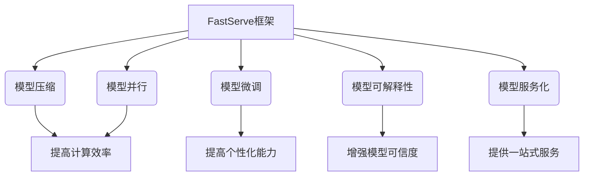

# 大规模语言模型从理论到实践 FastServe框架

## 1.背景介绍

近年来,大规模语言模型(Large Language Model, LLM)在自然语言处理领域取得了令人瞩目的成就。这些模型通过在海量文本数据上进行预训练,学习了丰富的语言知识和上下文信息,展现出惊人的生成能力和理解能力。著名的LLM模型包括GPT-3、BERT、T5等。

然而,当前的LLM模型在实际应用中仍面临诸多挑战,例如:

1. **计算资源消耗巨大**:训练和推理这些庞大的模型需要消耗大量的计算资源,对硬件要求非常高,成本昂贵。
2. **响应延迟较高**:推理过程需要对大量参数进行计算,导致响应时间较长,难以满足实时性要求。
3. **缺乏可解释性**:LLM是一个黑盒模型,其内部机理很难解释,存在一定的安全隐患。
4. **缺乏个性化**:LLM是一个通用模型,难以针对特定场景和任务进行个性化优化。

为了解决上述挑战,我们提出了FastServe框架,旨在实现LLM在生产环境中的高效部署和服务化。FastServe框架包括以下关键技术:

- 模型压缩与加速
- 模型分片与并行推理
- 模型个性化微调
- 模型可解释性分析
- 模型服务化与在线学习

接下来,我们将逐一介绍FastServe框架的核心概念、算法原理和实践应用。

## 2.核心概念与联系

FastServe框架的核心概念包括:

1. **模型压缩**:通过剪枝、量化、知识蒸馏等技术,压缩LLM模型的大小和计算复杂度,提高推理效率。
2. **模型并行**:将LLM模型分片部署在多个计算节点上,并行执行推理计算,提高吞吐量。
3. **模型微调**:针对特定任务和数据,对LLM模型进行继续训练,提高模型的个性化能力。
4. **模型可解释性**:分析LLM模型内部的注意力机制和表征空间,提高模型的可解释性和可信度。
5. **模型服务化**:将LLM模型封装为云服务,提供在线推理和持续学习能力。

这些概念相互关联,共同构建了FastServe的技术体系。模型压缩和并行技术解决了LLM的计算效率问题,模型微调技术解决了个性化需求,模型可解释性技术增强了模型的可信度,而模型服务化则将这些技术集成,提供一站式的LLM服务能力。

## 3.核心算法原理具体操作步骤

### 3.1 模型压缩

模型压缩的目标是在尽可能保留模型性能的前提下,减小模型的大小和计算复杂度。主要的压缩技术包括:

1. **剪枝(Pruning)**:通过分析模型参数的重要性,删除不重要的参数,从而减小模型大小。常用的剪枝算法包括权重剪枝、神经元剪枝等。

2. **量化(Quantization)**:将原本使用32位或16位浮点数表示的模型参数,压缩到较低比特位(如8位或4位)的定点数表示,从而减小模型大小和计算复杂度。

3. **知识蒸馏(Knowledge Distillation)**:使用一个大型教师模型(Teacher Model)指导训练一个小型的学生模型(Student Model),让学生模型学习到教师模型的知识,从而在保持性能的同时大幅减小模型大小。

压缩算法的具体操作步骤如下:

1. 选择合适的压缩算法(剪枝、量化或知识蒸馏)。
2. 对原始模型进行分析,识别出重要和不重要的参数或神经元。
3. 根据算法,删除不重要的参数或神经元,或将参数量化到低比特位。
4. 对压缩后的模型进行微调,恢复模型性能。
5. 评估压缩模型的大小、计算复杂度和性能,根据需要重复上述步骤。

### 3.2 模型并行

由于LLM模型通常包含数十亿甚至数百亿个参数,因此单机推理时需要消耗大量内存和计算资源。模型并行技术将模型分片部署在多个计算节点上,并行执行推理计算,从而提高了吞吐量和资源利用率。

常见的模型并行技术包括:

1. **数据并行**:将输入数据分批并行送入多个计算节点,每个节点独立计算一部分数据,最后汇总结果。适用于小模型和大批量推理场景。

2. **模型并行**:将模型按层或按列分片部署在不同的计算节点上,每个节点只计算一部分参数,通过节点间通信合并中间结果。适用于大模型和小批量推理场景。

3. **流水线并行**:将模型分成多个阶段,通过流水线的方式在不同节点上并行执行各阶段的计算,充分利用计算资源。适用于超大型模型。

模型并行的具体操作步骤如下:

1. 选择合适的并行策略(数据并行、模型并行或流水线并行)。
2. 根据策略,将模型或数据分片部署到多个计算节点上。
3. 设计高效的通信机制,在节点间传递中间结果和梯度。
4. 实现负载均衡和容错机制,确保并行计算的稳定性。
5. 评估并行推理的吞吐量和资源利用率,根据需要调整并行策略。

### 3.3 模型微调

虽然LLM模型通过预训练学习到了丰富的语言知识,但在特定任务和领域上的表现往往不尽人意。模型微调技术通过在目标任务的数据上继续训练LLM模型,使其适应特定场景,提高模型的个性化能力。

常见的微调方法包括:

1. **全模型微调**:在目标任务的数据上,对LLM模型的所有参数进行继续训练,获得针对该任务的个性化模型。

2. **前馈适配(Prompt Tuning)**:只微调LLM模型的前馈层(Feed-Forward Layer),保持其他层参数不变,减小微调的计算开销。

3. **前缀微调(Prefix Tuning)**:在LLM模型的输入端插入一个可训练的前缀(Prefix),用于捕获任务特定的信息,而不改变原模型参数。

模型微调的具体操作步骤如下:

1. 收集目标任务的训练数据,构建数据集。
2. 选择合适的微调方法(全模型微调、前馈适配或前缀微调)。
3. 设计损失函数和优化策略,对LLM模型进行微调训练。
4. 在验证集上评估微调后模型的性能,根据需要调整超参数。
5. 在测试集上测试最终模型,获得个性化的LLM模型。

### 3.4 模型可解释性

虽然LLM模型展现出了惊人的语言生成和理解能力,但它的内部机理却是一个黑盒,缺乏可解释性。模型可解释性技术通过分析模型内部的注意力机制和表征空间,揭示模型的决策过程,提高模型的可信度和可控性。

常见的可解释性技术包括:

1. **注意力可视化**:可视化LLM模型中的自注意力(Self-Attention)机制,展示模型对输入的不同部分所关注的程度,揭示模型的决策依据。

2. **表征空间分析**:分析LLM模型在不同层次上学习到的表征空间,探索模型对语言的理解和建模方式。

3. **反事实推理**:通过对输入进行微小扰动,观察模型输出的变化,评估模型的稳健性和可解释性。

模型可解释性分析的具体操作步骤如下:

1. 选择合适的可解释性技术(注意力可视化、表征空间分析或反事实推理)。
2. 设计分析方法,提取模型内部的注意力权重、中间表征或反事实样本。
3. 对提取的数据进行可视化和分析,揭示模型的决策过程。
4. 基于分析结果,优化模型的架构和训练策略,提高模型的可解释性。
5. 将可解释性分析集成到模型开发和部署的全生命周期中。

## 4.数学模型和公式详细讲解举例说明

在FastServe框架中,数学模型和公式在各个核心技术中都扮演着重要角色。下面我们将详细介绍其中的几个关键公式。

### 4.1 模型压缩中的剪枝算法

在模型压缩的剪枝算法中,常用的一种方法是基于参数的重要性进行剪枝。参数的重要性可以通过计算其对模型输出的敏感度来衡量。具体来说,对于一个参数$w$,我们可以计算模型输出$y$相对于$w$的梯度$\frac{\partial y}{\partial w}$,梯度的绝对值越大,说明该参数对模型输出的影响越大,重要性越高。

基于此,我们可以定义一个剪枝标准:

$$\text{Prune}(w) = \begin{cases}
0, & \text{if } \left|\frac{\partial y}{\partial w}\right| < \theta\\
w, & \text{otherwise}
\end{cases}$$

其中$\theta$是一个阈值,当参数$w$的重要性(即梯度绝对值)小于$\theta$时,我们将其剪枝为0,否则保留该参数。通过调整$\theta$的值,我们可以控制剪枝的程度,实现模型大小和计算复杂度与性能之间的权衡。

### 4.2 模型并行中的流水线并行

在模型并行技术中,流水线并行是一种高效的并行策略,适用于超大型模型。它将模型分成多个阶段,并在不同的计算节点上并行执行各个阶段的计算。

假设我们有一个深度神经网络模型,包含$L$层,我们将其均匀分成$K$个阶段,每个阶段包含$\frac{L}{K}$层。令$x^{(0)}$为模型的输入,$y^{(L)}$为模型的输出,$f_i$表示第$i$层的计算,那么模型的前向计算过程可以表示为:

$$y^{(L)} = f_L \circ f_{L-1} \circ \cdots \circ f_1(x^{(0)})$$

在流水线并行中,我们将这$K$个阶段分别部署在$K$个计算节点上,并以流水线的方式执行计算。具体来说,在时间步$t$,第$k$个节点计算该阶段的前向传播:

$$x^{(k)} = f_{(k-1)\frac{L}{K}+1} \circ \cdots \circ f_{k\frac{L}{K}}(x^{(k-1)})$$

其中$x^{(k-1)}$是上一阶段的输出,作为本阶段的输入。通过在节点间传递中间结果,最终可以获得模型的输出$y^{(L)}$。

流水线并行能够充分利用计算资源,提高吞吐量。但是,它也增加了节点间通信的开销,对网络带宽有一定要求。

### 4.3 模型微调中的前馈适配

在模型微调技术中,前馈适配(Prompt Tuning)是一种高效的微调方法。它只微调LLM模型的前馈层(Feed-Forward Layer),而保持其他层(如自注意力层)的参数不变,从而大幅减小了微调的计算开销。

具体来说,对于一个包含$L$层的LLM模型,我们将其前馈层的参数表示为$\{W_l^{ff}, b_l^{ff}\}_{l=1}^L$,其中$W_l^{ff}$和$b_l^{ff}$分别是第$l