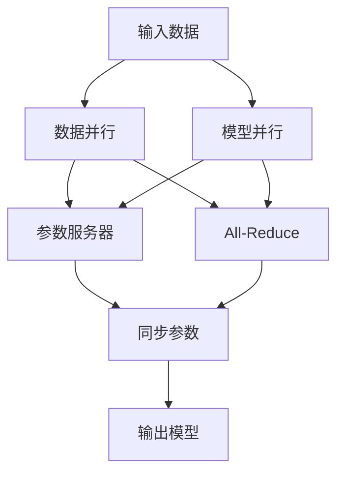

# 大规模语言模型从理论到实践 分布式训练

## 1. 背景介绍
### 1.1 大规模语言模型的兴起
近年来,随着深度学习技术的飞速发展,大规模语言模型(Large Language Models, LLMs)在自然语言处理领域取得了令人瞩目的成就。从GPT-3到ChatGPT,再到最新的LLaMA和Alpaca,LLMs展现出了惊人的语言理解和生成能力,引发了学术界和工业界的广泛关注。

### 1.2 训练LLMs面临的挑战
然而,训练大规模语言模型并非易事。随着模型参数量的增加,对计算资源和训练时间的需求也呈指数级增长。以GPT-3为例,其参数量高达1750亿,训练成本估计超过1200万美元。如何在有限的资源条件下高效训练LLMs,成为了一个亟待解决的问题。

### 1.3 分布式训练的必要性
为了应对训练LLMs所面临的挑战,分布式训练技术应运而生。通过将训练任务分配到多个计算节点上并行执行,可以显著提升训练效率,降低训练时间。同时,分布式训练还能够支持更大规模的模型训练,突破单机内存和算力的限制。

## 2. 核心概念与联系
### 2.1 数据并行与模型并行
分布式训练的两个核心概念是数据并行(Data Parallelism)和模型并行(Model Parallelism)。

数据并行是指将训练数据分割成多个子集,分别送入不同的计算节点进行训练,每个节点上的模型参数保持同步。数据并行适用于数据量较大而模型规模适中的场景。

模型并行则是将模型参数划分到不同的计算节点,每个节点只负责部分参数的训练和更新。模型并行适用于模型规模极大、单机难以承载的场景。

### 2.2 参数服务器与All-Reduce
在分布式训练中,不同计算节点之间需要频繁通信,交换梯度信息,同步模型参数。常见的通信架构有两种:参数服务器(Parameter Server)和All-Reduce。

参数服务器采用中心化的通信方式,设置专门的服务器节点负责管理和更新全局模型参数。各个计算节点将梯度发送给参数服务器,再从服务器拉取更新后的参数。

All-Reduce则是去中心化的通信方式,计算节点之间直接进行梯度聚合和参数同步,不需要中心节点的协调。All-Reduce通常基于环形拓扑或树形拓扑组织节点间通信。

### 2.3 核心概念联系图
下图展示了数据并行、模型并行、参数服务器和All-Reduce在分布式训练中的关系和应用:



## 3. 核心算法原理与具体操作步骤
### 3.1 数据并行的实现
数据并行的核心思想是将数据分割成多个批次,在不同的计算节点上同时进行训练。每个节点拥有完整的模型副本,但只处理部分数据。

具体步骤如下:
1. 将训练数据集划分为N个子集,N为参与训练的节点数。
2. 每个节点加载完整的模型参数,但只负责处理分配给它的数据子集。 
3. 各节点基于本地数据计算梯度,得到局部梯度。
4. 通过All-Reduce等通信原语,在节点间聚合局部梯度,得到全局梯度。
5. 各节点使用全局梯度更新本地模型参数,完成一次迭代。
6. 重复步骤2-5,直到模型收敛或达到预设的迭代次数。

### 3.2 模型并行的实现
模型并行将大规模模型划分成多个子模型,分别放置在不同的计算节点上。每个节点只负责训练模型的一部分。

具体步骤如下:
1. 将模型参数划分为N个互补的子集,N为参与训练的节点数。
2. 每个节点加载分配给它的子模型参数。
3. 根据模型的前向传播和反向传播依赖关系,确定节点间的通信顺序。
4. 按照通信顺序,节点间交换中间计算结果,实现前向传播。
5. 按照通信顺序,节点间交换梯度信息,实现反向传播。
6. 各节点基于分配的子模型参数和接收到的梯度,更新本地参数。
7. 重复步骤4-6,直到模型收敛或达到预设的迭代次数。

### 3.3 Ring All-Reduce算法
Ring All-Reduce是一种高效的去中心化通信算法,常用于数据并行中的梯度聚合。

具体步骤如下:
1. 将N个节点组织成一个逻辑环,每个节点有左右两个邻居。
2. 将梯度向量划分为N个等长的分块。
3. 每个节点将其本地梯度向量的第i块发送给左邻居,同时从右邻居接收梯度向量的第(i-1)块。
4. 各节点将接收到的梯度块与本地对应块相加,得到部分聚合结果。
5. 重复步骤3-4共N-1轮,每轮发送和接收的梯度块索引循环递增。
6. 各节点基于聚合后的完整梯度向量更新本地模型参数。

Ring All-Reduce的时间复杂度为O(N),通信量为O(N),是一种近乎最优的All-Reduce实现。

## 4. 数学模型与公式详解
### 4.1 数据并行的数学描述
假设有N个节点参与数据并行训练,每个节点处理的数据批次大小为B,模型参数为$\theta$,损失函数为$L$。

对于第i个节点,其基于本地数据$\{x_j,y_j\}_{j=1}^B$计算的损失为:

$$L_i(\theta)=\frac{1}{B}\sum_{j=1}^B l(f_{\theta}(x_j),y_j)$$

其中$f_{\theta}$为模型的前向传播函数,$l$为样本级的损失函数。

节点i的局部梯度为损失对参数的导数:

$$g_i=\nabla_{\theta}L_i(\theta)$$

通过All-Reduce聚合各节点的局部梯度,得到全局梯度:

$$g=\frac{1}{N}\sum_{i=1}^N g_i$$

每个节点基于全局梯度更新本地参数,学习率为$\eta$:

$$\theta\leftarrow\theta-\eta\cdot g$$

重复以上过程,直到模型收敛。可以证明,数据并行的收敛效果与单机训练一致。

### 4.2 模型并行的数学描述
假设有N个节点参与模型并行训练,模型参数$\theta$被划分为N个互补子集$\{\theta_1,\ldots,\theta_N\}$。

对于第i个节点,其负责优化参数子集$\theta_i$,基于本地数据$\{x_j,y_j\}_{j=1}^B$计算的损失为:

$$L_i(\theta_i;\theta_{-i})=\frac{1}{B}\sum_{j=1}^B l(f_{\theta}(x_j),y_j)$$

其中$\theta_{-i}$表示除$\theta_i$之外的其他参数子集。

节点i的局部梯度为:

$$g_i=\nabla_{\theta_i}L_i(\theta_i;\theta_{-i})$$

各节点基于局部梯度更新本地参数,学习率为$\eta$:

$$\theta_i\leftarrow\theta_i-\eta\cdot g_i$$

在前向传播和反向传播过程中,节点间需要交换中间计算结果和梯度信息,以保证计算的正确性。通信顺序由模型的计算图拓扑决定。

模型并行能够支持单机无法容纳的超大规模模型训练,但对通信效率和带宽要求较高。

### 4.3 Ring All-Reduce的数学描述
考虑N个节点组成的逻辑环,每个节点的局部梯度向量为$g_i\in\mathbb{R}^d$,目标是计算全局梯度向量:

$$g=\frac{1}{N}\sum_{i=1}^N g_i$$

将梯度向量划分为N个等长分块,每块长度为$\frac{d}{N}$。令$g_i^k$表示节点i的第k块梯度。

Ring All-Reduce共进行N-1轮通信。在第t轮,每个节点i执行:

1. 发送$g_i^{(i+t)\bmod N}$给左邻居(i-1)。
2. 接收$g_{i+1}^{(i+t-1)\bmod N}$从右邻居(i+1)。
3. 计算部分聚合结果:$g_i^{(i+t-1)\bmod N}\leftarrow g_i^{(i+t-1)\bmod N}+g_{i+1}^{(i+t-1)\bmod N}$。

N-1轮后,每个节点得到聚合后的完整梯度向量的$\frac{1}{N}$份:

$$\tilde{g}_i=\frac{1}{N}\sum_{k=1}^N g_k$$

各节点基于$\tilde{g}_i$更新本地模型参数:

$$\theta\leftarrow\theta-\eta\cdot\tilde{g}_i$$

Ring All-Reduce的通信复杂度为O(N),优于其他All-Reduce算法如树形All-Reduce的O(logN)。

## 5. 项目实践:代码实例与详解
下面以PyTorch为例,展示数据并行和Ring All-Reduce的简要实现。

### 5.1 数据并行示例
```python
import torch
import torch.nn as nn
import torch.optim as optim
import torch.distributed as dist

def train_dataparallel(model, data, lr):
    dist.init_process_group(backend='nccl')
    
    model = nn.parallel.DistributedDataParallel(model)
    optimizer = optim.SGD(model.parameters(), lr=lr)
    
    for x, y in data:
        optimizer.zero_grad()
        y_pred = model(x)
        loss = nn.MSELoss()(y_pred, y)
        loss.backward()
        optimizer.step()
        
        dist.all_reduce(loss)
        loss /= dist.get_world_size()
        
    dist.destroy_process_group()
    return model
```

在上述代码中,通过`nn.parallel.DistributedDataParallel`包装模型,实现数据并行。梯度计算和参数更新在每个进程内独立进行,而损失通过`dist.all_reduce`聚合得到全局平均值。

### 5.2 Ring All-Reduce示例
```python
import torch
import torch.distributed as dist

def ring_allreduce(send, recv):
    rank = dist.get_rank()
    size = dist.get_world_size()
    
    send_buff = send.clone()
    recv_buff = send.clone()
    accum = send.clone()
    
    left = ((rank - 1) + size) % size
    right = (rank + 1) % size
    
    for i in range(size - 1):
        if i % 2 == 0:
            dist.send(send_buff, right)
            dist.recv(recv_buff, left)
            accum[:] += recv_buff[:]
        else:
            dist.send(recv_buff, right)
            dist.recv(send_buff, left)
            accum[:] += send_buff[:]
            
    recv[:] = accum[:]
    
def allreduce(grad):
    dist.all_reduce(grad, op=dist.ReduceOp.SUM)
    grad /= dist.get_world_size()
```

Ring All-Reduce的核心在于将梯度向量分块,在环形拓扑中传递和聚合梯度块。`ring_allreduce`函数展示了详细的通信过程,而`allreduce`函数则基于PyTorch的集合通信原语实现了All-Reduce。

## 6. 实际应用场景
大规模语言模型的分布式训练在学术研究和工业实践中都有广泛应用,以下是一些代表性的案例:

### 6.1 GPT-3的训练
OpenAI在训练GPT-3时采用了数据并行和模型并行相结合的分布式方案。训练使用了Microsoft Azure的超级计算集群,动用了数千个GPU,历时数月。模型最终达到了1750亿参数的规模,展现出了惊人的自然语言理解和生成能力。

### 6.2 谷歌Switch Transformer
谷歌提出的Switch Transformer是一种支持千万亿参数