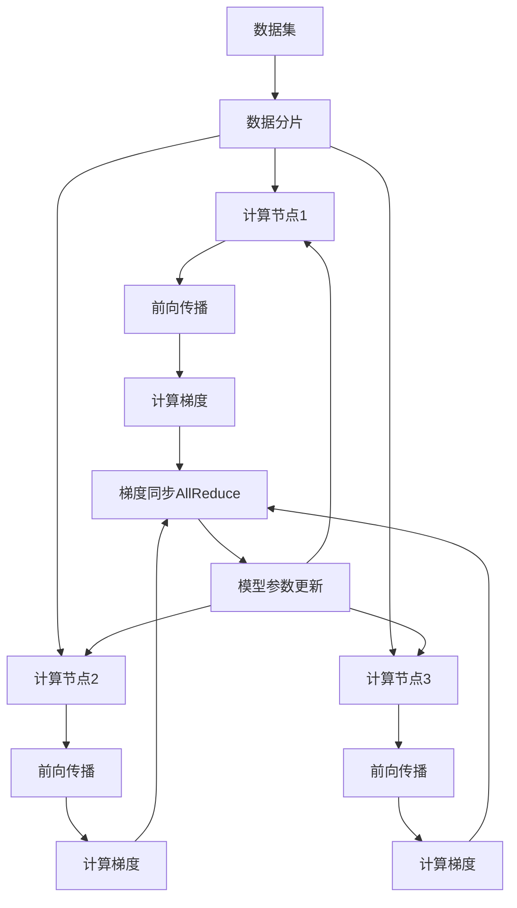

# 大规模语言模型从理论到实践 分布式训练概述

## 1.背景介绍

随着人工智能技术的快速发展,大规模语言模型已经成为自然语言处理领域的关键技术之一。这些模型通过在海量文本数据上进行预训练,能够捕捉到语言的丰富语义和上下文信息,从而在下游任务中表现出卓越的性能。然而,训练这些庞大的语言模型需要消耗大量的计算资源,这对于单机系统来说是一个巨大的挑战。因此,分布式训练技术应运而生,它通过将训练过程分散到多个计算节点上,从而显著提高了训练效率和可扩展性。

分布式训练技术不仅能够加速大规模语言模型的训练过程,还能够支持更大规模的模型,从而推动自然语言处理技术的进一步发展。本文将全面介绍大规模语言模型分布式训练的理论基础、核心算法、实现细节以及实际应用场景,为读者提供一个深入的视角,了解这一前沿技术的方方面面。

### 1.1 大规模语言模型概述

大规模语言模型是指具有数十亿甚至上百亿参数的深度神经网络模型,通过在海量文本数据上进行自监督预训练,学习到丰富的语言知识。这些模型可以在下游任务中进行微调(fine-tuning),展现出卓越的性能表现。典型的大规模语言模型包括GPT、BERT、T5等。

### 1.2 分布式训练的必要性

训练大规模语言模型需要消耗大量的计算资源,包括GPU、内存和存储空间。以GPT-3为例,它拥有1750亿个参数,在单机系统上训练这样的模型是极其低效的,甚至是不可能的。因此,分布式训练技术应运而生,它将训练过程分散到多个计算节点上,从而显著提高了训练效率和可扩展性。

## 2.核心概念与联系

### 2.1 数据并行与模型并行

在分布式训练中,有两种主要的并行策略:数据并行和模型并行。

**数据并行**是指将训练数据划分为多个子集,每个计算节点负责处理一个子集。每个节点都维护一份完整的模型副本,并在本地计算梯度。然后,这些梯度会通过通信机制(如AllReduce)在节点之间进行汇总和同步。

**模型并行**则是将模型本身划分为多个部分,每个计算节点负责一部分。这种策略通常应用于超大型模型,其参数无法完全装载到单个GPU的内存中。每个节点只需要维护模型的一部分参数,从而减轻了内存压力。但是,模型并行需要在节点之间频繁交换中间计算结果,通信开销较大。

在实践中,这两种策略通常会结合使用,以充分利用计算资源并实现最佳的性能表现。

### 2.2 数据并行训练流程

上图展示了数据并行训练的典型流程:

1. 将训练数据集划分为多个子集(数据分片)。
2. 每个计算节点加载一个数据子集和完整的模型副本。
3. 在每个节点上,进行前向传播计算,得到损失值。
4. 根据损失值,计算模型参数的梯度。
5. 使用AllReduce等通信操作,在所有节点之间同步梯度。
6. 根据同步后的梯度,更新每个节点上的模型参数。
7. 重复上述过程,直到模型收敛。

### 2.3 通信架构

在分布式训练中,节点之间需要频繁交换数据(如梯度同步),因此通信架构对整体性能有着重大影响。常见的通信架构包括:

- **环形拓扑(Ring Topology)**: 所有节点形成一个逻辑环,数据在环上传递。优点是简单,缺点是通信时延较大。
- **树形拓扑(Tree Topology)**: 节点组成一个树状结构,数据在树上传递。优点是时延较小,缺点是容错能力较差。
- **双级树形拓扑(Double Tree Topology)**: 将所有节点划分为多个组,组内采用树形拓扑,组间采用环形拓扑。结合了两者的优点。
- **全连接拓扑(Full Mesh)**: 每个节点与其他所有节点都直接相连。通信时延最小,但代价是网络开销较大。

不同的通信架构在不同的场景下表现不同,需要根据具体的集群规模、网络拓扑等因素来选择合适的架构。

## 3.核心算法原理具体操作步骤

### 3.1 数据并行算法

数据并行训练算法的核心思想是将训练数据划分为多个子集,每个计算节点分别处理一个子集,并在本地计算梯度。然后,使用通信操作(如AllReduce)将这些梯度汇总,得到全局梯度。最后,每个节点根据全局梯度更新自身的模型参数。

具体的操作步骤如下:

1. **初始化**: 所有节点加载完整的模型参数副本,并从训练数据集中获取对应的数据子集。
2. **前向传播**: 每个节点基于本地数据子集,进行前向传播计算,得到损失值。
3. **反向传播**: 根据损失值,计算模型参数的局部梯度。
4. **梯度同步**: 使用AllReduce等通信操作,将所有节点的局部梯度汇总,得到全局梯度。
5. **参数更新**: 每个节点根据全局梯度,更新自身的模型参数。
6. **重复迭代**: 重复上述过程,直到模型收敛或达到预设的训练轮次。

在实现上,常见的梯度同步算法包括:

- **AllReduce**: 将所有节点的梯度求和,得到全局梯度。
- **Parameter Server**: 将梯度发送到中央参数服务器,由服务器汇总并更新参数。
- **Gradient Checkpoint**: 通过重新计算前向传播,避免存储所有中间结果,从而节省内存。

这些算法各有优缺点,需要根据具体场景进行选择和调优。

### 3.2 模型并行算法

对于超大型模型,单个GPU无法容纳完整的模型参数,因此需要采用模型并行的策略。模型并行算法的核心思想是将模型划分为多个部分,每个计算节点负责一部分,并在节点之间交换中间计算结果。

具体的操作步骤如下:

1. **模型划分**: 将模型划分为多个部分,每个节点负责一部分。
2. **前向传播**: 每个节点基于本地模型部分,进行前向传播计算,得到中间结果。
3. **中间结果交换**: 节点之间交换中间结果,以便进行后续计算。
4. **反向传播**: 根据最终输出,计算每个节点的局部梯度。
5. **梯度同步**: 使用AllReduce等通信操作,将局部梯度汇总,得到全局梯度。
6. **参数更新**: 每个节点根据全局梯度,更新自身负责的模型参数部分。
7. **重复迭代**: 重复上述过程,直到模型收敛或达到预设的训练轮次。

在实现上,常见的模型划分策略包括:

- **层划分(Layer Parallelism)**: 将模型按层划分,每个节点负责一组连续的层。
- **张量划分(Tensor Parallelism)**: 将模型的张量(如权重矩阵)划分为多个部分,每个节点负责一部分。
- **管道并行(Pipeline Parallelism)**: 将模型划分为多个阶段,每个节点负责一个阶段,数据在节点之间流动。

这些策略可以根据具体模型结构和硬件资源进行选择和组合,以实现最佳的性能表现。

### 3.3 混合并行算法

在实践中,通常会将数据并行和模型并行相结合,形成混合并行算法。这种方式可以充分利用计算资源,实现更高的并行度和更好的可扩展性。

混合并行算法的具体步骤如下:

1. **数据划分**: 将训练数据划分为多个子集。
2. **模型划分**: 将模型划分为多个部分。
3. **分配计算资源**: 将数据子集和模型部分分配给不同的计算节点。
4. **前向传播**: 每个节点基于本地数据子集和模型部分,进行前向传播计算,得到中间结果。
5. **中间结果交换**: 节点之间交换中间结果,以便进行后续计算。
6. **反向传播**: 根据最终输出,计算每个节点的局部梯度。
7. **梯度同步**: 使用AllReduce等通信操作,将局部梯度汇总,得到全局梯度。
8. **参数更新**: 每个节点根据全局梯度,更新自身负责的模型参数部分。
9. **重复迭代**: 重复上述过程,直到模型收敛或达到预设的训练轮次。

混合并行算法的优点是可以充分利用计算资源,实现更高的并行度和更好的可扩展性。但同时也带来了更高的通信开销和实现复杂度。在实践中,需要根据具体场景进行调优和权衡。

## 4.数学模型和公式详细讲解举例说明

在分布式训练中,常见的数学模型和公式包括:

### 4.1 损失函数

在语言模型训练中,常用的损失函数是交叉熵损失(Cross-Entropy Loss),它衡量了模型预测概率分布与真实标签分布之间的差异。对于单个样本,交叉熵损失可以表示为:

$$\mathcal{L}(x, y) = -\sum_{i=1}^{V} y_i \log p_i(x)$$

其中,$ V $是词汇表大小,$ y_i $是真实标签(0或1),$ p_i(x) $是模型预测的第$ i $个词的概率。

对于整个训练集,损失函数是所有样本损失的平均:

$$\mathcal{L} = \frac{1}{N} \sum_{n=1}^{N} \mathcal{L}(x^{(n)}, y^{(n)})$$

其中,$ N $是训练集大小。

在分布式训练中,每个节点计算本地数据子集的损失,然后通过AllReduce等操作将这些损失值求和,得到全局损失值。

### 4.2 梯度计算

根据链式法则,我们可以计算模型参数$ \theta $相对于损失函数的梯度:

$$\frac{\partial \mathcal{L}}{\partial \theta} = \sum_{n=1}^{N} \frac{\partial \mathcal{L}(x^{(n)}, y^{(n)})}{\partial \theta}$$

在分布式训练中,每个节点计算本地数据子集的梯度,然后通过AllReduce等操作将这些梯度求和,得到全局梯度。

### 4.3 参数更新

在获得全局梯度后,我们可以使用优化算法(如SGD、Adam等)更新模型参数:

$$\theta_{t+1} = \theta_t - \eta \frac{\partial \mathcal{L}}{\partial \theta}$$

其中,$ \eta $是学习率,$ t $表示当前的训练步骤。

在分布式训练中,每个节点根据全局梯度更新自身的模型参数副本。

### 4.4 层归一化

在深度神经网络中,层归一化(Layer Normalization)是一种常用的技术,可以加速训练收敛并提高模型性能。对于一个输入向量$ x $,层归一化的计算公式如下:

$$\mu = \frac{1}{H} \sum_{i=1}^{H} x_i$$
$$\sigma^2 = \frac{1}{H} \sum_{