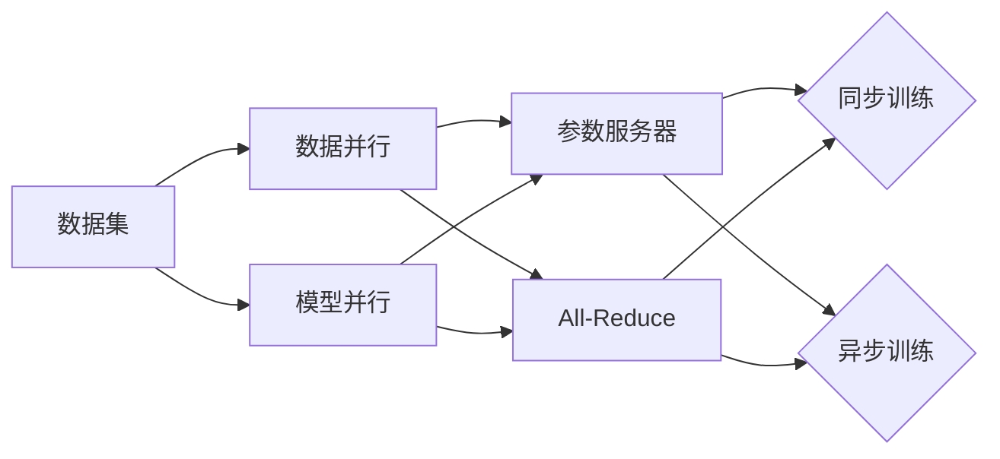

# 大规模语言模型从理论到实践 分布式训练的集群架构

## 1. 背景介绍
### 1.1 大规模语言模型的发展历程
#### 1.1.1 早期的语言模型
#### 1.1.2 Transformer的出现
#### 1.1.3 GPT、BERT等大规模预训练模型的诞生

### 1.2 训练大规模语言模型面临的挑战  
#### 1.2.1 计算资源的限制
#### 1.2.2 训练时间的瓶颈
#### 1.2.3 模型规模与性能的平衡

### 1.3 分布式训练的必要性
#### 1.3.1 加速训练过程
#### 1.3.2 支持更大规模的模型
#### 1.3.3 提高资源利用效率

## 2. 核心概念与联系
### 2.1 数据并行与模型并行  
#### 2.1.1 数据并行的原理与实现
#### 2.1.2 模型并行的原理与实现
#### 2.1.3 混合并行策略

### 2.2 参数服务器与All-Reduce
#### 2.2.1 参数服务器架构
#### 2.2.2 All-Reduce架构
#### 2.2.3 两种架构的优缺点对比

### 2.3 同步与异步训练
#### 2.3.1 同步训练的特点
#### 2.3.2 异步训练的特点  
#### 2.3.3 两种训练方式的权衡



## 3. 核心算法原理具体操作步骤
### 3.1 数据并行的分布式训练流程
#### 3.1.1 数据分片与分发
#### 3.1.2 模型副本的初始化
#### 3.1.3 并行计算梯度并同步更新

### 3.2 模型并行的分布式训练流程
#### 3.2.1 模型切分与分配
#### 3.2.2 前向传播的并行化
#### 3.2.3 反向传播的并行化

### 3.3 参数服务器的通信与更新机制
#### 3.3.1 参数的分布式存储
#### 3.3.2 Worker与Server的通信 
#### 3.3.3 参数的更新与同步

### 3.4 All-Reduce的通信与更新机制
#### 3.4.1 Ring All-Reduce算法
#### 3.4.2 Tree All-Reduce算法
#### 3.4.3 Gradient Compression技术

## 4. 数学模型和公式详细讲解举例说明
### 4.1 数据并行中的梯度平均
假设有$n$个Worker，每个Worker上的模型参数为$\theta_i$，对应的梯度为$g_i$，则All-Reduce后的梯度为：

$$\bar{g}=\frac{1}{n}\sum_{i=1}^n g_i$$

更新后的模型参数为：

$$\theta_{t+1}=\theta_t-\eta \bar{g}$$

其中$\eta$为学习率。

### 4.2 模型并行中的前向传播
假设将模型切分为$m$个部分，每个部分对应的参数为$\theta^{(i)}$，输入为$x^{(i)}$，输出为$y^{(i)}$，则前向传播过程可表示为：

$$x^{(i+1)}=f^{(i)}(x^{(i)};\theta^{(i)}), i=1,2,...,m-1$$

$$y=f^{(m)}(x^{(m)};\theta^{(m)})$$

其中$f^{(i)}$为第$i$个部分的前向传播函数。

### 4.3 参数服务器中的参数更新
假设有$n$个Worker和$m$个Server，第$i$个Worker上的第$j$个参数为$\theta_{ij}$，对应的梯度为$g_{ij}$，则Server上聚合后的梯度为：

$$\bar{g}_j=\frac{1}{n}\sum_{i=1}^n g_{ij}$$

更新后的参数为：

$$\theta_j=\theta_j-\eta \bar{g}_j$$

Server再将更新后的参数广播给各个Worker。

## 5. 项目实践：代码实例和详细解释说明
下面是一个使用PyTorch实现数据并行的简单示例：

```python
import torch
import torch.nn as nn
import torch.optim as optim
import torch.distributed as dist

class Model(nn.Module):
    def __init__(self):
        super(Model, self).__init__()
        self.fc = nn.Linear(784, 10)
        
    def forward(self, x):
        x = x.view(x.size(0), -1)
        x = self.fc(x)
        return x

def train(rank, world_size):
    dist.init_process_group("gloo", rank=rank, world_size=world_size)
    model = Model()
    model = nn.parallel.DistributedDataParallel(model)
    
    optimizer = optim.SGD(model.parameters(), lr=0.01)
    
    for epoch in range(100):
        for data, target in train_loader:
            optimizer.zero_grad()
            output = model(data)
            loss = criterion(output, target)
            loss.backward()
            optimizer.step()

if __name__ == "__main__":
    world_size = 4
    mp.spawn(train, args=(world_size,), nprocs=world_size)
```

主要步骤如下：

1. 定义模型类`Model`，包含一个全连接层。 

2. 在`train`函数中，首先调用`dist.init_process_group`初始化进程组，指定后端为"gloo"，设置当前进程的rank和总的world size。

3. 实例化模型，并使用`nn.parallel.DistributedDataParallel`对其进行封装，实现分布式数据并行。

4. 定义优化器，这里使用SGD。

5. 在训练循环中，对每个batch的数据进行前向传播、计算损失、反向传播和参数更新。

6. 在`__main__`中，指定总的进程数`world_size`，然后使用`mp.spawn`启动多个进程并行执行`train`函数。

这样就实现了一个简单的分布式数据并行训练。在实际应用中，还需要考虑数据的分发、模型保存与加载、学习率调整等问题。

## 6. 实际应用场景
### 6.1 自然语言处理
#### 6.1.1 机器翻译
#### 6.1.2 语言模型与文本生成
#### 6.1.3 命名实体识别与关系抽取

### 6.2 计算机视觉
#### 6.2.1 图像分类
#### 6.2.2 目标检测
#### 6.2.3 语义分割

### 6.3 语音识别
#### 6.3.1 声学模型
#### 6.3.2 语言模型
#### 6.3.3 端到端的语音识别系统

## 7. 工具和资源推荐
### 7.1 深度学习框架
#### 7.1.1 PyTorch
#### 7.1.2 TensorFlow
#### 7.1.3 MindSpore

### 7.2 分布式训练库
#### 7.2.1 Horovod
#### 7.2.2 BytePS
#### 7.2.3 DeepSpeed

### 7.3 集群管理工具
#### 7.3.1 Kubernetes
#### 7.3.2 Slurm
#### 7.3.3 YARN

## 8. 总结：未来发展趋势与挑战
### 8.1 模型规模的持续增长
### 8.2 新的并行化策略与优化技术
### 8.3 专用硬件的发展
### 8.4 数据隐私与安全问题
### 8.5 绿色AI与能效优化

## 9. 附录：常见问题与解答
### 9.1 如何选择合适的并行策略？
### 9.2 如何平衡通信开销与计算效率？
### 9.3 如何处理数据倾斜问题？
### 9.4 如何进行梯度聚合的优化？
### 9.5 如何实现容错与故障恢复？

作者：禅与计算机程序设计艺术 / Zen and the Art of Computer Programming