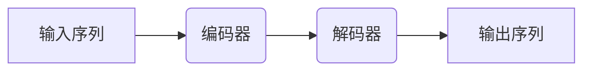
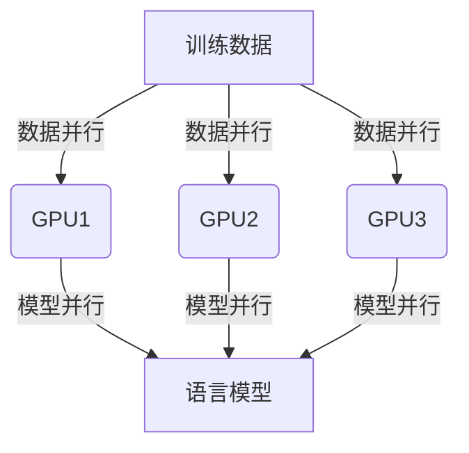

# 大规模语言模型从理论到实践 去中心化架构

## 1.背景介绍

### 1.1 语言模型的重要性

语言模型是自然语言处理领域的核心技术之一,广泛应用于机器翻译、问答系统、文本生成等各种任务中。随着深度学习技术的发展,大规模语言模型展现出了强大的语言理解和生成能力,成为推动自然语言处理领域飞速发展的关键驱动力。

### 1.2 大规模语言模型的兴起

传统的语言模型通常基于 N-gram 统计方法,但存在数据稀疏、难以捕捉长距离依赖等缺陷。2018年,Transformer 模型的提出为大规模语言模型的发展带来了新的契机。自注意力机制使模型能够有效捕捉长距离依赖关系,配合大规模语料训练,语言模型的性能得到了极大提升。

GPT、BERT、XLNet、T5 等一系列大规模语言模型相继问世,展现出了强大的文本理解和生成能力,在各种自然语言处理任务中取得了卓越的成绩。

### 1.3 去中心化架构的需求

随着大规模语言模型规模的不断扩大,训练和推理的计算资源需求也呈指数级增长。单机或集中式训练架构已经难以满足需求,因此需要一种新的去中心化架构来支持大规模语言模型的高效训练和推理。

去中心化架构不仅可以提供更强大的计算能力,还能提高系统的可扩展性、容错性和隐私保护能力,满足未来大规模语言模型发展的需求。

## 2.核心概念与联系

### 2.1 自注意力机制

自注意力机制是 Transformer 模型的核心,它允许模型直接捕捉输入序列中任意两个位置之间的关系,而不再局限于序列建模中的局部窗口。这种全局依赖性捕捉能力是大规模语言模型取得卓越性能的关键所在。

自注意力机制可以形式化表示为:

$$\mathrm{Attention}(Q, K, V) = \mathrm{softmax}(\frac{QK^T}{\sqrt{d_k}})V$$

其中 $Q$ 表示查询(Query)、$K$ 表示键(Key)、$V$ 表示值(Value),$d_k$ 是缩放因子。

### 2.2 Transformer 编码器-解码器架构

Transformer 采用了编码器-解码器架构,编码器用于捕捉输入序列的上下文信息,解码器则根据编码器的输出和之前生成的tokens,预测下一个token。



编码器和解码器内部都由多个相同的层组成,每一层包含多头自注意力子层和前馈网络子层。层与层之间使用残差连接,并采用层归一化来加速收敛。

### 2.3 预训练与微调

大规模语言模型通常采用预训练与微调的范式。首先在大规模无标注语料上进行自监督预训练,获得通用的语言表示能力。然后将预训练的模型在特定的下游任务上进行微调,从而将通用语言表示能力转移到特定任务上。

预训练任务的设计对语言模型的性能有很大影响。常见的预训练任务包括掩码语言模型(Masked LM)、下一句预测(Next Sentence Prediction)、因果语言模型(Causal LM)等。

### 2.4 模型并行与数据并行

为了支持大规模语言模型的高效训练,通常需要采用模型并行和数据并行相结合的策略。

模型并行指将模型分割到多个加速器(如GPU)上并行计算,以突破单个加速器的内存和计算能力限制。数据并行则是将训练数据分批在多个加速器上并行计算,以加速训练过程。



合理的并行策略对于高效训练大规模语言模型至关重要。

## 3.核心算法原理具体操作步骤

### 3.1 Transformer 模型训练

Transformer 模型的训练过程可以概括为以下步骤:

1. **数据预处理**:将原始文本数据转换为模型可以接受的形式,通常包括分词、构建词表、填充等步骤。

2. **创建数据批次**:将预处理后的数据按批次组织,以便并行训练。

3. **前向传播**:将输入数据传入 Transformer 模型,计算输出概率分布。

4. **计算损失**:将模型输出与标签计算损失,常用的损失函数有交叉熵损失。

5. **反向传播**:根据损失对模型参数进行梯度更新。

6. **模型更新**:使用优化器(如 Adam)根据梯度更新模型参数。

7. **评估模型**:在验证集上评估模型性能,根据指标(如困惑度、BLEU分数等)判断是否需要提前停止训练。

8. **模型保存**:将训练好的模型参数保存下来,以备将来使用。

以上步骤反复迭代,直到模型性能满足要求或达到最大训练轮次。

### 3.2 Transformer 模型推理

在推理阶段,我们需要将训练好的 Transformer 模型应用到实际任务中,例如机器翻译、文本生成等。推理过程可以概括为:

1. **数据预处理**:将输入数据转换为模型可接受的形式。

2. **模型加载**:加载训练好的 Transformer 模型参数。

3. **前向传播**:将输入数据传入模型,计算输出概率分布。

4. **输出解码**:根据输出概率分布,采用贪婪搜索或beam search等策略解码出最终输出序列。

5. **后处理**:对模型输出进行必要的后处理,如将词元序列转换为实际文本等。

需要注意的是,推理过程通常要求低延迟和高吞吐量,因此可能需要采用模型压缩、量化、并行计算等优化策略。

## 4.数学模型和公式详细讲解举例说明

### 4.1 自注意力机制

自注意力机制是 Transformer 模型的核心,它使用 Scaled Dot-Product Attention 计算注意力权重,公式如下:

$$\mathrm{Attention}(Q, K, V) = \mathrm{softmax}(\frac{QK^T}{\sqrt{d_k}})V$$

其中 $Q$ 为查询(Query)、$K$ 为键(Key)、$V$ 为值(Value),$d_k$ 是缩放因子,用于防止点积过大导致的梯度消失问题。

具体来说,注意力机制首先计算查询 $Q$ 与所有键 $K$ 的点积,得到未缩放的分数张量。然后对分数张量进行缩放(除以 $\sqrt{d_k}$),再通过 softmax 函数得到注意力权重张量。最后,将注意力权重与值 $V$ 相乘,得到加权求和的注意力输出。

以机器翻译任务为例,给定一个源语言句子 $X = (x_1, x_2, \dots, x_n)$,我们需要生成对应的目标语言句子 $Y = (y_1, y_2, \dots, y_m)$。在解码器的每一步,我们需要根据已生成的部分译文 $(y_1, y_2, \dots, y_{j-1})$ 和源句 $X$ 来预测下一个词 $y_j$。

在计算自注意力时,查询 $Q$ 是当前位置的解码器隐状态,键 $K$ 和值 $V$ 分别来自编码器的输出和解码器的前一个隐状态。通过注意力机制,解码器可以选择性地关注源句中与当前生成位置相关的部分,从而更好地捕捉长距离依赖关系。

### 4.2 Transformer 模型损失函数

在训练 Transformer 模型时,常用的损失函数是交叉熵损失(Cross-Entropy Loss),它衡量了模型预测的概率分布与真实标签之间的差异。

对于一个长度为 $N$ 的序列 $(x_1, x_2, \dots, x_N)$,其交叉熵损失可以表示为:

$$\mathcal{L} = -\frac{1}{N}\sum_{i=1}^N \log P(x_i|x_1, \dots, x_{i-1})$$

其中 $P(x_i|x_1, \dots, x_{i-1})$ 表示基于前 $i-1$ 个token预测第 $i$ 个token的条件概率。

在实现时,我们通常采用teacher forcing策略,将上一步的真实标签作为当前步的输入,从而简化了损失计算。具体来说,给定一个长度为 $N$ 的序列 $(x_1, x_2, \dots, x_N)$,其交叉熵损失可以表示为:

$$\mathcal{L} = -\frac{1}{N}\sum_{i=1}^N \log P(x_i|x_1, \dots, x_{i-1}; \theta)$$

其中 $\theta$ 表示模型参数。在训练过程中,我们通过梯度下降算法来最小化这个损失函数,从而获得最优的模型参数 $\theta$。

需要注意的是,在实际应用中,我们可能需要根据具体任务对损失函数进行调整和改进,例如添加正则项、采用其他评价指标作为辅助损失等。

## 5.项目实践:代码实例和详细解释说明

为了更好地理解 Transformer 模型的实现细节,我们将使用 PyTorch 框架,基于 Hugging Face 的 Transformers 库构建一个简单的机器翻译系统。完整代码可在 GitHub 上获取: https://github.com/zencoder-alpha/transformer-mt

### 5.1 数据预处理

```python
from datasets import load_dataset

# 加载WMT'14 EN-DE 数据集
raw_datasets = load_dataset("wmt14", "wmt14-en-de")

# 构建词表
tokenizer = AutoTokenizer.from_pretrained("t5-small")

def preprocess_function(examples):
    inputs = [doc for doc in examples["en"]]
    targets = [doc for doc in examples["de"]]
    model_inputs = tokenizer(inputs, max_length=512, truncation=True)

    labels = tokenizer(targets, max_length=512, truncation=True)
    model_inputs["labels"] = labels["input_ids"]
    return model_inputs

tokenized_datasets = raw_datasets.map(preprocess_function, batched=True)
```

在这个示例中,我们首先从 Hugging Face 数据集库中加载 WMT'14 English-German 翻译数据集。然后使用 T5 小型模型的 tokenizer 对源语言(英语)和目标语言(德语)进行分词和编码。`preprocess_function` 将原始文本转换为模型可接受的输入格式,包括输入 token 序列和标签 token 序列。

### 5.2 模型初始化和训练

```python
from transformers import AutoModelForSeq2SeqLM, DataCollatorForSeq2Seq, Seq2SeqTrainingArguments, Seq2SeqTrainer

model = AutoModelForSeq2SeqLM.from_pretrained("t5-small")
data_collator = DataCollatorForSeq2Seq(tokenizer, model=model)

batch_size = 64
args = Seq2SeqTrainingArguments(
    output_dir="./models",
    evaluation_strategy="epoch",
    learning_rate=2e-5,
    per_device_train_batch_size=batch_size,
    per_device_eval_batch_size=batch_size,
    weight_decay=0.01,
    save_total_limit=3,
    num_train_epochs=4,
    predict_with_generate=True,
)

trainer = Seq2SeqTrainer(
    model=model,
    args=args,
    train_dataset=tokenized_datasets["train"],
    eval_dataset=tokenized_datasets["validation"],
    tokenizer=tokenizer,
    data_collator=data_collator,
)

trainer.train()
```

在这个示例中,我们使用 Hugging Face Transformers 库中的 `AutoModelForSeq2SeqLM` 初始化一个基于 T5 小型模型的 Seq2Seq 模型。`DataCollatorForSeq2Seq` 用于构建训练和评估所需的批次数据。

`Seq2SeqTrainingArguments` 定义了训练的超参数,如学习率