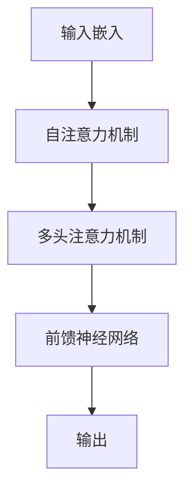

# 大规模语言模型从理论到实践 垂直领域评估

## 1.背景介绍

大规模语言模型（Large Language Models, LLMs）近年来在自然语言处理（NLP）领域取得了显著的进展。自从OpenAI发布了GPT系列模型以来，LLMs在文本生成、翻译、问答系统等多个应用场景中展现了强大的能力。然而，尽管LLMs在通用领域表现优异，其在垂直领域的应用和评估仍然面临诸多挑战。本文旨在探讨大规模语言模型在垂直领域的理论基础、核心算法、实际应用及未来发展趋势。

## 2.核心概念与联系

### 2.1 大规模语言模型简介

大规模语言模型是基于深度学习技术，特别是Transformer架构，训练得到的模型。其核心思想是通过大量的文本数据进行预训练，使模型能够捕捉语言的复杂结构和语义关系。

### 2.2 垂直领域定义

垂直领域指的是特定行业或专业领域，如医疗、法律、金融等。与通用领域不同，垂直领域通常具有特定的术语和知识体系。

### 2.3 LLMs在垂直领域的应用

在垂直领域中，LLMs可以用于自动化文档生成、专业问答系统、数据分析等。然而，由于垂直领域的专业性，LLMs需要进行特定领域的微调和评估。

## 3.核心算法原理具体操作步骤

### 3.1 Transformer架构

Transformer是LLMs的基础架构，其核心组件包括自注意力机制、多头注意力机制和前馈神经网络。以下是Transformer的基本流程图：



### 3.2 预训练与微调

LLMs的训练过程分为预训练和微调两个阶段。预训练阶段，模型在大规模通用文本数据上进行训练；微调阶段，模型在特定领域的数据上进行进一步训练，以适应垂直领域的需求。

### 3.3 数据准备与处理

数据准备是LLMs在垂直领域应用的关键步骤。需要收集、清洗和标注大量的领域特定数据，以确保模型能够学习到领域特有的知识。

## 4.数学模型和公式详细讲解举例说明

### 4.1 自注意力机制

自注意力机制是Transformer的核心，其计算公式如下：

$$
\text{Attention}(Q, K, V) = \text{softmax}\left(\frac{QK^T}{\sqrt{d_k}}\right)V
$$

其中，$Q$、$K$、$V$分别表示查询、键和值矩阵，$d_k$是键的维度。

### 4.2 多头注意力机制

多头注意力机制通过并行计算多个自注意力机制来捕捉不同的语义信息，其计算公式如下：

$$
\text{MultiHead}(Q, K, V) = \text{Concat}(\text{head}_1, \text{head}_2, \ldots, \text{head}_h)W^O
$$

其中，$\text{head}_i = \text{Attention}(QW_i^Q, KW_i^K, VW_i^V)$，$W_i^Q$、$W_i^K$、$W_i^V$和$W^O$是可训练的权重矩阵。

### 4.3 前馈神经网络

前馈神经网络由两个线性变换和一个激活函数组成，其计算公式如下：

$$
\text{FFN}(x) = \text{ReLU}(xW_1 + b_1)W_2 + b_2
$$

其中，$W_1$、$W_2$、$b_1$和$b_2$是可训练的权重和偏置。

## 5.项目实践：代码实例和详细解释说明

### 5.1 数据准备

首先，我们需要准备垂直领域的数据。以下是一个简单的数据清洗示例：

```python
import pandas as pd

# 读取数据
data = pd.read_csv('vertical_domain_data.csv')

# 数据清洗
data = data.dropna()  # 删除缺失值
data = data[data['text'].str.len() > 10]  # 删除短文本

# 保存清洗后的数据
data.to_csv('cleaned_data.csv', index=False)
```

### 5.2 模型微调

接下来，我们使用Hugging Face的Transformers库对预训练模型进行微调：

```python
from transformers import GPT2Tokenizer, GPT2LMHeadModel, Trainer, TrainingArguments

# 加载预训练模型和分词器
tokenizer = GPT2Tokenizer.from_pretrained('gpt2')
model = GPT2LMHeadModel.from_pretrained('gpt2')

# 加载数据
train_data = tokenizer(data['text'].tolist(), return_tensors='pt', padding=True, truncation=True)

# 定义训练参数
training_args = TrainingArguments(
    output_dir='./results',
    num_train_epochs=3,
    per_device_train_batch_size=4,
    save_steps=10_000,
    save_total_limit=2,
)

# 定义Trainer
trainer = Trainer(
    model=model,
    args=training_args,
    train_dataset=train_data,
)

# 开始训练
trainer.train()
```

### 5.3 模型评估

最后，我们对微调后的模型进行评估：

```python
from sklearn.metrics import accuracy_score

# 加载测试数据
test_data = tokenizer(data['test_text'].tolist(), return_tensors='pt', padding=True, truncation=True)

# 生成预测
outputs = model.generate(test_data['input_ids'])

# 计算准确率
accuracy = accuracy_score(data['test_labels'], outputs)
print(f'模型准确率: {accuracy:.2f}')
```

## 6.实际应用场景

### 6.1 医疗领域

在医疗领域，LLMs可以用于自动化病历生成、医学文献综述、患者问答系统等。例如，微调后的模型可以生成详细的病历记录，帮助医生提高工作效率。

### 6.2 法律领域

在法律领域，LLMs可以用于法律文书生成、法律咨询、案例分析等。通过微调，模型可以理解和生成法律术语，提供专业的法律建议。

### 6.3 金融领域

在金融领域，LLMs可以用于金融报告生成、市场分析、客户服务等。微调后的模型可以生成详细的金融报告，帮助分析师进行市场预测。

## 7.工具和资源推荐

### 7.1 开源工具

- **Hugging Face Transformers**：一个强大的NLP库，支持多种预训练模型。
- **TensorFlow**：一个广泛使用的深度学习框架，支持大规模模型训练。
- **PyTorch**：另一个流行的深度学习框架，具有灵活的动态计算图。

### 7.2 数据集

- **PubMed**：一个包含大量医学文献的数据库，适用于医疗领域的模型训练。
- **CaseLaw**：一个包含大量法律案例的数据库，适用于法律领域的模型训练。
- **Financial Times**：一个包含大量金融新闻的数据库，适用于金融领域的模型训练。

## 8.总结：未来发展趋势与挑战

### 8.1 未来发展趋势

随着计算能力和数据量的增加，LLMs将在更多垂直领域中得到应用。未来，LLMs可能会与其他技术（如知识图谱、强化学习）结合，进一步提升其性能和应用范围。

### 8.2 挑战

尽管LLMs在垂直领域展现了巨大的潜力，但仍面临诸多挑战。首先，垂直领域的数据通常较为稀缺，数据收集和标注成本较高。其次，模型的解释性和透明性仍需提高，以满足专业领域的需求。最后，模型的计算成本和能耗也是需要考虑的重要因素。

## 9.附录：常见问题与解答

### 9.1 如何选择合适的预训练模型？

选择预训练模型时，应考虑模型的规模、性能和适用性。对于大多数垂直领域应用，GPT-3、BERT等主流模型都是不错的选择。

### 9.2 如何进行数据标注？

数据标注是一个耗时且复杂的过程。可以考虑使用半自动化标注工具，结合人工审核，提高标注效率和质量。

### 9.3 如何评估模型性能？

模型性能评估可以使用多种指标，如准确率、精确率、召回率、F1分数等。应根据具体应用场景选择合适的评估指标。

### 9.4 如何优化模型训练过程？

优化模型训练过程可以从以下几个方面入手：选择合适的超参数、使用分布式训练、采用混合精度训练等。

### 9.5 如何应对模型的计算成本和能耗问题？

可以考虑使用模型压缩技术（如剪枝、量化）、选择高效的硬件设备（如TPU、GPU）等方法，降低模型的计算成本和能耗。

---

作者：禅与计算机程序设计艺术 / Zen and the Art of Computer Programming