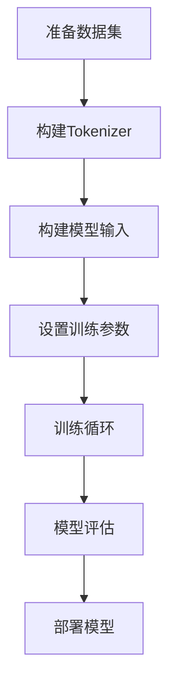

# 大规模语言模型从理论到实践 基于HuggingFace的预训练语言模型实践

## 1. 背景介绍

### 1.1 自然语言处理的发展历程

自然语言处理(Natural Language Processing, NLP)是人工智能领域的一个重要分支,旨在使计算机能够理解和生成人类语言。在过去几十年中,NLP技术取得了长足的进步,从早期的基于规则的系统,到统计机器学习模型,再到近年来基于深度学习的神经网络模型。

### 1.2 预训练语言模型的兴起

随着计算能力的提高和大规模语料库的出现,预训练语言模型(Pre-trained Language Models, PLMs)成为NLP领域的一个重要突破。这些模型通过在大量无标注文本数据上进行预训练,学习到丰富的语言知识和上下文信息,从而为下游任务提供强大的语义表示能力。

典型的预训练语言模型包括BERT、GPT、XLNet等,它们在各种NLP任务中表现出色,推动了整个领域的发展。然而,训练这些大规模模型需要巨大的计算资源,对于普通研究者和开发者来说,存在一定的门槛。

### 1.3 HuggingFace:开源预训练语言模型库

为了降低预训练语言模型的使用门槛,HuggingFace团队推出了同名开源库,集成了众多流行的预训练模型,并提供了统一的API接口,方便研究者和开发者快速加载和微调这些模型。HuggingFace库不仅支持PyTorch和TensorFlow等主流深度学习框架,还提供了丰富的示例代码和教程,极大地促进了预训练语言模型在工业界和学术界的应用。

## 2. 核心概念与联系

### 2.1 预训练语言模型的核心思想

预训练语言模型的核心思想是利用大量无标注文本数据,通过自监督学习(Self-Supervised Learning)的方式,预先学习到丰富的语言知识和上下文信息。这种预训练过程不需要人工标注数据,可以充分利用互联网上海量的文本资源。

预训练阶段通常采用两种主要的任务:

1. **Masked Language Modeling (MLM)**: 该任务随机掩蔽输入序列中的一些词,并要求模型预测这些被掩蔽词的原始词。通过这种方式,模型可以学习到词与上下文之间的关联关系。

2. **Next Sentence Prediction (NSP)**: 该任务要求模型判断两个句子是否相邻,从而学习句子之间的关系和语义连贯性。

通过上述自监督任务的预训练,模型可以获得通用的语言表示能力,为后续的下游任务(如文本分类、机器阅读理解等)提供强大的语义表示。

### 2.2 HuggingFace库的核心组件

HuggingFace库的核心组件包括:

1. **Tokenizers**: 用于将文本序列转换为模型可以理解的数字序列。HuggingFace库提供了多种tokenizer,如ByteLevelBPETokenizer、WordPieceTokenizer等。

2. **Models**: 包含了众多预训练语言模型的实现,如BERT、GPT-2、XLNet等。每个模型都有对应的配置文件和预训练权重文件。

3. **Pipelines**: 提供了一种简单的方式,可以直接使用预训练模型进行常见的NLP任务,如文本生成、命名实体识别、问答系统等。

4. **Trainers**: 用于微调预训练模型,支持多种优化器、学习率调度器和训练技巧。

5. **Datasets**: 集成了多种公开数据集,方便用户快速加载和预处理数据。

这些组件的设计使得HuggingFace库具有很强的可扩展性和灵活性,用户可以根据需求轻松定制和组合不同的组件。

### 2.3 预训练语言模型与下游任务的联系

预训练语言模型为下游NLP任务提供了强大的语义表示能力,但是通常需要进行进一步的微调(Fine-tuning)才能适应具体的任务。微调过程是在预训练模型的基础上,使用特定任务的标注数据进行额外的训练,以使模型更好地捕捉任务相关的特征。

不同的下游任务可能需要采用不同的微调策略,如选择合适的微调层、设置合理的学习率等。HuggingFace库提供了灵活的微调接口,支持多种训练技巧,如梯度裁剪、混合精度训练等,方便用户快速实现模型微调。

## 3. 核心算法原理具体操作步骤

在本节中,我们将详细介绍预训练语言模型的核心算法原理,以及如何使用HuggingFace库进行模型的加载、微调和评估。

### 3.1 Transformer模型架构

许多流行的预训练语言模型,如BERT、GPT等,都是基于Transformer模型架构构建的。Transformer是一种全新的序列到序列(Sequence-to-Sequence)模型,它完全依赖于注意力机制(Attention Mechanism)来捕捉输入序列中的长程依赖关系,而不需要像RNN那样依赖序列的顺序计算。

Transformer模型的核心组件包括:

1. **Embedding层**: 将输入序列(如文本)转换为向量表示。

2. **Encoder**: 由多个相同的Encoder层组成,每个Encoder层包含一个Multi-Head Attention子层和一个前馈神经网络子层。Encoder负责捕捉输入序列中的上下文信息。

3. **Decoder**: 与Encoder类似,也由多个相同的Decoder层组成。Decoder不仅需要捕捉输出序列的上下文信息,还需要关注输入序列的信息,因此在每个Decoder层中都包含一个额外的Encoder-Decoder Attention子层。

4. **输出层**: 根据Decoder的输出,生成最终的序列输出。

对于像BERT这样的掩码语言模型,只使用了Transformer的Encoder部分;而对于像GPT这样的自回归语言模型,则使用了Encoder-Decoder的架构。

### 3.2 HuggingFace中加载预训练模型

HuggingFace库提供了统一的API接口,方便加载不同的预训练模型。以BERT模型为例,加载过程如下:

```python
from transformers import BertTokenizer, BertModel

# 加载tokenizer
tokenizer = BertTokenizer.from_pretrained('bert-base-uncased')

# 加载模型
model = BertModel.from_pretrained('bert-base-uncased')
```

上述代码将从HuggingFace的模型库中下载BERT的tokenizer和模型权重文件。`from_pretrained`函数支持多种预训练模型,如`'gpt2'`、`'xlnet-base-cased'`等。

### 3.3 微调预训练模型

微调预训练模型的过程通常包括以下步骤:

1. **准备数据**: 根据具体任务,准备标注数据集,并使用tokenizer进行数据预处理。

2. **定义模型输入**: 根据任务需求,构建模型的输入张量,如输入序列、标签等。

3. **设置训练参数**: 选择合适的优化器、学习率调度器等超参数。

4. **训练循环**: 进行多轮训练,计算损失并更新模型参数。

5. **模型评估**: 在验证集或测试集上评估模型性能。

以文本分类任务为例,微调BERT模型的代码如下:

```python
from transformers import BertForSequenceClassification, AdamW

# 加载模型和tokenizer
model = BertForSequenceClassification.from_pretrained('bert-base-uncased')
tokenizer = BertTokenizer.from_pretrained('bert-base-uncased')

# 准备数据
train_data = ... # 训练数据
val_data = ... # 验证数据

# 定义训练参数
optimizer = AdamW(model.parameters(), lr=2e-5)
num_epochs = 3

# 训练循环
for epoch in range(num_epochs):
    model.train()
    for batch in train_data:
        # 准备模型输入
        inputs = tokenizer(batch['text'], return_tensors='pt', padding=True, truncation=True)
        labels = batch['label']

        # 前向传播
        outputs = model(**inputs, labels=labels)
        loss = outputs.loss

        # 反向传播
        loss.backward()
        optimizer.step()
        optimizer.zero_grad()

    # 评估模型
    model.eval()
    val_accuracy = evaluate(model, val_data)
    print(f'Epoch {epoch+1} | Val Accuracy: {val_accuracy}')
```

上述代码展示了如何使用HuggingFace库加载BERT模型,并进行微调训练和评估。注意,不同的任务可能需要使用不同的模型类(如`BertForSequenceClassification`、`BertForQuestionAnswering`等)和输入格式。

### 3.4 Mermaid流程图

下面是使用HuggingFace库进行预训练语言模型微调的整体流程图:



## 4. 数学模型和公式详细讲解举例说明

在本节中,我们将介绍预训练语言模型中使用的一些核心数学模型和公式,并给出具体的解释和示例。

### 4.1 Attention机制

Attention机制是Transformer模型的核心,它允许模型在编码序列时关注不同位置的信息。给定一个查询向量(Query) $q$,键向量(Key) $k$和值向量(Value) $v$,Attention函数可以计算如下:

$$\mathrm{Attention}(q, k, v) = \mathrm{softmax}\left(\frac{qk^T}{\sqrt{d_k}}\right)v$$

其中,$ \frac{qk^T}{\sqrt{d_k}} $计算了查询向量和键向量之间的相似性分数,$ \sqrt{d_k} $是一个缩放因子,用于防止过大的值导致softmax函数饱和。softmax函数将相似性分数转换为概率分布,最后将值向量 $v$ 根据这个概率分布进行加权求和,得到最终的注意力向量。

在实践中,通常使用Multi-Head Attention,它将注意力分成多个子空间,每个子空间单独计算注意力,最后将它们的结果拼接起来:

$$\mathrm{MultiHead}(Q, K, V) = \mathrm{Concat}(head_1, \ldots, head_h)W^O$$
$$\text{where } head_i = \mathrm{Attention}(QW_i^Q, KW_i^K, VW_i^V)$$

其中,$ W_i^Q $、$ W_i^K $、$ W_i^V $和$ W^O $是可学习的线性投影参数。

### 4.2 掩码语言模型(Masked Language Modeling)

掩码语言模型(Masked Language Modeling, MLM)是预训练语言模型中常用的自监督任务之一。它的目标是根据上下文预测被掩码的词。

给定一个输入序列 $X = (x_1, x_2, \ldots, x_n)$,我们随机选择一些位置进行掩码,得到掩码序列 $X^m = (x_1^m, x_2^m, \ldots, x_n^m)$,其中 $x_i^m$ 可能是原始词、掩码标记[MASK]或随机替换的词。模型的目标是最大化掩码位置的条件概率:

$$\mathcal{L}_\text{MLM} = \mathbb{E}_{X, X^m} \left[ \sum_{i=1}^n \log P(x_i | X^m) \right]$$

其中,$ P(x_i | X^m) $是模型预测第 $i$ 个位置的词为 $x_i$ 的概率。通过最大化这个目标函数,模型可以学习到词与上下文之间的关联关系。

### 4.3 下三角矩阵掩码(Causal Mask)

对于自回归语言模型(如GPT),在生成每个词时,只能利用之前的上下文信息,而不能使用未来的信息。为了实现这一点,Transformer的Decoder部分使用了下三角矩阵掩码(Causal Mask)。

给定一个输入序列 $X = (x_1, x_2, \ldots, x_n)$,我们构建一个掩码矩阵 $M \in \mathbb{R}^{n \times n}$,其中:

$$M_{ij} = \begin{cases}
0, & \text{if } i \leq j \\
-\infty, & \text{otherwise}
\end{cases}$$

然后,在计算Attention时,将输入的