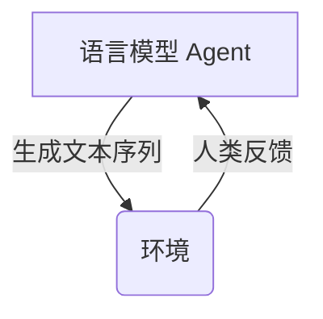
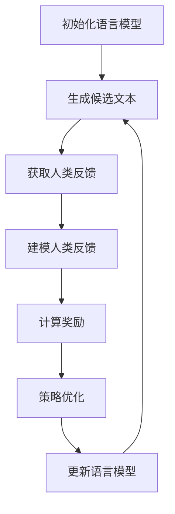

# 大规模语言模型从理论到实践 基于人类反馈的强化学习流程

## 1. 背景介绍

### 1.1 语言模型的重要性

语言模型是自然语言处理领域的基础技术,广泛应用于机器翻译、问答系统、文本生成等各种任务中。随着深度学习技术的发展,大规模语言模型展现出了强大的语言理解和生成能力,成为推动自然语言处理发展的核心动力。

### 1.2 大规模语言模型的兴起

传统的语言模型通常基于 N-gram 统计方法,存在参数空间有限、语义理解能力弱等缺陷。而基于深度学习的大规模语言模型能够从海量语料中学习丰富的语义知识,并通过注意力机制等技术捕捉长距离依赖关系,极大提升了语言理解和生成的质量。

代表性的大规模语言模型包括 GPT(Generative Pre-trained Transformer)、BERT(Bidirectional Encoder Representations from Transformers)等,它们在各种自然语言处理任务上取得了卓越的表现。

### 1.3 人类反馈在语言模型中的重要性

尽管大规模语言模型展现出了强大的能力,但它们仍然存在一些缺陷,例如生成的文本可能包含不合理的内容、存在偏差等问题。因此,如何利用人类反馈来指导和优化语言模型,成为了一个重要的研究方向。

通过人类反馈,语言模型可以更好地理解人类的意图和偏好,从而生成更加符合人类期望的高质量文本。同时,人类反馈也可以帮助语言模型减少不当内容的生成,提高其可靠性和安全性。

## 2. 核心概念与联系

### 2.1 强化学习

强化学习是一种基于环境反馈的机器学习范式,agent(智能体)通过与环境交互,根据获得的奖励信号来优化自身的策略,最终达到最大化累积奖励的目标。

在语言模型的场景中,语言模型可以视为 agent,生成的文本序列是 agent 的行为,而人类反馈则作为环境的奖励信号,指导语言模型优化文本生成策略。



### 2.2 策略优化

策略优化是强化学习中的一种核心方法,旨在直接优化 agent 的策略,使其能够获得更高的累积奖励。常见的策略优化算法包括 REINFORCE、Actor-Critic、PPO(Proximal Policy Optimization)等。

在语言模型的场景中,策略优化的目标是优化语言模型的生成策略,使其能够生成更符合人类偏好的高质量文本。

### 2.3 人类反馈建模

为了有效利用人类反馈,需要对人类反馈进行合理的建模。常见的人类反馈形式包括:

1. **奖励分数**: 人类对生成文本进行打分评价。
2. **偏好排序**: 人类对多个候选文本进行排序。
3. **修改反馈**: 人类直接修改生成文本中的不合理部分。

不同形式的人类反馈需要采用不同的建模方式,以便将其融入到强化学习的框架中。

### 2.4 探索与利用权衡

在强化学习中,存在着探索(exploration)与利用(exploitation)之间的权衡。过多的探索可能导致效率低下,而过多的利用则可能陷入次优的局部最优解。

在语言模型的场景中,探索与利用权衡体现在生成文本的多样性和质量之间的平衡。适当的探索有助于发现新的高质量文本,但过多的探索也可能导致生成大量低质量文本。因此,需要在探索与利用之间寻求合理的平衡。

## 3. 核心算法原理具体操作步骤

基于人类反馈的强化学习流程可以概括为以下几个关键步骤:



### 3.1 初始化语言模型

首先,需要初始化一个预训练的语言模型,作为强化学习的起点。常见的初始化方式包括:

1. 使用大规模语料预训练的语言模型,如 GPT、BERT 等。
2. 在特定任务上进行监督微调的语言模型。

### 3.2 生成候选文本

基于当前的语言模型,生成多个候选文本。可以通过调整解码策略(如 top-k 采样、nucleus sampling 等)来控制生成文本的多样性。

### 3.3 获取人类反馈

将生成的候选文本呈现给人类评审者,并收集他们的反馈。反馈形式可以是奖励分数、偏好排序或修改反馈等。

### 3.4 建模人类反馈

根据收集到的人类反馈,构建合适的反馈模型。例如,对于奖励分数反馈,可以直接将分数作为奖励;对于偏好排序反馈,可以使用 Bradley-Terry 模型或 Plackett-Luce 模型等进行建模;对于修改反馈,可以将修改操作转化为奖励信号。

### 3.5 计算奖励

基于反馈模型,计算每个候选文本对应的奖励值。这个过程可能需要一些技术细节,如奖励归一化、基线减去等,以提高训练稳定性。

### 3.6 策略优化

使用强化学习算法(如 REINFORCE、Actor-Critic、PPO 等)优化语言模型的生成策略,以最大化累积奖励。这一步通常需要计算策略梯度,并使用优化器(如 Adam)进行参数更新。

### 3.7 更新语言模型

将优化后的策略应用到语言模型中,得到新的语言模型。然后,重复上述步骤,进行多轮迭代训练,直到语言模型的性能满足要求。

## 4. 数学模型和公式详细讲解举例说明

### 4.1 策略梯度算法

策略梯度算法是强化学习中的一种基本算法,用于直接优化 agent 的策略函数。在语言模型的场景中,我们可以将语言模型视为一个策略函数 $\pi_\theta(y|x)$,表示在给定上下文 $x$ 的情况下,生成文本序列 $y$ 的概率分布,其中 $\theta$ 是语言模型的参数。

目标是最大化期望奖励 $J(\theta) = \mathbb{E}_{y \sim \pi_\theta(y|x)}[r(y)]$,其中 $r(y)$ 是文本序列 $y$ 对应的奖励值。根据策略梯度定理,我们可以计算目标函数的梯度如下:

$$\nabla_\theta J(\theta) = \mathbb{E}_{y \sim \pi_\theta(y|x)}[r(y) \nabla_\theta \log \pi_\theta(y|x)]$$

在实际计算中,我们可以使用蒙特卡罗采样来近似期望值:

$$\nabla_\theta J(\theta) \approx \frac{1}{N} \sum_{i=1}^N r(y^{(i)}) \nabla_\theta \log \pi_\theta(y^{(i)}|x)$$

其中 $y^{(i)}$ 是从策略 $\pi_\theta$ 采样得到的第 $i$ 个文本序列。

为了减小方差,我们可以使用基线 $b$ 对奖励进行减去:

$$\nabla_\theta J(\theta) \approx \frac{1}{N} \sum_{i=1}^N (r(y^{(i)}) - b) \nabla_\theta \log \pi_\theta(y^{(i)}|x)$$

常见的基线包括输入相关的基线(如平均奖励)和学习的基线(如基于神经网络的值函数估计)。

### 4.2 Actor-Critic 算法

Actor-Critic 算法是一种常用的策略优化算法,它将策略函数(Actor)和值函数(Critic)分开建模,并通过值函数的估计来减小策略梯度的方差。

在语言模型的场景中,Actor 对应于生成文本序列的语言模型 $\pi_\theta(y|x)$,而 Critic 对应于估计文本序列的值函数 $V_\phi(x)$,表示在给定上下文 $x$ 的情况下,期望获得的累积奖励。

Actor 的目标是最大化期望奖励:

$$\max_\theta J(\theta) = \mathbb{E}_{y \sim \pi_\theta(y|x)}[r(y)]$$

而 Critic 的目标是最小化值函数的均方误差:

$$\min_\phi L(\phi) = \mathbb{E}_{y \sim \pi_\theta(y|x)}[(r(y) - V_\phi(x))^2]$$

在训练过程中,我们可以交替优化 Actor 和 Critic 的参数。具体地,Actor 的梯度可以计算为:

$$\nabla_\theta J(\theta) \approx \frac{1}{N} \sum_{i=1}^N (r(y^{(i)}) - V_\phi(x)) \nabla_\theta \log \pi_\theta(y^{(i)}|x)$$

而 Critic 的梯度可以计算为:

$$\nabla_\phi L(\phi) \approx \frac{1}{N} \sum_{i=1}^N (r(y^{(i)}) - V_\phi(x)) \nabla_\phi V_\phi(x)$$

通过 Actor-Critic 算法,我们可以更加稳定地优化语言模型的生成策略。

### 4.3 PPO 算法

PPO(Proximal Policy Optimization)算法是一种高效的策略优化算法,它通过限制新旧策略之间的差异来确保训练的稳定性。

在语言模型的场景中,PPO 算法的目标函数可以表示为:

$$J^{PPO}(\theta) = \mathbb{E}_{y \sim \pi_\theta(y|x)}[\min(r(y) A_\theta(y|x), \text{clip}(r(y), 1-\epsilon, 1+\epsilon)A_\theta(y|x))]$$

其中 $A_\theta(y|x)$ 是优势函数(Advantage Function),定义为:

$$A_\theta(y|x) = r(y) - V_\phi(x)$$

$\epsilon$ 是一个超参数,用于限制新旧策略之间的差异。

优势函数 $A_\theta(y|x)$ 可以通过 Actor-Critic 算法中的 Critic 网络来估计,也可以使用其他方法(如 Generalized Advantage Estimation)进行估计。

在实际计算中,我们可以使用蒙特卡罗采样来近似期望值:

$$\nabla_\theta J^{PPO}(\theta) \approx \frac{1}{N} \sum_{i=1}^N \min(r(y^{(i)}) A_\theta(y^{(i)}|x), \text{clip}(r(y^{(i)}), 1-\epsilon, 1+\epsilon)A_\theta(y^{(i)}|x)) \nabla_\theta \log \pi_\theta(y^{(i)}|x)$$

通过 PPO 算法,我们可以在保证训练稳定性的同时,有效地优化语言模型的生成策略。

## 5. 项目实践: 代码实例和详细解释说明

在这一部分,我们将提供一个基于 PyTorch 和 Hugging Face Transformers 库实现的示例代码,展示如何将人类反馈融入到语言模型的强化学习流程中。

### 5.1 导入必要的库

```python
import torch
import torch.nn as nn
from transformers import GPT2LMHeadModel, GPT2Tokenizer
```

我们将使用 Hugging Face 提供的 GPT-2 语言模型作为基础模型。

### 5.2 定义语言模型和反馈模型

```python
class LanguageModel(nn.Module):
    def __init__(self, model_name):
        super().__init__()
        self.tokenizer = GPT2Tokenizer.from_pretrained(model_name)
        self.model = GPT2LMHeadModel.from_pretrained(model_name)

    def forward(self, input_ids, attention_mask=None, labels=None):
        outputs = self.model(input_ids, attention_mask=attention_mask, labels=labels)
        return outputs.loss, outputs.logits

class FeedbackModel(nn.Module):
    def __init__(self, input_size, hidden_size):
        super().__init__()
        self.fc1 = nn.Linear(input_size,