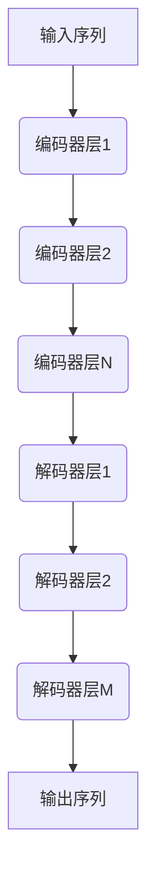
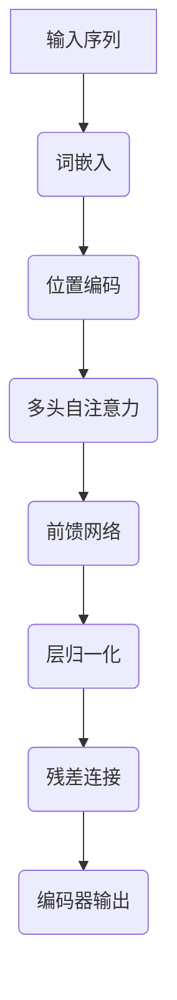
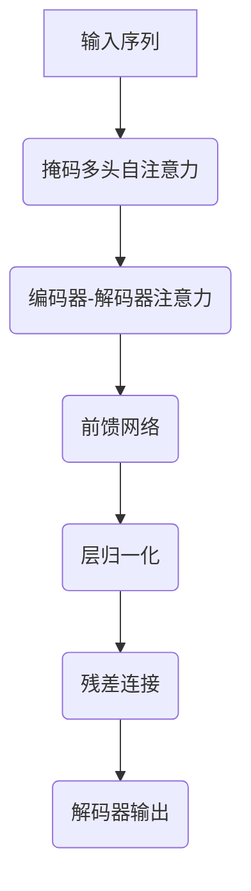
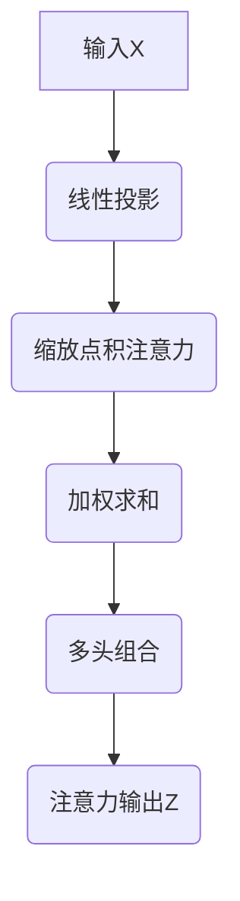

# 大规模语言模型从理论到实践 实践思考

## 1.背景介绍

### 1.1 语言模型的重要性

语言模型是自然语言处理(NLP)领域的核心技术之一,广泛应用于机器翻译、自动问答、文本生成、语音识别等各种任务。随着深度学习技术的快速发展,大规模语言模型的性能不断提高,在各种NLP任务中取得了卓越的成绩。

### 1.2 大规模语言模型的兴起

早期的统计语言模型主要基于N-gram模型,但由于数据稀疏和上下文利用不足的问题,其性能受到了一定限制。2018年,Transformer模型的提出为构建大规模语言模型奠定了基础。自注意力机制使模型能够有效捕获长距离依赖关系,并且允许高度并行化,从而可以在海量数据上进行预训练。

此后,GPT、BERT、XLNet等大规模预训练语言模型相继问世,展现出了强大的语言理解和生成能力。最新的GPT-3甚至达到了1750亿参数的规模,在多项任务上超过了人类水平。大规模语言模型正在推动着NLP技术的飞速发展。

## 2.核心概念与联系

### 2.1 自注意力机制(Self-Attention)

自注意力机制是构建大规模语言模型的关键,它允许模型直接对输入序列中任意两个位置之间的表示进行关联,捕获长距离依赖关系。这种全局关联消除了RNN的路径长度限制,使得模型可以在更长的序列上进行高效的并行计算。

自注意力机制可以形式化为将查询(Query)与键(Key)序列进行点积,得到注意力权重,然后对值(Value)序列进行加权求和:

$$\mathrm{Attention}(Q,K,V)=\mathrm{softmax}(\frac{QK^T}{\sqrt{d_k}})V$$

其中$Q$、$K$、$V$分别为查询、键和值的线性投影。

### 2.2 Transformer架构

Transformer是第一个完全基于自注意力机制的序列转换模型,由编码器(Encoder)和解码器(Decoder)组成。编码器将输入序列映射为连续的表示,解码器则自回归地生成输出序列。

编码器和解码器都由多个相同的层组成,每一层包含多头自注意力子层和前馈网络子层。残差连接和层归一化被广泛应用,以提高模型的性能和收敛速度。



### 2.3 预训练与微调

大规模语言模型通常采用预训练与微调的范式。在预训练阶段,模型在大量无监督文本数据上学习通用的语言表示;在微调阶段,模型在特定的有监督任务数据上进行进一步调整,以适应特定任务。

预训练可以看作是一种自监督学习,常用的目标包括掩码语言模型(Masked LM)和下一句预测(Next Sentence Prediction)等。微调则根据具体任务设计不同的监督目标,如序列到序列(Seq2Seq)、span分类等。

## 3.核心算法原理具体操作步骤 

### 3.1 Transformer编码器

Transformer编码器将输入序列映射为连续的表示,主要包括以下步骤:

1. **词嵌入(Word Embeddings)**: 将输入token映射为低维稠密向量表示。
2. **位置编码(Positional Encodings)**: 因为自注意力机制没有位置信息,需要将序列位置的信息编码并添加到嵌入中。
3. **多头自注意力(Multi-Head Attention)**: 对嵌入序列进行自注意力计算,捕获不同表示子空间的长程依赖关系。
4. **前馈网络(Feed-Forward Network)**: 对自注意力的输出进行非线性变换,提供"编码"能力。
5. **层归一化(Layer Normalization)**: 加速收敛并防止梯度爆炸/消失。
6. **残差连接(Residual Connection)**: 将输入直接与子层输出相加,以更好地传播梯度信号。

编码器堆叠了N个相同的层,每一层都会对序列的表示进行转换和编码,最终输出编码后的序列表示。



### 3.2 Transformer解码器

解码器的作用是根据编码器的输出和自身的输入,自回归地生成目标序列。主要步骤包括:

1. **掩码多头自注意力(Masked Multi-Head Attention)**: 对输入序列进行编码,同时防止关注后续位置的信息(保证自回归属性)。
2. **编码器-解码器注意力(Encoder-Decoder Attention)**: 结合编码器的输出,为每个位置关注输入序列的全部位置。
3. **前馈网络(Feed-Forward Network)**: 对注意力输出进行非线性变换。
4. **层归一化(Layer Normalization)和残差连接(Residual Connection)**: 加速收敛并更好地传播梯度。

解码器堆叠了M个相同的层,每一层都会生成一个新的token,最终输出完整的目标序列。



### 3.3 注意力计算详解

多头自注意力是Transformer的核心部件,包含以下步骤:

1. **线性投影**: 将输入$X$分别线性投影到查询$Q$、键$K$和值$V$空间。
2. **缩放点积注意力**: 计算查询$Q$与所有键$K$的点积,对其进行缩放并应用softmax得到注意力权重$\alpha$。
   $$\alpha_{ij}=\mathrm{softmax}(\frac{Q_iK_j^T}{\sqrt{d_k}})$$
3. **加权求和**: 使用注意力权重$\alpha$对值$V$进行加权求和,得到注意力输出$Z$。
   $$Z_i=\sum_{j}{\alpha_{ij}V_j}$$
4. **多头组合**: 将$h$个并行计算的注意力头的输出进行拼接,并进行线性变换以允许头与头之间的交互。



多头自注意力允许模型关注不同表示子空间,并通过并行计算提高效率。

## 4.数学模型和公式详细讲解举例说明

### 4.1 掩码语言模型(Masked Language Modeling)

掩码语言模型是预训练大规模语言模型的常用目标之一。给定一个输入序列,模型需要预测被掩码(用特殊token[MASK]替换)的token。形式化地,目标是最大化掩码位置的条件概率:

$$\mathcal{L}_{\text{MLM}}=-\mathbb{E}_{x\sim X}\left[\sum_{i\in\mathcal{M}}\log P(x_i|x_{\backslash i})\right]$$

其中$X$为语料库,$\mathcal{M}$为被掩码的位置集合,$x_{\backslash i}$表示除$x_i$外的其他token。

例如,对于输入序列"我昨天去了[MASK]吃晚饭",模型需要预测被掩码的token"餐馆"。通过学习预测被掩码token的目标,模型可以捕获双向的语境信息,提高语言理解能力。

### 4.2 下一句预测(Next Sentence Prediction)

除了掩码语言模型,BERT还引入了下一句预测(Next Sentence Prediction)作为辅助目标。给定两个句子$A$和$B$,模型需要预测$B$是否为$A$的下一句。形式化地:

$$\mathcal{L}_{\text{NSP}}=-\mathbb{E}_{(A,B)\sim D}\left[\log P(y|A,B)\right]$$

其中$D$为句对数据集,$y$表示$B$是否为$A$的下一句的标签。通过该目标,模型可以学习捕获句子之间的关系和连贯性。

### 4.3 序列到序列生成(Sequence-to-Sequence Generation)

在生成任务中,模型需要根据输入序列$X$生成目标序列$Y$。常用的目标函数是最大化生成序列的条件概率:

$$\mathcal{L}_{\text{gen}}=-\mathbb{E}_{(X,Y)\sim D}\left[\sum_{t=1}^{|Y|}\log P(y_t|X,y_{<t})\right]$$

其中$D$为序列对数据集,$y_{<t}$表示生成的前$t-1$个token。在解码时,通常使用贪心搜索或beam search等方法来近似最优序列。

例如在机器翻译任务中,给定一个英文句子$X$,模型需要生成对应的中文翻译$Y$。通过最大化上式,模型可以学习到输入到输出的条件分布,从而完成序列生成。

## 5.项目实践：代码实例和详细解释说明

以下是使用PyTorch实现的一个简化版Transformer模型,用于英文到德文的机器翻译任务。

```python
import torch
import torch.nn as nn

# 词嵌入和位置编码
class PositionalEncoding(nn.Module):
    def __init__(self, d_model, max_len=5000):
        ...

    def forward(self, x):
        ...

# 多头自注意力
class MultiHeadAttention(nn.Module):
    def __init__(self, heads, d_model, dropout=0.1):
        ...
    
    def forward(self, q, k, v, mask=None):
        ...

# 编码器层
class EncoderLayer(nn.Module):
    def __init__(self, d_model, heads, dropout=0.1):
        ...

    def forward(self, x, mask):
        ...

# 解码器层 
class DecoderLayer(nn.Module):
    def __init__(self, d_model, heads, dropout=0.1):
        ...

    def forward(self, x, enc_outputs, look_ahead_mask, padding_mask):
        ...

# 编码器
class Encoder(nn.Module):
    def __init__(self, d_model, N, heads, dropout):
        ...

    def forward(self, x, mask):
        ...

# 解码器
class Decoder(nn.Module):
    def __init__(self, d_model, N, heads, dropout):
        ...
    
    def forward(self, x, enc_outputs, look_ahead_mask, padding_mask):
        ...

# Transformer
class Transformer(nn.Module):
    def __init__(self, src_vocab, tgt_vocab, d_model=512, N=6, heads=8, dropout=0.1):
        ...

    def forward(self, src, tgt, src_mask, tgt_mask):
        ...
```

上述代码实现了Transformer的核心组件,包括位置编码、多头自注意力、编码器层、解码器层、编码器和解码器。以下是一些关键部分的解释:

1. `PositionalEncoding`通过sin/cos函数计算位置编码,并将其加到词嵌入上。
2. `MultiHeadAttention`实现了缩放点积注意力,并进行多头组合。
3. `EncoderLayer`和`DecoderLayer`分别构建了编码器层和解码器层,包含自注意力、编码器-解码器注意力和前馈网络。
4. `Encoder`和`Decoder`通过堆叠多个相同的层来构建编码器和解码器。
5. `Transformer`将编码器和解码器整合,并处理输入输出。

在训练过程中,我们需要准备好数据,构建模型,定义优化器和损失函数,然后进行迭代训练。预测时,我们可以使用贪心搜索或beam search来生成翻译序列。

## 6.实际应用场景

大规模语言模型在自然语言处理的多个领域发挥着重要作用,下面列举了一些典型的应用场景:

### 6.1 机器翻译

机器翻译是语言模型的主要应用之一。基于Transformer的神经机