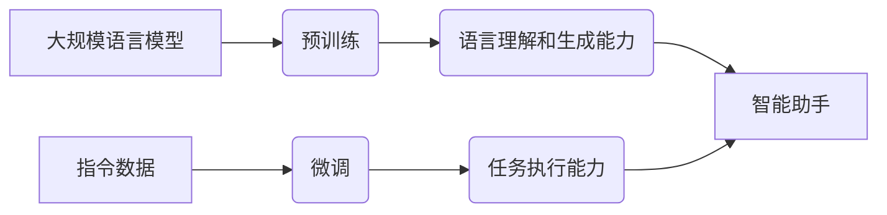

# 大规模语言模型从理论到实践 指令数据的构建

## 1. 背景介绍
### 1.1 大规模语言模型概述
#### 1.1.1 语言模型的定义与作用
语言模型(Language Model)是自然语言处理(NLP)领域的一个重要分支,它用于描述语言中词语、短语或句子的概率分布。通过对大量文本数据的学习,语言模型能够捕捉到语言的统计规律和语义信息,从而实现对未见过的文本的理解和生成。语言模型在机器翻译、语音识别、信息检索、文本摘要等诸多NLP任务中发挥着关键作用。

#### 1.1.2 大规模语言模型的兴起
近年来,随着深度学习技术的发展和计算资源的增强,大规模语言模型(Large-scale Language Model)开始崭露头角。相比传统的语言模型,大规模语言模型通过在海量文本语料上进行预训练,能够学习到更加丰富和精准的语言表征。代表性的大规模语言模型包括GPT系列[1]、BERT[2]、XLNet[3]等,它们在多项NLP任务上取得了突破性的进展,展现出惊人的语言理解和生成能力。

### 1.2 指令数据的重要性
#### 1.2.1 指令数据的定义
指令数据(Instruction Data)是一种特殊形式的语言数据,它由自然语言指令和相应的执行结果组成。不同于传统的语料库,指令数据强调语言的指令性和操作性,旨在教会模型如何根据指令完成特定任务。例如,指令"请用Python写一个计算斐波那契数列的函数"对应的执行结果就是相应的Python代码实现。

#### 1.2.2 指令数据对大规模语言模型的意义
大规模语言模型虽然展现出强大的语言能力,但它们主要是在无监督的方式下进行预训练,缺乏对指令的理解和执行能力。为了赋予语言模型更强的任务完成能力,需要引入指令数据对模型进行微调(Fine-tuning)。通过学习指令-执行结果的映射关系,模型能够更好地理解人类意图,并根据指令生成符合要求的输出。指令数据的构建和应用,有助于将大规模语言模型从单纯的语言表征学习器发展为真正意义上的智能助手。

## 2. 核心概念与联系
### 2.1 大规模语言模型的核心概念
#### 2.1.1 预训练(Pre-training)
预训练是大规模语言模型的关键步骤,它通过在大规模无标注语料上进行自监督学习,使模型掌握语言的基本规律和表征。常见的预训练任务包括语言模型任务(预测下一个词)、掩码语言模型任务(预测被掩盖的词)等。预训练阶段一般使用Transformer[4]等强大的神经网络架构,并在GPU/TPU集群上进行大规模分布式训练。

#### 2.1.2 微调(Fine-tuning)
微调是在预训练模型的基础上,使用少量标注数据对模型进行针对性调优的过程。通过在下游任务的训练集上对模型进行微调,可以使模型快速适应特定任务,并达到较好的性能。微调一般只需要较小的学习率和较少的训练轮数,且可以根据任务的特点对模型结构进行适当修改,如增加任务特定的输出层等。

### 2.2 指令数据的核心概念
#### 2.2.1 指令格式(Instruction Format)
指令数据中的指令一般采用特定的格式,以便模型能够准确理解和执行。常见的指令格式包括自然语言指令、结构化指令等。自然语言指令以人类可读的自然语言形式表达任务要求,如"请写一个Python函数来计算两个数的最大公约数"。结构化指令则使用预定义的结构化表示,如JSON格式,明确指定任务的输入、输出和约束条件。

#### 2.2.2 执行结果(Execution Result)
执行结果是指令数据的另一个关键组成部分,它表示模型根据指令应该生成的正确输出。执行结果可以是代码片段、文本序列、结构化数据等多种形式,具体取决于任务的类型。高质量的执行结果对于指导模型学习至关重要,需要经过人工标注或自动生成。

### 2.3 大规模语言模型与指令数据的关系
大规模语言模型和指令数据是相辅相成的关系。大规模语言模型通过预训练掌握了丰富的语言知识,具备了语言理解和生成的基础能力。而指令数据则为语言模型提供了如何执行任务的范例,使其学会根据指令生成符合要求的输出。二者的结合,使得大规模语言模型能够真正应用于实际任务,成为人类的得力助手。下图展示了大规模语言模型与指令数据的关系:

## 3. 核心算法原理与具体操作步骤
### 3.1 大规模语言模型的预训练算法
#### 3.1.1 Transformer架构
Transformer是大规模语言模型的核心架构,它采用了全注意力机制(Self-Attention)和前馈神经网络(Feed-Forward Network)的组合,能够高效地建模长距离依赖关系。Transformer的编码器由多个相同的层堆叠而成,每一层包括一个自注意力子层和一个前馈子层。自注意力机制允许模型在处理当前词时,参考句子中的所有其他词,从而捕捉到全局的语义信息。

#### 3.1.2 预训练任务
大规模语言模型的预训练任务一般包括以下两类:

1. 语言模型任务(Language Modeling):给定前面的词,预测下一个词。通过最大化下一个词的概率,模型学习到语言的基本规律和词之间的依赖关系。

2. 掩码语言模型任务(Masked Language Modeling):随机掩盖句子中的部分词,并让模型预测被掩盖的词。这个任务能够促使模型学习到更加丰富的上下文信息和词义表征。

预训练的具体步骤如下:

1. 准备大规模无标注语料,进行必要的清洗和预处理。
2. 根据预训练任务的要求,构建训练样本。对于语言模型任务,将文本划分为固定长度的序列;对于掩码语言模型任务,随机掩盖部分词。
3. 将训练样本输入Transformer模型,计算预测词的概率分布。
4. 使用交叉熵损失函数,计算预测分布与真实分布之间的差异,并进行梯度反向传播和参数更新。
5. 重复步骤3-4,直到模型收敛或达到预设的训练轮数。

### 3.2 指令数据的构建算法
#### 3.2.1 数据收集与过滤
构建高质量的指令数据需要从多个来源收集原始数据,并进行必要的过滤和清洗。常见的数据来源包括:

1. 众包平台:利用众包平台(如Amazon Mechanical Turk)发布任务,让工人根据提供的模板和指南创作指令数据。
2. 现有数据集:从相关领域的现有数据集(如编程问答网站、Wiki How等)中提取和转化指令数据。
3. 自动生成:利用规则或模板,自动生成合成的指令数据。

收集到的原始数据需要经过一系列过滤和清洗步骤,以确保数据的质量和可用性。常见的过滤方法包括:

1. 长度过滤:移除过长或过短的指令和执行结果。
2. 重复过滤:去除重复或高度相似的数据。
3. 质量过滤:根据预定义的质量标准(如可读性、合理性等),筛选出高质量的数据。

#### 3.2.2 数据增强与平衡
为了提高指令数据的多样性和鲁棒性,可以对原始数据进行增强和平衡处理。常用的数据增强技术包括:

1. 回译(Back Translation):将指令翻译到另一种语言,再翻译回原语言,以引入表达方式的变化。
2. 词替换(Word Substitution):使用同义词或相似词替换指令中的部分词,以增加语言的多样性。
3. 指令扩展(Instruction Expansion):根据指令的核心意图,生成多个语义相似但表达不同的指令。

数据平衡主要针对不同类别或难度的指令数据进行平衡,以避免模型过拟合到特定类型的指令。可以通过上采样(Over-sampling)少数类别或下采样(Under-sampling)多数类别的方式来实现数据平衡。

#### 3.2.3 数据格式化与组织
为了方便模型的训练和使用,需要将指令数据格式化为统一的形式,并进行合理的组织和存储。常见的数据格式包括:

1. JSON格式:每个样本包含指令、执行结果等字段,以JSON字典的形式存储。
2. CSV格式:每个样本占一行,不同字段用逗号分隔。
3. TXT格式:指令和执行结果以特定的分隔符(如<sep>)隔开,每个样本占一行。

组织和存储数据时,需要考虑以下因素:

1. 划分数据集:将数据划分为训练集、验证集和测试集,以评估模型的性能。
2. 数据版本控制:对数据集进行版本管理,记录每个版本的变更和特点。
3. 数据存储:选择合适的存储格式和存储位置,如使用文件系统、数据库等。

## 4. 数学模型与公式详解
### 4.1 Transformer的数学原理
Transformer是大规模语言模型的核心组件,其关键是自注意力机制和位置编码。下面详细介绍Transformer的数学原理。

#### 4.1.1 自注意力机制
自注意力机制允许模型在处理当前词时,参考句子中的所有其他词。具体来说,对于输入序列$X=(x_1,\dots,x_n)$,自注意力机制通过以下步骤计算输出表示$Z=(z_1,\dots,z_n)$:

1. 计算查询矩阵$Q$、键矩阵$K$和值矩阵$V$:
$$
\begin{aligned}
Q &= XW^Q \\
K &= XW^K \\
V &= XW^V
\end{aligned}
$$
其中,$W^Q$、$W^K$、$W^V$是可学习的参数矩阵。

2. 计算注意力权重矩阵$A$:
$$
A = \text{softmax}(\frac{QK^T}{\sqrt{d_k}})
$$
其中,$d_k$是键向量的维度,用于缩放点积结果。

3. 计算输出表示$Z$:
$$
Z = AV
$$

自注意力机制通过查询、键、值的计算和注意力权重的分配,使得模型能够在编码每个词时,关注输入序列中的不同部分,捕捉词之间的依赖关系。

#### 4.1.2 位置编码
由于Transformer不包含递归或卷积结构,为了引入序列的位置信息,需要对输入序列进行位置编码。位置编码通过在词嵌入中加入表示位置的向量,使模型能够区分不同位置的词。常用的位置编码方法有:

1. 正弦位置编码:对于位置$pos$和维度$i$,位置编码向量$PE_{pos,i}$的计算公式为:
$$
\begin{aligned}
PE_{pos,2i} &= \sin(pos/10000^{2i/d_{model}}) \\
PE_{pos,2i+1} &= \cos(pos/10000^{2i/d_{model}})
\end{aligned}
$$
其中,$d_{model}$是词嵌入的维度。

2. 可学习的位置编码:使用可学习的参数矩阵$P\in\mathbb{R}^{n\times d_{model}}$表示位置编码,其中$n$是序列的最大长度。

将位置编码与词嵌入相加,得到最终的输入表示:
$$
X = E + PE
$$
其中,$E$是词嵌入矩阵。

### 4.2 指令数据的