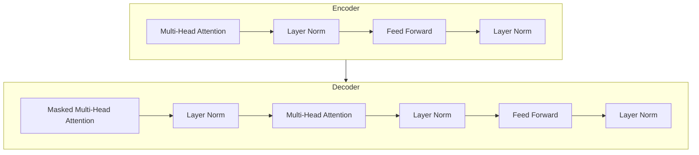

# 大规模语言模型从理论到实践 模型推理

## 1.背景介绍

### 1.1 语言模型的重要性

语言模型在自然语言处理领域扮演着至关重要的角色。它们旨在捕捉语言的统计规律,从而更好地理解和生成自然语言。随着深度学习技术的不断发展,大规模语言模型取得了令人瞩目的成就,展现出强大的语言理解和生成能力。

### 1.2 大规模语言模型的兴起

传统的语言模型通常基于 n-gram 统计或有限的神经网络,其表现能力受到模型规模和训练数据的限制。近年来,benefiting from:

- 大规模语料库的积累
- 强大的硬件计算能力 
- 创新的深度学习模型架构

大规模语言模型得以蓬勃发展,极大地推进了自然语言处理的发展。

### 1.3 大规模语言模型的影响

大规模语言模型在多个领域展现出卓越的性能,包括但不限于:

- 机器翻译
- 问答系统
- 文本摘要
- 内容生成
- 代码生成等

它们不仅能够更好地理解和生成自然语言,还能够从语料库中学习到丰富的知识,并将其应用于下游任务。这些模型正在推动着自然语言处理的新纪元。

## 2.核心概念与联系

### 2.1 语言模型的基本概念

语言模型的核心目标是估计一个句子或词序列的概率。形式化地,对于一个长度为 n 的词序列 $w_1, w_2, ..., w_n$,语言模型需要计算该序列的概率:

$$P(w_1, w_2, ..., w_n)$$

根据链式法则,我们可以将该概率分解为:

$$P(w_1, w_2, ..., w_n) = \prod_{i=1}^{n}P(w_i|w_1, ..., w_{i-1})$$

其中 $P(w_i|w_1, ..., w_{i-1})$ 表示在给定前 i-1 个词的情况下,第 i 个词出现的条件概率。

### 2.2 自回归语言模型

大规模语言模型通常采用自回归(Autoregressive)的架构,即在生成每个新词时,模型会考虑之前生成的所有词。这种架构可以用下式表示:

$$P(w_1, w_2, ..., w_n) = \prod_{i=1}^{n}P(w_i|w_1, ..., w_{i-1}; \theta)$$

其中 $\theta$ 表示模型的参数。自回归模型通过最大化训练语料库的概率来学习参数 $\theta$。

### 2.3 Transformer 模型

Transformer 是大规模语言模型中广泛采用的一种模型架构。它完全基于注意力机制,不依赖于循环神经网络或卷积神经网络,因此具有更好的并行性能。Transformer 模型的核心组件包括:

- 多头注意力机制(Multi-Head Attention)
- 位置编码(Positional Encoding)
- 层归一化(Layer Normalization)
- 前馈神经网络(Feed-Forward Neural Network)

Transformer 架构在捕捉长距离依赖关系方面表现出色,因此被广泛应用于大规模语言模型中。

### 2.4 预训练与微调

大规模语言模型通常采用两阶段训练策略:

1. **预训练(Pre-training)**: 在大规模无标注语料库上训练模型,学习通用的语言表示。
2. **微调(Fine-tuning)**: 在特定的下游任务上进行进一步训练,将通用语言表示应用于具体任务。

这种策略允许模型在预训练阶段学习丰富的语言知识,并在微调阶段将这些知识迁移到特定任务上,从而显著提高模型的性能。

## 3.核心算法原理具体操作步骤

### 3.1 Transformer 模型架构

Transformer 模型的核心架构由编码器(Encoder)和解码器(Decoder)两部分组成。编码器将输入序列映射为序列表示,而解码器则根据序列表示生成输出序列。



编码器和解码器都由多个相同的层组成,每层包含以下几个主要部分:

1. **Multi-Head Attention**: 计算输入序列中每个位置与其他位置的注意力权重,捕捉序列内部的依赖关系。
2. **Layer Normalization**: 对输入进行归一化,加速训练并提高模型性能。
3. **Feed Forward**: 由两个线性变换和一个非线性激活函数组成,对每个位置的表示进行独立的变换。

解码器中还包含一个额外的 Masked Multi-Head Attention 层,用于防止注意力机制关注到未来的位置,确保模型只能依赖于当前和过去的信息进行预测。

### 3.2 注意力机制

注意力机制是 Transformer 模型的核心部分,它允许模型动态地捕捉输入序列中不同位置之间的依赖关系。

对于一个查询向量 $q$、键向量 $k$ 和值向量 $v$,注意力机制计算如下:

$$\text{Attention}(q, k, v) = \text{softmax}\left(\frac{qk^T}{\sqrt{d_k}}\right)v$$

其中 $d_k$ 是缩放因子,用于防止内积过大导致梯度消失或爆炸。

Multi-Head Attention 将注意力机制扩展为多个并行的注意力头,每个头捕捉不同的依赖关系模式,然后将它们的结果拼接起来:

$$\text{MultiHead}(Q, K, V) = \text{Concat}(head_1, ..., head_h)W^O$$
$$\text{where } head_i = \text{Attention}(QW_i^Q, KW_i^K, VW_i^V)$$

其中 $W_i^Q$、$W_i^K$、$W_i^V$ 和 $W^O$ 是可学习的线性变换。

### 3.3 位置编码

由于 Transformer 模型不依赖于序列的顺序信息(如 RNN 或 CNN),因此需要一种机制来注入位置信息。位置编码就是一种将位置信息编码到输入序列中的方法。

常见的位置编码方式是使用正弦和余弦函数:

$$PE_{(pos, 2i)} = \sin\left(pos / 10000^{2i/d_{model}}\right)$$
$$PE_{(pos, 2i+1)} = \cos\left(pos / 10000^{2i/d_{model}}\right)$$

其中 $pos$ 是词的位置,而 $i$ 是维度的索引。位置编码会被添加到输入的词嵌入中,从而为模型提供位置信息。

### 3.4 模型预训练

大规模语言模型通常在大量无标注语料库上进行预训练,以学习通用的语言表示。常见的预训练目标包括:

1. **掩码语言模型(Masked Language Modeling, MLM)**: 随机掩码输入序列中的一些词,并让模型预测被掩码的词。
2. **下一句预测(Next Sentence Prediction, NSP)**: 判断两个句子是否相邻出现。

通过这些预训练目标,模型可以学习到丰富的语义和语法知识,为下游任务做好准备。

### 3.5 模型微调

在完成预训练后,大规模语言模型需要针对特定的下游任务进行微调。微调过程通常包括以下步骤:

1. **添加任务特定的输出层**: 根据下游任务的性质(如分类、序列生成等),添加相应的输出层。
2. **准备训练数据**: 将下游任务的训练数据转换为模型可以处理的格式。
3. **微调训练**: 在下游任务的训练数据上进行有监督的微调训练,更新模型参数以适应特定任务。

微调过程通常只需要更新模型的一部分参数,因此可以快速收敛并且数据需求较小。

## 4.数学模型和公式详细讲解举例说明

### 4.1 交叉熵损失函数

在训练语言模型时,常用的损失函数是交叉熵损失(Cross-Entropy Loss)。对于一个长度为 $N$ 的目标序列 $y = (y_1, y_2, ..., y_N)$,以及模型预测的概率分布 $\hat{y} = (\hat{y}_1, \hat{y}_2, ..., \hat{y}_N)$,交叉熵损失定义为:

$$\mathcal{L}(\hat{y}, y) = -\sum_{i=1}^{N} y_i \log \hat{y}_i$$

其中 $y_i$ 是一个一热向量,表示第 i 个位置的真实标签。交叉熵损失函数刻画了模型预测与真实标签之间的差异,模型训练的目标是最小化这个损失函数。

在实践中,我们通常会对损失函数进行平均或归一化,以防止梯度过大或过小。

### 4.2 注意力分数计算

在 Transformer 模型中,注意力分数的计算是关键步骤之一。给定一个查询向量 $q$、键矩阵 $K$ 和值矩阵 $V$,注意力分数的计算过程如下:

1. 计算查询和键之间的点积: $e_{ij} = q_i^T k_j$
2. 对点积进行缩放: $\tilde{e}_{ij} = e_{ij} / \sqrt{d_k}$,其中 $d_k$ 是键向量的维度
3. 对缩放后的点积应用 softmax 函数,得到注意力权重: $\alpha_{ij} = \text{softmax}(\tilde{e}_{ij})$
4. 将注意力权重与值矩阵相乘,得到加权和: $o_i = \sum_{j} \alpha_{ij} v_j$

最终的注意力输出 $o$ 就是所有加权和 $o_i$ 的集合。

### 4.3 位置编码公式推导

位置编码的目的是将位置信息注入到输入的词嵌入中,从而让模型能够捕捉序列的顺序信息。Transformer 中使用的位置编码公式如下:

$$PE_{(pos, 2i)} = \sin\left(pos / 10000^{2i/d_{model}}\right)$$
$$PE_{(pos, 2i+1)} = \cos\left(pos / 10000^{2i/d_{model}}\right)$$

其中 $pos$ 是词的位置,而 $i$ 是维度的索引。这个公式的推导过程如下:

1. 我们希望位置编码能够捕捉不同频率的周期性信号,因为不同的位置可能需要不同的周期性模式。
2. 对于给定的维度 $i$,我们可以将其看作是一个频率,即 $f(i) = 1 / 10000^{2i/d_{model}}$。
3. 然后,我们可以使用正弦和余弦函数来表示不同位置的周期性信号,其中偶数维度使用正弦函数,奇数维度使用余弦函数。
4. 将位置 $pos$ 代入正弦或余弦函数,我们就得到了该位置在该维度上的位置编码值。

通过这种方式,位置编码可以为每个位置提供一个独特的向量表示,并且这些向量是有意义的,能够捕捉不同频率的周期性模式。

## 5.项目实践:代码实例和详细解释说明

在本节中,我们将提供一个基于 PyTorch 的 Transformer 模型实现示例,并详细解释每个部分的代码。

### 5.1 导入所需的库

```python
import math
import torch
import torch.nn as nn
from torch.nn import TransformerEncoder, TransformerEncoderLayer
```

我们首先导入所需的库,包括 PyTorch 及其神经网络模块。

### 5.2 位置编码实现

```python
class PositionalEncoding(nn.Module):
    def __init__(self, d_model, dropout=0.1, max_len=5000):
        super(PositionalEncoding, self).__init__()
        self.dropout = nn.Dropout(p=dropout)

        pe = torch.zeros(max_len, 