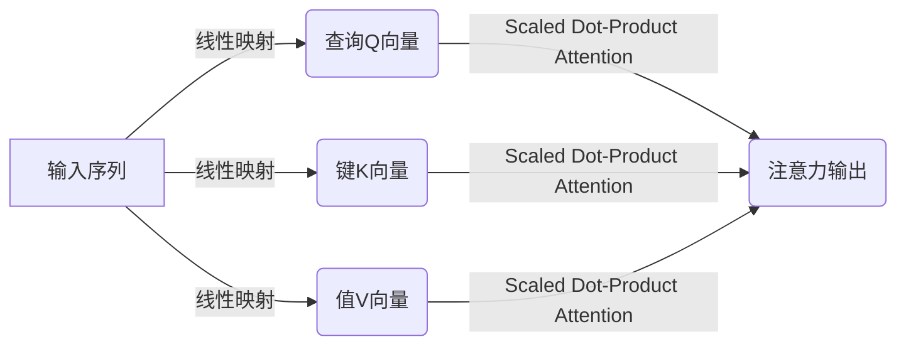
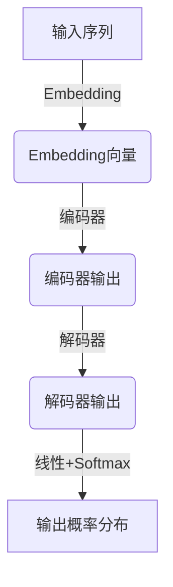
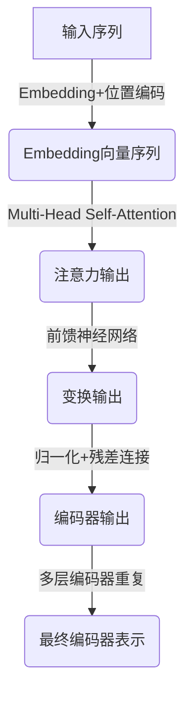
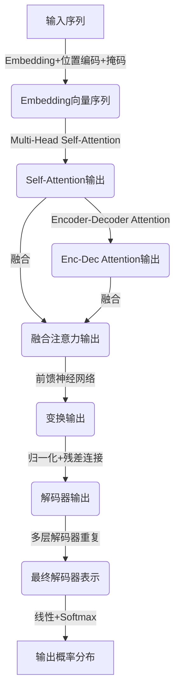

# 大规模语言模型从理论到实践：编码器和解码器结构

## 1. 背景介绍

### 1.1 自然语言处理的重要性

在当今的数字时代,自然语言处理(NLP)已成为人工智能领域中最重要和最具挑战性的研究方向之一。它旨在使计算机能够理解、解释和生成人类语言,从而实现人机之间自然、流畅的交互。随着大数据和计算能力的不断提高,NLP已广泛应用于机器翻译、智能问答、语音识别、情感分析等诸多领域,为我们的生活带来了巨大便利。

### 1.2 语言模型的作用

语言模型是NLP的核心部分,它通过学习大量的文本数据,捕捉语言的统计规律,从而预测下一个单词或词序列出现的概率。高质量的语言模型对于提高NLP系统的性能至关重要。传统的语言模型基于n-gram统计方法,但存在数据稀疏、上下文窗口小等缺陷。而近年来,基于神经网络的大规模语言模型凭借其强大的表示能力和建模能力,取得了令人瞩目的成就。

### 1.3 大规模语言模型的兴起

随着算力和数据量的快速增长,大规模语言模型应运而生。这些模型通过预训练海量无标注语料,学习丰富的语义和语法知识,然后可以通过微调等方式迁移到下游NLP任务中,显著提升了性能表现。代表性的大规模语言模型包括GPT、BERT、XLNet等,它们已在多个领域创造了新的最高纪录,推动了NLP的飞速发展。

## 2. 核心概念与联系

### 2.1 编码器-解码器架构

编码器-解码器(Encoder-Decoder)架构是大规模语言模型中的核心结构,广泛应用于机器翻译、文本生成、问答系统等任务。其基本思想是:

1. 编码器(Encoder)将输入序列(如源语言文本)映射为语义向量表示; 
2. 解码器(Decoder)则根据语义向量,生成目标序列(如目标语言文本)。

该架构灵活高效,能够处理可变长度的输入和输出序列,是序列到序列(Seq2Seq)建模的有力工具。


### 2.2 Self-Attention机制

Self-Attention是Transformer等大规模语言模型的核心组件,它能够捕捉序列中任意两个位置之间的依赖关系,从而更好地建模长程依赖。与RNN相比,Self-Attention没有递归计算,更易于并行化,从而能够高效处理长序列。此外,Multi-Head Attention通过多个注意力头共同作用,进一步增强了模型的表示能力。



### 2.3 Transformer模型

Transformer是一种全新的基于Self-Attention的序列建模架构,由Google在2017年提出,在机器翻译等任务上表现出色。它完全抛弃了RNN结构,使用Encoder-Decoder架构和Self-Attention机制,大大提高了并行性和长程依赖建模能力。此后,BERT、GPT等大规模语言模型都是基于Transformer的变体和改进。



### 2.4 预训练与微调策略

大规模语言模型通常采用两阶段策略:

1. 预训练(Pre-training):在大规模无标注语料上训练模型,学习通用的语言知识;
2. 微调(Fine-tuning):将预训练模型迁移到特定的下游NLP任务,在有标注数据上进行进一步训练和微调。

这种策略能够充分利用无标注数据的优势,提高模型的泛化能力,同时也避免了从头训练的巨大计算开销。

## 3. 核心算法原理具体操作步骤

### 3.1 Transformer编码器

Transformer编码器的核心是Multi-Head Self-Attention和位置编码,具体操作步骤如下:

1. 将输入序列通过Embedding层映射为向量表示;
2. 对Embedding向量序列加上位置编码,赋予每个词元位置信息;
3. 通过Multi-Head Self-Attention计算序列中每个词元与其他词元的注意力权重;
4. 将注意力加权后的值传递给前馈神经网络进行变换;
5. 对变换后的值执行归一化和残差连接;
6. 重复3-5步骤的多层编码器运算,输出最终的编码器表示。



### 3.2 Transformer解码器

Transformer解码器在编码器的基础上,增加了Encoder-Decoder Attention,用于融合编码器输出的信息。具体步骤如下:

1. 将输入序列通过Embedding层映射为向量表示;  
2. 对Embedding向量序列加上位置编码和掩码(防止看到后续位置的信息);
3. 通过Multi-Head Self-Attention计算序列内部的注意力权重;
4. 通过Encoder-Decoder Attention计算当前位置与编码器输出的注意力权重;
5. 将两种注意力输出进行融合,传递给前馈神经网络进行变换;
6. 对变换后的值执行归一化和残差连接;  
7. 重复3-6步骤的多层解码器运算,输出最终的解码器表示;
8. 将解码器表示通过线性层和softmax,生成词元的概率分布。



## 4. 数学模型和公式详细讲解举例说明

### 4.1 Self-Attention注意力机制

Self-Attention是Transformer的核心所在,它能够捕捉序列中任意两个位置之间的依赖关系。给定一个序列 $X = (x_1, x_2, ..., x_n)$,Self-Attention的计算过程如下:

1. 将序列X分别线性映射为查询向量Q、键向量K和值向量V:

$$\begin{aligned}
Q &= XW^Q\\
K &= XW^K\\
V &= XW^V
\end{aligned}$$

其中 $W^Q, W^K, W^V$ 为可训练的权重矩阵。

2. 计算查询Q与所有键K的点积,获得未缩放的分数矩阵:

$$\text{Scores} = QK^T$$

3. 对分数矩阵进行缩放并应用Softmax函数,得到注意力权重矩阵:

$$\text{Attention}(Q, K, V) = \text{Softmax}(\frac{\text{Scores}}{\sqrt{d_k}})V$$

其中 $d_k$ 为缩放系数,通常取 $d_k = \sqrt{d_{\text{model}}}$ ($d_{\text{model}}$ 为模型维度)。

4. 注意力输出即为值向量V根据注意力权重矩阵的加权和:

$$\text{Attention Output} = \text{Attention}(Q, K, V)$$

通过Self-Attention,每个位置的输出向量都是所有位置的值向量的加权和,权重由该位置与其他位置的相似性决定。这种机制能够有效捕捉长程依赖关系。

### 4.2 Multi-Head Attention

为了进一步提高模型的表示能力,Transformer引入了Multi-Head Attention机制。它将注意力分成多个"头部"(Head)进行并行计算,然后将这些头部的输出进行拼接,最后通过线性变换得到最终的注意力输出。具体计算过程如下:

1. 将查询Q、键K和值V分别线性映射为 $h$ 个头部:

$$\begin{aligned}
\text{head}_i &= \text{Attention}(QW_i^Q, KW_i^K, VW_i^V)\\
\text{MultiHead}(Q, K, V) &= \text{Concat}(\text{head}_1, ..., \text{head}_h)W^O
\end{aligned}$$

其中 $W_i^Q, W_i^K, W_i^V$ 为第 $i$ 个头部的权重矩阵, $W^O$ 为最终的线性变换矩阵。

2. 将 $h$ 个头部的注意力输出拼接后,通过线性变换 $W^O$ 得到最终的Multi-Head Attention输出。

Multi-Head Attention允许模型从不同的表示子空间捕捉不同的注意力模式,从而提高了模型的表示能力和泛化性。

### 4.3 位置编码

由于Self-Attention没有捕捉序列顺序的能力,Transformer引入了位置编码(Positional Encoding)机制,为序列中的每个位置赋予独特的位置信息。位置编码向量与Embedding向量相加,从而使模型能够区分不同位置的词元。

Transformer使用的是正弦/余弦函数编码位置信息,其公式如下:

$$\begin{aligned}
\text{PE}_{(pos, 2i)} &= \sin(pos / 10000^{2i/d_{\text{model}}})\\
\text{PE}_{(pos, 2i+1)} &= \cos(pos / 10000^{2i/d_{\text{model}}})
\end{aligned}$$

其中 $pos$ 为位置索引, $i$ 为维度索引, $d_{\text{model}}$ 为模型维度。这种编码方式能够很好地捕捉相对位置关系,并且在不同维度上具有不同的周期性,从而使模型能够更好地学习位置信息。

## 5. 项目实践:代码实例和详细解释说明

以下是使用PyTorch实现Transformer编码器和解码器的简化代码示例,并对关键部分进行了详细说明。

```python
import math
import torch
import torch.nn as nn

# 位置编码实现
class PositionalEncoding(nn.Module):
    def __init__(self, d_model, max_len=5000):
        super(PositionalEncoding, self).__init__()
        pe = torch.zeros(max_len, d_model)
        position = torch.arange(0, max_len, dtype=torch.float).unsqueeze(1)
        div_term = torch.exp(torch.arange(0, d_model, 2).float() * (-math.log(10000.0) / d_model))
        pe[:, 0::2] = torch.sin(position * div_term)
        pe[:, 1::2] = torch.cos(position * div_term)
        pe = pe.unsqueeze(0)
        self.register_buffer('pe', pe)

    def forward(self, x):
        return x + self.pe[:, :x.size(1), :]

# 编码器层实现
class EncoderLayer(nn.Module):
    def __init__(self, d_model, num_heads, dff, rate=0.1):
        super(EncoderLayer, self).__init__()
        self.mha = nn.MultiheadAttention(d_model, num_heads)
        self.ffn = nn.Sequential(
            nn.Linear(d_model, dff),
            nn.ReLU(),
            nn.Linear(dff, d_model)
        )
        self.layernorm1 = nn.LayerNorm(d_model, eps=1e-6)
        self.layernorm2 = nn.LayerNorm(d_model, eps=1e-6)
        self.dropout1 = nn.Dropout(rate)
        self.dropout2 = nn.Dropout(rate)

    def forward(self, x):
        attn_output, _ = self.mha(x, x, x)  # 多头注意力
        attn_output = self.dropout1(attn_output)
        out1 = self.layernorm