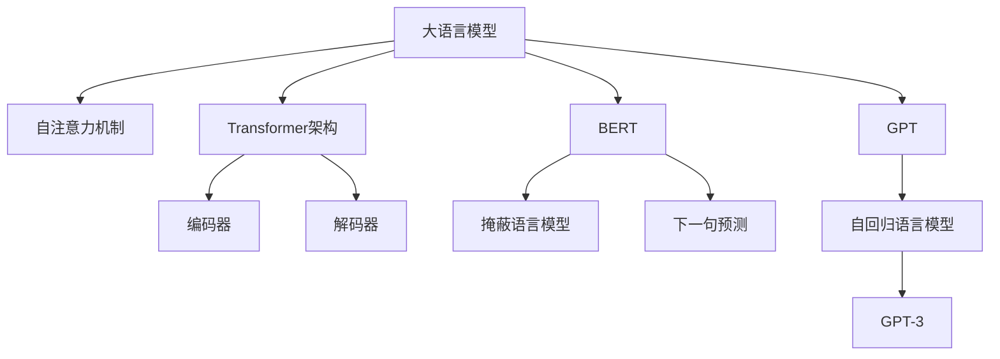

# 大语言模型原理与工程实践：C4

## 1.背景介绍

### 1.1 什么是大语言模型？

大语言模型(Large Language Model, LLM)是一种基于深度学习的自然语言处理(NLP)模型,通过在海量文本数据上进行预训练,学习语言的语义和上下文关系,从而获得强大的语言理解和生成能力。这些模型具有数十亿甚至上百亿个参数,能够捕捉复杂的语言模式和关联性。

大语言模型的出现极大推动了NLP技术的发展,在机器翻译、文本摘要、问答系统、内容生成等领域取得了突破性进展。其中,OpenAI的GPT(Generative Pre-trained Transformer)系列、谷歌的BERT(Bidirectional Encoder Representations from Transformers)、DeepMind的Gopher以及元素人工智能的ChatGPT等,都是备受瞩目的大语言模型。

### 1.2 C4大语言模型的重要性

C4(Colossal Clean Crawled Corpus)是一个由AI21实验室构建的大规模高质量文本语料库,包含了从互联网上爬取并经过清理的63亿个单词。C4语料库的出现,为训练大型语言模型提供了优质的数据基础。

基于C4语料库训练的大语言模型具有广泛的应用前景,可用于自然语言处理任务、知识提取、内容生成等场景。同时,C4模型在训练过程中采用了创新的技术,如反向语言建模(Reverse Language Modeling)、条件生成(Conditional Generation)等,提高了模型的性能和泛化能力。

因此,深入探讨C4大语言模型的原理和工程实践,对于推动NLP技术发展、促进人工智能在各行业的应用都具有重要意义。

## 2.核心概念与联系

### 2.1 自注意力机制(Self-Attention)

自注意力机制是大语言模型中的核心概念之一,它允许模型在编码输入序列时,捕捉序列中任意两个位置之间的关系,而不受位置距离的限制。这种全局依赖性使得模型能够更好地理解长序列的上下文信息。

在自注意力机制中,每个位置的表示是所有位置的加权和,权重由位置之间的相似性决定。这种注意力机制可以自动学习到输入序列中最重要的部分,并相应地分配更多的注意力资源。

自注意力机制的公式如下:

$$\text{Attention}(Q, K, V) = \text{softmax}(\frac{QK^T}{\sqrt{d_k}})V$$

其中,$Q$是查询(Query)向量,$K$是键(Key)向量,$V$是值(Value)向量,$d_k$是缩放因子。

### 2.2 transformer架构

Transformer是大语言模型中广泛采用的一种架构,它完全基于自注意力机制,消除了传统序列模型中的递归和卷积结构。Transformer架构包括编码器(Encoder)和解码器(Decoder)两个主要部分。

编码器用于处理输入序列,通过多个编码器层捕捉输入的上下文信息。每个编码器层由多头自注意力子层和前馈神经网络子层组成。

解码器用于生成输出序列,同样由多个解码器层构成。每个解码器层包含三个子层:掩蔽的多头自注意力子层、编码器-解码器注意力子层和前馈神经网络子层。掩蔽的自注意力机制确保解码器在生成每个位置的输出时,只依赖于当前位置之前的输出。

Transformer架构可以并行计算,提高了训练和推理的效率。它在机器翻译、语言模型等任务中表现出色,成为大语言模型的主导架构。

### 2.3 BERT及其变体

BERT(Bidirectional Encoder Representations from Transformers)是一种基于Transformer的双向编码器模型,通过掩蔽语言模型(Masked Language Model)和下一句预测(Next Sentence Prediction)两个任务进行预训练。

BERT的核心创新在于使用双向编码器,能够同时捕捉输入序列中每个位置的左右上下文信息。这种双向编码方式大大提高了模型的语义理解能力,在各种自然语言处理任务中取得了卓越的表现。

基于BERT,研究人员提出了多种变体模型,如RoBERTa、ALBERT、DistilBERT等,通过优化预训练策略、模型结构和知识蒸馅等技术,进一步提升了模型性能和效率。

### 2.4 GPT及其发展

GPT(Generative Pre-trained Transformer)是一种基于Transformer的自回归语言模型,由OpenAI提出。GPT采用了自监督的预训练方式,通过预测下一个词的目标函数,学习到了丰富的语言知识。

GPT的后续版本GPT-2和GPT-3在模型规模和性能上都有了大幅提升。GPT-3拥有1750亿个参数,展现出了惊人的语言生成能力,可以执行各种自然语言任务,如问答、文本摘要、代码生成等,引发了广泛关注。

GPT系列模型的出现,推动了大语言模型在自然语言生成领域的发展,为构建通用人工智能(AGI)奠定了基础。

### 2.5 Mermaid流程图

上图展示了大语言模型的核心概念及其相互关系。自注意力机制是大语言模型的基础,Transformer架构则是主导架构。BERT和GPT分别代表了两种不同的预训练范式,它们及其变体模型推动了大语言模型的发展。

## 3.核心算法原理具体操作步骤

### 3.1 Transformer编码器

Transformer编码器的主要操作步骤如下:

1. **输入嵌入(Input Embedding)**:将输入序列的每个词token映射为一个连续的向量表示。

2. **位置编码(Positional Encoding)**:由于Transformer没有递归和卷积结构,因此需要添加位置编码来捕捉序列的位置信息。

3. **多头自注意力(Multi-Head Attention)**:计算输入序列中每个位置与其他位置的注意力权重,生成注意力表示。

   - 将输入分别映射到查询(Query)、键(Key)和值(Value)向量。
   - 计算查询和所有键的点积,应用softmax函数得到注意力权重。
   - 将注意力权重与值向量相乘,得到加权和作为注意力表示。
   - 多头注意力机制可以从不同的子空间捕捉不同的注意力模式。

4. **残差连接(Residual Connection)**:将注意力表示与输入相加,作为下一个子层的输入。

5. **层归一化(Layer Normalization)**:对子层的输出进行归一化,加速收敛并提高模型性能。

6. **前馈神经网络(Feed-Forward Network)**:将归一化后的表示通过两个全连接层,进行非线性变换。

7. **残差连接和层归一化**:将前馈网络的输出与输入相加,并进行层归一化。

8. **编码器层堆叠**:重复上述步骤,将多个编码器层堆叠在一起,形成深层编码器。

通过上述步骤,Transformer编码器可以捕捉输入序列的上下文信息,生成高质量的序列表示,为下游任务提供有用的特征。

### 3.2 Transformer解码器

Transformer解码器的主要操作步骤如下:

1. **输出嵌入(Output Embedding)**:将输出序列的每个词token映射为一个连续的向量表示。

2. **掩蔽自注意力(Masked Self-Attention)**:计算当前位置与之前位置的注意力权重,生成自注意力表示。这种掩蔽机制确保解码器在生成每个位置的输出时,只依赖于当前位置之前的输出。

3. **残差连接和层归一化**:将掩蔽自注意力的输出与输入相加,并进行层归一化。

4. **编码器-解码器注意力(Encoder-Decoder Attention)**:计算输出序列中每个位置与输入序列中所有位置的注意力权重,捕捉输入和输出之间的关系。

5. **残差连接和层归一化**:将编码器-解码器注意力的输出与输入相加,并进行层归一化。

6. **前馈神经网络(Feed-Forward Network)**:将归一化后的表示通过两个全连接层,进行非线性变换。

7. **残差连接和层归一化**:将前馈网络的输出与输入相加,并进行层归一化。

8. **解码器层堆叠**:重复上述步骤,将多个解码器层堆叠在一起,形成深层解码器。

9. **输出层(Output Layer)**:将最终的解码器输出通过一个线性层和softmax层,生成下一个词的概率分布。

通过上述步骤,Transformer解码器可以生成高质量的输出序列,同时利用编码器的输出作为条件,实现各种条件生成任务。

## 4.数学模型和公式详细讲解举例说明

### 4.1 注意力机制(Attention Mechanism)

注意力机制是大语言模型中的核心概念之一,它允许模型在编码输入序列时,捕捉序列中任意两个位置之间的关系,而不受位置距离的限制。

在自注意力机制中,每个位置的表示是所有位置的加权和,权重由位置之间的相似性决定。这种注意力机制可以自动学习到输入序列中最重要的部分,并相应地分配更多的注意力资源。

自注意力机制的公式如下:

$$\text{Attention}(Q, K, V) = \text{softmax}(\frac{QK^T}{\sqrt{d_k}})V$$

其中,$Q$是查询(Query)向量,$K$是键(Key)向量,$V$是值(Value)向量,$d_k$是缩放因子。

具体来说,我们首先将输入序列$X$映射为查询$Q$、键$K$和值$V$:

$$Q = XW^Q, K = XW^K, V = XW^V$$

其中,$W^Q$、$W^K$和$W^V$是可学习的权重矩阵。

然后,我们计算查询$Q$和所有键$K$的点积,得到未缩放的分数矩阵:

$$\text{scores} = QK^T$$

为了避免较大的点积值导致softmax函数的梯度过小,我们对分数矩阵进行缩放:

$$\text{scores}_{\text{scaled}} = \frac{\text{scores}}{\sqrt{d_k}}$$

其中,$d_k$是键向量的维度。

接下来,我们对缩放后的分数矩阵应用softmax函数,得到注意力权重矩阵:

$$\text{Attention}(Q, K, V) = \text{softmax}(\text{scores}_{\text{scaled}})V$$

最终,我们将注意力权重与值向量$V$相乘,得到加权和作为注意力表示。

注意力机制允许模型自动关注输入序列中最重要的部分,从而提高了模型的性能和解释性。它已经成为大语言模型中不可或缺的核心组件。

### 4.2 多头注意力(Multi-Head Attention)

多头注意力机制是注意力机制的一种扩展,它可以从不同的子空间捕捉不同的注意力模式,从而提高模型的表示能力。

在多头注意力机制中,我们将查询$Q$、键$K$和值$V$线性投影到$h$个不同的子空间,并在每个子空间中计算注意力表示。然后,将所有子空间的注意力表示连接起来,作为最终的多头注意力表示。

具体来说,对于第$i$个注意力头,我们有:

$$\text{head}_i = \text{Attention}(QW_i^Q, KW_i^K, VW_i^V)$$

其中,$W_i^Q$、$W_i^K$和$W_i^V$是可学习的权重矩阵,用于将$Q$、$K$和$V$投影到第$i$个子空间。

然后,我们将所有注意力头的输出连接起来:

$$\text{MultiHead}(Q, K, V) = \text{Concat}(\text{head}_1