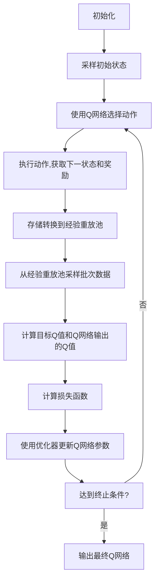

# 大语言模型原理与工程实践：DQN 训练：完整算法

## 1.背景介绍

近年来,大型语言模型(Large Language Models, LLMs)在自然语言处理(NLP)领域取得了令人瞩目的成就。这些模型通过在海量文本数据上进行预训练,学习了丰富的语言知识和上下文信息,从而在各种下游NLP任务上展现出了强大的泛化能力。

然而,训练这些庞大的模型需要耗费大量的计算资源,因此提高训练效率成为了一个重要的挑战。强化学习(Reinforcement Learning, RL)被认为是一种有前景的方法,可以帮助语言模型更有效地学习。其中,深度Q网络(Deep Q-Network, DQN)是一种流行的RL算法,已经在许多领域取得了成功,如视频游戏、机器人控制等。

本文将详细介绍如何将DQN应用于大型语言模型的训练,并提供完整的算法步骤和实现细节。我们将探讨DQN在语言模型训练中的作用、核心概念和数学原理,并通过实际案例展示其在提高训练效率和模型性能方面的优势。

## 2.核心概念与联系

在深入探讨DQN训练算法之前,我们需要先了解一些核心概念和它们之间的联系。

### 2.1 强化学习(Reinforcement Learning)

强化学习是机器学习的一个重要分支,其目标是让智能体(Agent)通过与环境(Environment)的交互,学习如何采取最优策略(Policy)以最大化累积奖励(Cumulative Reward)。

在语言模型训练的场景中,智能体可以被视为语言模型本身,而环境则是训练数据集。模型通过生成文本序列与环境交互,并根据生成的质量获得奖励或惩罚。目标是找到一种策略,使模型能够生成高质量的文本,从而获得最大的累积奖励。

### 2.2 Q-Learning

Q-Learning是一种流行的无模型强化学习算法,它通过估计状态-动作值函数Q(s,a)来学习最优策略。Q(s,a)表示在状态s下采取动作a,之后能获得的期望累积奖励。

在语言模型训练中,状态s可以表示当前生成的文本序列,而动作a则是下一个要生成的词。Q-Learning的目标是找到一个最优的Q函数,使得在任意状态下选择期望累积奖励最大的动作,就能获得最优策略。

### 2.3 深度Q网络(Deep Q-Network, DQN)

DQN是Q-Learning的一种扩展,它使用深度神经网络来逼近Q函数,从而能够处理高维、连续的状态和动作空间。这使得DQN在语言模型训练中变得可行,因为文本序列的状态空间是离散且高维的。

在DQN中,Q网络将当前状态(文本序列)作为输入,输出所有可能动作(下一个词)的Q值估计。然后,我们选择Q值最大的动作作为下一步的生成词。通过不断与环境交互并根据奖励更新Q网络,DQN就能逐步学习到一个近似最优的Q函数,从而指导语言模型生成高质量的文本。

## 3.核心算法原理具体操作步骤

现在,让我们来详细介绍DQN训练语言模型的完整算法步骤。



1. **初始化**：初始化Q网络的参数,以及经验重放池(Experience Replay Buffer)。经验重放池用于存储智能体与环境交互过程中的转换(状态、动作、奖励、下一状态)。

2. **采样初始状态**：从训练数据集中采样一个初始文本序列作为初始状态。

3. **使用Q网络选择动作**：将当前状态输入到Q网络,获取所有可能动作(下一个词)的Q值估计。根据一定的策略(如ε-贪婪策略)选择一个动作。

4. **执行动作,获取下一状态和奖励**：将选择的动作(词)添加到当前文本序列,得到下一个状态(新的文本序列)。同时,根据一定的奖励函数计算该动作的即时奖励。

5. **存储转换到经验重放池**：将当前状态、选择的动作、获得的奖励和下一状态的转换存储到经验重放池中。

6. **从经验重放池采样批次数据**：从经验重放池中随机采样一个批次的转换数据。

7. **计算目标Q值和Q网络输出的Q值**：对于每个转换样本,计算其目标Q值,作为训练Q网络的监督信号。同时,将当前状态输入到Q网络,获取Q网络对应的Q值估计。

8. **计算损失函数**：使用均方误差(Mean Squared Error, MSE)或其他合适的损失函数,计算目标Q值与Q网络输出Q值之间的差异。

9. **使用优化器更新Q网络参数**：使用优化算法(如随机梯度下降)，根据损失函数的梯度更新Q网络的参数。

10. **达到终止条件?**：检查是否达到终止条件,如最大训练步数或收敛条件。如果达到,则输出最终的Q网络;否则,返回步骤3,继续训练过程。

通过上述算法步骤,Q网络将逐步学习到一个近似最优的Q函数,从而指导语言模型生成高质量的文本序列。在训练过程中,我们还可以采用一些技巧来提高训练效率和稳定性,如目标网络(Target Network)、双重Q学习(Double Q-Learning)等。

## 4.数学模型和公式详细讲解举例说明

为了更好地理解DQN算法的数学原理,我们将详细介绍其中涉及的数学模型和公式。

### 4.1 马尔可夫决策过程(Markov Decision Process, MDP)

强化学习问题通常被建模为马尔可夫决策过程(MDP)。一个MDP可以用一个五元组(S, A, P, R, γ)来表示,其中:

- S是状态集合
- A是动作集合
- P是状态转移概率,表示在状态s下执行动作a,转移到状态s'的概率P(s'|s,a)
- R是奖励函数,表示在状态s下执行动作a,获得的即时奖励R(s,a)
- γ是折扣因子,用于平衡即时奖励和长期累积奖励的权重

在语言模型训练的场景中,状态s可以表示当前生成的文本序列,动作a则是下一个要生成的词。状态转移概率P(s'|s,a)由语言模型本身决定,即在当前文本序列s下生成词a,转移到新文本序列s'的概率。奖励函数R(s,a)可以根据生成词的质量来设计,如与参考文本的相似度等。

### 4.2 Q函数和Bellman方程

Q函数Q(s,a)定义为在状态s下执行动作a,之后能获得的期望累积奖励。它满足以下Bellman方程:

$$Q(s,a) = \mathbb{E}_{s' \sim P(\cdot|s,a)}[R(s,a) + \gamma \max_{a'} Q(s',a')]$$

其中,期望是关于下一状态s'的分布P(s'|s,a)计算的。直观上,Q(s,a)等于即时奖励R(s,a)加上折扣的下一状态的最大Q值的期望。

Q-Learning的目标就是找到一个最优的Q函数Q*(s,a),使得在任意状态下选择期望累积奖励最大的动作,就能获得最优策略π*:

$$\pi^*(s) = \arg\max_a Q^*(s,a)$$

### 4.3 DQN中的Q网络

在DQN中,我们使用一个深度神经网络来逼近Q函数,即Q(s,a) ≈ Q(s,a;θ),其中θ是网络的参数。

对于每个训练样本(s,a,r,s'),我们希望Q网络的输出Q(s,a;θ)尽可能接近目标Q值y:

$$y = r + \gamma \max_{a'} Q(s',a';\theta^-)$$

其中,θ-是一个滞后的目标网络参数,用于计算目标Q值以稳定训练过程。

我们可以使用均方误差(MSE)作为损失函数:

$$L(\theta) = \mathbb{E}_{(s,a,r,s') \sim D}[(y - Q(s,a;\theta))^2]$$

其中,D是经验重放池,期望是关于从D中采样的批次数据计算的。

通过优化该损失函数,我们可以使Q网络的输出Q值逐步逼近目标Q值,从而学习到一个近似最优的Q函数。

### 4.4 ε-贪婪策略

在训练过程中,我们需要在探索(Exploration)和利用(Exploitation)之间达成平衡。ε-贪婪策略就是一种常用的方法。

具体来说,在选择动作时,我们有ε的概率随机选择一个动作(探索),有1-ε的概率选择Q值最大的动作(利用)。ε通常会随着训练的进行而逐渐减小,以增加利用的比例。

### 4.5 经验重放池

经验重放池(Experience Replay Buffer)是DQN算法中的一个关键技术,它可以显著提高数据利用效率和训练稳定性。

在训练过程中,我们将智能体与环境交互得到的转换(s,a,r,s')存储到经验重放池中。在每个训练步,我们从经验重放池中随机采样一个批次的转换数据,用于更新Q网络。

这种方法打破了数据样本之间的相关性,增加了训练数据的多样性,从而提高了训练的稳定性和收敛速度。

## 5.项目实践:代码实例和详细解释说明

为了更好地理解DQN算法在语言模型训练中的应用,我们提供了一个基于PyTorch实现的代码示例。该示例使用DQN训练一个简单的字符级语言模型,生成莎士比亚风格的文本。

### 5.1 环境和奖励函数

我们首先定义环境和奖励函数。环境包含一个文本数据集,用于提供初始状态(文本序列)和计算奖励。奖励函数基于生成字符与参考文本的相似度,鼓励模型生成更加自然、流畅的文本。

```python
class ShakespeareEnv:
    def __init__(self, text):
        self.text = text
        self.char_to_idx = {...}  # 字符到索引的映射
        self.idx_to_char = {...}  # 索引到字符的映射
        self.start_idx = self.char_to_idx['\n']  # 文本序列起始字符

    def reset(self):
        idx = np.random.randint(len(self.text) - seq_len - 1)
        return self.text[idx:idx + seq_len]

    def step(self, action):
        next_char = self.idx_to_char[action]
        ref_char = self.text[idx + seq_len]
        reward = 1 if next_char == ref_char else 0
        return reward

def reward_func(env, state, action, next_state):
    reward = env.step(action)
    return reward
```

### 5.2 DQN代理

接下来,我们定义DQN代理,包括Q网络、经验重放池和训练循环。

```python
class DQNAgent:
    def __init__(self, env, hidden_size=128, buffer_size=10000, batch_size=64, gamma=0.99, lr=1e-3, eps_start=1.0, eps_end=0.01, eps_decay=0.995):
        self.env = env
        self.q_net = QNetwork(env.observation_space.shape, env.action_space.n, hidden_size)
        self.target_q_net = QNetwork(env.observation_space.shape, env.action_space.n, hidden_size)
        self.buffer = ReplayBuffer(buffer_size)
        self.batch_size = batch_size
        self.gamma = gamma
        self.optimizer = optim.Adam(self.q_net.parameters(), lr=lr)
        self