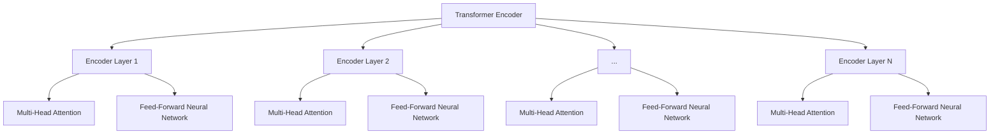
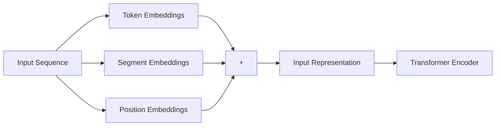

# 大语言模型原理与工程实践：Encoder 的代表：BERT

## 1. 背景介绍

在自然语言处理(NLP)领域,Transformer 模型因其出色的性能而备受关注。作为 Transformer 的一个重要分支,Bidirectional Encoder Representations from Transformers (BERT) 凭借其创新的预训练方法和双向编码器架构,成为语言模型领域的里程碑式进展。

BERT 于 2018 年由谷歌的 Jacob Devlin 等人提出,旨在通过大规模语料库的预训练,学习通用的语言表示。与传统的语言模型相比,BERT 采用了全新的预训练目标和架构设计,显著提高了下游 NLP 任务的性能表现。

### 1.1 传统语言模型的局限性

在 BERT 之前,大多数语言模型都是基于单向语言模型(Unidirectional Language Model)训练的,例如 Word2Vec、GloVe 和 ELMo 等。这些模型通过预测下一个词或者给定上文预测当前词,学习词向量表示。然而,这种单向建模方式存在一些固有的局限性:

1. **单向性**: 单向语言模型只能利用单侧的上下文信息,无法同时融合双向的上下文,从而限制了语义表示的质量。
2. **缺乏深层语义**: 传统语言模型主要关注词级别的表示,难以捕捉更深层次的语义和句法结构信息。
3. **预训练-微调不一致**: 预训练阶段的目标(如词预测)与下游任务的目标存在差异,导致预训练和微调之间存在一定的不一致性。

### 1.2 BERT 的创新之处

为了解决上述问题,BERT 提出了一种全新的预训练范式,主要创新点包括:

1. **双向编码器**: BERT 采用了 Transformer 的编码器架构,能够同时利用左右两侧的上下文信息,获得更丰富的语义表示。
2. **掩蔽语言模型(Masked Language Model, MLM)**: BERT 在预训练阶段引入了 MLM 任务,通过随机掩蔽部分词,并预测被掩蔽词的方式,学习深层次的双向语义表示。
3. **下一句预测(Next Sentence Prediction, NSP)**: BERT 还引入了 NSP 任务,用于捕捉句子之间的关系,提高模型对于上下文的理解能力。
4. **大规模语料库预训练**: BERT 在大规模通用语料库(如 Wikipedia 和 BookCorpus)上进行了预训练,使其能够学习到通用的语言知识。

凭借这些创新,BERT 在多个 NLP 任务上取得了当时的最佳性能,成为语言模型领域的里程碑式进展。

## 2. 核心概念与联系

### 2.1 Transformer 编码器架构

BERT 的核心架构是基于 Transformer 的编码器部分。Transformer 编码器由多个相同的编码器层堆叠而成,每个编码器层包含两个子层:多头自注意力(Multi-Head Attention)和前馈神经网络(Feed-Forward Neural Network)。

1. **多头自注意力层**:这一层允许每个单词注意力聚焦于与之相关的其他单词,捕捉输入序列中的长程依赖关系。
2. **前馈神经网络层**:这一层对每个单词的表示进行非线性变换,提取更高层次的特征。

通过堆叠多个这样的编码器层,Transformer 能够从输入序列中学习到丰富的上下文表示。

### 2.2 BERT 的输入表示

为了适应 BERT 的双向编码器架构,输入序列需要进行特殊的处理。BERT 将输入序列表示为三个embedding 的求和:

1. **Token Embeddings**: 对应每个词的embedding向量。
2. **Segment Embeddings**: 标识该词属于第一个句子还是第二个句子(用于 NSP 任务)。
3. **Position Embeddings**: 标识该词在序列中的位置信息。

通过这种方式,BERT 能够同时编码词的语义信息、句子级别的信息以及位置信息,为后续的预训练任务奠定基础。

### 2.3 预训练任务

BERT 在预训练阶段采用了两个主要的任务:掩蔽语言模型(MLM)和下一句预测(NSP)。

1. **掩蔽语言模型(MLM)**:在输入序列中随机选择 15% 的词,将它们用特殊的 [MASK] 标记替换。模型的目标是基于剩余的上下文,预测被掩蔽词的原始词汇。这一任务迫使模型学习双向的语义表示。

2. **下一句预测(NSP)**:为了捕捉句子之间的关系,BERT 会将一对句子作为输入,其中 50% 的时候第二个句子是第一个句子的下一句,另外 50% 则是随机选择的句子。模型需要预测这两个句子是否为连续的句子对。

通过这两个预训练任务,BERT 能够同时学习词级别和句子级别的语义表示,为下游的 NLP 任务奠定坚实的基础。

## 3. 核心算法原理具体操作步骤 

### 3.1 BERT 预训练流程

BERT 的预训练过程包括以下几个主要步骤:

1. **数据预处理**:从原始语料库(如 Wikipedia 和 BookCorpus)中提取出大量的句子对,构建预训练数据集。

2. **输入表示**:将每个句子对转换为 BERT 可接受的输入表示,包括 Token Embeddings、Segment Embeddings 和 Position Embeddings。

3. **掩蔽处理**:在每个输入序列中随机选择 15% 的词,使用 [MASK] 标记替换它们,用于 MLM 任务。

4. **NSP 标签**:为每个句子对生成一个二元标签,表示它们是否为连续的句子对,用于 NSP 任务。

5. **前向传播**:将输入表示输入到 BERT 的 Transformer 编码器中,计算 MLM 和 NSP 任务的预测结果。

6. **损失计算**:计算 MLM 和 NSP 任务的损失函数,如交叉熵损失。

7. **模型优化**:使用优化算法(如 Adam)基于损失函数更新 BERT 模型的参数。

8. **迭代训练**:重复执行上述步骤,直到模型在验证集上的性能不再提升为止。

通过大规模的预训练语料和上述预训练任务,BERT 能够学习到通用的语言表示,为后续的下游任务提供强大的迁移学习能力。

### 3.2 BERT 微调流程

在完成预训练后,BERT 可以通过微调(Fine-tuning)的方式,将预训练得到的语言表示知识迁移到具体的下游 NLP 任务中。微调过程包括以下步骤:

1. **数据准备**:准备下游任务的训练数据和测试数据,并进行必要的预处理。

2. **输入表示**:将下游任务的输入数据转换为 BERT 可接受的输入表示。

3. **任务特定头部**:根据下游任务的性质,在 BERT 的输出层之上添加一个特定的头部(Head),用于生成任务所需的输出(如分类、序列标注等)。

4. **微调训练**:使用下游任务的训练数据,对 BERT 模型(包括预训练部分和任务特定头部)进行端到端的微调训练。在这个过程中,BERT 的大部分参数会被冻结,只有最后几层的参数会被更新。

5. **模型评估**:在测试数据集上评估微调后模型的性能,并根据需要进行超参数调整。

6. **模型部署**:将微调好的 BERT 模型部署到实际的应用系统中,用于处理新的输入数据。

通过微调的方式,BERT 能够将预训练得到的通用语言表示知识迁移到特定的下游任务中,显著提升了任务性能。同时,由于大部分参数在微调时被冻结,这种方式也大大减少了微调所需的计算资源和数据量。

## 4. 数学模型和公式详细讲解举例说明

### 4.1 Transformer 的自注意力机制

BERT 的核心架构是基于 Transformer 的编码器部分,其中自注意力机制是 Transformer 的关键组成部分。自注意力机制允许每个单词注意力聚焦于与之相关的其他单词,捕捉输入序列中的长程依赖关系。

给定一个长度为 $n$ 的输入序列 $X = (x_1, x_2, \dots, x_n)$,自注意力机制的计算过程如下:

1. **线性投影**:将输入序列 $X$ 分别投影到查询(Query)、键(Key)和值(Value)的向量空间中,得到 $Q$、$K$ 和 $V$:

$$Q = XW^Q, K = XW^K, V = XW^V$$

其中 $W^Q$、$W^K$ 和 $W^V$ 是可学习的权重矩阵。

2. **计算注意力分数**:计算查询 $Q$ 和键 $K$ 之间的点积,得到注意力分数矩阵 $S$:

$$S = QK^T$$

3. **缩放和软最大化**:对注意力分数矩阵 $S$ 进行缩放和软最大化操作,得到注意力权重矩阵 $A$:

$$A = \text{softmax}(\frac{S}{\sqrt{d_k}})$$

其中 $d_k$ 是键向量的维度,缩放操作可以避免梯度爆炸或消失的问题。

4. **加权求和**:使用注意力权重矩阵 $A$ 对值向量 $V$ 进行加权求和,得到输出表示 $O$:

$$O = AV$$

通过上述步骤,自注意力机制能够自适应地捕捉输入序列中任意两个单词之间的依赖关系,从而学习到更丰富的上下文表示。

### 4.2 多头自注意力

为了进一步提高表示能力,Transformer 采用了多头自注意力(Multi-Head Attention)机制。多头自注意力将输入序列投影到多个子空间中,分别计算自注意力,然后将这些子空间的注意力输出进行拼接,捕捉不同子空间的信息。

具体来说,给定一个输入序列 $X$,多头自注意力的计算过程如下:

1. **线性投影**:将输入序列 $X$ 分别投影到 $h$ 个子空间中,得到查询、键和值向量:

$$\begin{aligned}
Q_i &= XW_i^Q, & i &= 1, \dots, h \\
K_i &= XW_i^K, & i &= 1, \dots, h \\
V_i &= XW_i^V, & i &= 1, \dots, h
\end{aligned}$$

其中 $W_i^Q$、$W_i^K$ 和 $W_i^V$ 是对应第 $i$ 个子空间的可学习权重矩阵。

2. **计算自注意力**:对每个子空间,分别计算自注意力输出 $O_i$:

$$O_i = \text{Attention}(Q_i, K_i, V_i)$$

其中 $\text{Attention}(\cdot)$ 表示前面介绍的自注意力计算过程。

3. **拼接输出**:将所有子空间的自注意力输出 $O_i$ 沿着特征维度进行拼接,得到多头自注意力的最终输出 $O$:

$$O = \text{Concat}(O_1, O_2, \dots, O_h)W^O$$

其中 $W^O$ 是一个可学习的权重矩阵,用于将拼接后的向量投影到期