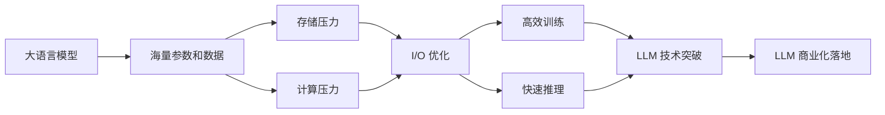

# 大语言模型原理与工程实践：I/O 优化

## 1. 背景介绍

### 1.1 大语言模型的兴起与应用

近年来,随着深度学习技术的飞速发展,大语言模型(Large Language Model, LLM)在自然语言处理领域取得了突破性的进展。从 GPT 到 BERT,再到最新的 GPT-3、PaLM 等模型,LLM 展现出了惊人的语言理解和生成能力,在机器翻译、问答系统、文本摘要等任务上取得了超越人类的表现。LLM 的出现,标志着人工智能正在向通用人工智能(Artificial General Intelligence, AGI)迈进。

### 1.2 大语言模型面临的挑战

尽管 LLM 取得了瞩目的成就,但它们在训练和推理过程中也面临着巨大的挑战。最突出的问题之一就是海量的数据 I/O 和计算资源消耗。以 GPT-3 为例,它拥有惊人的 1750 亿参数,训练数据量高达 45TB。如此庞大的模型参数和训练数据,对存储和 I/O 性能提出了极高的要求。此外,在推理阶段,LLM 需要实时处理用户的请求并生成响应,这对 I/O 和计算的延迟也提出了严苛的要求。

### 1.3 I/O 优化的重要性

为了应对 LLM 带来的存储和计算压力,I/O 优化成为了大语言模型工程实践中的关键一环。高效的 I/O 可以显著加速模型的训练和推理速度,节省宝贵的计算资源,提升用户体验。同时,I/O 优化也是实现 LLM 商业化落地的必由之路。只有建立高性能、低成本的 LLM 训练和服务平台,才能推动 LLM 技术在更广泛的领域得到应用。

## 2. 核心概念与联系

### 2.1 大语言模型的核心概念

- Transformer 架构:LLM 的核心骨架,采用 Self-Attention 机制来捕捉长距离的语义依赖。
- Pre-training:在大规模无标注语料上进行自监督学习,让模型学习到语言的通用表征。 
- Fine-tuning:在下游任务的标注数据上微调预训练模型,使其适应特定任务。
- Zero-shot/Few-shot Learning:利用预训练模型强大的语言理解能力,在没有或很少训练数据的情况下完成任务。

### 2.2 I/O 优化的核心概念 

- 数据存储:将训练语料、模型参数等数据高效地存储,需要权衡存储容量、读写速度、成本等因素。
- 数据读取:高效读取训练数据并加载到内存或显存中,需要优化数据格式、批处理、多线程等。
- 数据预处理:将原始语料转换为模型可以直接使用的数值化张量,需要优化文本编码、词表构建等。
- 参数加载与更新:将模型参数加载到显存,并在训练过程中高效地更新梯度,需要优化参数分片、梯度压缩等。
- 推理加速:在线实时地对用户请求进行处理并生成回复,需要优化模型量化、剪枝、蒸馏等。

### 2.3 LLM 与 I/O 优化的关系

从上图可以看出,I/O 优化是连接 LLM 技术突破和商业化落地的关键纽带。高效的 I/O 可以缓解 LLM 海量参数和数据带来的存储和计算压力,加速模型训练和推理,最终推动 LLM 技术在更广阔的领域发挥价值。可以说,I/O 优化已经成为 LLM 工程实践中不可或缺的一部分。

## 3. 核心算法原理与具体操作步骤

### 3.1 数据存储优化

#### 3.1.1 分布式存储

- 将大规模语料和模型参数分布存储在多个节点,提升存储容量和 I/O 吞吐。
- 常见的分布式存储系统有 HDFS、Ceph、AWS S3 等。
- 操作步骤:
    1. 搭建分布式存储集群,配置存储节点和元数据节点。
    2. 将数据上传到分布式文件系统,设置合适的分块大小和副本数。
    3. 使用分布式存储的 API 读写数据,如 HDFS 的 Java API。

#### 3.1.2 列式存储

- 相比行式存储,列式存储可以更高效地压缩数据,加快查询速度。
- 适合存储稀疏的高维数据,如词向量、稀疏 Attention 矩阵等。
- 常见的列式存储格式有 Parquet、ORC 等。
- 操作步骤:
    1. 将数据转换为列式存储格式,如使用 Spark 的 DataFrame 写入 Parquet。
    2. 使用列式存储的 API 读取数据,如 PyArrow 读取 Parquet。
    3. 对读取的列数据进行批处理,转换为模型需要的张量格式。

### 3.2 数据读取优化

#### 3.2.1 多线程读取

- 使用多线程并发读取数据,充分利用 I/O 带宽,提升数据读取速度。
- 需要注意线程安全和负载均衡问题。
- 操作步骤:
    1. 将数据划分为多个分片,每个线程负责读取一部分。
    2. 创建多个读取线程,分别读取分配到的数据分片。
    3. 将读取的数据放入线程安全的队列,供模型训练使用。

#### 3.2.2 预取和缓存

- 在训练过程中,预先异步读取下一个 batch 的数据,减少 I/O 等待时间。
- 将频繁使用的数据缓存到内存或显存,加快读取速度。
- 操作步骤:
    1. 创建数据读取器,实现异步预取下一个 batch 的逻辑。
    2. 在读取数据时,先检查缓存中是否已存在,如果存在则直接返回。
    3. 如果缓存未命中,则从磁盘读取数据,并更新缓存。

### 3.3 数据预处理优化

#### 3.3.1 文本编码

- 将文本转换为数值化的 token ID,可以采用字典编码或 Byte Pair Encoding (BPE) 等方法。
- 选择合适的词表大小,权衡词汇覆盖率和模型参数量。
- 操作步骤:
    1. 在大规模语料上训练 BPE 或其他编码器,得到词表和编码规则。
    2. 对训练数据进行编码,将文本转换为 token ID 序列。
    3. 对 token ID 序列进行填充或截断,使其长度统一。

#### 3.3.2 数据增强

- 通过数据增强扩充训练数据,提升模型泛化能力,如替换同义词、调整语序等。
- 数据增强可以在文本级别或 token 级别进行。
- 操作步骤:
    1. 对文本数据进行清洗和标准化,如去除特殊字符、统一大小写等。
    2. 定义数据增强规则,如随机替换、插入、删除等。
    3. 对每条数据进行增强操作,生成新的训练样本。

### 3.4 参数加载与更新优化

#### 3.4.1 参数分片

- 将超大模型的参数划分为多个分片,分布存储在多个 GPU 或节点。
- 在训练过程中,每个 GPU 只加载和更新自己负责的参数分片。
- 操作步骤:
    1. 定义参数分片方案,如按层划分、按 Tensor 行/列划分等。
    2. 在每个 GPU 上创建参数分片,只加载分配到的部分。
    3. 在前向传播和反向传播中,只计算和更新本地的参数分片。

#### 3.4.2 梯度压缩

- 在分布式训练中,将梯度压缩后再进行通信,减少网络带宽占用。
- 常见的梯度压缩方法有量化、稀疏化、TopK 等。
- 操作步骤:
    1. 在每个 GPU 上计算参数的梯度。
    2. 对梯度进行压缩,如量化为 INT8、只保留 Top-K 大的梯度等。
    3. 将压缩后的梯度通过网络发送给其他 GPU 或参数服务器。
    4. 在服务器端对梯度进行解压缩和聚合,更新全局参数。

### 3.5 推理加速优化

#### 3.5.1 模型量化

- 将模型参数从 FP32 量化为 INT8 或 FP16,减少存储和计算开销。
- 在推理过程中,可以使用量化后的模型进行加速。
- 操作步骤:
    1. 在训练过程中,记录参数的量化范围,如最大值、最小值等。
    2. 对模型参数进行量化,如将 FP32 转换为 INT8。
    3. 在推理时,使用量化后的模型和相应的量化算子进行计算。

#### 3.5.2 模型剪枝

- 将模型中不重要的参数或连接剪除,降低模型复杂度。
- 可以采用基于重要性的剪枝、基于正则化的剪枝等方法。
- 操作步骤:
    1. 定义剪枝标准,如基于参数绝对值大小、基于梯度等。
    2. 在训练过程中,根据剪枝标准对参数进行掩码或直接置零。
    3. 对剪枝后的模型进行微调,恢复部分性能损失。
    4. 在推理时,使用剪枝后的稀疏模型进行加速。

## 4. 数学模型和公式详细讲解举例说明

### 4.1 Transformer 架构的数学原理

Transformer 是 LLM 的核心骨架,其关键在于 Self-Attention 机制。对于输入序列 $X=[x_1, x_2, ..., x_n]$,Self-Attention 的计算过程如下:

1. 计算 Query、Key、Value 矩阵:

$$
\begin{aligned}
Q &= X W_Q \\
K &= X W_K \\
V &= X W_V
\end{aligned}
$$

其中 $W_Q, W_K, W_V$ 是可学习的参数矩阵。

2. 计算 Attention 权重:

$$
A = \text{softmax}(\frac{QK^T}{\sqrt{d_k}})
$$

其中 $d_k$ 是 Key 向量的维度,用于缩放点积结果。

3. 计算 Attention 输出:

$$
\text{Attention}(Q,K,V) = AV
$$

通过 Self-Attention,模型可以捕捉序列内任意位置之间的依赖关系,克服了 RNN 难以建模长距离依赖的问题。

### 4.2 Byte Pair Encoding 的数学原理

BPE 是一种基于频率的子词编码方法,可以在有限的词表大小下覆盖更多的词汇。其核心思想是反复合并频率最高的相邻字节对,直到达到预设的词表大小。

具体算法如下:

1. 将所有单个字符加入初始词表。

2. 统计每一对相邻字节的出现频率,选择频率最高的字节对 $(x,y)$。

3. 将所有出现的 $(x,y)$ 合并为新的子词 $xy$,加入词表。

4. 重复步骤 2-3,直到达到预设的词表大小或无法继续合并。

举例说明:

假设我们有一个文本语料:"low lower lowest newer wider"。

初始词表为:['l', 'o', 'w', 'e', 'r', 's', 't', 'n', 'i', 'd']。

第一轮迭代,频率最高的字节对是 ('e', 'r'),合并为 'er',得到新词表:
['l', 'o', 'w', 'e', 'r', 's', 't', 'n', 'i', 'd', 'er']。