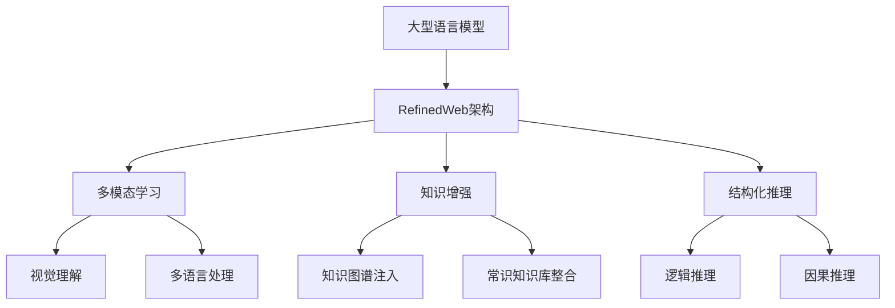

# 大语言模型原理与工程实践：RefinedWeb

## 1.背景介绍

近年来,大型语言模型(Large Language Models, LLMs)在自然语言处理领域取得了令人瞩目的成就。这些模型通过在海量文本语料上进行预训练,学习了丰富的语言知识和上下文信息,从而在下游任务中表现出惊人的泛化能力。

随着计算能力和数据量的不断增长,LLMs的规模也在不断扩大。以GPT-3为代表的百亿参数级别的大型语言模型,展现了强大的文本生成、理解和推理能力,在多项自然语言处理任务中取得了人类水平的表现。然而,这些模型也面临着一些挑战,例如需要大量计算资源、存在潜在的偏见风险、缺乏可解释性等。

为了解决这些问题,RefinedWeb被提出,旨在通过精细化调优和结构化知识注入,提高大型语言模型的性能、可解释性和可控性。RefinedWeb是一种创新的大型语言模型架构,融合了多模态学习、知识增强和结构化推理等技术,为构建更加高效、可靠和可解释的人工智能系统奠定了基础。

## 2.核心概念与联系

### 2.1 大型语言模型(LLMs)

大型语言模型是一种基于transformer架构的深度神经网络模型,通过在大规模文本语料上进行自监督预训练,学习丰富的语言表示。这些模型具有极大的参数容量,能够捕捉复杂的语义和上下文信息,在下游任务中表现出强大的泛化能力。

典型的大型语言模型包括GPT(Generative Pre-trained Transformer)、BERT(Bidirectional Encoder Representations from Transformers)等。这些模型在自然语言生成、理解和推理等任务中取得了卓越的成绩,但也存在一些局限性,如需要大量计算资源、缺乏可解释性和可控性等。

### 2.2 RefinedWeb架构

RefinedWeb是一种创新的大型语言模型架构,旨在通过精细化调优和结构化知识注入,提高模型的性能、可解释性和可控性。它融合了多模态学习、知识增强和结构化推理等技术,为构建更加高效、可靠和可解释的人工智能系统奠定了基础。

RefinedWeb架构包括以下三个核心组件:

1. **多模态学习**:通过融合视觉、语音等多种模态信息,提高模型对多模态数据的理解能力,实现更加自然和人性化的交互。

2. **知识增强**:将结构化知识(如知识图谱、常识知识库等)注入到语言模型中,丰富模型的知识表示,提高模型的推理和解释能力。

3. **结构化推理**:引入逻辑推理、因果推理等结构化推理机制,增强模型的推理能力,提高模型对复杂问题的理解和解决能力。

通过这三个核心组件的有机结合,RefinedWeb架构旨在构建更加智能、可靠和可解释的人工智能系统,为各种复杂任务提供强大的语言理解和推理能力。

## 3.核心算法原理具体操作步骤

RefinedWeb架构的核心算法原理包括三个主要部分:多模态学习、知识增强和结构化推理。下面将详细介绍每个部分的具体操作步骤。

### 3.1 多模态学习

多模态学习旨在融合来自不同模态(如文本、图像、视频等)的信息,提高模型对多模态数据的理解能力。其具体操作步骤如下:

1. **模态编码**:将不同模态的输入数据(如文本、图像等)转换为相应的特征向量表示。常用的编码方式包括BERT编码器(用于文本)、ResNet编码器(用于图像)等。

2. **模态融合**:将不同模态的特征向量通过融合机制(如注意力机制、门控机制等)进行融合,得到一个多模态表示向量。

3. **多头注意力**:使用多头注意力机制捕捉不同模态之间的交互关系,进一步提高多模态表示的质量。

4. **预训练**:在大规模多模态数据集上进行自监督预训练,使模型学习到不同模态之间的关联和映射关系。

5. **微调**:在下游任务上对预训练模型进行微调,使其适应特定的多模态任务,如视觉问答、图像描述等。

通过多模态学习,RefinedWeb架构能够有效地融合不同模态的信息,提高模型对多模态数据的理解能力,实现更加自然和人性化的交互。

### 3.2 知识增强

知识增强旨在将结构化知识(如知识图谱、常识知识库等)注入到语言模型中,丰富模型的知识表示,提高模型的推理和解释能力。其具体操作步骤如下:

1. **知识表示**:将结构化知识(如知识图谱、常识知识库等)转换为适合语言模型处理的表示形式,如知识嵌入向量、知识三元组等。

2. **知识注入**:将知识表示注入到语言模型的不同层次,如嵌入层、注意力层、前馈层等。常用的注入方式包括知识注意力、知识门控等。

3. **知识融合**:通过注意力机制或门控机制,将语言模型的原始表示和知识表示进行融合,得到知识增强的表示。

4. **预训练**:在大规模文本语料和知识库上进行自监督预训练,使模型学习到语言和知识之间的关联。

5. **微调**:在下游任务上对预训练模型进行微调,使其适应特定的知识驱动任务,如知识问答、事实验证等。

通过知识增强,RefinedWeb架构能够将结构化知识注入到语言模型中,丰富模型的知识表示,提高模型的推理和解释能力,为构建更加智能和可解释的人工智能系统奠定了基础。

### 3.3 结构化推理

结构化推理旨在引入逻辑推理、因果推理等结构化推理机制,增强模型的推理能力,提高模型对复杂问题的理解和解决能力。其具体操作步骤如下:

1. **推理模块设计**:设计适合不同推理任务的推理模块,如逻辑推理模块、因果推理模块等。这些模块可以基于神经符号模型、图神经网络等技术实现。

2. **推理模块集成**:将设计好的推理模块与语言模型进行集成,形成端到端的结构化推理模型。常用的集成方式包括序列到序列学习、多任务学习等。

3. **推理约束**:引入推理约束,如逻辑规则、因果关系等,指导模型进行合理的推理过程。

4. **预训练**:在大规模推理数据集上进行自监督预训练,使模型学习到推理规律和策略。

5. **微调**:在下游任务上对预训练模型进行微调,使其适应特定的推理任务,如阅读理解、问答系统等。

通过结构化推理,RefinedWeb架构能够引入逻辑推理、因果推理等结构化推理机制,增强模型的推理能力,提高模型对复杂问题的理解和解决能力,为构建更加智能和可靠的人工智能系统奠定了基础。

## 4.数学模型和公式详细讲解举例说明

在RefinedWeb架构中,数学模型和公式扮演着重要的角色,为多模态学习、知识增强和结构化推理等核心组件提供了理论基础和计算支持。下面将详细介绍一些关键的数学模型和公式。

### 4.1 多头注意力机制

多头注意力机制是transformer架构的核心组件,它能够有效地捕捉输入序列中的长程依赖关系,对于建模复杂的语义和上下文信息至关重要。

对于一个查询向量 $\boldsymbol{q}$、键向量 $\boldsymbol{K}$ 和值向量 $\boldsymbol{V}$,多头注意力机制的计算过程如下:

$$\begin{aligned}
\text{MultiHead}(\boldsymbol{q}, \boldsymbol{K}, \boldsymbol{V}) &= \text{Concat}(\text{head}_1, \text{head}_2, \ldots, \text{head}_h) \boldsymbol{W}^O\\
\text{where}\quad \text{head}_i &= \text{Attention}(\boldsymbol{q}\boldsymbol{W}_i^Q, \boldsymbol{K}\boldsymbol{W}_i^K, \boldsymbol{V}\boldsymbol{W}_i^V)
\end{aligned}$$

其中 $\boldsymbol{W}_i^Q$、$\boldsymbol{W}_i^K$、$\boldsymbol{W}_i^V$ 和 $\boldsymbol{W}^O$ 是可学习的线性变换矩阵。注意力分数计算如下:

$$\text{Attention}(\boldsymbol{Q}, \boldsymbol{K}, \boldsymbol{V}) = \text{softmax}\left(\frac{\boldsymbol{Q}\boldsymbol{K}^\top}{\sqrt{d_k}}\right)\boldsymbol{V}$$

其中 $d_k$ 是键向量的维度,用于缩放点积注意力分数。

多头注意力机制能够从不同的子空间捕捉不同的注意力模式,提高了模型的表示能力和泛化性能。

### 4.2 知识注意力机制

知识注意力机制是一种将结构化知识注入到语言模型中的有效方法。它通过计算语言表示和知识表示之间的注意力分数,实现了知识的选择性融合。

对于一个语言表示向量 $\boldsymbol{h}$ 和一组知识表示向量 $\{\boldsymbol{k}_1, \boldsymbol{k}_2, \ldots, \boldsymbol{k}_n\}$,知识注意力机制的计算过程如下:

$$\begin{aligned}
\boldsymbol{a} &= \text{softmax}(\boldsymbol{h}^\top\boldsymbol{W}^K\boldsymbol{K})\\
\boldsymbol{c} &= \sum_{i=1}^n a_i\boldsymbol{k}_i\\
\boldsymbol{h}^\prime &= \text{FFN}(\boldsymbol{h}, \boldsymbol{c})
\end{aligned}$$

其中 $\boldsymbol{W}^K$ 是可学习的线性变换矩阵,用于将知识表示映射到注意力空间。$\boldsymbol{a}$ 是注意力分数向量,表示语言表示对每个知识表示的关注程度。$\boldsymbol{c}$ 是加权求和后的知识上下文向量,与原始语言表示 $\boldsymbol{h}$ 一起送入前馈神经网络 FFN,得到知识增强的表示 $\boldsymbol{h}^\prime$。

通过知识注意力机制,RefinedWeb架构能够选择性地融合相关知识,提高模型的推理和解释能力。

### 4.3 逻辑推理模块

逻辑推理模块是RefinedWeb架构中结构化推理组件的一个重要部分,它基于神经符号模型,能够执行符合逻辑规则的推理过程。

假设有一组逻辑规则 $\mathcal{R} = \{r_1, r_2, \ldots, r_m\}$ 和一组事实陈述 $\mathcal{F} = \{f_1, f_2, \ldots, f_n\}$,逻辑推理模块的目标是根据规则和事实推导出一个新的逻辑表达式 $q$。

首先,将逻辑规则和事实陈述编码为分布式表示:

$$\begin{aligned}
\boldsymbol{r}_i &= \text{Encoder}(r_i)\\
\boldsymbol{f}_j &= \text{Encoder}(f_j)
\end{aligned}$$

然后,通过神经推理网络进行逻辑推理:

$$\boldsymbol{q} = \text{NeuralReasoner}(\{\boldsymbol{r}_1, \boldsymbol{r}_2,