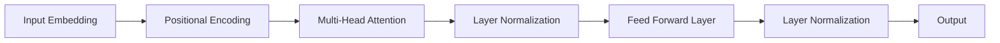

# 大语言模型原理与工程实践：前馈神经网络

## 1. 背景介绍
### 1.1 大语言模型的兴起
近年来，随着深度学习技术的快速发展，自然语言处理(NLP)领域取得了令人瞩目的进展。其中，大语言模型(Large Language Model, LLM)的出现，更是掀起了NLP领域的一场革命。LLM 能够从海量文本数据中学习语言的统计规律和语义知识，并应用于各种 NLP 任务，如机器翻译、问答系统、文本生成等，大大提升了这些任务的性能表现。

### 1.2 前馈神经网络的重要性
在众多的神经网络架构中，前馈神经网络(Feed-forward Neural Network, FNN)是一种最基础也最重要的网络结构。FNN 由输入层、隐藏层和输出层组成，信息沿着一个方向从输入层传递到输出层，期间没有反馈回路。尽管结构简单，但 FNN 具有强大的非线性表达能力，是构建复杂神经网络模型的基石。在 LLM 中，FNN 通常作为 Transformer 编码器的组成部分，在特征提取和信息传递中发挥着关键作用。

### 1.3 本文的主要内容
本文将重点探讨前馈神经网络在大语言模型中的原理和实践。我们首先介绍 FNN 的核心概念和网络结构，然后深入分析其数学原理和前向传播、反向传播算法。接着，我们通过代码实例详细讲解如何使用 PyTorch 实现 FNN，并讨论在 LLM 中的具体应用。最后，我们总结 FNN 的发展趋势与面临的挑战，并提供一些常见问题的解答。

## 2. 核心概念与联系
### 2.1 人工神经元
FNN 的基本组成单元是人工神经元(Artificial Neuron)，它模拟了生物神经元的信息处理过程。一个人工神经元接收多个输入信号，对它们进行加权求和，然后通过激活函数产生输出信号。常见的激活函数有 Sigmoid、Tanh、ReLU 等。

### 2.2 网络结构
FNN 由多个人工神经元按层组织而成。第一层为输入层，最后一层为输出层，中间可以有一个或多个隐藏层。每一层的神经元与相邻层的所有神经元相连，但同一层内的神经元之间没有连接。网络的连接权重决定了信息在网络中的传递和变换方式。

### 2.3 前向传播与反向传播
FNN 的训练过程包括前向传播和反向传播两个阶段。在前向传播中，输入信号沿着网络逐层传递，最终产生输出。在反向传播中，根据输出误差计算损失函数，并利用梯度下降法更新网络权重，使网络输出尽可能接近期望输出。通过多次迭代，网络逐渐学习到输入到输出的映射关系。

### 2.4 FNN 与 LLM 的关系
在 Transformer 架构的 LLM 中，FNN 主要用于以下两个部分：
1. 位置编码(Positional Encoding)：将词嵌入与位置编码相加，再通过 FNN 映射到更高维度的特征空间。
2. 前馈层(Feed Forward Layer)：在多头注意力机制之后，使用 FNN 对特征进行非线性变换，提取高层语义信息。

下图展示了 FNN 在 Transformer 编码器中的位置和作用：



## 3. 核心算法原理具体操作步骤
### 3.1 前向传播
FNN 的前向传播过程可以分为以下步骤：
1. 输入层接收输入特征向量 $\mathbf{x}$。
2. 对于第 $l$ 层的第 $i$ 个神经元，计算加权输入：$z_i^{(l)} = \sum_{j} w_{ij}^{(l)} a_j^{(l-1)} + b_i^{(l)}$，其中 $w_{ij}^{(l)}$ 是第 $l-1$ 层第 $j$ 个神经元到第 $l$ 层第 $i$ 个神经元的连接权重，$b_i^{(l)}$ 是第 $l$ 层第 $i$ 个神经元的偏置项，$a_j^{(l-1)}$ 是第 $l-1$ 层第 $j$ 个神经元的激活值。
3. 将加权输入通过激活函数 $\sigma$，得到第 $l$ 层第 $i$ 个神经元的激活值：$a_i^{(l)} = \sigma(z_i^{(l)})$。
4. 重复步骤 2 和 3，直到计算出输出层的激活值。

### 3.2 反向传播
反向传播算法利用链式法则计算损失函数对网络权重的梯度，并用梯度下降法更新权重。具体步骤如下：
1. 计算输出层的误差项：$\delta_i^{(L)} = \frac{\partial C}{\partial a_i^{(L)}} \sigma'(z_i^{(L)})$，其中 $C$ 是损失函数，$L$ 是网络的层数。
2. 对于第 $l$ 层的第 $i$ 个神经元，计算误差项：$\delta_i^{(l)} = (\sum_{j} w_{ji}^{(l+1)} \delta_j^{(l+1)}) \sigma'(z_i^{(l)})$。
3. 计算第 $l$ 层第 $i$ 个神经元的偏置项梯度：$\frac{\partial C}{\partial b_i^{(l)}} = \delta_i^{(l)}$。
4. 计算第 $l-1$ 层第 $j$ 个神经元到第 $l$ 层第 $i$ 个神经元的权重梯度：$\frac{\partial C}{\partial w_{ij}^{(l)}} = a_j^{(l-1)} \delta_i^{(l)}$。 
5. 重复步骤 2 到 4，直到计算出所有权重和偏置项的梯度。
6. 使用梯度下降法更新权重和偏置项：$w_{ij}^{(l)} := w_{ij}^{(l)} - \alpha \frac{\partial C}{\partial w_{ij}^{(l)}}$，$b_i^{(l)} := b_i^{(l)} - \alpha \frac{\partial C}{\partial b_i^{(l)}}$，其中 $\alpha$ 是学习率。

## 4. 数学模型和公式详细讲解举例说明
### 4.1 前向传播的矩阵形式
为了提高计算效率，我们通常使用矩阵运算来实现前向传播。假设第 $l$ 层有 $n_l$ 个神经元，第 $l-1$ 层有 $n_{l-1}$ 个神经元，令 $\mathbf{W}^{(l)}$ 为 $n_l \times n_{l-1}$ 的权重矩阵，$\mathbf{b}^{(l)}$ 为 $n_l$ 维的偏置向量，$\mathbf{a}^{(l-1)}$ 为第 $l-1$ 层的激活值向量，则第 $l$ 层的加权输入可以表示为：

$$\mathbf{z}^{(l)} = \mathbf{W}^{(l)} \mathbf{a}^{(l-1)} + \mathbf{b}^{(l)}$$

第 $l$ 层的激活值为：

$$\mathbf{a}^{(l)} = \sigma(\mathbf{z}^{(l)})$$

其中 $\sigma$ 是逐元素应用的激活函数。

### 4.2 反向传播的矩阵形式
类似地，我们可以将反向传播的计算也表示为矩阵形式。令 $\boldsymbol{\delta}^{(l)}$ 为第 $l$ 层的误差项向量，则有：

$$\boldsymbol{\delta}^{(L)} = \nabla_{\mathbf{a}^{(L)}} C \odot \sigma'(\mathbf{z}^{(L)})$$

$$\boldsymbol{\delta}^{(l)} = ((\mathbf{W}^{(l+1)})^T \boldsymbol{\delta}^{(l+1)}) \odot \sigma'(\mathbf{z}^{(l)})$$

其中 $\odot$ 表示 Hadamard 积(逐元素相乘)，$\nabla_{\mathbf{a}^{(L)}} C$ 是损失函数对输出层激活值的梯度。

权重和偏置项的梯度可以表示为：

$$\frac{\partial C}{\partial \mathbf{b}^{(l)}} = \boldsymbol{\delta}^{(l)}$$

$$\frac{\partial C}{\partial \mathbf{W}^{(l)}} = \boldsymbol{\delta}^{(l)} (\mathbf{a}^{(l-1)})^T$$

### 4.3 举例说明
考虑一个简单的三层 FNN，输入层有 2 个神经元，隐藏层有 3 个神经元，输出层有 1 个神经元。假设输入为 $\mathbf{x} = [x_1, x_2]^T$，期望输出为 $y$，损失函数为均方误差 $C = \frac{1}{2}(a^{(3)} - y)^2$。

在前向传播中，我们依次计算：

$$\mathbf{z}^{(1)} = \mathbf{W}^{(1)} \mathbf{x} + \mathbf{b}^{(1)}$$
$$\mathbf{a}^{(1)} = \sigma(\mathbf{z}^{(1)})$$
$$\mathbf{z}^{(2)} = \mathbf{W}^{(2)} \mathbf{a}^{(1)} + \mathbf{b}^{(2)}$$
$$\mathbf{a}^{(2)} = \sigma(\mathbf{z}^{(2)})$$
$$z^{(3)} = \mathbf{w}^{(3)} \mathbf{a}^{(2)} + b^{(3)}$$
$$a^{(3)} = \sigma(z^{(3)})$$

在反向传播中，我们依次计算：

$$\delta^{(3)} = (a^{(3)} - y) \sigma'(z^{(3)})$$
$$\boldsymbol{\delta}^{(2)} = ((\mathbf{w}^{(3)})^T \delta^{(3)}) \odot \sigma'(\mathbf{z}^{(2)})$$
$$\boldsymbol{\delta}^{(1)} = ((\mathbf{W}^{(2)})^T \boldsymbol{\delta}^{(2)}) \odot \sigma'(\mathbf{z}^{(1)})$$

然后更新权重和偏置项：

$$\mathbf{W}^{(1)} := \mathbf{W}^{(1)} - \alpha \boldsymbol{\delta}^{(1)} \mathbf{x}^T$$
$$\mathbf{b}^{(1)} := \mathbf{b}^{(1)} - \alpha \boldsymbol{\delta}^{(1)}$$
$$\mathbf{W}^{(2)} := \mathbf{W}^{(2)} - \alpha \boldsymbol{\delta}^{(2)} (\mathbf{a}^{(1)})^T$$
$$\mathbf{b}^{(2)} := \mathbf{b}^{(2)} - \alpha \boldsymbol{\delta}^{(2)}$$
$$\mathbf{w}^{(3)} := \mathbf{w}^{(3)} - \alpha \delta^{(3)} (\mathbf{a}^{(2)})^T$$
$$b^{(3)} := b^{(3)} - \alpha \delta^{(3)}$$

## 5. 项目实践：代码实例和详细解释说明
下面我们使用 PyTorch 实现一个简单的 FNN，并应用于手写数字识别任务。

### 5.1 定义网络结构
```python
import torch
import torch.nn as nn

class FNN(nn.Module):
    def __init__(self, input_size, hidden_size, output_size):
        super(FNN, self).__init__()
        self.hidden = nn.Linear(input_size, hidden_size) 
        self.output = nn.Linear(hidden_size, output_size)
        
    def forward(self, x):
        x = torch.relu(self.hidden(x))
        x = self.output(x)
        return x
```

这里我们定义了一个两层的 FNN，包含一个隐藏层和一个输出层。`nn.Linear` 表示全连接层，`torch.relu` 是 ReLU 激活函数。`forward` 方法定义了前向传播的过程。

### 5.2 准备数据集
```python
from torchvision import datasets, transforms

train_dataset = datasets.MNIST(root='./data', train=True, transform=transforms