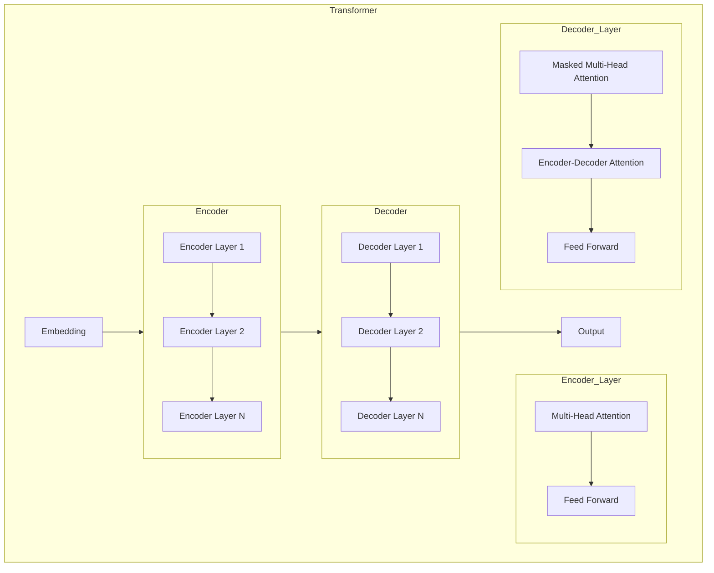

# 大语言模型原理与工程实践：基于上下文学习的推理策略

## 1.背景介绍

### 1.1 大语言模型的兴起

近年来,大型语言模型(Large Language Models, LLMs)在自然语言处理领域取得了令人瞩目的成就。这些模型通过在海量文本数据上进行预训练,学习了丰富的语言知识和上下文信息,从而在下游任务中展现出强大的泛化能力。

代表性的大语言模型包括:

- GPT(Generative Pre-trained Transformer)系列模型
- BERT(Bidirectional Encoder Representations from Transformers)
- XLNet
- RoBERTa
- ALBERT
- T5(Text-to-Text Transfer Transformer)

这些模型通过自监督学习和迁移学习的方式,在自然语言理解、生成、推理等多个领域展现出卓越的性能。

### 1.2 大语言模型的挑战

尽管取得了令人鼓舞的进展,但大语言模型仍然面临着一些重大挑战:

- **数据质量**:预训练数据的质量和多样性直接影响模型的泛化能力。
- **计算资源**:训练大型模型需要大量的计算资源,对硬件要求很高。
- **解释性**:大型模型的决策过程通常是一个黑盒,缺乏解释性。
- **鲁棒性**:模型容易受到对抗样本的攻击,并且可能会产生有害或不当的输出。
- **知识一致性**:模型学习到的知识可能存在矛盾或错误。

因此,提高大语言模型的性能、可解释性、鲁棒性和一致性是当前研究的重点方向之一。

## 2.核心概念与联系

### 2.1 自然语言处理任务

自然语言处理(Natural Language Processing, NLP)是人工智能领域的一个重要分支,旨在使计算机能够理解和生成人类语言。常见的NLP任务包括:

- **文本分类**:将文本归类到预定义的类别中。
- **命名实体识别**:识别文本中的人名、地名、组织机构名等实体。
- **关系抽取**:从文本中抽取实体之间的语义关系。
- **机器翻译**:将一种语言的文本翻译成另一种语言。
- **问答系统**:根据给定的问题,从知识库中检索相关答案。
- **文本生成**:根据给定的上下文或主题,生成连贯的文本。
- **情感分析**:识别文本中表达的情感倾向(积极、消极等)。

大语言模型在上述任务中都展现出了优异的性能,成为NLP领域的关键技术之一。

### 2.2 上下文学习

上下文学习(Contextual Learning)是大语言模型的核心思想之一。传统的词嵌入方法(如Word2Vec和GloVe)将每个词映射为一个固定的向量,无法捕捉词义在不同上下文中的变化。而上下文学习则允许模型根据上下文动态地生成单词的表示,从而更好地捕捉语义信息。

上下文学习的实现通常依赖于注意力机制(Attention Mechanism)和自注意力机制(Self-Attention Mechanism)。这些机制使模型能够关注输入序列中的不同部分,并根据上下文动态地构建单词表示。

### 2.3 预训练与微调

大语言模型通常采用两阶段训练策略:预训练(Pre-training)和微调(Fine-tuning)。

1. **预训练阶段**:模型在大规模无标注语料库上进行自监督学习,获取通用的语言知识和上下文表示能力。常用的预训练目标包括:
   - 掩码语言模型(Masked Language Modeling)
   - 下一句预测(Next Sentence Prediction)
   - 因果语言模型(Causal Language Modeling)
   - 替代标记检测(Replaced Token Detection)

2. **微调阶段**:将预训练模型在特定的下游任务上进行进一步的监督微调,使模型适应目标任务的特征。微调通常只需要调整模型的部分参数,从而大大减少了训练开销。

这种预训练-微调范式使大语言模型能够在下游任务上快速收敛,并取得优异的泛化性能。

### 2.4 推理策略

推理(Reasoning)是自然语言理解和问答系统的关键能力之一。基于上下文学习的推理策略旨在利用大语言模型捕捉的丰富语义信息,推断出问题的答案或进行复杂的逻辑推理。常见的推理策略包括:

- **检索式推理**:从知识库中检索相关事实,并组合这些事实推导出答案。
- **生成式推理**:模型直接生成答案,而无需显式检索知识。
- **多步推理**:将复杂的推理任务分解为多个子步骤,逐步推导出最终答案。
- **基于规则的推理**:利用预定义的规则和约束条件进行推理。
- **基于模型的推理**:利用神经网络模型自主学习推理模式。

不同的推理策略适用于不同的场景和任务,选择合适的策略对于提高推理性能至关重要。

## 3.核心算法原理具体操作步骤

### 3.1 Transformer 架构

Transformer 是大语言模型的核心架构之一,它完全基于注意力机制,不依赖于循环神经网络(RNN)或卷积神经网络(CNN)。Transformer 的主要组成部分包括:

1. **嵌入层(Embedding Layer)**: 将输入的单词或子词映射为连续的向量表示。
2. **编码器(Encoder)**: 由多个相同的编码器层组成,每个编码器层包含一个多头自注意力子层和一个前馈神经网络子层。编码器捕捉输入序列的上下文信息。
3. **解码器(Decoder)**: 与编码器类似,由多个解码器层组成。每个解码器层包含一个掩码多头自注意力子层、一个编码器-解码器注意力子层和一个前馈神经网络子层。解码器根据编码器的输出和前一时间步的输出生成新的单词或序列。
4. **注意力机制(Attention Mechanism)**: 允许每个位置的输出向量关注整个输入序列的不同表示,从而捕捉长距离依赖关系。
5. **残差连接(Residual Connection)**: 将输入直接传递到下一层,以缓解梯度消失问题。
6. **层归一化(Layer Normalization)**: 对每一层的输入进行归一化,加速训练收敛。

Transformer 架构的自注意力机制和残差连接使其能够有效地捕捉长距离依赖关系,从而在序列建模任务中取得出色的性能。

### 3.2 自注意力机制

自注意力机制(Self-Attention Mechanism)是 Transformer 架构的核心组件之一。它允许每个位置的输出向量关注整个输入序列的不同表示,从而捕捉长距离依赖关系。

自注意力机制的计算过程如下:

1. 将输入序列 $X = (x_1, x_2, \dots, x_n)$ 线性映射为查询(Query)、键(Key)和值(Value)向量:

   $$
   Q = XW^Q \\
   K = XW^K \\
   V = XW^V
   $$

   其中 $W^Q$、$W^K$ 和 $W^V$ 是可学习的权重矩阵。

2. 计算查询和键之间的点积,获得注意力分数矩阵 $A$:

   $$
   A = \text{softmax}\left(\frac{QK^T}{\sqrt{d_k}}\right)
   $$

   其中 $d_k$ 是缩放因子,用于防止点积过大导致梯度饱和。

3. 将注意力分数矩阵 $A$ 与值向量 $V$ 相乘,得到加权和表示:

   $$
   \text{Attention}(Q, K, V) = AV
   $$

4. 对多个注意力头的输出进行拼接,得到最终的自注意力输出。

自注意力机制允许模型动态地关注输入序列的不同部分,从而更好地捕捉上下文信息和长距离依赖关系。

### 3.3 掩码语言模型

掩码语言模型(Masked Language Modeling, MLM)是大语言模型预训练的一种常用目标。它的基本思想是在输入序列中随机掩码一部分单词,然后让模型根据上下文预测这些被掩码的单词。

具体操作步骤如下:

1. 从语料库中随机采样一个序列 $X = (x_1, x_2, \dots, x_n)$。
2. 在序列中随机选择一些位置,将对应的单词替换为特殊的掩码标记 `[MASK]`。假设被掩码的位置集合为 $M$。
3. 将掩码后的序列 $X'$ 输入到 Transformer 编码器中,获得每个位置的上下文表示 $H = (h_1, h_2, \dots, h_n)$。
4. 对于每个被掩码的位置 $i \in M$,计算预测分数向量 $\hat{y}_i$:

   $$
   \hat{y}_i = \text{softmax}(W_o h_i + b_o)
   $$

   其中 $W_o$ 和 $b_o$ 是可学习的权重和偏置。

5. 计算被掩码位置的交叉熵损失:

   $$
   \mathcal{L}_\text{MLM} = -\frac{1}{|M|} \sum_{i \in M} \log P(x_i | X')
   $$

6. 使用梯度下降算法最小化损失函数,更新模型参数。

通过掩码语言模型的预训练,大语言模型能够学习到丰富的语言知识和上下文表示能力,从而在下游任务中展现出强大的泛化性能。

## 4.数学模型和公式详细讲解举例说明

### 4.1 注意力分数计算

在自注意力机制中,注意力分数矩阵 $A$ 的计算公式为:

$$
A = \text{softmax}\left(\frac{QK^T}{\sqrt{d_k}}\right)
$$

其中 $Q$ 和 $K$ 分别表示查询(Query)和键(Key)向量,而 $d_k$ 是缩放因子。

让我们以一个具体的例子来解释这个公式:

假设输入序列为 "The quick brown fox jumps over the lazy dog"。我们将其映射为查询向量 $Q$、键向量 $K$ 和值向量 $V$,其中每个单词对应一个向量,向量维度为 $d_k = 4$。

$$
Q = \begin{bmatrix}
    0.1 & 0.2 & 0.3 & 0.4 \\
    0.5 & 0.6 & 0.7 & 0.8 \\
    \vdots & \vdots & \vdots & \vdots \\
    0.9 & 1.0 & 1.1 & 1.2
\end{bmatrix} \\
K = \begin{bmatrix}
    0.2 & 0.4 & 0.6 & 0.8 \\
    1.0 & 1.2 & 1.4 & 1.6 \\
    \vdots & \vdots & \vdots & \vdots \\
    1.8 & 2.0 & 2.2 & 2.4
\end{bmatrix}
$$

我们计算查询和键之间的点积:

$$
QK^T = \begin{bmatrix}
    0.1 & 0.2 & 0.3 & 0.4 \\