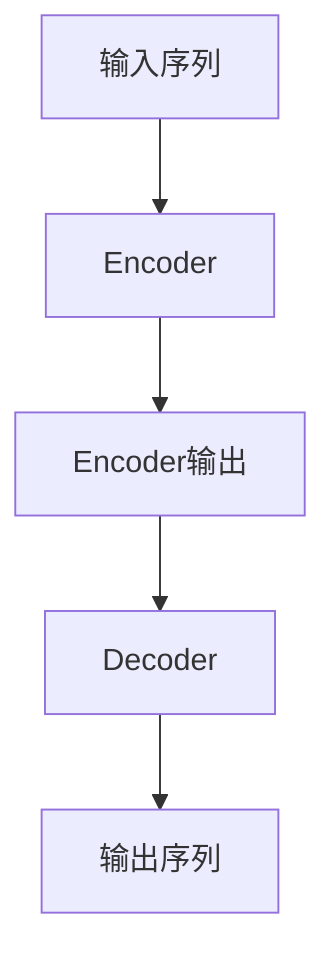
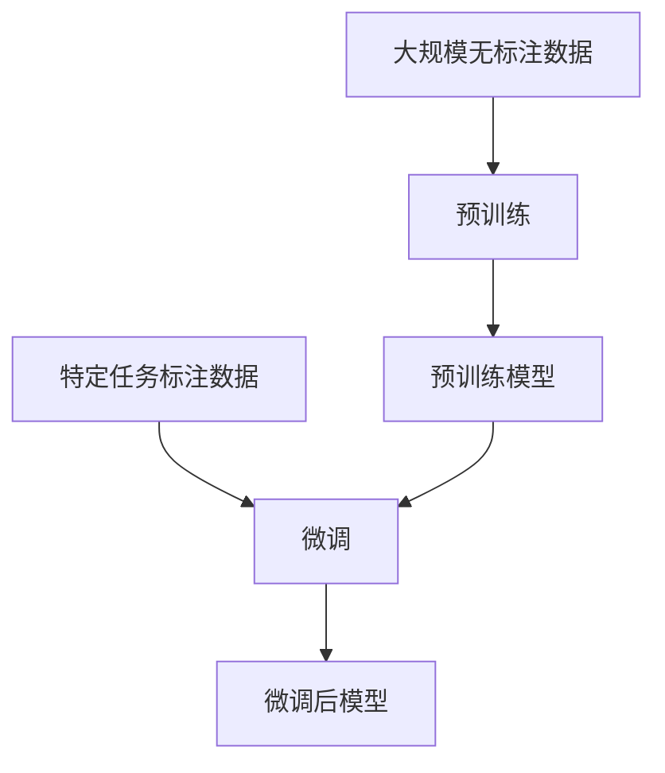

# 大语言模型原理与工程实践：大语言模型微调的挑战和探索

## 1. 背景介绍

### 1.1 大语言模型的兴起

近年来,大型语言模型(Large Language Models, LLMs)在自然语言处理(Natural Language Processing, NLP)领域掀起了一场革命。这些模型通过在海量文本数据上进行预训练,学习了丰富的语言知识和上下文信息,展现出令人惊叹的语言生成和理解能力。

代表性的大语言模型包括 GPT-3、BERT、XLNet、ALBERT 等,它们在各种 NLP 任务中取得了卓越的表现,如文本生成、机器翻译、问答系统、情感分析等。这些模型的出现,不仅推动了 NLP 技术的发展,也为人工智能系统赋予了更强大的语言理解和生成能力。

### 1.2 大语言模型微调的重要性

尽管大语言模型在通用语言理解和生成方面表现出色,但要将它们应用于特定领域或任务,通常需要进行进一步的微调(fine-tuning)。微调是指在大语言模型的基础上,使用特定领域或任务的数据进行额外的训练,以使模型更好地适应该领域或任务的特征。

微调的重要性在于,它可以有效地将通用的语言知识转移到特定领域或任务中,从而提高模型在该领域或任务上的性能。同时,由于大语言模型已经学习了丰富的语言知识,微调所需的数据量和计算资源通常比从头训练要少得多,这使得微调成为一种高效且经济的方式。

然而,大语言模型微调也面临着一些挑战,如数据质量、微调策略、计算资源需求等。本文将探讨大语言模型微调的原理、方法和实践,并分析其中的挑战和解决方案。

## 2. 核心概念与联系

### 2.1 大语言模型的架构

大语言模型通常采用基于Transformer的编码器-解码器(Encoder-Decoder)架构或仅编码器(Encoder-only)架构。编码器负责将输入序列(如文本)编码为上下文表示,而解码器则根据编码器的输出和目标序列生成输出序列。



在微调过程中,模型的编码器和解码器权重都会根据特定任务的数据进行调整,以更好地捕获该任务的语义和模式。

### 2.2 预训练与微调

大语言模型通常经历两个阶段:预训练(Pre-training)和微调(Fine-tuning)。

1. **预训练阶段**:模型在大规模无标注文本数据(如网页、书籍等)上进行自监督学习,学习通用的语言表示。常见的预训练目标包括掩码语言模型(Masked Language Modeling)和下一句预测(Next Sentence Prediction)等。

2. **微调阶段**:在预训练的基础上,模型使用特定任务或领域的标注数据进行进一步训练,以适应该任务或领域的特征。微调过程通常只需要少量的计算资源和数据,就可以获得显著的性能提升。



预训练和微调的分离使得大语言模型可以在不同的任务和领域之间转移和共享知识,提高了模型的泛化能力和效率。

### 2.3 微调策略

微调策略决定了如何有效地利用大语言模型的知识,并将其转移到特定任务中。常见的微调策略包括:

1. **全模型微调(Full Model Fine-tuning)**:对整个模型(包括编码器和解码器)的所有参数进行微调。这种策略通常需要更多的计算资源,但可以充分利用模型的知识。

2. **编码器微调(Encoder Fine-tuning)**:只微调模型的编码器部分,而保持解码器参数不变。这种策略计算成本较低,适用于输入数据的表示对任务至关重要的情况。

3. **前馈层微调(Feed-Forward Layer Fine-tuning)**:只微调模型的前馈层(Feed-Forward Layers),而保持其他层(如自注意力层)的参数不变。这种策略计算成本最低,但可能无法充分利用模型的知识。

4. **层微调(Layer-wise Fine-tuning)**:对模型的不同层进行选择性微调,例如只微调高层或低层。这种策略可以平衡计算成本和性能。

5. **渐进式微调(Gradual Fine-tuning)**:先微调模型的高层,然后逐渐微调低层,以防止过度微调导致的灾难性遗忘(Catastrophic Forgetting)。

选择合适的微调策略对于充分利用大语言模型的知识,并在特定任务上获得良好性能至关重要。

## 3. 核心算法原理具体操作步骤

### 3.1 微调数据准备

微调的第一步是准备高质量的任务或领域相关数据。数据质量对微调效果有着重大影响,因此需要进行适当的数据清洗、标注和预处理。

1. **数据清洗**:去除噪声数据、错误标注等,以提高数据质量。
2. **数据标注**:对于监督学习任务,需要由人工或自动方式对数据进行标注。
3. **数据预处理**:将数据转换为模型可接受的格式,如文本TokeniZation、数值特征归一化等。

### 3.2 微调超参数设置

微调过程中需要设置一些关键的超参数,如学习率、批量大小、训练轮数等。合理的超参数设置对模型性能有着重大影响。

1. **学习率(Learning Rate)**:控制模型参数更新的步长。较小的学习率可以提高收敛性,但训练速度较慢;较大的学习率可以加快训练,但可能导致不稳定性。

2. **批量大小(Batch Size)**:每次更新模型参数时使用的样本数量。较大的批量大小可以提高GPU利用率,但可能导致收敛性下降。

3. **训练轮数(Training Epochs)**:模型在整个训练集上迭代的次数。过多的轮数可能导致过拟合,而过少的轮数则可能欠拟合。

4. **优化器(Optimizer)**:用于更新模型参数的优化算法,如Adam、AdamW等。不同的优化器对收敛速度和稳定性有不同的影响。

5. **正则化(Regularization)**:防止过拟合的技术,如L1/L2正则化、Dropout等。

6. **早停(Early Stopping)**:在验证集上的性能不再提升时提前停止训练,以防止过拟合。

通常需要进行超参数搜索和调优,以找到最佳的超参数组合。

### 3.3 微调训练

在设置好超参数后,即可开始微调训练过程。训练过程通常包括以下步骤:

1. **加载预训练模型**:从预训练模型的检查点(Checkpoint)加载模型参数。
2. **准备数据加载器(Data Loader)**:将标注数据分割为训练集、验证集和测试集,并使用数据加载器按批次加载数据。
3. **定义损失函数(Loss Function)**:根据任务类型选择合适的损失函数,如交叉熵损失(Cross-Entropy Loss)、均方误差(Mean Squared Error)等。
4. **模型训练**:使用优化器和损失函数,在训练集上迭代更新模型参数。每个epoch结束后,在验证集上评估模型性能,并根据早停策略决定是否停止训练。
5. **模型评估**:在测试集上评估微调后模型的性能,并与基线模型进行比较。
6. **模型保存**:将微调后的模型参数保存为新的检查点,以便后续使用或部署。

在训练过程中,还需要关注模型的收敛情况、损失曲线、评估指标等,以判断模型是否收敛且性能是否满足要求。

## 4. 数学模型和公式详细讲解举例说明

### 4.1 掩码语言模型(Masked Language Modeling)

掩码语言模型是大语言模型预训练的一种常见目标,旨在预测被掩码(masked)的单词。给定一个输入序列 $X = (x_1, x_2, \dots, x_n)$,模型需要预测被掩码的单词 $x_m$。

损失函数定义为:

$$\mathcal{L}_{MLM} = -\log P(x_m | X \setminus \{x_m\})$$

其中 $X \setminus \{x_m\}$ 表示去掉 $x_m$ 的输入序列。

模型的目标是最大化掩码单词的条件概率,即最小化上述损失函数。通过在大量文本数据上优化该目标,模型可以学习到丰富的语言知识和上下文理解能力。

### 4.2 下一句预测(Next Sentence Prediction)

下一句预测是另一种常见的预训练目标,旨在判断给定的两个句子是否连续出现。给定两个句子 $S_1$ 和 $S_2$,模型需要预测它们是否为连续句子对。

损失函数定义为:

$$\mathcal{L}_{NSP} = -\log P(y | S_1, S_2)$$

其中 $y \in \{0, 1\}$ 表示 $S_1$ 和 $S_2$ 是否为连续句子对(1为连续,0为不连续)。

通过优化该目标,模型可以学习到句子之间的关系和语义连贯性。

### 4.3 交叉熵损失(Cross-Entropy Loss)

在微调过程中,常用的损失函数是交叉熵损失,用于监督学习任务如文本分类、机器翻译等。

对于一个样本 $(x, y)$,其中 $x$ 为输入序列, $y$ 为目标标签,交叉熵损失定义为:

$$\mathcal{L}_{CE}(x, y) = -\sum_{i=1}^{C} y_i \log p_i(x)$$

其中 $C$ 为类别数量, $y_i$ 为样本 $x$ 属于第 $i$ 类的真实标签(0或1), $p_i(x)$ 为模型预测 $x$ 属于第 $i$ 类的概率。

目标是最小化交叉熵损失,使模型的预测概率分布尽可能接近真实标签分布。

### 4.4 均方误差(Mean Squared Error)

在回归任务中,常用的损失函数是均方误差(Mean Squared Error, MSE)。

对于一个样本 $(x, y)$,其中 $x$ 为输入序列, $y$ 为目标连续值,均方误差定义为:

$$\mathcal{L}_{MSE}(x, y) = \frac{1}{N}\sum_{i=1}^{N}(y_i - \hat{y}_i(x))^2$$

其中 $N$ 为样本数量, $y_i$ 为第 $i$ 个样本的真实目标值, $\hat{y}_i(x)$ 为模型对第 $i$ 个样本的预测值。

目标是最小化均方误差,使模型的预测值尽可能接近真实值。

通过优化上述损失函数,大语言模型可以在特定任务上进行微调,从而提高性能。选择合适的损失函数对于模型的收敛和泛化能力至关重要。

## 5. 项目实践:代码实例和详细解释说明

在本节中,我们将使用 Hugging Face 的 Transformers 库,演示如何对 BERT 模型进行微调,以完成文本分类任务。

### 5.1 导入所需库

```python
from transformers import BertTokenizer, BertForSequenceClassification
from transformers import TrainingArguments, Trainer
from datasets import load_dataset
import numpy as np
```

### 5.2 加载数据集

我们将使用 Hugging Face 的 `datasets` 库加载 IMDB 电影评论数据集,用于二分类任务(正面评论或负面评论)。

```python
dataset = load_dataset("imdb")
```

### 5.3 数据预处理

我们需要对数据进行TokeniZation,并将其转换为模型可接受的格式。

```python
tokenizer = BertTokenizer.from_pretrained("bert-base-uncased")

def preprocess_function(examples):
    return tokenizer(examples["text"], truncation=True, padding="max_length", max_length