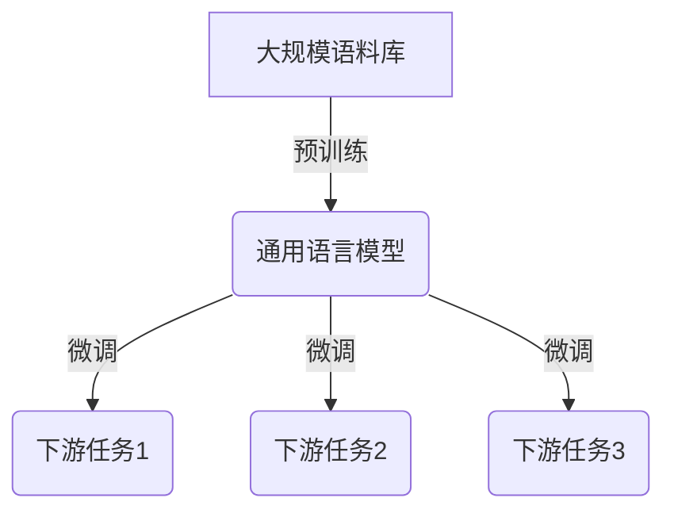
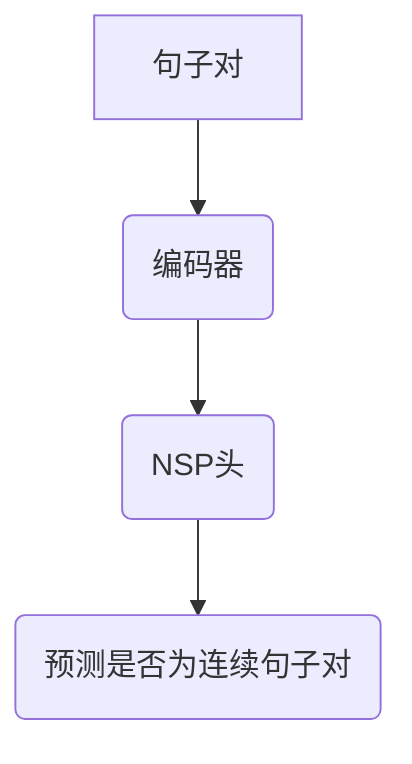
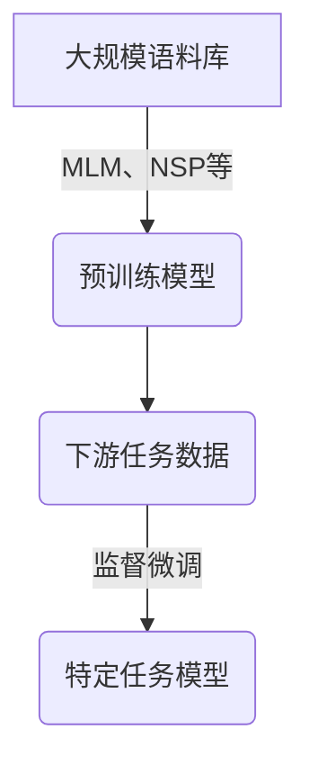

# 大语言模型原理与工程实践：工具设计

## 1. 背景介绍

在当今的人工智能领域中,大型语言模型(Large Language Models, LLMs)正在引领着一场革命性的变革。这些模型通过从海量文本数据中学习,展现出惊人的自然语言理解和生成能力,为各种应用场景带来了前所未有的机遇。

大语言模型的兴起可以追溯到2017年,当时谷歌的Transformer模型首次提出,展示了卓越的机器翻译性能。此后,OpenAI的GPT(Generative Pre-trained Transformer)系列、谷歌的BERT(Bidirectional Encoder Representations from Transformers)、微软的MT-NLG(Multitask Trained Neural Language Generation)等模型不断刷新着大语言模型的性能上限。

这些模型通过预训练的方式,在海量无标注文本数据上学习语言的统计规律,获取了极为丰富的语言知识。之后,只需要在特定任务上进行少量的微调(fine-tuning),就能将这些知识迁移到下游任务中,展现出令人惊叹的性能表现。

大语言模型的出现,不仅推动了自然语言处理(NLP)技术的飞速发展,也为人工智能的其他领域注入了新的活力。它们在文本生成、问答系统、信息检索、代码生成等领域均有广泛的应用前景。

然而,要充分发挥大语言模型的潜力,还需要解决一些关键性的挑战,例如模型的可解释性、可控性、鲁棒性、隐私保护等。同时,如何高效地部署和管理这些庞大的模型,也是一个亟待解决的工程难题。

本文将深入探讨大语言模型的原理和工程实践,为读者提供一个全面的视角,了解这一革命性技术的本质,以及如何将其应用于实际场景中。我们将涵盖从核心概念到算法原理,再到具体的代码实现和工程实践,最后探讨未来的发展趋势和挑战。

## 2. 核心概念与联系

### 2.1 自然语言处理(NLP)基础

在深入探讨大语言模型之前,我们需要先了解一些自然语言处理(NLP)的基础概念。NLP是一门研究计算机如何理解和生成人类语言的学科,它涉及多个子领域,包括文本预处理、词法分析、句法分析、语义分析、discourse分析等。

大语言模型主要关注语义表示和文本生成这两个核心任务。它们需要将文本映射到一个连续的向量空间中,以捕捉语义和上下文信息。这种表示方式被称为分布式表示(Distributed Representation),它可以有效地解决传统的一热编码(One-Hot Encoding)方法所面临的维数灾难问题。

### 2.2 Word Embedding

Word Embedding是将单词映射到低维连续向量空间的技术,它能够较好地捕捉单词之间的语义相似性。常见的Word Embedding方法包括Word2Vec、GloVe等。这些方法通过在大规模语料库上训练,使得语义相似的单词在向量空间中的表示也相似。

然而,Word Embedding存在一个固有的缺陷,即无法很好地捕捉单词在不同上下文中的多义性。为了解决这个问题,我们需要引入上下文信息,从而得到更加丰富和动态的语义表示。

### 2.3 上下文语义表示

上下文语义表示(Contextual Semantic Representation)是指根据单词所处的上下文,为每个单词生成动态的语义向量表示。这种表示方式能够更好地捕捉单词的多义性,提高语义理解的准确性。

ELMo(Embeddings from Language Models)是最早提出上下文语义表示的模型之一。它使用双向LSTM(Long Short-Term Memory)网络,从前向和后向上下文中捕获单词的语义信息。

### 2.4 自注意力机制(Self-Attention)

自注意力机制是Transformer模型的核心,它能够直接建模输入序列中任意两个位置之间的依赖关系,从而更好地捕捉长距离上下文信息。

与RNN(Recurrent Neural Network)和CNN(Convolutional Neural Network)相比,自注意力机制具有更好的并行计算能力,能够更高效地利用硬件资源。此外,它还能够捕捉输入序列中任意两个位置之间的依赖关系,而不受距离限制。

自注意力机制的引入,使得Transformer模型在机器翻译等任务上取得了突破性的进展,为后续的大语言模型奠定了基础。

### 2.5 预训练与微调(Pre-training and Fine-tuning)

预训练与微调是大语言模型的核心训练范式。在预训练阶段,模型会在大规模无标注语料库上进行自监督学习,获取丰富的语言知识。而在微调阶段,模型会在特定的下游任务上进行少量的监督fine-tuning,将预训练获得的知识迁移到目标任务中。

这种范式的优势在于,预训练可以在海量数据上学习通用的语言知识,而微调则可以快速地将这些知识适配到特定任务上,大大减少了从头训练所需的数据和计算资源。

预训练与微调范式的提出,极大地推动了大语言模型的发展,使得这些庞大的模型能够在有限的计算资源下获得可观的性能提升。



上图展示了预训练与微调的工作流程。首先,大语言模型会在海量语料库上进行自监督预训练,获取通用的语言知识。之后,根据不同的下游任务,对预训练模型进行少量的监督微调,从而将通用知识迁移到特定任务中。

## 3. 核心算法原理具体操作步骤

在了解了大语言模型的核心概念之后,我们将深入探讨其背后的算法原理和具体操作步骤。

### 3.1 Transformer模型

Transformer是大语言模型的基础架构,它由编码器(Encoder)和解码器(Decoder)两部分组成。编码器负责将输入序列映射到上下文语义表示,而解码器则根据编码器的输出和前续生成的tokens,预测下一个token。

Transformer的核心是自注意力机制,它能够直接建模输入序列中任意两个位置之间的依赖关系,从而更好地捕捉长距离上下文信息。


上图展示了Transformer模型的基本架构。编码器由多个编码器层堆叠而成,每个编码器层包含一个自注意力子层和一个前馈网络子层。解码器的结构类似,但多了一个编码器-解码器注意力子层,用于关注编码器的输出。

在训练过程中,Transformer会最小化输入序列和目标序列之间的交叉熵损失,从而学习到合理的参数。而在推理阶段,解码器会自回归地生成一个token,并将其作为下一步的输入,重复这个过程直到生成完整的序列。

### 3.2 Masked Language Modeling (MLM)

Masked Language Modeling (MLM)是大语言模型预训练的一种常用目标,它的目标是根据上下文预测被掩码的token。具体来说,MLM会随机选择输入序列中的一些token,将它们替换为特殊的[MASK]标记,然后让模型去预测这些被掩码的token。

MLM能够让模型学习到双向的上下文信息,从而获得更加丰富和准确的语义表示。此外,MLM还能够作为一种自监督信号,在大规模无标注语料库上进行有效的预训练。

```mermaid
graph TD
    A[原始输入序列] -->|随机掩码| B([MASK] 序列)
    B --> C(编码器)
    C --> D(MLM头)
    D --> E(预测被掩码的token)
```

上图展示了MLM的工作流程。首先,MLM会随机选择输入序列中的一些token,并将它们替换为[MASK]标记。然后,编码器会对这个被掩码的序列进行编码,生成上下文语义表示。最后,MLM头会根据这个表示,预测被掩码的token。

在训练过程中,MLM会最小化预测token和实际token之间的交叉熵损失,从而学习到合理的参数。

### 3.3 Next Sentence Prediction (NSP)

Next Sentence Prediction (NSP)是另一种常用的大语言模型预训练目标。它的目标是判断两个输入句子是否为连续的句子对。

NSP能够让模型学习到更高层次的语义和discourse信息,从而更好地理解文本的连贯性和逻辑关系。这对于许多下游任务(如问答、文本摘要等)都是非常有益的。



上图展示了NSP的工作流程。首先,NSP会将两个句子拼接为一个输入序列。然后,编码器会对这个序列进行编码,生成上下文语义表示。最后,NSP头会根据这个表示,预测这两个句子是否为连续的句子对。

在训练过程中,NSP会最小化预测结果和实际标签之间的交叉熵损失,从而学习到合理的参数。

### 3.4 预训练与微调

大语言模型的训练过程分为两个阶段:预训练(Pre-training)和微调(Fine-tuning)。

在预训练阶段,模型会在大规模无标注语料库上进行自监督学习,通过MLM、NSP等目标捕获丰富的语言知识。这个过程通常需要消耗大量的计算资源,但只需要进行一次。

而在微调阶段,模型会在特定的下游任务上进行少量的监督fine-tuning,将预训练获得的知识迁移到目标任务中。这个过程相对高效,只需要少量的标注数据和计算资源。



上图展示了预训练与微调的工作流程。首先,大语言模型会在海量语料库上进行自监督预训练,获取通用的语言知识。之后,根据不同的下游任务,对预训练模型进行少量的监督微调,从而将通用知识迁移到特定任务中。

预训练与微调范式的提出,极大地推动了大语言模型的发展,使得这些庞大的模型能够在有限的计算资源下获得可观的性能提升。

## 4. 数学模型和公式详细讲解举例说明

在探讨大语言模型的算法原理时,我们不可避免地需要涉及一些数学模型和公式。在这一部分,我们将详细讲解这些模型和公式,并通过具体的例子来加深理解。

### 4.1 自注意力机制(Self-Attention)

自注意力机制是Transformer模型的核心,它能够直接建模输入序列中任意两个位置之间的依赖关系,从而更好地捕捉长距离上下文信息。

给定一个输入序列 $X = (x_1, x_2, \dots, x_n)$,自注意力机制会计算每个位置 $i$ 对其他所有位置 $j$ 的注意力权重 $\alpha_{ij}$,然后根据这些权重对输入进行加权求和,得到该位置的上下文表示 $z_i$。数学表达式如下:

$$z_i = \sum_{j=1}^n \alpha_{ij}(x_j W^V)$$

其中, $W^V$ 是一个可学习的值向量(Value Vector)的线性变换矩阵。注意力权重 $\alpha_{ij}$ 则通过以下公式计算:

$$\alpha_{ij} =