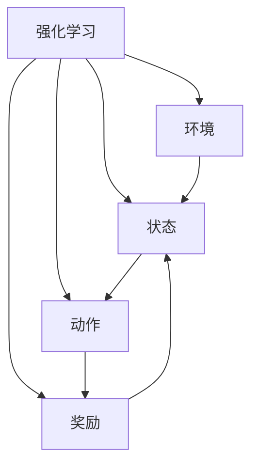
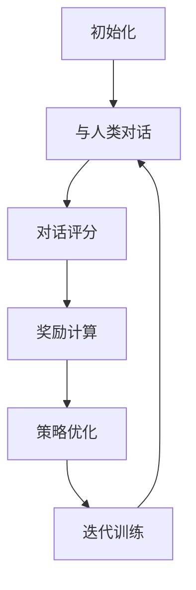

# 大语言模型原理与工程实践：强化学习工程实践 DeepSpeed-Chat 训练调优实践

## 1. 背景介绍

### 1.1 大语言模型的兴起

近年来,大型语言模型(Large Language Models, LLMs)在自然语言处理(NLP)领域取得了令人瞩目的成就。这些模型通过在海量文本数据上进行预训练,学习到了丰富的语言知识和上下文信息,从而在下游任务中表现出色,推动了NLP技术的快速发展。

### 1.2 强化学习在对话系统中的应用

传统的语言模型训练方式主要采用监督学习或自监督学习,但这种方式难以捕捉对话过程中的长期依赖关系和策略性决策。强化学习(Reinforcement Learning, RL)则可以通过奖励机制来优化模型的行为策略,使其在与环境交互的过程中不断学习和改进。

### 1.3 DeepSpeed-Chat: 基于强化学习的对话模型

DeepSpeed-Chat是一种基于强化学习的大型对话模型,旨在提高对话系统的一致性、有趣性和安全性。它通过与人类进行大量对话互动,并根据对话质量获得奖励或惩罚,从而不断优化自身的对话策略。

## 2. 核心概念与联系

### 2.1 强化学习基础

强化学习是一种基于奖励机制的机器学习范式,其核心思想是通过与环境交互,获取奖励或惩罚信号,从而学习到最优策略。强化学习包括四个基本元素:

- 环境(Environment)
- 状态(State)
- 动作(Action)
- 奖励(Reward)



### 2.2 策略梯度算法

策略梯度(Policy Gradient)算法是强化学习中一种常用的优化方法,它直接优化模型的策略函数,使期望奖励最大化。策略梯度算法的核心思想是通过计算奖励函数相对于策略参数的梯度,并沿着梯度方向更新参数,从而逐步改进策略。

### 2.3 对话系统中的强化学习

在对话系统中,强化学习可以帮助模型学习到更加自然、一致和有趣的对话策略。通过与人类进行大量对话互动,模型可以根据对话质量获得奖励或惩罚,从而不断优化自身的对话行为。

## 3. 核心算法原理具体操作步骤

### 3.1 DeepSpeed-Chat 训练流程

DeepSpeed-Chat 的训练过程可以概括为以下几个步骤:

1. **初始化**: 从一个预训练的语言模型开始,如 GPT-2 或 BERT。
2. **与人类对话**: 模型与人类进行大量对话互动,收集对话数据。
3. **对话评分**: 人类评分员根据对话质量对每个对话进行评分。
4. **奖励计算**: 根据评分结果计算奖励值。
5. **策略优化**: 使用策略梯度算法,根据奖励值优化模型的策略参数。
6. **迭代训练**: 重复步骤 2-5,直到模型的对话策略收敛。



### 3.2 对话质量评估

对话质量的评估是 DeepSpeed-Chat 训练过程中一个关键环节。常见的评估指标包括:

- **一致性(Consistency)**: 对话是否自洽,没有矛盾和逻辑错误。
- **有趣性(Engagingness)**: 对话是否富有吸引力,能够吸引人继续交谈。
- **安全性(Safety)**: 对话是否避免了有害、不当或不适当的内容。
- **相关性(Relevance)**: 回复是否与上下文相关,没有逻辑跳跃。

### 3.3 奖励函数设计

奖励函数的设计直接影响了模型的优化目标。DeepSpeed-Chat 通常采用基于人类评分的奖励函数,将对话质量评分映射为奖励值。例如,可以将评分归一化到 [0, 1] 区间,然后将其作为奖励值。

$$
R = \frac{score - score_{min}}{score_{max} - score_{min}}
$$

其中 $R$ 表示奖励值, $score$ 表示对话质量评分, $score_{min}$ 和 $score_{max}$ 分别表示评分的最小值和最大值。

### 3.4 策略优化算法

DeepSpeed-Chat 常用的策略优化算法包括 REINFORCE、Actor-Critic 和 Proximal Policy Optimization (PPO) 等。以 REINFORCE 算法为例,其目标是最大化期望奖励:

$$
J(\theta) = \mathbb{E}_{\pi_\theta}[\sum_{t=0}^{T} \gamma^t r_t]
$$

其中 $\theta$ 表示策略参数, $\pi_\theta$ 表示当前策略, $r_t$ 表示时间步 $t$ 的奖励, $\gamma$ 是折现因子。梯度可以通过以下公式计算:

$$
\nabla_\theta J(\theta) = \mathbb{E}_{\pi_\theta}\left[\sum_{t=0}^{T} \nabla_\theta \log \pi_\theta(a_t|s_t) \sum_{t'=t}^{T} \gamma^{t'-t} r_{t'}\right]
$$

通过计算梯度并沿着梯度方向更新参数,可以逐步优化策略函数。

## 4. 数学模型和公式详细讲解举例说明

### 4.1 马尔可夫决策过程 (MDP)

强化学习问题通常被建模为马尔可夫决策过程 (Markov Decision Process, MDP)。MDP 由以下五个要素组成:

- 状态集合 $\mathcal{S}$
- 动作集合 $\mathcal{A}$
- 转移概率 $\mathcal{P}_{ss'}^a = \mathbb{P}[S_{t+1}=s'|S_t=s, A_t=a]$
- 奖励函数 $\mathcal{R}_s^a = \mathbb{E}[R_{t+1}|S_t=s, A_t=a]$
- 折现因子 $\gamma \in [0, 1]$

在对话系统中,状态可以表示为对话历史,动作则是模型的回复。目标是找到一个策略 $\pi: \mathcal{S} \rightarrow \mathcal{A}$,使得期望累积奖励最大化:

$$
J(\pi) = \mathbb{E}_\pi\left[\sum_{t=0}^\infty \gamma^t R_t\right]
$$

### 4.2 策略梯度算法推导

我们可以使用策略梯度算法来直接优化策略函数 $\pi_\theta(a|s)$,其中 $\theta$ 表示策略参数。根据期望累积奖励的目标函数,我们有:

$$
\begin{aligned}
\nabla_\theta J(\theta) &= \nabla_\theta \mathbb{E}_{\pi_\theta}\left[\sum_{t=0}^\infty \gamma^t R_t\right] \\
&= \mathbb{E}_{\pi_\theta}\left[\sum_{t=0}^\infty \gamma^t \nabla_\theta \log \pi_\theta(A_t|S_t) Q^{\pi_\theta}(S_t, A_t)\right]
\end{aligned}
$$

其中 $Q^{\pi_\theta}(S_t, A_t)$ 表示在状态 $S_t$ 执行动作 $A_t$ 后的期望累积奖励。由于计算 $Q^{\pi_\theta}(S_t, A_t)$ 比较困难,我们可以使用蒙特卡罗估计来近似计算:

$$
Q^{\pi_\theta}(S_t, A_t) \approx \sum_{t'=t}^\infty \gamma^{t'-t} R_{t'}
$$

将其代入梯度公式,我们得到 REINFORCE 算法的梯度估计:

$$
\nabla_\theta J(\theta) \approx \mathbb{E}_{\pi_\theta}\left[\sum_{t=0}^\infty \nabla_\theta \log \pi_\theta(A_t|S_t) \sum_{t'=t}^\infty \gamma^{t'-t} R_{t'}\right]
$$

通过对这个梯度进行采样估计,我们可以更新策略参数 $\theta$,从而优化策略函数。

### 4.3 Actor-Critic 算法

Actor-Critic 算法是另一种常用的策略优化算法,它将策略函数 (Actor) 和值函数 (Critic) 分开训练,从而提高了训练效率。Actor 负责输出动作概率分布,而 Critic 则估计状态值函数 $V(s)$ 或状态动作值函数 $Q(s, a)$。

Actor 的目标是最大化期望累积奖励:

$$
J(\theta) = \mathbb{E}_{\pi_\theta}\left[\sum_{t=0}^\infty \gamma^t R_t\right]
$$

而 Critic 的目标是最小化估计误差:

$$
L(\phi) = \mathbb{E}_{s \sim \rho^\pi}\left[(V_\phi(s) - V^{\pi}(s))^2\right]
$$

其中 $\rho^\pi$ 表示状态分布, $V_\phi$ 表示参数为 $\phi$ 的值函数近似,而 $V^\pi$ 表示真实的值函数。

Actor 和 Critic 通过交替训练来优化彼此的参数。Actor 利用 Critic 提供的值函数估计来更新策略参数,而 Critic 则根据 Actor 生成的轨迹数据来更新值函数参数。

## 5. 项目实践: 代码实例和详细解释说明

在本节中,我们将提供一个基于 PyTorch 和 Hugging Face Transformers 库的 DeepSpeed-Chat 实现示例,并对关键代码进行详细解释。

### 5.1 环境设置

首先,我们需要安装必要的依赖库:

```bash
pip install torch transformers
```

### 5.2 加载预训练模型

我们从 Hugging Face 模型库中加载一个预训练的语言模型,如 GPT-2:

```python
from transformers import GPT2LMHeadModel, GPT2Tokenizer

tokenizer = GPT2Tokenizer.from_pretrained("gpt2")
model = GPT2LMHeadModel.from_pretrained("gpt2")
```

### 5.3 定义对话数据集

我们定义一个简单的对话数据集,包含一系列人机对话:

```python
conversations = [
    ("Human: Hello", "AI: Hello! How can I assist you today?"),
    ("Human: What is the capital of France?", "AI: The capital of France is Paris."),
    # ... more conversations
]
```

### 5.4 实现 REINFORCE 算法

我们实现 REINFORCE 算法来优化对话模型的策略函数。首先,定义一个用于生成回复的函数:

```python
import torch

def generate_response(model, tokenizer, input_text, max_length=50):
    input_ids = tokenizer.encode(input_text, return_tensors="pt")
    output = model.generate(input_ids, max_length=max_length, num_return_sequences=1)
    response = tokenizer.decode(output[0], skip_special_tokens=True)
    return response
```

然后,实现 REINFORCE 算法的核心部分:

```python
import torch.optim as optim

optimizer = optim.Adam(model.parameters(), lr=1e-5)

for conversation in conversations:
    human_text, target_response = conversation
    
    # 生成模型回复
    model_response = generate_response(model, tokenizer, human_text)
    
    # 计算奖励 (这里我们使用一个简单的奖励函数,实际应用中可以使用更复杂的评估方法)
    reward = 1 if model_response == target_response else -1
    
    # 计算损失函数
    loss = -reward * model.forward(tokenizer.encode(human_text + model_response, return_tensors="pt"))[0]
    
    # 反向传播和参数更新
    optimizer.zero_grad()
    loss.backward()
    optimizer.step()
```

在上述代码中,我们首先生成模型的回复,然后根据目标回复计算奖励值。接下来,我们计算损失函数,即负的奖励乘以模型输出的对数概率。通过反向传播和参数更新,我们可以优化模型的策略函数。

请注意,这只是一个简化的示例,实际应用中需要考虑更多因素,如对话历史、多轮对话等。

## 6. 实际应用场景

DeepSpeed-Chat 及其强化