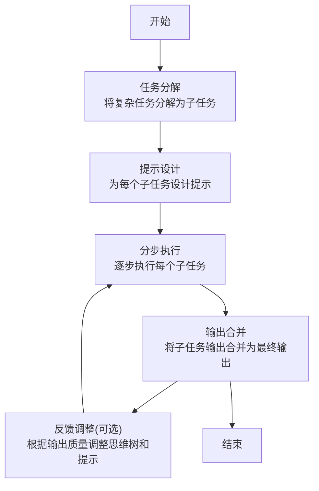
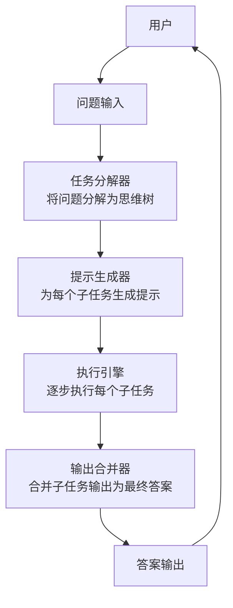

# 大语言模型原理与工程实践：思维树提示

## 1.背景介绍

随着人工智能和深度学习技术的不断发展,大型语言模型(Large Language Models, LLMs)已经成为自然语言处理领域的关键技术之一。这些模型通过在海量文本数据上进行预训练,学习了丰富的语言知识和上下文信息,从而能够生成高质量、连贯的文本输出。

大型语言模型的出现,为各种自然语言处理任务带来了革命性的突破,例如机器翻译、问答系统、文本生成和摘要等。其中,OpenAI推出的GPT(Generative Pre-trained Transformer)系列模型,以及谷歌的BERT(Bidirectional Encoder Representations from Transformers)模型,是当前最为广泛使用和研究的大型语言模型。

然而,仅依靠大型语言模型的原始输出并不能满足复杂的应用场景需求。为了充分发挥这些模型的潜力,需要引入有效的控制和指导机制,使模型输出更加符合特定任务的要求。这就是"思维树提示"(Thought-Prompting)技术的用武之地。

## 2.核心概念与联系

### 2.1 思维树提示的核心概念

思维树提示是一种基于人类思维过程的提示范式,旨在指导大型语言模型按照特定的思维路径生成输出。它将复杂的任务分解为一系列简单的子任务,并通过一系列结构化的提示来引导模型逐步完成每个子任务。

思维树提示的核心思想是模拟人类的思维过程,将复杂的问题分解为多个可管理的步骤,然后逐步解决每个步骤。这种方法不仅有助于提高模型输出的质量和一致性,还能增强模型的可解释性和可控性。

### 2.2 思维树提示与其他提示技术的联系

思维树提示与其他提示技术(如Few-Shot Learning、Chain-of-Thought Prompting等)有着密切的联系,但也存在一些显著的区别。

与Few-Shot Learning相比,思维树提示更加强调任务的分解和结构化,而不是简单地提供少量示例数据。与Chain-of-Thought Prompting相比,思维树提示更加注重思维路径的明确性和可控性,而不是依赖模型自发生成思维链。

总的来说,思维树提示融合了其他提示技术的优点,并进一步强调了结构化思维和任务分解的重要性。它为大型语言模型提供了一种更加灵活和可控的指导机制,有助于提高模型输出的质量和可解释性。

## 3.核心算法原理具体操作步骤

思维树提示的核心算法原理可以概括为以下几个关键步骤:

1. **任务分解**: 将复杂的任务分解为一系列可管理的子任务,形成一棵思维树。每个子任务对应思维树中的一个节点。

2. **提示设计**: 为每个子任务设计相应的提示,引导模型按照预期的思维路径生成输出。提示可以包括任务描述、示例输入输出、约束条件等信息。

3. **分步执行**: 按照思维树的层次结构,逐步执行每个子任务。模型根据当前节点的提示生成相应的输出,作为下一级子任务的输入。

4. **输出合并**: 将各个子任务的输出合并,形成最终的任务输出。

5. **反馈调整(可选)**: 根据输出的质量和任务要求,对思维树和提示进行调整和优化,形成迭代式的改进过程。

下面是一个简化的示例,说明思维树提示的具体操作步骤:



以上示例展示了思维树提示的基本流程,但实际应用中,思维树的结构和提示的设计会根据具体任务的复杂程度而有所不同。下一节将介绍思维树提示在实际应用中的一些细节和技巧。

## 4.数学模型和公式详细讲解举例说明

虽然思维树提示主要是一种基于启发式的方法,但我们也可以将其形式化为一个数学模型,以更好地理解和优化这一过程。

假设我们有一个复杂任务 $T$,可以分解为 $n$ 个子任务 $\{t_1, t_2, \dots, t_n\}$,它们构成一棵思维树。每个子任务 $t_i$ 都有一个相应的提示 $p_i$,用于引导模型生成子任务输出 $o_i$。

我们可以将思维树提示过程建模为一个条件概率模型:

$$P(O|T, P) = \prod_{i=1}^{n} P(o_i|t_i, p_i, \mathcal{O}_{<i})$$

其中,

- $O = \{o_1, o_2, \dots, o_n\}$ 是所有子任务输出的集合
- $T = \{t_1, t_2, \dots, t_n\}$ 是所有子任务的集合
- $P = \{p_1, p_2, \dots, p_n\}$ 是所有提示的集合
- $\mathcal{O}_{<i}$ 表示在生成 $o_i$ 之前的所有子任务输出

该模型表示,生成每个子任务输出 $o_i$ 的概率,取决于当前子任务 $t_i$、对应的提示 $p_i$,以及之前所有子任务输出 $\mathcal{O}_{<i}$。

我们的目标是找到一组最优的提示 $P^*$,使得在给定任务 $T$ 的情况下,生成期望输出 $O^*$ 的概率最大化:

$$P^* = \arg\max_P P(O^*|T, P)$$

这可以通过监督学习或强化学习等方法来优化提示,使其能够更好地指导模型生成期望的输出。

以上是思维树提示过程的一个简化数学模型。在实际应用中,我们还需要考虑思维树的结构、提示的表示形式、评估指标等多方面因素,以获得更好的性能。

## 5.项目实践:代码实例和详细解释说明

为了更好地理解思维树提示在实践中的应用,我们将通过一个具体的示例项目来说明。这个项目是一个基于思维树提示的问答系统,它可以回答各种复杂的开放式问题。

### 5.1 项目概述

该问答系统的核心是一个基于GPT-3的大型语言模型,配合一个思维树提示引擎。当用户输入一个问题时,系统会首先将问题分解为一系列子任务,构建一棵思维树。然后,系统会为每个子任务生成相应的提示,并按照思维树的层次结构逐步执行每个子任务,最终将所有子任务的输出合并为最终的答案。

### 5.2 系统架构

下图展示了该问答系统的整体架构:



以下是各个模块的详细说明:

1. **任务分解器(Task Decomposer)**: 将用户输入的问题分解为一棵思维树,每个节点代表一个子任务。这个模块需要理解问题的语义,并根据预定义的规则或机器学习模型进行任务分解。

2. **提示生成器(Prompt Generator)**: 为每个子任务生成相应的提示,引导语言模型按照预期的思维路径生成输出。提示可以包括子任务描述、示例输入输出、约束条件等信息。

3. **执行引擎(Execution Engine)**: 按照思维树的层次结构,逐步执行每个子任务。它将当前子任务的提示输入到语言模型中,获取模型的输出,并将输出作为下一级子任务的输入。

4. **输出合并器(Output Merger)**: 将各个子任务的输出合并,形成最终的问题答案。这个模块需要处理子任务输出之间的逻辑关系和一致性。

5. **语言模型(Language Model)**: 本项目使用GPT-3作为核心的语言模型,根据提示生成子任务输出。

### 5.3 代码实现

下面是一个简化的Python代码示例,展示了该问答系统的核心功能:

```python
import openai
from typing import List, Dict

# 定义思维树节点
class ThoughtNode:
    def __init__(self, task: str, prompt: str, children: List['ThoughtNode'] = None):
        self.task = task
        self.prompt = prompt
        self.children = children or []

# 任务分解器
def decompose_task(question: str) -> ThoughtNode:
    # 实现任务分解逻辑
    ...
    return root_node

# 提示生成器
def generate_prompt(node: ThoughtNode) -> str:
    # 实现提示生成逻辑
    ...
    return prompt

# 执行引擎
def execute_task(node: ThoughtNode, model) -> str:
    prompt = generate_prompt(node)
    output = model(prompt)
    
    if node.children:
        child_outputs = [execute_task(child, model) for child in node.children]
        output = merge_outputs(output, child_outputs)
    
    return output

# 输出合并器
def merge_outputs(parent_output: str, child_outputs: List[str]) -> str:
    # 实现输出合并逻辑
    ...
    return merged_output

# 主函数
def answer_question(question: str, model) -> str:
    root_node = decompose_task(question)
    answer = execute_task(root_node, model)
    return answer

# 使用OpenAI的GPT-3模型
openai.api_key = "YOUR_API_KEY"
model = openai.Completion.create

# 示例用法
question = "什么是量子计算机,它有什么应用?"
answer = answer_question(question, model)
print(answer)
```

在这个示例中,我们定义了一个`ThoughtNode`类来表示思维树中的节点,每个节点包含一个子任务描述(`task`)和一个提示(`prompt`)。`decompose_task`函数负责将问题分解为一棵思维树,`generate_prompt`函数为每个子任务生成相应的提示。

`execute_task`函数是执行引擎的核心,它递归地执行每个子任务:首先生成当前节点的提示,将提示输入到语言模型中获取输出,然后对子节点的输出进行合并。`merge_outputs`函数负责将父节点和子节点的输出合并为一个统一的输出。

最后,`answer_question`函数将整个流程串联起来,生成对于给定问题的最终答案。

请注意,这只是一个简化的示例,实际系统的实现会更加复杂和健壮。例如,任务分解和提示生成可能需要使用更高级的自然语言处理技术,输出合并可能需要考虑更多的语义和逻辑因素。

## 6.实际应用场景

思维树提示技术可以应用于各种需要生成高质量、结构化输出的自然语言处理任务,例如:

1. **问答系统**: 通过将复杂问题分解为多个子任务,思维树提示可以帮助问答系统生成更加准确、全面的答案。这种方法已经在一些商业问答系统中得到应用,例如Anthropic的Claude。

2. **写作辅助**: 思维树提示可以用于指导语言模型生成结构化的文本内容,如新闻报道、论文、小说等。通过分解写作任务,模型可以更好地组织思路,生成连贯、逻辑清晰的输出。

3. **任务规划和决策支持**: 在一些需要多步骤规划和决策的场景中,思维树提示可以帮助语言模型