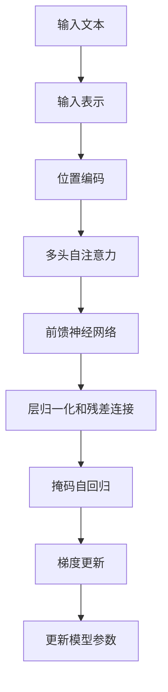

# 大语言模型原理与工程实践：案例介绍

## 1.背景介绍

随着人工智能和机器学习技术的不断发展,大型语言模型(Large Language Models, LLMs)已经成为自然语言处理领域的关键技术之一。大型语言模型是一种基于深度学习的技术,通过在海量文本数据上进行训练,学习语言的语义和语法规则,从而获得对自然语言的理解和生成能力。

近年来,随着计算能力的提升和数据量的激增,大型语言模型的规模和性能也在不断扩大。GPT-3、PaLM、ChatGPT等模型凭借其强大的语言理解和生成能力,在自然语言处理的各个领域展现出了令人惊叹的表现,包括机器翻译、文本摘要、问答系统、内容创作等,为人工智能技术的实际应用带来了新的机遇。

然而,大型语言模型的训练和部署也面临着诸多挑战,例如海量数据的获取和处理、高性能计算资源的需求、模型优化和压缩等。同时,模型的可解释性、公平性、隐私保护等方面也需要进一步探索和改进。因此,深入理解大型语言模型的原理和工程实践,对于推动该领域的发展至关重要。

## 2.核心概念与联系

### 2.1 自然语言处理(Natural Language Processing, NLP)

自然语言处理是人工智能领域的一个重要分支,旨在使计算机能够理解和生成人类语言。它涉及多个子领域,如机器翻译、文本摘要、情感分析、问答系统等。大型语言模型是自然语言处理领域的核心技术之一,为各种应用提供了强大的语言理解和生成能力。

### 2.2 深度学习(Deep Learning)

深度学习是机器学习的一个分支,它基于人工神经网络,通过对大量数据的训练,自动学习特征表示和模式,从而解决复杂的任务。大型语言模型通常采用基于Transformer的深度神经网络架构,利用自注意力机制来捕捉长距离依赖关系,从而实现对自然语言的有效建模。

### 2.3 预训练与微调(Pre-training and Fine-tuning)

大型语言模型通常采用预训练与微调的范式。首先,模型在海量无标注文本数据上进行预训练,学习通用的语言表示。然后,针对特定的下游任务,对预训练模型进行微调,使其适应特定领域和任务的需求。这种范式大大提高了模型的泛化能力和数据利用效率。

## 3.核心算法原理具体操作步骤

大型语言模型的核心算法主要基于Transformer架构,包括以下关键步骤:

1. **输入表示**:将输入文本转换为向量表示,通常采用词嵌入或子词嵌入的方式。

2. **位置编码**:由于Transformer没有递归或卷积结构,因此需要添加位置编码来捕获序列的位置信息。

3. **多头自注意力**:计算输入序列中每个元素与其他元素的注意力权重,捕捉长距离依赖关系。

4. **前馈神经网络**:对注意力输出进行非线性变换,提取更高层次的特征表示。

5. **层归一化和残差连接**:用于稳定训练过程和提高梯度流动。

6. **掩码自回归**:在预训练阶段,对输入序列进行掩码,模型需要预测被掩码的词。

7. **梯度更新**:使用优化算法(如Adam)根据损失函数计算的梯度,更新模型参数。

以上步骤通过多层Transformer块的堆叠,形成了深度的神经网络结构,从而学习到强大的语言表示能力。



## 4.数学模型和公式详细讲解举例说明

### 4.1 自注意力机制(Self-Attention Mechanism)

自注意力机制是Transformer架构的核心,它允许模型直接捕捉输入序列中任意两个位置之间的依赖关系。给定一个输入序列 $X = (x_1, x_2, ..., x_n)$,自注意力计算如下:

$$\begin{aligned}
Q &= XW^Q\\
K &= XW^K\\
V &= XW^V\\
\text{Attention}(Q, K, V) &= \text{softmax}(\frac{QK^T}{\sqrt{d_k}})V
\end{aligned}$$

其中 $Q$、$K$、$V$ 分别表示查询(Query)、键(Key)和值(Value)向量,它们通过线性变换从输入 $X$ 计算得到。$d_k$ 是缩放因子,用于防止点积过大导致的梯度饱和问题。

多头自注意力(Multi-Head Attention)是将多个注意力头的结果拼接而成,从不同的子空间捕捉不同的依赖关系:

$$\text{MultiHead}(Q, K, V) = \text{Concat}(head_1, ..., head_h)W^O$$
$$\text{where } head_i = \text{Attention}(QW_i^Q, KW_i^K, VW_i^V)$$

### 4.2 位置编码(Positional Encoding)

由于Transformer没有递归或卷积结构,因此需要添加位置编码来捕获序列的位置信息。位置编码是一种固定的向量,与输入的词嵌入相加,从而使模型能够区分不同位置的词。

对于位置 $pos$,其位置编码 $PE(pos, 2i)$ 和 $PE(pos, 2i+1)$ 分别为:

$$\begin{aligned}
PE(pos, 2i) &= \sin(pos / 10000^{2i/d_{model}})\\
PE(pos, 2i+1) &= \cos(pos / 10000^{2i/d_{model}})
\end{aligned}$$

其中 $d_{model}$ 是模型的维度,通过不同的频率对应不同的位置,从而编码位置信息。

### 4.3 掩码自回归(Masked Self-Regression)

在预训练阶段,大型语言模型通常采用掩码自回归的方式进行训练。具体来说,对于一个长度为 $n$ 的输入序列 $X = (x_1, x_2, ..., x_n)$,我们随机选择一些位置进行掩码,得到掩码后的序列 $X^{mask}$。模型的目标是根据上下文预测被掩码的词,即最大化以下条件概率:

$$\mathcal{L} = \sum_{t \in mask} \log P(x_t | X^{mask})$$

通过这种方式,模型学习到了捕捉上下文信息和预测缺失词的能力,从而获得了强大的语言理解和生成能力。

## 5.项目实践:代码实例和详细解释说明

以下是一个使用PyTorch实现的简化版Transformer模型,用于机器翻译任务。代码旨在说明Transformer的核心组件,并非完整的生产级代码。

```python
import torch
import torch.nn as nn
import math

# 位置编码
class PositionalEncoding(nn.Module):
    def __init__(self, d_model, dropout=0.1, max_len=5000):
        super(PositionalEncoding, self).__init__()
        self.dropout = nn.Dropout(p=dropout)

        pe = torch.zeros(max_len, d_model)
        position = torch.arange(0, max_len, dtype=torch.float).unsqueeze(1)
        div_term = torch.exp(torch.arange(0, d_model, 2).float() * (-math.log(10000.0) / d_model))
        pe[:, 0::2] = torch.sin(position * div_term)
        pe[:, 1::2] = torch.cos(position * div_term)
        pe = pe.unsqueeze(0)
        self.register_buffer('pe', pe)

    def forward(self, x):
        x = x + self.pe[:, :x.size(1)]
        return self.dropout(x)

# 多头自注意力
class MultiHeadAttention(nn.Module):
    def __init__(self, d_model, num_heads):
        super(MultiHeadAttention, self).__init__()
        self.num_heads = num_heads
        self.d_model = d_model

        self.W_q = nn.Linear(d_model, d_model)
        self.W_k = nn.Linear(d_model, d_model)
        self.W_v = nn.Linear(d_model, d_model)
        self.fc = nn.Linear(d_model, d_model)

    def forward(self, input_q, input_k, input_v, mask=None):
        batch_size = input_q.size(0)

        q = self.W_q(input_q).view(batch_size, -1, self.num_heads, self.d_model // self.num_heads).transpose(1, 2)
        k = self.W_k(input_k).view(batch_size, -1, self.num_heads, self.d_model // self.num_heads).transpose(1, 2)
        v = self.W_v(input_v).view(batch_size, -1, self.num_heads, self.d_model // self.num_heads).transpose(1, 2)

        attn_scores = torch.matmul(q, k.transpose(-2, -1)) / math.sqrt(self.d_model // self.num_heads)
        if mask is not None:
            attn_scores = attn_scores.masked_fill(mask == 0, -1e9)
        attn_probs = nn.Softmax(dim=-1)(attn_scores)
        context = torch.matmul(attn_probs, v)
        context = context.transpose(1, 2).contiguous().view(batch_size, -1, self.d_model)
        output = self.fc(context)
        return output

# 前馈神经网络
class FeedForward(nn.Module):
    def __init__(self, d_model, d_ff, dropout=0.1):
        super(FeedForward, self).__init__()
        self.linear1 = nn.Linear(d_model, d_ff)
        self.dropout = nn.Dropout(dropout)
        self.linear2 = nn.Linear(d_ff, d_model)

    def forward(self, x):
        x = self.linear1(x)
        x = nn.ReLU()(x)
        x = self.dropout(x)
        x = self.linear2(x)
        return x

# Transformer编码器层
class EncoderLayer(nn.Module):
    def __init__(self, d_model, num_heads, d_ff, dropout=0.1):
        super(EncoderLayer, self).__init__()
        self.attn = MultiHeadAttention(d_model, num_heads)
        self.ff = FeedForward(d_model, d_ff, dropout)
        self.layernorm1 = nn.LayerNorm(d_model)
        self.layernorm2 = nn.LayerNorm(d_model)
        self.dropout1 = nn.Dropout(dropout)
        self.dropout2 = nn.Dropout(dropout)

    def forward(self, x, mask=None):
        attn_output = self.attn(x, x, x, mask)
        attn_output = self.dropout1(attn_output)
        out1 = self.layernorm1(x + attn_output)

        ffn_output = self.ff(out1)
        ffn_output = self.dropout2(ffn_output)
        out2 = self.layernorm2(out1 + ffn_output)
        return out2

# Transformer解码器层
class DecoderLayer(nn.Module):
    def __init__(self, d_model, num_heads, d_ff, dropout=0.1):
        super(DecoderLayer, self).__init__()
        self.self_attn = MultiHeadAttention(d_model, num_heads)
        self.enc_attn = MultiHeadAttention(d_model, num_heads)
        self.ff = FeedForward(d_model, d_ff, dropout)
        self.layernorm1 = nn.LayerNorm(d_model)
        self.layernorm2 = nn.LayerNorm(d_model)
        self.layernorm3 = nn.LayerNorm(d_model)
        self.dropout1 = nn.Dropout(dropout)
        self.dropout2 = nn.Dropout(dropout)
        self.dropout3 = nn.Dropout(dropout)

    def forward(self, x, enc_output, self_mask=None, enc_mask=None):
        self_attn_output = self.self_attn(x, x, x, self_mask)
        self_attn_output = self.dropout1(self_attn_output)
        out1 = self.layernorm1(x + self_attn_output)

        enc_attn_output = self.enc_attn(out1, enc_output, enc_output, enc_mask)
        enc_attn_output = self.dropout2(enc_attn_output)
        out2 = self.layernorm2(out1 + enc_attn_output)

        ffn_output = self.ff(out2)
        ffn_output = self.dropout3(ffn_output)
        out3 = self.layernorm3(out2 + ffn_output)
        return out3

# Transformer模型
class Transformer(nn