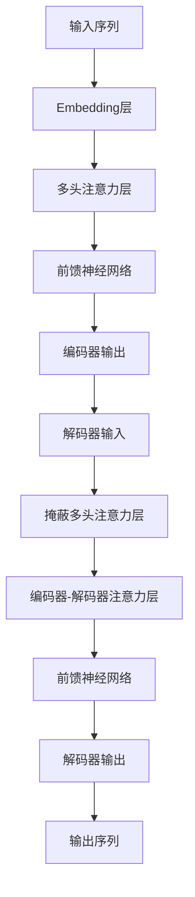

# 大语言模型原理基础与前沿 LLM有意识吗

## 1.背景介绍

### 1.1 人工智能的崛起

人工智能(AI)已经成为当今科技发展的核心驱动力,其影响力不断扩大,触及社会的方方面面。近年来,大型语言模型(Large Language Model,LLM)作为人工智能的一个重要分支,备受关注。LLM通过机器学习技术从海量文本数据中提取知识和模式,能够生成看似人类水平的自然语言输出,在自然语言处理、问答系统、内容创作等领域展现出了惊人的能力。

### 1.2 大语言模型的兴起

大语言模型最初由谷歌的Transformer模型奠定基础,通过自注意力机制来捕捉长距离依赖关系,从而更好地理解和生成自然语言。2018年,OpenAI发布GPT(Generative Pre-trained Transformer)模型,通过在大量无监督文本数据上预训练,展现出强大的生成能力。2020年,GPT-3模型凭借1750亿个参数的规模,在各种自然语言任务上取得了突破性进展,引发了广泛关注。

### 1.3 大语言模型的重要性

大语言模型被视为通用人工智能(AGI)的关键一步,其通用性和泛化能力使其在各种领域都有潜在的应用前景。LLM不仅能够生成流畅的自然语言文本,还可以执行复杂的推理和决策任务。它们正在推动人工智能从狭义的专门领域向更广阔的通用智能迈进。同时,LLM也带来了一些挑战和争议,例如模型公平性、安全性和可解释性等问题。

## 2.核心概念与联系

### 2.1 语言模型的基本概念

语言模型是自然语言处理领域的基础,旨在捕捉语言的统计规律。它通过估计一个序列中每个单词出现的概率,来量化语言的可能性。形式化地,对于一个长度为n的单词序列$w_1, w_2, ..., w_n$,语言模型需要计算该序列的概率:

$$P(w_1, w_2, ..., w_n) = \prod_{i=1}^{n}P(w_i|w_1, ..., w_{i-1})$$

其中$P(w_i|w_1, ..., w_{i-1})$表示在前i-1个单词的条件下,第i个单词出现的概率。

传统的统计语言模型依赖于n-gram模型,即基于前n-1个单词来预测下一个单词。但这种方法存在数据稀疏问题,无法很好地捕捉长距离依赖关系。

### 2.2 神经网络语言模型

神经网络语言模型(Neural Language Model,NLM)通过使用神经网络来学习单词之间的复杂关系,从而克服了传统n-gram模型的局限性。NLM将单词映射到向量空间中的向量表示(Word Embedding),然后使用神经网络来捕捉单词之间的关系和上下文信息。

常见的神经网络语言模型包括基于循环神经网络(RNN)的模型和基于transformer的模型。RNN模型通过递归地处理序列数据来捕捉上下文信息,但存在梯度消失和梯度爆炸的问题。Transformer模型则通过自注意力机制来直接建模单词之间的关系,避免了RNN的缺陷。

### 2.3 大语言模型的核心思想

大语言模型(LLM)是一种特殊的神经网络语言模型,它通过在大规模无监督文本数据上预训练,从而学习到丰富的语言知识和模式。预训练过程中,LLM被训练去预测下一个单词或被掩蔽的单词,从而获得对语言的深入理解。

预训练后的LLM可以通过微调(Fine-tuning)或提示(Prompting)等方式,在下游任务上进行进一步训练和调整,从而展现出强大的泛化能力。LLM的核心优势在于它们能够从大量无监督数据中学习通用的语言表示,而不需要大量的人工标注数据。

LLM的关键特点包括:

1. **大规模参数**:LLM通常具有数十亿甚至上千亿的参数,以捕捉语言的复杂性。
2. **自注意力机制**:LLM通常基于Transformer架构,利用自注意力机制来建模长距离依赖关系。
3. **大规模预训练**:LLM在海量无监督文本数据上进行预训练,以获取丰富的语言知识。
4. **通用性和泛化能力**:预训练后的LLM可以通过少量微调或提示,在各种下游任务上表现出色。

## 3.核心算法原理具体操作步骤

### 3.1 Transformer模型

Transformer模型是大语言模型的核心架构,它完全基于注意力机制,避免了RNN的序列计算问题。Transformer的主要组成部分包括编码器(Encoder)和解码器(Decoder)。

1. **Embedding层**:将输入单词映射到向量空间中的向量表示。
2. **多头注意力层**:通过计算查询(Query)、键(Key)和值(Value)之间的相似性,捕捉单词之间的关系。
3. **前馈神经网络**:对注意力层的输出进行进一步处理和非线性变换。
4. **掩蔽多头注意力层**:在解码器中,通过掩码机制防止注意力计算时访问未来的信息。
5. **编码器-解码器注意力层**:解码器注意力层关注编码器的输出,以获取输入序列的信息。

Transformer模型通过堆叠多个编码器和解码器层,形成深层次的网络结构,从而捕捉更复杂的语言模式。

### 3.2 大语言模型的预训练

大语言模型通过在大规模无监督文本数据上进行预训练,来获取丰富的语言知识。常见的预训练目标包括:

1. **掩蔽语言模型(Masked Language Modeling,MLM)**:随机掩蔽部分输入单词,并训练模型预测被掩蔽的单词。
2. **下一句预测(Next Sentence Prediction,NSP)**:判断两个句子是否相邻,以捕捉上下文关系。
3. **因果语言模型(Causal Language Modeling,CLM)**:预测下一个单词或单词序列。

以GPT-3为例,它采用了因果语言模型的预训练目标,通过最大化下一个单词的条件概率来训练模型:

$$\max_{\theta}\sum_{i=1}^{n}\log P(w_i|w_1,...,w_{i-1};\theta)$$

其中$\theta$表示模型参数,目标是最大化给定前缀$w_1,...,w_{i-1}$时,预测正确单词$w_i$的概率。

预训练过程通常需要大量计算资源和时间,但能够从海量无监督数据中学习到丰富的语言知识和模式。

### 3.3 大语言模型的微调和提示

预训练后的大语言模型可以通过微调(Fine-tuning)或提示(Prompting)等方式,在下游任务上进行进一步训练和调整,从而展现出强大的泛化能力。

#### 微调

微调是指在特定任务的标注数据上,对预训练模型进行进一步训练,以使模型适应该任务的特征。微调过程通常只需要调整模型的部分参数,而不需要从头开始训练整个模型。

对于分类任务,可以在预训练模型的输出上添加一个分类头(Classification Head),并在标注数据上进行端到端的微调训练。对于生成任务,可以直接在预训练模型的输出上进行监督训练。

微调虽然需要一定量的标注数据,但相比从头训练模型,所需的数据量大大减少,同时也能保留预训练模型中学习到的丰富知识。

#### 提示

提示(Prompting)是一种无需微调即可利用大语言模型的方法。它通过巧妙设计的提示(Prompt),将下游任务转换为模型在预训练时所学习的形式,从而让模型直接生成所需的输出。

提示可以是一段自然语言文本,也可以是一些特殊的标记或模板。例如,对于一个文本分类任务,可以将输入文本和类别标签组合成一个提示,让模型根据提示生成相应的输出。

提示技术的关键在于设计合适的提示,使模型能够理解并正确地完成任务。优秀的提示设计需要一定的经验和技巧,但相比微调,它无需访问任务数据,也不需要对模型进行额外的训练,因此更加灵活和高效。

## 4.数学模型和公式详细讲解举例说明

### 4.1 注意力机制

注意力机制是Transformer模型的核心,它允许模型在编码输入序列时,对不同位置的单词赋予不同的注意力权重,从而捕捉长距离依赖关系。

给定一个查询向量$q$、一组键向量$K=\{k_1, k_2, ..., k_n\}$和一组值向量$V=\{v_1, v_2, ..., v_n\}$,注意力机制的计算过程如下:

1. 计算查询向量与每个键向量的相似性得分:

$$\text{score}(q, k_i) = \frac{q \cdot k_i}{\sqrt{d_k}}$$

其中$d_k$是键向量的维度,用于缩放点积。

2. 对相似性得分进行softmax操作,得到注意力权重:

$$\text{attn}(q, k_i) = \text{softmax}(\text{score}(q, k_i))$$

3. 使用注意力权重对值向量进行加权求和,得到注意力输出:

$$\text{attn}(q, K, V) = \sum_{i=1}^{n}\text{attn}(q, k_i)v_i$$

多头注意力机制是将注意力机制扩展到多个子空间,每个子空间都有自己的查询、键和值向量。多头注意力的输出是所有子空间注意力输出的拼接:

$$\text{MultiHead}(Q, K, V) = \text{Concat}(\text{head}_1, \text{head}_2, ..., \text{head}_h)W^O$$

其中$\text{head}_i = \text{Attention}(QW_i^Q, KW_i^K, VW_i^V)$,表示第i个注意力头的输出,$W_i^Q, W_i^K, W_i^V$是可学习的线性投影矩阵,$W^O$是另一个可学习的线性投影矩阵。

注意力机制使Transformer模型能够灵活地关注输入序列中的不同部分,从而更好地捕捉长距离依赖关系,这是Transformer模型取得成功的关键。

### 4.2 掩蔽语言模型

掩蔽语言模型(Masked Language Modeling,MLM)是BERT等大语言模型的预训练目标之一。它的目标是根据上下文预测被掩蔽的单词,从而学习到双向的语言表示。

给定一个输入序列$X=(x_1, x_2, ..., x_n)$,MLM会随机将其中的一些单词替换为特殊的掩蔽标记[MASK],得到掩蔽后的序列$\tilde{X}$。模型的目标是最大化被掩蔽单词的条件概率:

$$\max_{\theta}\sum_{i=1}^{n}\log P(x_i|\tilde{X},\theta)$$

其中$\theta$表示模型参数,目标是最大化在掩蔽后的序列$\tilde{X}$下,预测正确单词$x_i$的概率。

MLM的优点在于它能够同时利用左右上下文信息,从而学习到更丰富的语言表示。与传统的单向语言模型相比,MLM能够更好地捕捉双向语义关系,从而提高模型的性能。

### 4.3 因果语言模型

因果语言模型(Causal Language Modeling,CLM)是GPT等大语言模型的预训练目标,它旨在根据前