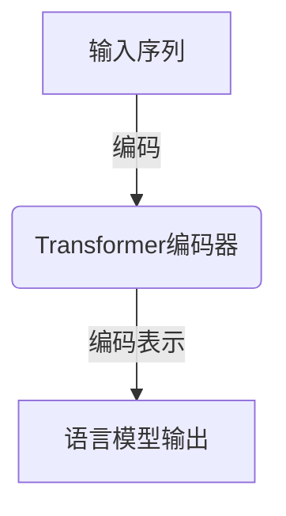
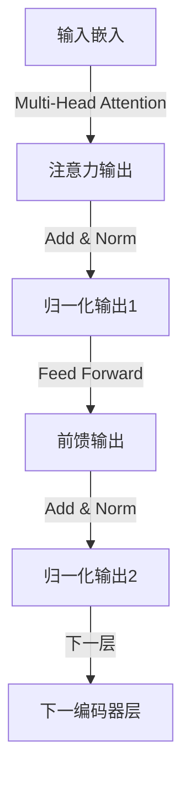
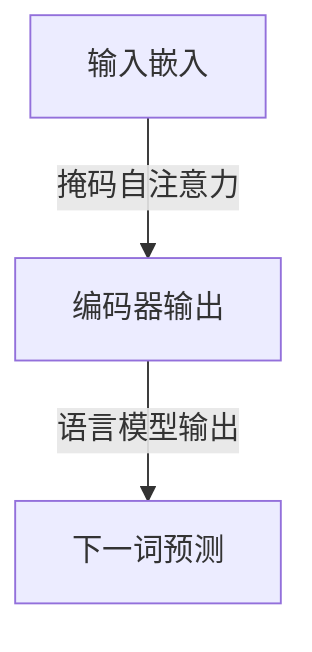

# 大语言模型原理基础与前沿 Transformer编码器模块

## 1. 背景介绍

### 1.1 人工智能的发展历程

人工智能(Artificial Intelligence, AI)是当代科技发展的重要领域,旨在使机器能够模拟人类的认知能力,如学习、推理、感知和决策等。自20世纪50年代诞生以来,人工智能经历了几个重要的发展阶段。

### 1.2 自然语言处理(NLP)的重要性

随着信息时代的到来,自然语言处理(Natural Language Processing, NLP)成为人工智能的核心应用领域之一。NLP致力于使计算机能够理解和生成人类自然语言,广泛应用于机器翻译、问答系统、文本分类和摘要等场景。

### 1.3 大语言模型的兴起

传统的NLP模型通常基于统计机器学习方法,需要手动设计特征并受限于数据规模。近年来,随着深度学习的兴起和大规模语料库的出现,大语言模型(Large Language Model, LLM)凭借其强大的表示能力和泛化性能,成为NLP领域的研究热点。

## 2. 核心概念与联系

### 2.1 语言模型

语言模型是NLP的基础,旨在捕捉语言的统计规律。形式化地,给定一个文本序列$X=(x_1, x_2, ..., x_n)$,语言模型的目标是估计该序列的概率$P(X)$。根据链式法则,我们可以将$P(X)$分解为:

$$P(X) = \prod_{i=1}^{n}P(x_i|x_1, ..., x_{i-1})$$

其中$P(x_i|x_1, ..., x_{i-1})$表示在给定前缀$x_1, ..., x_{i-1}$的条件下,生成单词$x_i$的概率。

### 2.2 神经网络语言模型

传统的统计语言模型通常基于n-gram或者最大熵模型,但它们无法很好地捕捉长距离依赖关系。神经网络语言模型(Neural Network Language Model, NNLM)则利用神经网络的强大表示能力,可以更好地建模长距离依赖。

### 2.3 Transformer模型

Transformer是一种全新的基于注意力机制(Attention Mechanism)的神经网络架构,可以高效地捕捉序列中的长距离依赖关系。它不仅在机器翻译等序列到序列(Sequence-to-Sequence)任务中表现出色,也被广泛应用于语言模型等领域。

Transformer的核心组件包括编码器(Encoder)和解码器(Decoder)模块。编码器用于编码输入序列,解码器则根据编码器的输出生成目标序列。在语言模型任务中,通常只使用Transformer的编码器模块。



## 3. 核心算法原理具体操作步骤

### 3.1 Transformer编码器模块

Transformer编码器模块的核心是多头注意力机制(Multi-Head Attention)和前馈神经网络(Feed-Forward Neural Network)。每个编码器层由这两个子层组成,并使用残差连接(Residual Connection)和层归一化(Layer Normalization)来促进梯度传播。



#### 3.1.1 多头注意力机制

多头注意力机制是Transformer的核心部分,它允许模型同时关注输入序列的不同位置。具体来说,对于一个长度为$n$的输入序列$X=(x_1, x_2, ..., x_n)$,多头注意力机制首先将其线性映射为查询(Query)、键(Key)和值(Value)向量:

$$\begin{aligned}
Q &= XW^Q\\
K &= XW^K\\
V &= XW^V
\end{aligned}$$

其中$W^Q$、$W^K$和$W^V$分别是可学习的权重矩阵。然后,注意力分数通过查询和键的点积计算:

$$\text{Attention}(Q, K, V) = \text{softmax}\left(\frac{QK^T}{\sqrt{d_k}}\right)V$$

其中$d_k$是缩放因子,用于防止点积的值过大或过小。注意力分数表示了输入序列中不同位置对当前位置的重要性。

为了捕捉不同的注意力模式,多头注意力机制将注意力过程独立运行$h$次(即$h$个注意力头),然后将它们的结果拼接起来:

$$\text{MultiHead}(Q, K, V) = \text{Concat}(\text{head}_1, ..., \text{head}_h)W^O$$

其中$\text{head}_i = \text{Attention}(QW_i^Q, KW_i^K, VW_i^V)$,而$W_i^Q$、$W_i^K$、$W_i^V$和$W^O$都是可学习的权重矩阵。

#### 3.1.2 前馈神经网络

每个编码器层中的前馈神经网络是一个简单的全连接前馈网络,它对每个位置的输入进行独立的位置wise前馈计算:

$$\text{FFN}(x) = \max(0, xW_1 + b_1)W_2 + b_2$$

其中$W_1$、$W_2$、$b_1$和$b_2$是可学习的权重和偏置参数。前馈神经网络为模型引入了非线性变换,有助于捕捉更复杂的特征。

### 3.2 位置编码

由于Transformer没有使用循环或卷积神经网络,因此它无法直接捕捉序列的位置信息。为了解决这个问题,Transformer在输入嵌入中添加了位置编码(Positional Encoding),以显式地编码每个位置的相对或绝对位置信息。

常见的位置编码方法包括:

1. **正弦位置编码**:使用正弦函数对位置进行编码,具有周期性和相对位置编码的特点。
2. **学习位置编码**:将位置编码作为可学习的参数,由模型在训练过程中自动学习。

### 3.3 掩码自注意力

在语言模型任务中,我们希望模型能够基于前缀预测下一个词。为了实现这一点,Transformer编码器使用了掩码自注意力(Masked Self-Attention)机制,它只允许每个位置关注其之前的位置,而忽略之后的位置。

这可以通过在计算注意力分数时,将查询和键之间的未来位置的分数设置为负无穷大,从而在softmax操作后将其完全屏蔽。



## 4. 数学模型和公式详细讲解举例说明

在上一节中,我们介绍了Transformer编码器模块的核心算法原理。现在,让我们通过一个具体的例子来详细说明其中涉及的数学模型和公式。

假设我们有一个长度为4的输入序列"The cat sat on"。我们将使用一个单头注意力机制和一个单层前馈神经网络来计算编码器的输出。为了简化计算,我们假设查询、键和值的维度为2,前馈网络的隐藏层大小为4。

### 4.1 输入嵌入和位置编码

首先,我们将输入序列映射为词嵌入向量,并添加正弦位置编码:

```python
输入词嵌入 = [[0.1, 0.2], [0.3, 0.4], [0.5, 0.6], [0.7, 0.8]]
位置编码 = [[0.0, 0.1], [0.2, 0.3], [0.4, 0.5], [0.6, 0.7]]
输入嵌入 = 输入词嵌入 + 位置编码
```

输入嵌入结果为:

$$
\begin{bmatrix}
0.1 & 0.3\\
0.5 & 0.7\\
0.9 & 1.1\\
1.3 & 1.5
\end{bmatrix}
$$

### 4.2 多头注意力机制

接下来,我们计算单头注意力机制的输出。首先,我们将输入嵌入线性映射为查询、键和值向量:

$$
\begin{aligned}
Q &= \begin{bmatrix}
0.1 & 0.3\\
0.5 & 0.7\\
0.9 & 1.1\\
1.3 & 1.5
\end{bmatrix} \begin{bmatrix}
1 & 0\\
0 & 1
\end{bmatrix} = \begin{bmatrix}
0.1 & 0.3\\
0.5 & 0.7\\
0.9 & 1.1\\
1.3 & 1.5
\end{bmatrix}\\
K &= \begin{bmatrix}
0.1 & 0.3\\
0.5 & 0.7\\
0.9 & 1.1\\
1.3 & 1.5
\end{bmatrix} \begin{bmatrix}
1 & 0\\
0 & 1
\end{bmatrix} = \begin{bmatrix}
0.1 & 0.3\\
0.5 & 0.7\\
0.9 & 1.1\\
1.3 & 1.5
\end{bmatrix}\\
V &= \begin{bmatrix}
0.1 & 0.3\\
0.5 & 0.7\\
0.9 & 1.1\\
1.3 & 1.5
\end{bmatrix} \begin{bmatrix}
1 & 0\\
0 & 1
\end{bmatrix} = \begin{bmatrix}
0.1 & 0.3\\
0.5 & 0.7\\
0.9 & 1.1\\
1.3 & 1.5
\end{bmatrix}
\end{aligned}
$$

然后,我们计算注意力分数矩阵:

$$
\text{Attention}(Q, K, V) = \text{softmax}\left(\frac{QK^T}{\sqrt{2}}\right)V
$$

其中$QK^T$为:

$$
QK^T = \begin{bmatrix}
0.1 & 0.3\\
0.5 & 0.7\\
0.9 & 1.1\\
1.3 & 1.5
\end{bmatrix} \begin{bmatrix}
0.1 & 0.5 & 0.9 & 1.3\\
0.3 & 0.7 & 1.1 & 1.5
\end{bmatrix} = \begin{bmatrix}
0.01 & 0.03 & 0.09 & 0.19\\
0.05 & 0.14 & 0.45 & 0.95\\
0.09 & 0.25 & 0.81 & 1.71\\
0.13 & 0.36 & 1.17 & 2.47
\end{bmatrix}
$$

由于我们使用掩码自注意力,因此需要将未来位置的分数设置为负无穷大:

$$
\text{Masked}(QK^T) = \begin{bmatrix}
0.01 & 0.03 & 0.09 & -\infty\\
0.05 & 0.14 & 0.45 & -\infty\\
0.09 & 0.25 & 0.81 & -\infty\\
0.13 & 0.36 & 1.17 & 2.47
\end{bmatrix}
$$

经过softmax操作后,我们得到注意力分数矩阵:

$$
\text{Attention Scores} = \text{softmax}\left(\frac{\text{Masked}(QK^T)}{\sqrt{2}}\right) = \begin{bmatrix}
0.37 & 0.26 & 0.37 & 0.00\\
0.18 & 0.27 & 0.55 & 0.00\\
0.11 & 0.22 & 0.67 & 0.00\\
0.03 & 0.09 & 0.28 & 0.60
\end{bmatrix}
$$

最后,我们将注意力分数与值向量相乘,得到注意力输出:

$$
\text{Attention Output} = \text{Attention Scores} \cdot V = \begin{bmatrix}
0.11 & 0.33\\
0.27 & 0.66\\
0.42 & 0.99\\
0.57 & 1.32
\end{bmatrix}
$$

### 4.3 前馈神经网络

接下来,我们计算前馈神经网络的输出。假设权重矩阵和偏置向量如下:

$$
\begin{aligned}
W_1 &= \begin{bmatrix}
1 & 0