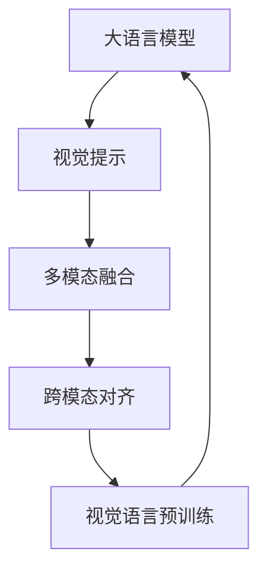

# 大语言模型原理基础与前沿 作为大语言模型提示的视觉输入

## 1.背景介绍
近年来,大语言模型(Large Language Models,LLMs)在自然语言处理(Natural Language Processing,NLP)领域取得了巨大的突破和进展。从GPT-3到ChatGPT,再到最新的GPT-4,大语言模型展现出了惊人的自然语言理解和生成能力,引发了学术界和工业界的广泛关注。

大语言模型是基于海量文本数据训练的深度神经网络模型,通过自监督学习的方式,学习自然语言的统计规律和语义表示。与传统的NLP模型不同,大语言模型能够在没有显式监督的情况下,从海量无标注数据中自主学习语言知识,具备强大的语言理解和生成能力。

然而,大语言模型目前主要基于文本形式的输入和输出,对于图像、视频等视觉信息的理解和生成能力还比较有限。如何将视觉信息引入大语言模型,增强其多模态理解和生成能力,是当前大语言模型研究的一个重要方向。

本文将从大语言模型的基本原理出发,探讨如何将视觉信息作为大语言模型的提示(prompt),增强其多模态理解和生成能力。我们将介绍相关的核心概念、算法原理、数学模型,并结合具体的项目实践和应用场景,展望大语言模型未来的发展趋势和挑战。

## 2.核心概念与联系
### 2.1 大语言模型
大语言模型是基于深度神经网络,利用海量文本数据进行预训练得到的语言模型。其核心思想是通过自监督学习,让模型从大规模无标注数据中自主学习语言的统计规律和语义表示,从而获得强大的语言理解和生成能力。

大语言模型通常采用Transformer等注意力机制的神经网络架构,包含了海量的参数(从几亿到上千亿)。通过预训练,这些参数学习到了丰富的语言知识,能够完成各种NLP任务,如文本分类、命名实体识别、问答、对话、摘要、翻译等。

### 2.2 视觉提示
视觉提示(Visual Prompt)是指将视觉信息作为大语言模型的输入,引导其进行视觉感知的多模态理解和生成。传统的大语言模型主要基于文本形式的输入,对图像、视频等视觉信息的理解能力有限。

视觉提示的引入,可以将视觉信息编码为连续的向量表示,与文本形式的提示一起输入到大语言模型中。这种多模态融合的方式,能够增强大语言模型对视觉语义的理解,使其具备跨模态推理和生成的能力。

### 2.3 多模态融合
多模态融合是指将不同模态(如文本、图像、音频、视频等)的信息进行有机结合,形成统一的语义表示。在视觉提示的场景下,多模态融合主要指将视觉信息与文本信息进行融合,使大语言模型能够同时理解和生成多模态内容。

多模态融合可以分为早期融合和晚期融合两种方式。早期融合是在输入端将不同模态的特征拼接或混合,形成统一的多模态表示;晚期融合则是在输出端或中间层将不同模态的信息进行交互和整合。

### 2.4 跨模态对齐
跨模态对齐是指在多模态融合的过程中,将不同模态的信息在语义层面进行匹配和对齐。由于不同模态的信息具有不同的特征和分布,如何找到它们之间的语义对应关系,是实现有效多模态融合的关键。

跨模态对齐可以通过对比学习、注意力机制、图神经网络等技术来实现。其核心思想是学习不同模态之间的语义相似性,将它们映射到一个共同的语义空间,从而实现语义层面的对齐和融合。

### 2.5 视觉语言预训练
视觉语言预训练是指利用大规模的图文对数据,对视觉模型和语言模型进行联合预训练,使其学习到视觉语言的对齐关系和交互规律。常见的视觉语言预训练任务包括图像描述、视觉问答、图文匹配等。

通过视觉语言预训练,视觉模型能够学习到更加语义化的视觉表示,语言模型也能够学习到如何根据视觉信息生成相应的文本描述。这为视觉提示在大语言模型中的应用奠定了基础。

### 核心概念联系

上图展示了视觉提示在大语言模型中的核心概念以及它们之间的联系。大语言模型通过引入视觉提示,实现多模态融合,通过跨模态对齐和视觉语言预训练,增强了其视觉语言理解和生成能力,形成了视觉语言统一建模的范式。

## 3.核心算法原理具体操作步骤
视觉提示在大语言模型中的应用,涉及到多个关键算法和操作步骤。下面我们将详细介绍其中的几个核心算法原理。

### 3.1 视觉特征提取
将视觉信息引入大语言模型的第一步,是对图像或视频进行特征提取,得到紧凑的向量表示。常用的视觉特征提取方法包括:

1. 卷积神经网络(CNN):利用预训练的CNN模型(如ResNet、ViT等)对图像进行编码,提取其高层语义特征。
2. 目标检测和分割:通过目标检测和分割模型(如Faster R-CNN、Mask R-CNN等),识别图像中的关键目标和区域,提取局部特征。
3. 视频理解:对于视频数据,可以使用3D CNN、LSTM等模型,提取时空特征,捕捉视频的动态信息。

视觉特征提取的目标是将高维的图像或视频数据转化为固定长度的特征向量,为后续的多模态融合做准备。

### 3.2 文本特征提取
大语言模型擅长处理文本数据,因此需要将文本信息也转化为向量表示。常用的文本特征提取方法包括:

1. 词嵌入:将每个单词映射为一个固定长度的稠密向量,捕捉单词的语义信息。可以使用预训练的词嵌入模型如Word2Vec、GloVe等。
2. 句子编码:对整个句子或文本段落进行编码,得到句子级别的特征表示。可以使用RNN、Transformer等序列建模模型。
3. 语言模型:利用预训练的语言模型(如BERT、GPT等),对文本进行上下文感知的编码,捕捉词语之间的依赖关系。

文本特征提取的目标是将离散的文本信息转化为连续的向量表示,为多模态融合提供统一的特征格式。

### 3.3 多模态融合
多模态融合是将视觉特征和文本特征进行有机结合,形成统一的多模态表示。常用的多模态融合方法包括:

1. 拼接融合:将视觉特征和文本特征直接拼接在一起,形成一个长向量。这种方法简单直观,但忽略了模态之间的交互。
2. 注意力融合:通过注意力机制,让模型自动学习不同模态之间的关联和权重分配。常见的有协同注意力、交叉注意力等。
3. 双线性池化:通过双线性函数,对视觉特征和文本特征进行外积交互,捕捉它们之间的高阶关系。
4. 多模态Transformer:将视觉特征和文本特征输入到Transformer的编码器中,通过自注意力机制实现多模态融合和交互。

多模态融合的关键是学习视觉和文本信息之间的语义对齐和交互,形成一个统一的多模态语义空间。

### 3.4 跨模态对齐
跨模态对齐是在多模态融合的基础上,进一步优化不同模态之间的语义对齐。常用的跨模态对齐方法包括:

1. 对比学习:通过构建正负样本对,最小化正样本对的距离,最大化负样本对的距离,学习不同模态之间的语义相似性。
2. 对抗学习:引入对抗损失,让模型生成的多模态表示能够欺骗判别器,从而实现模态之间的分布对齐。
3. 循环一致性:通过循环重构的方式,让模型能够从一个模态的表示恢复另一个模态的信息,保证模态之间的语义一致性。

跨模态对齐的目标是最小化不同模态之间的语义鸿沟,使得模型能够在统一的语义空间中进行推理和生成。

### 3.5 视觉语言预训练
视觉语言预训练是在大规模图文对数据上,对视觉模型和语言模型进行联合优化,学习视觉语言的对齐关系和交互规律。常见的视觉语言预训练任务包括:

1. 图像描述:给定图像,生成相应的文本描述。通过最大化图像和描述之间的互信息,学习视觉语言的生成能力。
2. 视觉问答:给定图像和问题,预测正确的答案。通过学习图像、问题和答案之间的三元关系,增强视觉语言的理解能力。
3. 图文匹配:给定图像和文本,判断它们是否匹配。通过对比匹配和不匹配的图文对,学习视觉语言的对齐关系。
4. 掩码语言建模:随机掩盖图像的一部分区域或文本的一些词语,让模型预测被掩盖的内容。通过自监督的方式,学习视觉语言的上下文表示。

视觉语言预训练的关键是在大规模数据上,让视觉模型和语言模型相互促进,形成紧密的视觉语言对齐和交互,为下游的多模态任务提供良好的初始化。

## 4.数学模型和公式详细讲解举例说明
在视觉提示的大语言模型中,涉及到多个关键的数学模型和公式。下面我们将详细讲解其中的几个重要模型,并给出具体的数学公式和举例说明。

### 4.1 多模态Transformer
多模态Transformer是一种基于自注意力机制的神经网络模型,用于实现视觉和文本信息的融合与交互。其核心思想是将视觉特征和文本特征输入到Transformer的编码器中,通过自注意力机制学习不同模态之间的关联和权重分配。

假设我们有一个图像特征矩阵$V\in\mathbb{R}^{n\times d_v}$和一个文本特征矩阵$T\in\mathbb{R}^{m\times d_t}$,其中$n$和$m$分别表示图像和文本的序列长度,$d_v$和$d_t$表示它们的特征维度。多模态Transformer的计算过程如下:

1. 将图像特征$V$和文本特征$T$分别乘以映射矩阵$W_v\in\mathbb{R}^{d_v\times d}$和$W_t\in\mathbb{R}^{d_t\times d}$,得到统一维度的特征表示:

$$
\begin{aligned}
\hat{V} &= VW_v \\
\hat{T} &= TW_t
\end{aligned}
$$

2. 将$\hat{V}$和$\hat{T}$拼接在一起,得到多模态输入序列$X\in\mathbb{R}^{(n+m)\times d}$:

$$
X = [\hat{V}; \hat{T}]
$$

3. 对$X$进行自注意力计算,得到注意力权重矩阵$A\in\mathbb{R}^{(n+m)\times(n+m)}$:

$$
A = \text{softmax}(\frac{QK^T}{\sqrt{d}})
$$

其中,$Q=XW_q, K=XW_k, V=XW_v$分别表示查询、键、值矩阵,$W_q,W_k,W_v\in\mathbb{R}^{d\times d}$为可学习的参数矩阵。

4. 将注意力权重矩阵$A$与值矩阵$V$相乘,得到注意力