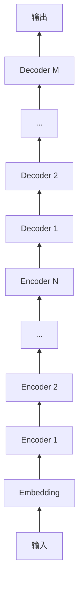

# 大语言模型原理基础与前沿 在单个GPU上一天内训练一个语言模型

## 1. 背景介绍
### 1.1 大语言模型的兴起
近年来,随着深度学习技术的快速发展,大语言模型(Large Language Model,LLM)在自然语言处理(Natural Language Processing,NLP)领域取得了突破性的进展。LLM通过在海量文本数据上进行预训练,能够学习到丰富的语言知识和语义信息,在机器翻译、对话系统、文本生成等任务上表现出色。

### 1.2 训练效率的挑战
然而,训练一个高质量的大语言模型通常需要庞大的计算资源和漫长的训练时间。动辄数十亿甚至上百亿参数的模型规模,对计算力和内存都提出了极高的要求。如何在有限的硬件条件下,高效地训练出一个性能优异的语言模型,成为了NLP研究者们的一大挑战。

### 1.3 本文的目标与贡献
本文将探讨如何利用优化的训练方法和技巧,在单个消费级GPU上,在一天内完成一个语言模型的训练。我们将详细介绍相关的核心概念、算法原理、数学模型以及实践经验,为读者提供一个全面的指南。通过本文的学习,你将掌握在资源受限情况下训练大语言模型的关键要点,并能够将这些技术应用到自己的NLP项目中。

## 2. 核心概念与联系
### 2.1 语言模型
语言模型是一种对语言进行建模的方法,旨在学习语言的统计规律和模式。给定一个单词序列,语言模型能够估计整个序列出现的概率。一个好的语言模型应当能够区分出合理的句子和不合理的句子。常见的语言模型有 n-gram 模型、循环神经网络语言模型(RNN-LM)、Transformer语言模型(如GPT系列)等。

### 2.2 预训练与微调
预训练(Pre-training)是指在大规模无标注语料上进行自监督学习,让模型自主学习语言的通用表征。在此基础上,我们可以在下游任务的标注数据集上对预训练模型进行微调(Fine-tuning),使其适应具体任务。这种"预训练+微调"的范式能够显著提升模型性能,减少对标注数据的依赖。

### 2.3 自回归语言模型
自回归语言模型(Auto-regressive Language Model)是一类重要的语言模型,它通过迭代地预测下一个单词,来生成连贯的文本。形式化地,给定单词序列 $x=(x_1,\cdots,x_T)$,自回归语言模型的目标是最大化条件概率 $p(x)=\prod_{t=1}^T p(x_t|x_{<t})$。GPT系列模型就是典型的自回归语言模型。

### 2.4 Transformer 架构
Transformer 是一种基于自注意力机制(Self-attention)的神经网络架构,广泛应用于自然语言处理任务。相比RNN/LSTM,Transformer能够更高效地建模长距离依赖,成为大语言模型的首选架构。Transformer由若干个编码器(Encoder)和解码器(Decoder)层组成,每一层包含自注意力子层和前馈神经网络子层。



## 3. 核心算法原理具体操作步骤
接下来,我们将详细介绍如何在单个GPU上高效训练一个语言模型的核心算法和步骤。

### 3.1 数据准备
1. 选择合适的语料库,如维基百科、新闻语料等,确保语料的质量和覆盖面。
2. 对语料进行清洗和预处理,去除噪声和无意义的内容。
3. 使用字节对编码(Byte Pair Encoding,BPE)或 WordPiece 等方法对语料进行分词,平衡词汇表大小和 OOV 问题。
4. 将处理后的语料划分为训练集、验证集和测试集。

### 3.2 模型设计
1. 选择合适的 Transformer 模型配置,如层数、隐藏层维度、注意力头数等,权衡模型容量和计算效率。
2. 设计输入表示,将离散的单词映射为连续的词嵌入向量。可以随机初始化,也可以使用预训练的词向量。
3. 在 Transformer 的基础上,根据任务需求添加必要的组件,如语言模型头、下游任务的输出层等。
4. 初始化模型参数,采用合适的初始化策略,如 Xavier 初始化、Kaiming 初始化等。

### 3.3 优化算法选择
1. 采用 AdamW 优化器,结合学习率预热(Learning rate warmup)和衰减(Decay)策略,稳定训练过程。
2. 使用梯度裁剪(Gradient clipping)防止梯度爆炸,保证训练的稳定性。
3. 采用混合精度训练(Mixed precision training),在保证模型性能的同时,减少内存占用,加速训练过程。

### 3.4 训练过程优化
1. 使用数据并行(Data parallelism)将训练样本分布到多个 GPU 上,加速训练。
2. 采用梯度积累(Gradient accumulation)的方式,在内存受限的情况下,使用更大的批量大小(Batch size),提高训练效率。
3. 使用动态掩码(Dynamic masking)的策略动态生成训练样本,增强模型的泛化能力。
4. 监控训练过程中的损失(Loss)和评估指标(如困惑度 Perplexity),根据验证集性能调整超参数。

### 3.5 模型微调与推理
1. 在预训练语言模型的基础上,使用下游任务的标注数据对模型进行微调,快速适应特定任务。
2. 根据任务的特点,设计合适的微调策略,如不同的学习率、训练轮数等。
3. 对微调后的模型进行推理,生成最终的预测结果。可以使用 Beam Search、Top-k 采样等策略控制生成的多样性和质量。

## 4. 数学模型和公式详细讲解举例说明
在这一节,我们将详细讲解语言模型训练过程中涉及的关键数学模型和公式,并给出具体的例子帮助理解。

### 4.1 语言模型的概率公式
给定单词序列 $x=(x_1,\cdots,x_T)$,语言模型的目标是估计该序列的概率 $p(x)$。根据概率论的链式法则,我们可以将其分解为:

$$p(x)=p(x_1,\cdots,x_T)=\prod_{t=1}^T p(x_t|x_{<t})$$

其中, $p(x_t|x_{<t})$ 表示在给定前 $t-1$ 个单词的条件下,第 $t$ 个单词出现的条件概率。语言模型的任务就是学习这个条件概率分布。

举例来说,假设我们有一个句子 "The cat sat on the mat",语言模型需要估计这个句子出现的概率:

$$p(\text{The cat sat on the mat})=p(\text{The})\cdot p(\text{cat}|\text{The})\cdot p(\text{sat}|\text{The cat}) \cdot p(\text{on}|\text{The cat sat}) \cdot p(\text{the}|\text{The cat sat on}) \cdot p(\text{mat}|\text{The cat sat on the})$$

### 4.2 自注意力机制
自注意力机制是 Transformer 的核心组件,它允许模型在处理某个位置的信息时,参考序列中的所有其他位置。

给定输入序列的表示 $\mathbf{X} \in \mathbb{R}^{n \times d}$,自注意力机制首先计算查询矩阵 $\mathbf{Q}$、键矩阵 $\mathbf{K}$ 和值矩阵 $\mathbf{V}$:

$$\mathbf{Q}=\mathbf{X}\mathbf{W}^Q, \mathbf{K}=\mathbf{X}\mathbf{W}^K, \mathbf{V}=\mathbf{X}\mathbf{W}^V$$

其中, $\mathbf{W}^Q, \mathbf{W}^K, \mathbf{W}^V \in \mathbb{R}^{d \times d_k}$ 是可学习的参数矩阵。

然后,通过查询矩阵和键矩阵的乘积计算注意力权重:

$$\mathbf{A}=\text{softmax}(\frac{\mathbf{Q}\mathbf{K}^T}{\sqrt{d_k}})$$

最后,将注意力权重与值矩阵相乘,得到自注意力的输出表示:

$$\text{Attention}(\mathbf{Q},\mathbf{K},\mathbf{V})=\mathbf{A}\mathbf{V}$$

通过自注意力机制,模型能够动态地聚焦于输入序列中的不同位置,捕捉长距离依赖关系。

### 4.3 损失函数
语言模型的训练通常采用极大似然估计(Maximum Likelihood Estimation,MLE)的方法,即最小化负对数似然损失(Negative Log-Likelihood Loss,NLL):

$$\mathcal{L}_{NLL}=-\sum_{t=1}^T \log p(x_t|x_{<t})$$

这相当于最大化正确单词的对数概率,使模型的预测分布尽可能接近真实的单词分布。

在实践中,我们通常使用交叉熵损失(Cross-entropy Loss)作为近似:

$$\mathcal{L}_{CE}=-\sum_{t=1}^T \sum_{i=1}^V y_{t,i} \log \hat{y}_{t,i}$$

其中, $y_{t,i}$ 是第 $t$ 个位置单词的真实标签(one-hot 向量), $\hat{y}_{t,i}$ 是模型预测的第 $i$ 个单词的概率, $V$ 是词汇表的大小。

## 5. 项目实践：代码实例和详细解释说明
在这一节,我们将给出一个基于 PyTorch 的语言模型训练的代码实例,并详细解释关键部分。

```python
import torch
import torch.nn as nn
import torch.optim as optim

class TransformerLM(nn.Module):
    def __init__(self, vocab_size, d_model, nhead, num_layers, dropout=0.1):
        super(TransformerLM, self).__init__()
        self.embed = nn.Embedding(vocab_size, d_model)
        self.pos_encoder = PositionalEncoding(d_model, dropout)
        encoder_layer = nn.TransformerEncoderLayer(d_model, nhead, dropout=dropout)
        self.transformer_encoder = nn.TransformerEncoder(encoder_layer, num_layers)
        self.fc = nn.Linear(d_model, vocab_size)
        
    def forward(self, src, src_mask):
        src = self.embed(src) * math.sqrt(d_model)
        src = self.pos_encoder(src)
        output = self.transformer_encoder(src, src_mask)
        output = self.fc(output)
        return output
        
def train(model, data_loader, criterion, optimizer, device):
    model.train()
    total_loss = 0.
    for batch in data_loader:
        src, tgt = batch
        src, tgt = src.to(device), tgt.to(device)
        src_mask = generate_square_subsequent_mask(src.size(0)).to(device)
        
        optimizer.zero_grad()
        output = model(src, src_mask)
        loss = criterion(output.view(-1, vocab_size), tgt.view(-1))
        loss.backward()
        torch.nn.utils.clip_grad_norm_(model.parameters(), 0.5)
        optimizer.step()
        
        total_loss += loss.item()
    return total_loss / len(data_loader)

def evaluate(model, data_loader, criterion, device):
    model.eval()
    total_loss = 0.
    with torch.no_grad():
        for batch in data_loader:
            src, tgt = batch
            src, tgt = src.to(device), tgt.to(device)
            src_mask = generate_square_subsequent_mask(src.size(0)).to(device)
            
            output = model(src, src_mask)
            loss = criterion(output.view(-1, vocab_size), tgt.view(-1))
            
            total_loss += loss.item()
    return total_loss / len(data_loader)

if __name__ == '__main__':
    vocab_size = 10000
    d_model = 512
    nhead = 8
    num_layers = 6
    dropout = 0.1
    device = torch.device("cuda" if torch.cuda.is_available() else "cpu")
    
    model = TransformerLM(vocab_size, d_model, nhead,