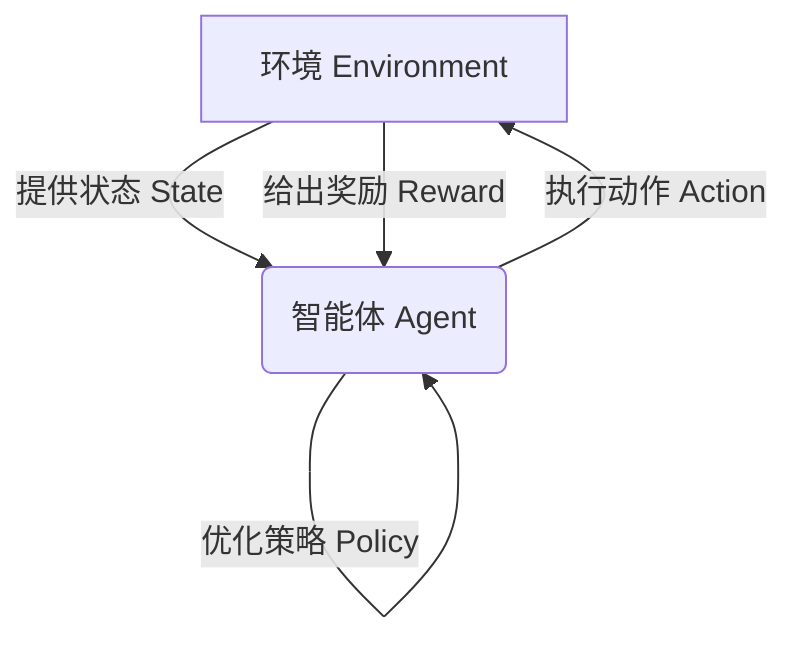
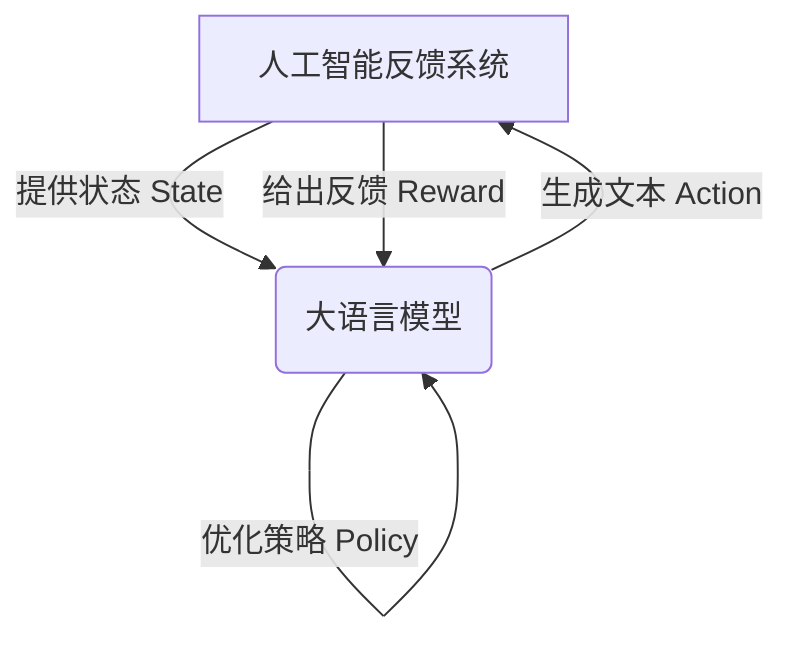
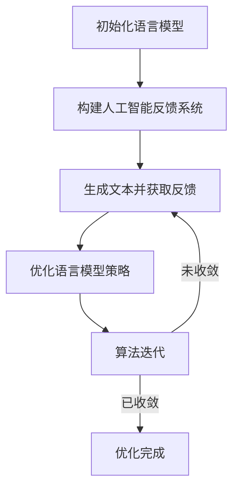

# 大语言模型原理基础与前沿 基于人工智能反馈的强化学习

## 1. 背景介绍

### 1.1 大语言模型的兴起

近年来,大型语言模型(Large Language Models, LLMs)在自然语言处理领域取得了令人瞩目的成就。这些模型通过在海量文本数据上进行预训练,学习了丰富的语言知识和上下文信息,从而在下游任务中表现出惊人的泛化能力。

随着计算能力的不断提升和训练数据的持续增长,LLMs的规模也在不断扩大。从GPT-3拥有1750亿个参数,到PaLM达到5400亿个参数,再到Cerebras AI的模型更是突破了1万亿参数的大关。这些参数庞大的模型展现出了强大的语言理解和生成能力,在机器翻译、问答系统、文本摘要等多个领域取得了新的突破。

### 1.2 强化学习在大语言模型中的作用

尽管LLMs表现出色,但它们仍然存在一些缺陷,例如:

1. **不确定性和不一致性**: 模型的输出往往具有一定的随机性,在相似的输入下可能会给出不同的结果。
2. **缺乏常识推理能力**: 模型难以很好地理解和推理一些常识性的知识。
3. **缺乏长期一致性**: 模型在生成较长的文本时,往往难以保持整体的一致性和连贯性。

为了解决这些问题,研究人员开始探索将强化学习(Reinforcement Learning, RL)技术与LLMs相结合,通过人工智能反馈的方式来优化和调整模型的输出。这种方法被称为基于人工智能反馈的强化学习(AI-Feedback Reinforcement Learning)。

## 2. 核心概念与联系

### 2.1 强化学习概述

强化学习是机器学习的一个重要分支,它研究如何让智能体(Agent)通过与环境(Environment)的交互,学习一种策略(Policy),使得在给定的环境中获得最大的累积奖励(Reward)。

强化学习的核心组成部分包括:

- **智能体(Agent)**: 执行动作并与环境交互的决策实体。
- **环境(Environment)**: 智能体所处的外部世界,它提供状态信息并对智能体的动作做出反馈。
- **状态(State)**: 描述环境当前情况的信息。
- **动作(Action)**: 智能体在特定状态下可以执行的操作。
- **奖励(Reward)**: 环境对智能体执行动作的评价,用于指导智能体优化策略。
- **策略(Policy)**: 智能体在每个状态下选择动作的规则或函数。

强化学习的目标是找到一个最优策略,使得在给定的环境中,智能体可以获得最大的累积奖励。



### 2.2 人工智能反馈的强化学习

在大语言模型的场景中,我们可以将语言模型视为智能体,而生成文本的过程则是与环境的交互。具体来说:

- **智能体(Agent)**: 大语言模型本身。
- **环境(Environment)**: 用于评估生成文本质量的人工智能反馈系统。
- **状态(State)**: 当前已生成的文本。
- **动作(Action)**: 生成下一个词或句子。
- **奖励(Reward)**: 人工智能反馈系统对生成文本的评分或反馈。
- **策略(Policy)**: 语言模型根据当前状态生成下一个词或句子的规则。

在这种设置下,我们的目标是通过不断优化语言模型的策略,使其能够生成高质量、符合预期的文本,从而获得更高的人工智能反馈奖励。



## 3. 核心算法原理具体操作步骤

基于人工智能反馈的强化学习算法通常包括以下几个关键步骤:

### 3.1 初始化语言模型

首先,我们需要一个预训练的大语言模型作为初始策略。这个模型通常是在大量文本数据上进行无监督预训练得到的,具有一定的语言生成能力。

### 3.2 构建人工智能反馈系统

接下来,我们需要构建一个人工智能反馈系统,用于评估语言模型生成的文本质量。这个系统可以是基于规则的评分系统,也可以是基于人工标注的评分模型。

### 3.3 生成文本并获取反馈

在每一个时间步,语言模型会根据当前状态(已生成的文本)和策略生成下一个词或句子。然后,人工智能反馈系统会对生成的文本进行评估,给出一个奖励值或反馈信号。

### 3.4 优化语言模型策略

根据获得的反馈信号,我们可以使用强化学习算法(如策略梯度算法)来优化语言模型的策略,使其能够生成更高质量的文本,从而获得更高的累积奖励。

具体的优化过程可以表示为:

$$J(\theta) = \mathbb{E}_{\pi_\theta}[\sum_{t=0}^{T} \gamma^t r_t]$$

其中:
- $\theta$ 表示语言模型的参数
- $\pi_\theta$ 表示当前的策略
- $r_t$ 表示时间步 $t$ 获得的奖励
- $\gamma$ 是折现因子,用于平衡即时奖励和长期奖励
- $J(\theta)$ 是我们需要最大化的目标函数,即累积奖励的期望

通过计算目标函数的梯度,并使用优化算法(如随机梯度下降)更新模型参数,我们就可以不断优化语言模型的策略,使其逐步生成更高质量的文本。

### 3.5 算法迭代

上述过程会不断重复迭代,直到语言模型的策略收敛或达到预期的性能水平。在每一次迭代中,我们都会根据人工智能反馈系统的评分来调整语言模型的参数,使其逐步适应人工智能反馈的偏好,生成更加符合预期的高质量文本。



## 4. 数学模型和公式详细讲解举例说明

在基于人工智能反馈的强化学习算法中,我们通常会使用策略梯度算法来优化语言模型的策略。策略梯度算法的核心思想是直接优化策略的参数,使得在给定策略下生成的序列能够获得最大的期望累积奖励。

### 4.1 策略梯度算法

假设我们的语言模型采用序列到序列(Sequence-to-Sequence, Seq2Seq)的架构,其中编码器(Encoder)将输入序列映射到上下文向量,而解码器(Decoder)则根据上下文向量和当前已生成的词生成下一个词。

我们可以将解码器的策略表示为 $\pi_\theta(y_t | x, y_{<t})$,其中:

- $x$ 表示输入序列
- $y_t$ 表示时间步 $t$ 生成的词
- $y_{<t}$ 表示之前生成的词序列
- $\theta$ 表示解码器的参数

我们的目标是最大化在给定策略下生成序列的期望累积奖励:

$$J(\theta) = \mathbb{E}_{\pi_\theta}[\sum_{t=0}^{T} \gamma^t r_t]$$

其中 $r_t$ 表示时间步 $t$ 获得的奖励,由人工智能反馈系统给出。

为了优化目标函数 $J(\theta)$,我们可以计算其关于策略参数 $\theta$ 的梯度:

$$\nabla_\theta J(\theta) = \mathbb{E}_{\pi_\theta}\left[\left(\sum_{t=0}^{T} \nabla_\theta \log \pi_\theta(y_t | x, y_{<t}) \right)\left(\sum_{t'=0}^{T} \gamma^{t'} r_{t'}\right)\right]$$

这个梯度表达式由两部分组成:

1. $\nabla_\theta \log \pi_\theta(y_t | x, y_{<t})$ 表示时间步 $t$ 生成词 $y_t$ 的对数概率关于参数 $\theta$ 的梯度。
2. $\sum_{t'=0}^{T} \gamma^{t'} r_{t'}$ 表示从时间步 $t$ 开始的累积奖励。

通过蒙特卡罗采样估计这个梯度,并使用优化算法(如随机梯度下降)更新模型参数 $\theta$,我们就可以不断优化语言模型的策略,使其生成更高质量的文本序列。

### 4.2 示例:基于REINFORCE算法的优化

REINFORCE算法是一种简单而有效的策略梯度算法,它可以直接应用于优化语言模型的策略。具体来说,我们可以使用以下步骤来优化语言模型:

1. **生成样本序列**:根据当前策略 $\pi_\theta$,生成一个样本序列 $y^{(i)} = (y_0^{(i)}, y_1^{(i)}, \dots, y_T^{(i)})$。
2. **获取累积奖励**:将生成的序列 $y^{(i)}$ 输入到人工智能反馈系统中,获得该序列的累积奖励 $R^{(i)} = \sum_{t=0}^{T} \gamma^t r_t^{(i)}$。
3. **计算梯度估计**:根据累积奖励计算梯度估计:

$$\hat{\nabla}_\theta J(\theta) = \left(\sum_{t=0}^{T} \nabla_\theta \log \pi_\theta(y_t^{(i)} | x, y_{<t}^{(i)}) \right) R^{(i)}$$

4. **更新参数**:使用优化算法(如随机梯度下降)根据梯度估计更新模型参数 $\theta$:

$$\theta \leftarrow \theta + \alpha \hat{\nabla}_\theta J(\theta)$$

其中 $\alpha$ 是学习率。

通过不断重复上述过程,我们可以逐步优化语言模型的策略,使其生成更高质量的文本序列。

以下是一个简单的示例,展示如何使用 REINFORCE 算法优化一个基于 RNN 的语言模型:

```python
import torch
import torch.nn as nn
import torch.optim as optim

# 定义 RNN 语言模型
class LanguageModel(nn.Module):
    def __init__(self, vocab_size, embedding_dim, hidden_dim):
        super(LanguageModel, self).__init__()
        self.embeddings = nn.Embedding(vocab_size, embedding_dim)
        self.rnn = nn.RNN(embedding_dim, hidden_dim)
        self.output = nn.Linear(hidden_dim, vocab_size)

    def forward(self, input, hidden):
        embedded = self.embeddings(input)
        output, hidden = self.rnn(embedded, hidden)
        output = self.output(output)
        return output, hidden

# 定义 REINFORCE 算法
def reinforce(model, optimizer, data, feedback_system, gamma=0.99):
    hidden = None
    log_probs = []
    rewards = []

    for input in data:
        output, hidden = model(input, hidden)
        log_prob = torch.log_softmax(output, dim=-1)
        log_probs.append(log_prob)

    sequence = torch.argmax(torch.cat(log_probs, dim=0), dim=-1)
    reward = feedback_system(sequence)
    rewards.append(reward)

    policy_loss = []
    for log_prob, r in zip(log_probs, rewards):
        policy_loss.append(-log_prob * r)

    policy_loss = torch.cat(policy_loss).sum()
    optimizer.zero_grad()
    policy_loss.backward()
    optimizer.step()

# 训练循环
model = LanguageModel(vocab_size, embedding_dim, hidden_dim)
optimizer = optim.Adam(model.parameters())

for epoch in range(num_epochs):
    for data in dataset:
        reinforce(model, optimizer, data, feedback_system)
```

在这个示例中,我们首先定义了一个基于 RNN 的语言模型。然后,我们实现了