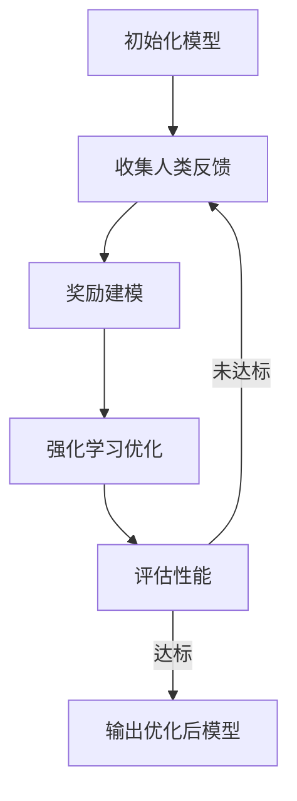

# 大语言模型原理基础与前沿 基于人类反馈的强化学习

## 1. 背景介绍

### 1.1 大语言模型的兴起

近年来,大型语言模型(Large Language Models, LLMs)在自然语言处理(Natural Language Processing, NLP)领域取得了令人瞩目的成就。这些模型通过在海量文本数据上进行预训练,学习了丰富的语言知识和上下文关联,从而在广泛的自然语言任务中表现出色。

大语言模型的发展可以追溯到2018年,当时谷歌的Transformer模型首次展现了其在机器翻译等任务中的卓越表现。此后,OpenAI的GPT、谷歌的BERT、微软的Turing-NLG等模型不断刷新着大模型的规模和性能记录。

### 1.2 大模型的挑战

尽管大语言模型取得了令人鼓舞的成绩,但它们也面临着一些重大挑战:

1. **数据质量偏差**: 预训练数据的质量和多样性直接影响模型的表现。训练数据中存在的偏差可能导致模型产生不公平、不道德或有害的输出。
2. **缺乏可解释性**: 大型语言模型通常是黑箱模型,难以解释其内部决策过程,这限制了它们在一些关键领域(如医疗、金融等)的应用。
3. **对话一致性差**: 在长时间的对话交互中,大语言模型往往难以保持一致的个性和观点,容易出现自相矛盾的情况。
4. **缺乏常识推理能力**: 尽管掌握了丰富的语言知识,但大语言模型在常识推理和因果推理方面的能力仍然有限。

### 1.3 人类反馈在内的强化学习

为了解决上述挑战,研究人员提出了一种新的训练范式:基于人类反馈的强化学习(Reinforcement Learning from Human Feedback, RLHF)。这种方法旨在通过人类的明确反馈来优化语言模型,使其产生更加符合预期、更加可靠和可解释的输出。

在RLHF中,人类对模型的输出进行评分或排序,这些反馈被用作强化学习的奖励信号,指导模型朝着更好的输出方向优化。相比于通过简单的监督学习在静态数据集上训练,RLHF允许模型在动态的人类反馈下不断改进,从而更好地捕捉人类的偏好和价值观。

本文将深入探讨基于人类反馈的强化学习在大语言模型中的应用原理、实现方法和前沿进展,为读者提供一个全面的视角来理解这一新兴的训练范式。

## 2. 核心概念与联系

### 2.1 强化学习概述

强化学习(Reinforcement Learning, RL)是机器学习的一个重要分支,它研究如何让智能体(Agent)通过与环境(Environment)的交互,学习一种行为策略(Policy),以最大化预期的长期回报(Reward)。

在强化学习中,智能体根据当前状态(State)选择一个动作(Action),并将动作施加到环境中。环境会根据这个动作转移到下一个状态,并返回一个即时奖励(Reward)给智能体。智能体的目标是学习一个策略,使得在一个序列的交互中获得的累积奖励最大化。

强化学习的核心要素包括:

1. **状态(State)**: 描述环境的当前情况。
2. **动作(Action)**: 智能体可以采取的行为。
3. **奖励(Reward)**: 对智能体行为的即时评价,用于指导优化方向。
4. **策略(Policy)**: 智能体根据当前状态选择动作的决策函数。
5. **价值函数(Value Function)**: 评估一个状态或状态-动作对的长期回报。
6. **模型(Model)**: 描述环境的转移规律和奖励机制。

强化学习算法通常分为基于价值函数(Value-based)、基于策略(Policy-based)和Actor-Critic两大类。其中,Actor-Critic算法结合了价值函数和策略的优点,被广泛应用于复杂的序列决策问题。

### 2.2 人类反馈作为奖励信号

在传统的强化学习中,奖励信号通常由环境提供,例如在游戏中获胜或失败、机器人完成或未完成任务等。然而,对于复杂的任务(如自然语言生成),手工设计一个合理的奖励函数并不容易。

基于人类反馈的强化学习提出了一种新的思路:将人类对模型输出的评价作为奖励信号,指导模型朝着更好的输出方向优化。这种方法的优点在于:

1. **灵活性**: 人类反馈可以针对不同的任务和场景进行调整,而不需要手工设计复杂的奖励函数。
2. **可解释性**: 通过人类的明确反馈,模型的决策过程变得更加可解释和可控。
3. **价值一致性**: 模型可以更好地捕捉人类的价值观和偏好,产生符合预期的输出。

然而,这种方法也面临一些挑战,例如如何高效地收集和利用人类反馈、如何处理人类反馈的噪声和偏差等。我们将在后续章节中详细探讨这些问题的解决方案。

### 2.3 人类反馈在大语言模型中的应用

将人类反馈引入强化学习,为大语言模型的优化提供了新的途径。传统的大语言模型通常是在海量文本数据上进行监督预训练,然后在特定任务上进行微调。虽然这种方法可以学习到丰富的语言知识,但它无法很好地捕捉人类的偏好和价值观,也难以解决数据偏差等问题。

相比之下,基于人类反馈的强化学习可以让大语言模型在与人类的交互中不断优化,从而产生更加符合预期、更加可靠和可解释的输出。这种方法已被应用于对话系统、文本生成、内容审核等多个领域,取得了积极的效果。

在接下来的章节中,我们将深入探讨基于人类反馈的强化学习在大语言模型中的具体实现方法和原理,以及它在各个应用场景中的实践和挑战。

## 3. 核心算法原理具体操作步骤

### 3.1 基于人类反馈的强化学习框架

基于人类反馈的强化学习(RLHF)将人类的明确反馈作为奖励信号,指导大语言模型朝着更好的输出方向优化。其核心框架可以概括为以下几个步骤:

1. **初始化模型**: 使用传统的监督学习方法(如自监督预训练)在大规模文本数据上训练一个初始的语言模型。

2. **收集人类反馈**: 让人类评价者对模型在特定任务或场景下的输出进行评分或排序,作为奖励信号。

3. **奖励建模(Reward Modeling)**: 基于收集到的人类反馈,训练一个奖励模型(Reward Model),用于估计任意输出的潜在奖励值。

4. **强化学习优化**: 使用强化学习算法(如PPO、REINFORCE等),将语言模型的参数朝着最大化预期奖励的方向优化。

5. **迭代优化**: 重复步骤2-4,不断优化语言模型,直到达到满意的性能。

这个过程可以用下面的流程图来概括:

在实际应用中,上述框架还需要解决一些关键性的问题,例如如何高效地收集人类反馈、如何处理人类反馈的噪声和偏差、如何设计合适的强化学习算法等。我们将在后续章节中详细讨论这些问题的解决方案。

### 3.2 人类反馈的收集方式

收集高质量的人类反馈是RLHF的关键环节之一。常见的反馈收集方式包括:

1. **评分(Rating)**: 让人类评价者对模型输出进行打分,例如使用1-5分或满意/不满意等标准。

2. **排序(Ranking)**: 让人类评价者对多个模型输出进行排序,表示它们的相对质量。

3. **比较(Comparison)**: 让人类评价者对比两个模型输出,选择更好的一个。

4. **修正(Editing)**: 让人类评价者直接修改或重写模型输出,以达到理想的效果。

不同的反馈收集方式各有优缺点。评分和排序相对简单,但可能存在主观性和噪声。比较和修正则更加直观和准确,但成本较高。在实践中,通常需要权衡成本和效果,选择合适的反馈收集方式。

为了提高反馈质量,一些常见的策略包括:

- 为评价者提供详细的指导和示例,明确反馈的标准。
- 对评价者进行培训和考核,确保他们的反馈一致性。
- 采用多轮迭代的方式,逐步优化和校准反馈标准。
- 通过聚合多个评价者的反馈,减小个体偏差的影响。

### 3.3 奖励建模

收集到人类反馈后,下一步是构建一个奖励模型(Reward Model),用于估计任意输出的潜在奖励值。这个模型通常是一个监督学习模型,使用人类反馈作为训练标签。

奖励建模的主要目标是从有限的人类反馈中学习一个通用的奖励函数,从而避免为每一个新的输出收集反馈的需求。一个理想的奖励模型应该能够很好地捕捉人类的偏好,并将其泛化到未见过的输出上。

常见的奖励建模方法包括:

1. **回归模型**: 将奖励建模看作一个回归问题,使用神经网络或其他机器学习模型来预测连续的奖励值。

2. **分类模型**: 将奖励建模看作一个分类问题,预测离散的奖励类别(如满意/不满意)。

3. **排序模型**: 直接学习对输出进行排序的模型,而不是预测具体的奖励值。

4. **基于比较的模型**: 使用成对比较的人类反馈来训练奖励模型,无需明确的奖励值。

在实践中,研究人员通常会结合多种方法,并针对具体任务和数据集进行调优,以获得更准确的奖励估计。

### 3.4 强化学习优化

有了奖励模型后,我们就可以使用强化学习算法来优化语言模型的参数,使其产生更高奖励的输出。常见的强化学习算法包括:

1. **策略梯度算法(Policy Gradient)**: 直接优化语言模型的参数,使其产生的输出获得更高的预期奖励。典型算法包括REINFORCE、PPO等。

2. **Actor-Critic算法**: 同时学习一个价值函数(Value Function)和一个策略(Policy),前者用于估计状态或状态-动作对的长期回报,后者决定下一步的动作。常见算法包括A2C、ACER等。

3. **离线强化学习算法(Offline RL)**: 利用现有的人类反馈数据进行强化学习,无需与环境进行在线交互。常见算法包括BCQ、CQL等。

在应用于大语言模型时,这些算法需要针对序列生成任务进行修改和扩展。例如,可以将语言模型视为一个自回归模型(Autoregressive Model),在每一个时间步骤选择下一个token作为动作。奖励则可以基于生成的完整序列来计算。

值得注意的是,由于语言任务的开放性和多样性,直接应用标准的强化学习算法可能会导致不稳定的训练过程和次优的结果。因此,研究人员提出了一些特定的优化技术,例如通过KL正则化(KL Regularization)来控制输出的差异性,或者使用一些特殊的奖励塑形(Reward Shaping)方法来加速训练过程。我们将在后续章节中介绍这些优化技术的细节。

## 4. 数学模型和公式详细讲解举例说明

在本节中,