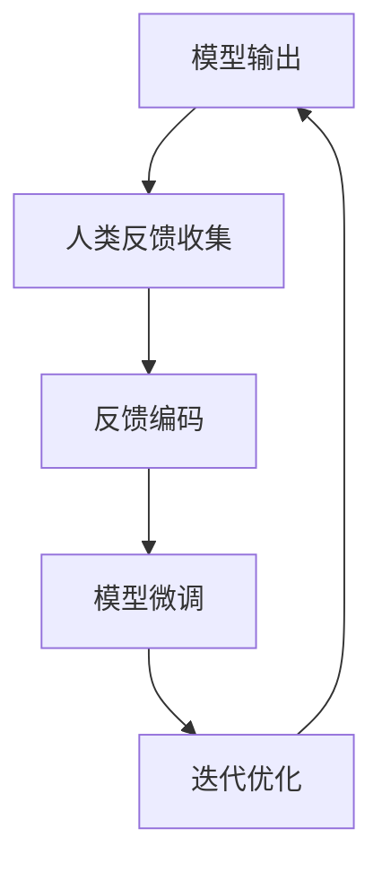

# 大语言模型原理基础与前沿 基于人类反馈进行微调

## 1. 背景介绍

### 1.1 大语言模型的崛起

近年来,大型语言模型(Large Language Models, LLMs)在自然语言处理(NLP)领域取得了令人瞩目的成就。这些模型通过在海量文本数据上进行预训练,学习了丰富的语言知识和上下文表示能力,可以在广泛的自然语言任务中发挥作用,包括机器翻译、文本摘要、问答系统等。

代表性的大语言模型有谷歌的BERT、OpenAI的GPT系列、DeepMind的Chinchilla、以及最新的PaLM等。它们通过transformer架构和自注意力机制,有效地捕捉长距离依赖关系,并在下游任务中表现出色。然而,这些模型在训练过程中主要依赖于大规模的文本语料,缺乏与人类的交互和反馈,因此可能存在一些偏差和不足。

### 1.2 人类反馈在大语言模型中的重要性

虽然大语言模型展现出了强大的语言理解和生成能力,但它们并非完美无缺。由于训练语料的局限性和模型本身的偏差,大语言模型可能会产生不准确、不相关或不恰当的输出。此外,它们也缺乏对特定领域知识和任务的深入理解。

为了解决这些问题,将人类反馈融入大语言模型的训练过程变得至关重要。通过与人类专家的交互,模型可以获得更准确、更相关的知识,并根据反馈进行调整和改进。这种基于人类反馈的微调(Human-Feedback Tuning)方法,有望提高大语言模型的性能、可靠性和可解释性。

## 2. 核心概念与联系

### 2.1 大语言模型的预训练和微调

大语言模型通常采用两阶段训练策略:预训练(Pre-training)和微调(Fine-tuning)。在预训练阶段,模型在海量的文本语料上进行自监督学习,捕捉语言的统计规律和上下文信息。而在微调阶段,模型在特定的下游任务数据上进行进一步训练,使其适应具体的应用场景。

传统的微调方法主要依赖于标注数据,即人工标记的数据集。然而,构建高质量的标注数据集是一项昂贵且耗时的工作,并且标注数据可能存在偏差和局限性。相比之下,基于人类反馈的微调方法可以更加灵活和高效地利用人类专家的知识和判断。

### 2.2 人类反馈的类型和形式

人类反馈可以采取多种形式,包括:

- **评分反馈**:人类对模型输出进行评分,如1-5分等级制。
- **排序反馈**:人类对多个候选输出进行排序。
- **编辑反馈**:人类直接编辑和修改模型输出。
- **自然语言反馈**:人类用自然语言对模型输出进行评论和反馈。

不同类型的反馈具有不同的优缺点。评分和排序反馈相对简单,但信息量有限。编辑反馈提供了更具体的修改建议,但需要人工耗费更多精力。自然语言反馈最为灵活和富有表现力,但也对模型的理解能力提出了更高的要求。

### 2.3 基于人类反馈的微调流程

基于人类反馈的微调过程可以概括为以下几个步骤:

1. **模型输出**:大语言模型根据输入生成初始输出。
2. **人类反馈收集**:人类专家对模型输出提供反馈,如评分、排序、编辑或自然语言反馈。
3. **反馈编码**:将人类反馈转换为模型可以理解的形式,如奖惩分数或标记序列。
4. **模型微调**:使用编码后的反馈数据,对大语言模型进行进一步的微调训练。
5. **迭代优化**:重复上述步骤,直到模型性能满足要求或达到预设的迭代次数。

该流程形成了一个人机协作的闭环,模型不断通过人类反馈进行改进和优化。

## 3. 核心算法原理具体操作步骤

### 3.1 反馈编码方法

将人类反馈转换为模型可以理解的形式是基于人类反馈微调的关键步骤。常见的反馈编码方法包括:

1. **评分映射**:将评分反馈映射为奖惩分数,用于调整模型的损失函数。
2. **排序编码**:将排序反馈编码为对比损失(Pairwise Ranking Loss),促使模型输出与人类偏好一致。
3. **标记序列编码**:将编辑反馈转换为标记序列,作为监督信号进行序列到序列的学习。
4. **自然语言理解**:利用模型的自然语言理解能力,直接从自然语言反馈中提取监督信号。

不同编码方法的优缺点取决于反馈类型、任务复杂性和模型能力。一般而言,评分映射和排序编码相对简单,但信息量有限;标记序列编码更加精确,但需要人工标注的代价较高;自然语言理解方法最为灵活,但对模型的理解能力要求更高。

### 3.2 微调算法

基于编码后的反馈数据,可以采用不同的微调算法来优化大语言模型的参数。常见的微调算法包括:

1. **监督微调**:将编码后的反馈数据视为监督信号,使用标准的监督学习方法(如交叉熵损失)进行微调。
2. **强化学习**:将人类反馈视为奖惩信号,采用策略梯度或者Actor-Critic等强化学习算法进行微调。
3. **对抗训练**:将人类反馈视为对抗样本,通过对抗训练提高模型的鲁棒性和泛化能力。
4. **元学习**:利用元学习框架,提高模型快速适应人类反馈的能力,实现有效的少样本学习。

不同算法的选择取决于任务特点、反馈类型和模型架构。一般而言,监督微调相对简单且易于实现,但可能受限于反馈数据的质量和数量;强化学习和对抗训练可以更好地利用稀疏的反馈信号,但计算复杂度较高;元学习则侧重于提高模型的适应性和泛化能力。

### 3.3 人机交互界面

为了有效地收集人类反馈,需要设计友好的人机交互界面。一个良好的交互界面应当具备以下特点:

1. **简单直观**:界面操作应当简单明了,避免过多的认知负担。
2. **高效流畅**:反馈过程应当高效流畅,避免过多的等待和中断。
3. **多模态交互**:支持多种反馈形式,如评分、排序、编辑和自然语言反馈。
4. **上下文呈现**:合理呈现模型输出和任务背景信息,方便人类理解和评判。
5. **反馈跟踪**:记录和可视化人类反馈,方便人机双方追踪和分析。

良好的交互界面不仅有助于提高反馈质量,还能增强人机协作的体验,促进模型的持续改进。

## 4. 数学模型和公式详细讲解举例说明

### 4.1 基于评分反馈的微调

假设我们有一个语言生成任务,模型的输出为 $y$,人类专家给出的评分反馈为 $r \in [0, 1]$,其中 $0$ 表示最差, $1$ 表示最佳。我们可以将评分反馈映射为奖惩分数 $R(y, r)$,并将其融入模型的损失函数中。

一种常见的映射方式是:

$$R(y, r) = \alpha r + (1 - \alpha)(1 - r)$$

其中 $\alpha \in [0, 1]$ 是一个平衡参数,用于调节奖惩的强度。当 $\alpha = 1$ 时,只考虑奖励;当 $\alpha = 0$ 时,只考虑惩罚。

将奖惩分数融入损失函数后,模型的优化目标变为:

$$\mathcal{L} = -\mathbb{E}_{y \sim p_\theta(y|x)}[R(y, r(x, y))]$$

其中 $p_\theta(y|x)$ 是模型的输出分布, $r(x, y)$ 是人类专家对输入 $x$ 和输出 $y$ 的评分反馈。通过最小化该损失函数,模型可以学习产生更高评分的输出。

### 4.2 基于排序反馈的微调

在某些情况下,人类专家可能更倾向于对多个候选输出进行排序,而不是给出精确的评分。假设我们有一个排序列表 $\tau = (y_1, y_2, \ldots, y_n)$,其中 $y_1$ 是最佳输出, $y_n$ 是最差输出。我们可以使用对比损失(Pairwise Ranking Loss)来编码排序反馈:

$$\mathcal{L}_\text{rank} = \sum_{i < j} \max(0, -s(y_i, x) + s(y_j, x) + \epsilon)$$

其中 $s(y, x)$ 是模型对输出 $y$ 给出的分数, $\epsilon$ 是一个边际项,用于保证排序的稳健性。

对比损失的目标是,对于任意一对 $(y_i, y_j)$,如果 $y_i$ 的排序高于 $y_j$,则 $s(y_i, x)$ 应当大于 $s(y_j, x)$ 至少 $\epsilon$ 分。通过最小化该损失函数,模型可以学习产生与人类偏好一致的输出。

### 4.3 基于编辑反馈的微调

在某些情况下,人类专家可能直接对模型输出进行编辑和修改。假设模型的输出为 $y$,人类专家的编辑后输出为 $y^*$。我们可以将编辑反馈视为一个序列到序列的学习任务,使用标准的序列损失函数(如交叉熵损失)进行微调:

$$\mathcal{L}_\text{edit} = -\log p_\theta(y^*|x)$$

其中 $p_\theta(y^*|x)$ 是模型在给定输入 $x$ 的情况下,生成编辑后输出 $y^*$ 的概率。

通过最小化该损失函数,模型可以直接学习从人类编辑反馈中,产生更加准确和相关的输出。

### 4.4 基于自然语言反馈的微调

在某些情况下,人类专家可能更倾向于使用自然语言对模型输出进行评论和反馈。假设模型的输出为 $y$,人类专家的自然语言反馈为 $f$。我们可以利用模型的自然语言理解能力,从反馈 $f$ 中提取监督信号。

一种可能的方法是,将自然语言反馈 $f$ 与模型输出 $y$ 连接,形成一个新的输入序列 $x' = [x, y, f]$,然后使用标准的语言模型损失函数(如交叉熵损失)进行微调:

$$\mathcal{L}_\text{nlf} = -\log p_\theta(y^*|x')$$

其中 $y^*$ 是期望的输出序列,可以是人类专家提供的参考输出,也可以是原始输出 $y$ 本身(如果反馈 $f$ 表示输出是正确的)。

通过最小化该损失函数,模型可以学习从自然语言反馈中提取相关信息,并产生更加准确和相关的输出。

需要注意的是,基于自然语言反馈的微调对模型的自然语言理解能力有较高的要求,并且可能需要更多的反馈数据和计算资源。

## 5. 项目实践:代码实例和详细解释说明

为了更好地理解基于人类反馈的微调过程,我们将提供一个基于 PyTorch 的代码示例,实现基于评分反馈的语言生成模型微调。

### 5.1 数据准备

首先,我们需要准备一个语言生成任务的数