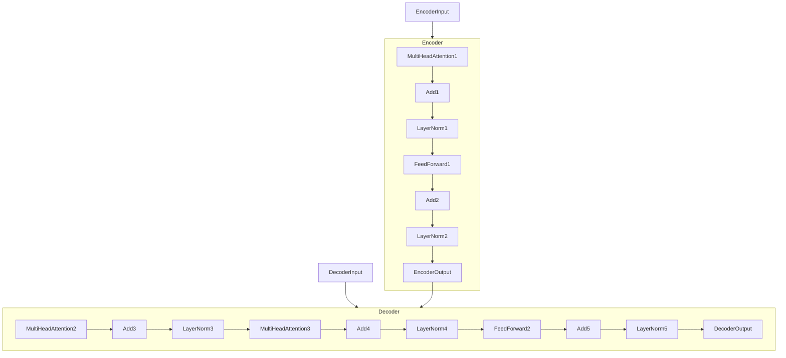

# 大语言模型原理基础与前沿 按空格分割

## 1. 背景介绍

### 1.1 什么是大语言模型

大语言模型(Large Language Model, LLM)是一种基于深度学习技术训练的巨大神经网络模型,旨在从海量文本数据中学习语言的语义和结构,从而获得对自然语言的理解和生成能力。这些模型通常包含数十亿甚至数万亿个参数,能够捕捉语言的丰富语义和复杂结构。

大语言模型的出现标志着自然语言处理(NLP)领域的一次重大突破。传统的NLP系统通常依赖于手工设计的规则和特征,难以处理复杂的语言现象。而大语言模型则通过从大规模语料库中学习,自动获取语言知识,从而显著提高了语言理解和生成的能力。

### 1.2 大语言模型的发展历程

大语言模型的发展可以追溯到2017年,当时谷歌推出了Transformer模型,这是第一个真正的大型语言模型。随后,OpenAI、微软、DeepMind等科技公司和研究机构相继推出了更大更强大的语言模型,如GPT、BERT、XLNet、T5等。

2020年,OpenAI发布了GPT-3,这是迄今为止规模最大的语言模型,包含1750亿个参数。GPT-3展现出了惊人的语言生成能力,可以完成各种复杂的自然语言任务,如文本生成、问答、代码生成等,引起了广泛关注。

随着模型规模和训练数据的不断增长,大语言模型的性能不断提高,在各种自然语言处理任务上取得了令人瞩目的成绩,推动了整个NLP领域的快速发展。

## 2. 核心概念与联系

### 2.1 自注意力机制(Self-Attention)

自注意力机制是大语言模型的核心组成部分,它允许模型捕捉输入序列中任意两个位置之间的关系,从而更好地建模长距离依赖关系。

在自注意力机制中,每个输入位置都会关注整个输入序列中的所有位置,并根据它们之间的关联程度分配不同的权重。这种机制使模型能够同时考虑全局和局部信息,提高了对语言的理解能力。

自注意力机制可以形式化表示为:

$$
\mathrm{Attention}(Q, K, V) = \mathrm{softmax}\left(\frac{QK^T}{\sqrt{d_k}}\right)V
$$

其中,Q、K、V分别表示查询(Query)、键(Key)和值(Value),它们都是输入序列的线性映射。$d_k$是缩放因子,用于防止点积过大导致的梯度消失问题。

### 2.2 transformer 架构

Transformer是第一个完全基于自注意力机制的序列到序列模型,它抛弃了传统的循环神经网络和卷积神经网络结构,完全依赖自注意力机制来捕捉输入和输出序列之间的关系。

Transformer的核心架构包括编码器(Encoder)和解码器(Decoder)两个部分。编码器将输入序列映射到连续的表示,解码器则根据编码器的输出生成目标序列。两者都由多个相同的层组成,每层包含多头自注意力子层和前馈神经网络子层。



Transformer架构的引入极大地提高了大语言模型的性能,使其能够在各种自然语言处理任务上取得优异的表现。

### 2.3 预训练与微调(Pre-training & Fine-tuning)

大语言模型通常采用两阶段训练策略:预训练(Pre-training)和微调(Fine-tuning)。

在预训练阶段,模型会在大规模无标注语料库上进行自监督学习,目标是学习通用的语言表示。常见的预训练目标包括掩码语言模型(Masked Language Modeling)和下一句预测(Next Sentence Prediction)等。

在微调阶段,预训练好的模型会在特定的下游任务数据集上进行进一步的监督训练,使模型能够更好地适应特定任务。微调过程通常只需要调整模型的部分参数,从而避免了从头开始训练的巨大计算开销。

预训练和微调的分离使得大语言模型能够有效地利用大规模无标注数据,同时也可以灵活地应用于各种下游任务,实现了通用语言表示和任务特定知识的有机结合。

## 3. 核心算法原理具体操作步骤

### 3.1 Transformer 模型训练

Transformer模型的训练过程包括以下几个关键步骤:

1. **数据预处理**: 将原始文本数据转换为模型可以接受的格式,通常包括分词、构建词表、添加特殊标记等。

2. **位置编码**: 由于Transformer没有循环或卷积结构,因此需要引入位置编码来捕捉序列的位置信息。常用的位置编码方式包括正弦位置编码和可学习的位置嵌入。

3. **掩码语言模型(MLM)**: 在预训练阶段,MLM是一种常用的自监督目标。它会随机掩码输入序列中的一部分词,要求模型根据上下文预测被掩码的词。

4. **下一句预测(NSP)**: NSP是另一种常用的预训练目标,要求模型判断两个句子是否相邻出现。

5. **前向传播**: 将输入数据传递给Transformer模型,计算输出。

6. **损失计算**: 根据预训练目标(MLM、NSP等)计算损失函数。

7. **反向传播**: 通过反向传播算法计算参数梯度。

8. **参数更新**: 使用优化算法(如Adam)根据梯度更新模型参数。

9. **微调**: 在下游任务上,使用带有任务特定头的预训练模型进行进一步的监督微调。

### 3.2 生成式任务

对于生成式任务(如机器翻译、文本摘要、对话系统等),Transformer模型的运行过程如下:

1. **输入编码**: 将源序列(如原始语言)输入编码器,得到其表示。

2. **解码器初始化**: 将解码器初始状态(通常是特殊的开始标记)输入解码器。

3. **自回归生成**: 在每个时间步,解码器会根据先前生成的输出和编码器输出,预测下一个词。生成的词会被馈送回解码器,重复该过程直到生成终止标记或达到最大长度。

4. **输出序列**: 将解码器生成的词序列作为最终输出。

该过程被称为"自回归"(Auto-Regressive),因为模型在生成每个词时都会利用先前生成的词。通过掩码机制,解码器在每个时间步只能看到当前输出,从而避免了未来信息的泄露。

## 4. 数学模型和公式详细讲解举例说明

### 4.1 Transformer 中的注意力计算

注意力机制是Transformer的核心,它允许模型动态地捕捉输入序列中任意两个位置之间的关系。我们以多头自注意力(Multi-Head Attention)为例,详细解释其数学原理。

多头自注意力首先将查询(Q)、键(K)和值(V)进行线性投影,得到投影后的矩阵:

$$
\begin{aligned}
Q &= XW_Q \\
K &= XW_K \\
V &= XW_V
\end{aligned}
$$

其中,X是输入序列的表示,W是可学习的权重矩阵。

然后,计算查询Q和键K的缩放点积,得到注意力分数矩阵:

$$
\mathrm{Attention}(Q, K, V) = \mathrm{softmax}\left(\frac{QK^T}{\sqrt{d_k}}\right)V
$$

其中,$d_k$是缩放因子,用于防止点积过大导致的梯度消失问题。softmax函数用于将注意力分数归一化为概率分布。

最后,将注意力分数与值V相乘,得到加权和表示:

$$
\mathrm{head}_i = \mathrm{Attention}(QW_i^Q, KW_i^K, VW_i^V)
$$

其中,$W_i^Q$、$W_i^K$和$W_i^V$分别是第i个注意力头的投影矩阵。

多头注意力机制通过并行计算多个注意力头,然后将它们的输出进行拼接和线性变换,从而捕捉不同的子空间表示:

$$
\mathrm{MultiHead}(Q, K, V) = \mathrm{Concat}(\mathrm{head}_1, \dots, \mathrm{head}_h)W^O
$$

其中,h是注意力头的数量,$W^O$是输出线性变换的权重矩阵。

通过注意力机制,Transformer能够动态地关注输入序列中的不同部分,从而更好地建模长距离依赖关系。

### 4.2 GPT 语言模型

GPT(Generative Pre-trained Transformer)是一种基于Transformer解码器的自回归语言模型,它在预训练阶段学习了广泛的语言知识,可以应用于各种自然语言生成任务。

GPT模型的核心是一个基于Transformer解码器的自回归模型,其目标函数是最大化给定上文的下一个词的条件概率:

$$
\max_\theta \sum_{t=1}^T \log P(x_t | x_{<t}; \theta)
$$

其中,$\theta$是模型参数,T是序列长度,$x_t$是第t个词,$x_{<t}$表示前t-1个词。

在预训练阶段,GPT会在大规模语料库上最大化上述目标函数,学习通用的语言表示。在微调阶段,则根据特定任务调整部分参数,使模型更好地适应该任务。

GPT模型的自回归特性使其能够生成连贯、上下文相关的文本。然而,这种单向建模方式也带来了一些限制,如无法直接获取双向上下文信息,难以处理某些需要全局理解的任务。

### 4.3 BERT 语言模型

BERT(Bidirectional Encoder Representations from Transformers)是另一种基于Transformer编码器的预训练语言模型,它采用了掩码语言模型(Masked Language Model,MLM)和下一句预测(Next Sentence Prediction,NSP)两种预训练目标,能够同时捕捉双向上下文信息。

BERT的MLM目标是基于输入序列中随机掩码的部分词,预测这些被掩码词的标识。其目标函数为:

$$
\max_\theta \sum_{i \in \mathcal{M}} \log P(x_i | x_{\backslash i}; \theta)
$$

其中,$\mathcal{M}$是被掩码词的位置集合,$x_{\backslash i}$表示除了$x_i$之外的其他词。

BERT的NSP目标是判断两个句子是否相邻出现,目标函数为:

$$
\max_\theta \log P(y | x_1, x_2; \theta)
$$

其中,$y$是二元标签(相邻或不相邻),$x_1$和$x_2$分别是两个输入句子。

通过MLM和NSP的联合预训练,BERT能够同时学习到词级和句级的表示,从而捕捉双向上下文信息。这使得BERT在各种自然语言理解任务上表现出色,成为NLP领域的里程碑式模型。

## 5. 项目实践:代码实例和详细解释说明

在这一部分,我们将通过一个简单的Python代码示例,演示如何使用Hugging Face的Transformers库加载和运行一个预训练的BERT模型,进行文本分类任务。

### 5.1 安装依赖库

首先,我们需要安装所需的Python库:

```bash
pip install transformers
```

### 5.2 加载预训练模型和分词器

```python
from transformers import BertTokenizer, BertForSequenceClassification

# 加载预训练模型和分词器
model_name = 'bert-base-uncased'
tokenizer = BertTokenizer.from_pretrained(model_name)
model = BertForSequenceClassification.from_pretrained(model_name)
```

在这里,我们加载了一个基