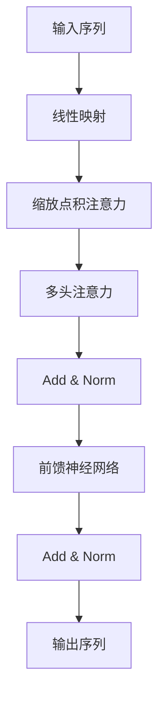

# 大语言模型原理基础与前沿 新时代的曙光

## 1. 背景介绍

### 1.1 人工智能的崛起

人工智能(Artificial Intelligence, AI)作为一门跨学科的研究领域,自20世纪50年代问世以来,已经经历了数十年的发展历程。近年来,受益于计算能力的飞速提升、海量数据的积累以及算法的创新,人工智能技术取得了突破性进展,在多个领域展现出了令人惊叹的能力。

### 1.2 语言模型的重要性

在人工智能的多个分支中,自然语言处理(Natural Language Processing, NLP)是一个备受关注的热门方向。语言模型作为自然语言处理的基础,旨在捕捉语言的统计规律,对语言的生成和理解至关重要。传统的语言模型主要基于统计方法,但存在一些局限性。

### 1.3 大语言模型的兴起

近年来,随着深度学习技术的不断发展,大型神经网络模型在自然语言处理领域展现出了卓越的性能。这些被称为"大语言模型"(Large Language Model, LLM)的模型,通过在海量文本数据上进行预训练,学习到了丰富的语言知识和上下文信息,为各种自然语言处理任务提供了强大的基础模型。

大语言模型的出现,标志着自然语言处理进入了一个新的时代。这些模型不仅在性能上取得了突破,而且为语言理解和生成提供了全新的范式,开辟了广阔的应用前景。

## 2. 核心概念与联系

### 2.1 自注意力机制(Self-Attention)



自注意力机制是大语言模型的核心组件之一,它允许模型捕捉输入序列中任意两个位置之间的依赖关系。与传统的循环神经网络(RNN)和卷积神经网络(CNN)不同,自注意力机制不受序列长度的限制,可以更好地建模长距离依赖关系。

### 2.2 transformer 结构

Transformer 是第一个完全基于自注意力机制的序列到序列模型,它抛弃了传统的递归和卷积结构,完全依赖自注意力机制来捕捉输入和输出序列之间的依赖关系。Transformer 结构的引入,极大地提高了并行计算能力,使得大型模型的训练成为可能。

### 2.3 预训练与微调(Pre-training & Fine-tuning)

大语言模型通常采用预训练与微调的范式。在预训练阶段,模型在大规模无监督文本数据上进行训练,学习通用的语言知识。在微调阶段,预训练的模型将在特定的下游任务数据上进行进一步的训练,使其适应具体的应用场景。这种范式大大减少了为每个任务从头训练模型的计算代价。

### 2.4 模型压缩与知识蒸馏

由于大语言模型通常包含数十亿甚至上百亿的参数,因此存在巨大的计算和存储开销。为了解决这一问题,研究人员提出了多种模型压缩和知识蒸馏技术,旨在将大模型中学习到的知识迁移到更小、更高效的模型中,从而实现模型的高效部署。

## 3. 核心算法原理具体操作步骤

### 3.1 transformer 编码器(Encoder)

transformer 编码器的主要作用是将输入序列映射到一系列连续的表示向量,这些向量捕捉了输入序列中每个位置的语义信息和上下文依赖关系。编码器的核心是多头自注意力机制和前馈神经网络,它们交替堆叠形成了编码器的层次结构。

1. **输入embedding和位置编码**

   首先,将输入序列的每个词元(token)映射为一个embedding向量,并添加位置编码,以保留序列的位置信息。

2. **多头自注意力层**

   对embedding序列进行线性映射,得到查询(Query)、键(Key)和值(Value)向量。然后,计算查询和所有键的缩放点积,得到注意力分数。注意力分数通过softmax函数归一化,最终得到每个位置对其他位置的注意力权重。注意力权重与值向量相乘,得到该位置的注意力表示。多头注意力机制可以从不同的子空间捕捉不同的依赖关系。

3. **残差连接和层归一化**

   将注意力表示和输入embedding相加,得到残差连接。然后进行层归一化,以防止梯度消失或爆炸。

4. **前馈神经网络**

   对归一化后的序列进行全连接的前馈神经网络变换,引入非线性激活函数,提高模型的表达能力。

5. **残差连接和层归一化**

   将前馈神经网络的输出与输入相加,得到残差连接。然后进行层归一化。

6. **堆叠编码器层**

   重复上述步骤,堆叠多个相同的编码器层,使模型能够学习到更高层次的表示。

通过上述操作,transformer 编码器能够捕捉输入序列中的上下文信息和长距离依赖关系,为下游的任务提供有力的语义表示。

### 3.2 transformer 解码器(Decoder)

transformer 解码器的作用是根据编码器的输出和目标序列的部分信息,生成目标序列的完整表示。解码器的结构与编码器类似,但增加了一个对已生成序列的掩码自注意力机制,以确保每个位置只能关注之前的位置。

1. **输入embedding和位置编码**

   将目标序列的每个词元映射为embedding向量,并添加位置编码。

2. **掩码多头自注意力层**

   与编码器的自注意力层类似,但在计算注意力分数时,对未来位置的键和值向量进行掩码,确保每个位置只能关注之前的位置。

3. **残差连接和层归一化**

4. **编码器-解码器多头注意力层**

   计算目标序列每个位置与编码器输出的注意力表示,融合编码器提供的源语言信息。

5. **残差连接和层归一化**

6. **前馈神经网络**

7. **残差连接和层归一化**

8. **堆叠解码器层**

通过上述操作,transformer 解码器能够生成目标序列的表示,同时融合了编码器提供的源语言信息。在序列生成任务中,解码器会逐个生成目标序列的词元,直到生成结束符号。

## 4. 数学模型和公式详细讲解举例说明

### 4.1 缩放点积注意力(Scaled Dot-Product Attention)

缩放点积注意力是 transformer 模型中自注意力机制的核心计算单元。给定一个查询向量 $\boldsymbol{q}$、一组键向量 $\boldsymbol{K}=\{\boldsymbol{k}_1, \boldsymbol{k}_2, \ldots, \boldsymbol{k}_n\}$ 和一组值向量 $\boldsymbol{V}=\{\boldsymbol{v}_1, \boldsymbol{v}_2, \ldots, \boldsymbol{v}_n\}$,缩放点积注意力的计算过程如下:

$$\begin{aligned}
\text{Attention}(\boldsymbol{q}, \boldsymbol{K}, \boldsymbol{V}) &= \text{softmax}\left(\frac{\boldsymbol{q}\boldsymbol{K}^\top}{\sqrt{d_k}}\right)\boldsymbol{V} \\
&= \sum_{i=1}^n \alpha_i \boldsymbol{v}_i
\end{aligned}$$

其中 $d_k$ 是键向量的维度,用于缩放点积,防止较大的值导致softmax函数的梯度较小。$\alpha_i$ 是注意力权重,表示查询向量对第 $i$ 个键-值对的注意力程度。

通过计算查询向量与所有键向量的缩放点积,并对结果进行softmax归一化,我们可以得到一组注意力权重。这些权重与对应的值向量相乘,得到最终的注意力表示。

缩放点积注意力机制允许模型动态地为每个查询向量分配注意力,关注输入序列中与之最相关的部分,从而捕捉长距离依赖关系。

### 4.2 多头注意力(Multi-Head Attention)

为了进一步提高注意力机制的表达能力,transformer 引入了多头注意力机制。多头注意力将查询、键和值向量进行线性映射,得到多组子空间的表示,然后在每个子空间中并行计算缩放点积注意力,最后将所有子空间的注意力表示拼接起来。

具体来说,给定查询向量 $\boldsymbol{q}$、键矩阵 $\boldsymbol{K}$ 和值矩阵 $\boldsymbol{V}$,以及头数 $h$,多头注意力的计算过程如下:

$$\begin{aligned}
\text{MultiHead}(\boldsymbol{q}, \boldsymbol{K}, \boldsymbol{V}) &= \text{Concat}(\text{head}_1, \text{head}_2, \ldots, \text{head}_h)\boldsymbol{W}^O \\
\text{where}\quad \text{head}_i &= \text{Attention}(\boldsymbol{q}\boldsymbol{W}_i^Q, \boldsymbol{K}\boldsymbol{W}_i^K, \boldsymbol{V}\boldsymbol{W}_i^V)
\end{aligned}$$

其中 $\boldsymbol{W}_i^Q$、$\boldsymbol{W}_i^K$ 和 $\boldsymbol{W}_i^V$ 分别是第 $i$ 个头的查询、键和值的线性映射矩阵,用于将向量映射到不同的子空间。$\boldsymbol{W}^O$ 是最终的线性映射矩阵,将所有头的注意力表示拼接并映射回原始空间。

多头注意力机制允许模型从不同的子空间捕捉不同的依赖关系,提高了模型的表达能力和泛化性能。

### 4.3 位置编码(Positional Encoding)

由于 transformer 模型完全依赖自注意力机制,因此需要一种方法来注入序列的位置信息。位置编码就是一种将位置信息编码到向量表示的方法。

具体来说,对于序列中的第 $i$ 个位置,其位置编码向量 $\boldsymbol{p}_i$ 的第 $j$ 个元素计算如下:

$$\begin{aligned}
\boldsymbol{p}_{i,2j} &= \sin\left(\frac{i}{10000^{\frac{2j}{d_\text{model}}}}\right) \\
\boldsymbol{p}_{i,2j+1} &= \cos\left(\frac{i}{10000^{\frac{2j}{d_\text{model}}}}\right)
\end{aligned}$$

其中 $d_\text{model}$ 是模型的embedding维度。

位置编码向量与输入embedding相加,从而将位置信息注入到模型的表示中。由于位置编码是基于三角函数计算的,因此它具有一定的周期性,可以很好地捕捉相对位置信息。

## 5. 项目实践:代码实例和详细解释说明

为了更好地理解 transformer 模型的原理和实现细节,我们将通过一个简单的实例来演示如何使用 PyTorch 构建一个小型的 transformer 模型。

### 5.1 导入所需的库

```python
import math
import torch
import torch.nn as nn
from torch.nn import TransformerEncoder, TransformerEncoderLayer
```

### 5.2 定义缩放点积注意力函数

```python
def scaled_dot_product_attention(q, k, v, mask=None):
    # 计算注意力分数
    attn_scores = torch.matmul(q, k.transpose(-2, -1)) / math.sqrt(q.size(-1))
    
    # 应用掩码
    if mask is not None:
        attn_scores = attn_scores.masked_fill(mask == 0, -1e9)
    
    # 计算注意力权重
    attn_weights = nn.functional.softmax(attn_scores, dim=-1)
    
    # 计算注意力表示
    attn_output = torch.matmul(attn_weights, v)
    
    return attn_output, attn_weights
```

### 5.3 定义多头注意力层

```python
class MultiHeadAttention(nn.Module):
    def __init__(self, d_