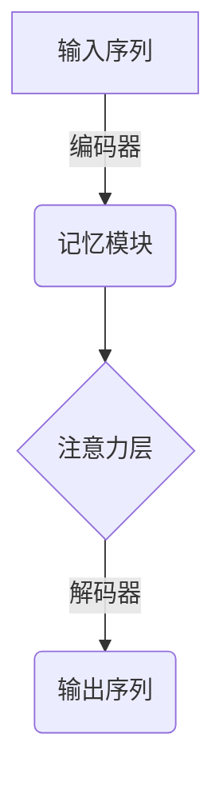
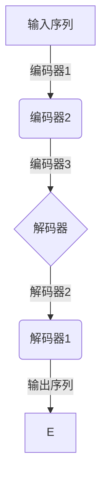

# 大语言模型原理基础与前沿 更长的上下文

## 1. 背景介绍

### 1.1 大语言模型的兴起

近年来,大型语言模型(Large Language Models, LLMs)在自然语言处理(NLP)领域掀起了一场革命。随着计算能力的提升和海量语料的积累,研究人员能够训练出参数量高达数十亿甚至上百亿的巨型神经网络模型。这些模型通过自监督学习方式,从互联网上海量的文本数据中学习语义和语法知识,展现出惊人的泛化能力,可以在广泛的自然语言任务中取得出色表现。

### 1.2 长上下文语境的重要性

传统的语言模型通常只关注局部的上下文信息,难以捕捉长距离的语义依赖关系。而现实世界中的语言表达往往需要依赖较长的上下文来理解。长上下文语境对于语言理解至关重要,尤其在阅读理解、对话系统、文本摘要等任务中,模型需要把握全局信息才能做出准确的判断和生成。

### 1.3 长上下文语境带来的挑战

然而,长上下文语境也给语言模型带来了新的挑战。首先,长序列会导致计算复杂度的急剧增加,给模型的训练和推理带来了巨大压力。其次,长距离依赖关系的捕捉需要模型具备强大的记忆能力,普通的Transformer结构难以满足要求。此外,长文本往往包含噪音和冗余信息,模型需要具备信息过滤和知识提取的能力。

## 2. 核心概念与联系

### 2.1 注意力机制

注意力机制(Attention Mechanism)是大语言模型的核心所在,它赋予了模型捕捉长距离依赖关系的能力。传统的序列模型如RNN难以学习到长期依赖关系,而Transformer架构中的多头自注意力层可以直接建模任意距离的元素之间的相关性,有效解决了长期依赖问题。


### 2.2 记忆增强机制

为了更好地捕捉长上下文信息,研究人员提出了多种记忆增强机制。其中一种流行的方法是增加外部记忆模块,如记忆增强Transformer等。这些模型通过引入可编辑、可持久化的记忆单元,增强了模型对长期信息的记忆和利用能力。



### 2.3 层次结构建模

针对长序列的挑战,另一种思路是采用层次结构的方式对输入进行建模。通过分层抽象和聚合,模型可以更高效地捕捉局部和全局的语义信息。常见的层次模型包括分层Transformer、金字塔Transformer等。



### 2.4 知识增强

除了模型结构的创新,一些工作还尝试通过外部知识库来增强语言模型的理解能力。知识增强语言模型可以利用结构化知识库或开放域知识库,在生成过程中参考相关的事实知识,从而提高模型的准确性和一致性。

## 3. 核心算法原理具体操作步骤

### 3.1 Transformer 模型

Transformer是当前主流的大语言模型架构,其核心是基于自注意力机制的编码器-解码器结构。我们以机器翻译任务为例,介绍Transformer的工作原理:

1. **输入嵌入**:将源语言序列和目标语言序列分别映射为嵌入向量序列。
2. **位置编码**:由于自注意力机制没有顺序信息,因此需要为每个位置添加位置编码,赋予位置信息。
3. **编码器**:源语言序列通过多层编码器层,每一层包含多头自注意力子层和前馈子层。自注意力子层捕捉序列内元素之间的相关性,前馈子层对每个位置的表示进行非线性变换。
4. **解码器**:目标语言序列通过多层解码器层,每一层包含掩码多头自注意力子层、编码器-解码器注意力子层和前馈子层。掩码多头自注意力子层只允许每个位置关注之前的位置,编码器-解码器注意力子层关注编码器的输出,前馈子层与编码器类似。
5. **生成**:解码器最后一层的输出作为生成概率分布,通过beam search或贪婪搜索得到翻译结果。

### 3.2 记忆增强 Transformer

为了增强对长期依赖的建模能力,一些工作在Transformer的基础上引入了外部记忆模块。以记忆增强Transformer(Mem-Transformer)为例,其操作步骤如下:

1. **输入嵌入和位置编码**:与标准Transformer相同。
2. **编码器**:源语言序列通过编码器层,得到编码器隐状态序列。
3. **记忆写入**:将编码器隐状态序列写入记忆模块,记忆模块由多个可编辑的记忆单元组成。
4. **记忆读取**:解码器在生成每个目标词时,会从记忆模块读取相关信息,并与自注意力结果融合,得到增强的上下文表示。
5. **解码器**:目标语言序列通过解码器层生成,与标准Transformer类似,但使用了增强的上下文表示。
6. **记忆更新**:生成每个目标词后,记忆模块会根据当前隐状态进行更新,以储存新的信息。

### 3.3 层次 Transformer

层次Transformer通过分层的方式对长序列进行建模,例如分层解码器(Hierarchical Decoder)的操作步骤如下:

1. **输入嵌入和位置编码**:与标准Transformer相同。
2. **编码器**:源语言序列通过编码器层得到编码器隐状态序列。
3. **第一层解码器**:将编码器隐状态序列分成多个片段,分别输入第一层解码器生成片段表示。
4. **第二层解码器**:将第一层解码器的片段表示输入第二层解码器,生成全局表示。
5. **第三层解码器**:将第二层解码器的全局表示和第一层解码器的片段表示作为上下文,输入第三层解码器生成目标序列。

通过分层的方式,模型可以分别聚焦于局部细节和全局语义,从而更好地捕捉长期依赖。

### 3.4 知识增强语言模型

知识增强语言模型通过引入外部知识库,提高了模型对事实性知识的理解能力。以基于记忆网络的知识增强模型为例,其操作步骤如下:

1. **输入编码**:将输入文本和相关知识库事实映射为向量表示。
2. **注意力层**:通过注意力机制从知识库中选取与输入相关的事实。
3. **记忆更新**:将选取的事实与输入文本融合,更新记忆状态。
4. **解码器**:根据更新后的记忆状态生成输出序列。

在生成过程中,模型可以根据输入上下文动态地从知识库中检索相关信息,并将其融入生成,从而提高了输出的准确性和一致性。

## 4. 数学模型和公式详细讲解举例说明

### 4.1 自注意力机制

自注意力机制是Transformer模型的核心,它能够直接对输入序列中任意两个元素之间的相关性进行建模。给定一个长度为n的输入序列 $X = (x_1, x_2, ..., x_n)$,自注意力的计算公式如下:

$$\begin{aligned}
Q &= XW^Q\\
K &= XW^K\\
V &= XW^V\\
\text{Attention}(Q, K, V) &= \text{softmax}(\frac{QK^T}{\sqrt{d_k}})V
\end{aligned}$$

其中,$W^Q, W^K, W^V$分别是查询(Query)、键(Key)和值(Value)的线性变换矩阵。$d_k$是缩放因子,用于防止点积过大导致梯度消失。注意力分数通过 softmax 函数归一化,然后与值向量 $V$ 相乘得到最终的注意力表示。

多头注意力机制是将多个注意力头的结果拼接而成,公式如下:

$$\text{MultiHead}(Q, K, V) = \text{Concat}(head_1, ..., head_h)W^O$$
$$\text{where } head_i = \text{Attention}(QW_i^Q, KW_i^K, VW_i^V)$$

其中,$W_i^Q, W_i^K, W_i^V$是第 $i$ 个注意力头的线性变换矩阵,$W^O$是最终的线性变换矩阵。多头注意力机制可以从不同的子空间捕捉不同的相关模式,提高了模型的表达能力。

### 4.2 位置编码

由于自注意力机制没有捕捉序列顺序信息的能力,因此需要为序列中的每个位置添加位置编码,赋予位置信息。Transformer 使用的是正弦位置编码,公式如下:

$$\begin{aligned}
\text{PE}_{(pos, 2i)} &= \sin(pos / 10000^{2i / d_\text{model}})\\
\text{PE}_{(pos, 2i+1)} &= \cos(pos / 10000^{2i / d_\text{model}})
\end{aligned}$$

其中,$pos$是词元的位置索引,$i$是维度索引。这种位置编码能够很好地编码绝对位置信息,并且由于是基于正弦函数的,位置之间是可以相互作用的。

### 4.3 层归一化

为了加速模型收敛并提高泛化能力,Transformer 在每一层之后使用了层归一化(Layer Normalization)操作。层归一化的公式如下:

$$\begin{aligned}
\mu &= \frac{1}{H}\sum_{i=1}^{H}x_i\\
\sigma^2 &= \frac{1}{H}\sum_{i=1}^{H}(x_i - \mu)^2\\
\hat{x_i} &= \frac{x_i - \mu}{\sqrt{\sigma^2 + \epsilon}}\\
y_i &= \gamma \hat{x_i} + \beta
\end{aligned}$$

其中,$x$是输入向量,$\mu$和$\sigma^2$分别是均值和方差,$\epsilon$是一个很小的数值,用于防止除以0。$\gamma$和$\beta$是可学习的缩放和偏移参数。层归一化可以加速梯度传播,并缓解了梯度消失和梯度爆炸问题。

### 4.4 掩码自注意力

在序列生成任务中,解码器需要避免关注将来的位置信息,因此在解码器的自注意力层中引入了掩码机制。给定长度为 $n$ 的目标序列 $Y=(y_1, y_2, ..., y_n)$,第 $i$ 个位置的掩码向量 $M_i$ 定义如下:

$$M_i = \begin{cases}
0, &j \leq i\\
-\infty, &j > i
\end{cases}$$

在计算注意力分数时,将掩码向量与注意力分数相加,从而遮蔽未来位置的信息:

$$\text{Attention}(Q, K, V) = \text{softmax}(\frac{QK^T + M}{\sqrt{d_k}})V$$

通过这种方式,解码器在生成第 $i$ 个位置的输出时,只能关注之前的 $i-1$ 个位置,避免了未来信息的泄露。

## 5. 项目实践: 代码实例和详细解释说明

为了更好地理解大语言模型的原理,我们以 PyTorch 实现的 Transformer 模型为例,介绍其核心代码实现。

### 5.1 自注意力层实现

```python
import torch
import torch.nn as nn

class MultiHeadAttention(nn.Module):
    def __init__(self, d_model, num_heads):
        super().__init__()
        self.num_heads = num_heads
        self