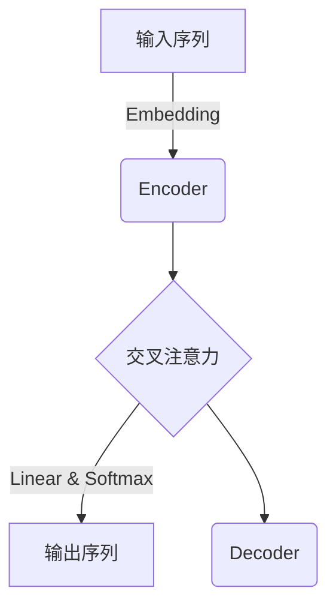

# 大语言模型原理基础与前沿 模型架构

## 1. 背景介绍

### 1.1 人工智能的发展历程

人工智能(AI)是当代科技发展的核心驱动力,其中自然语言处理(NLP)是AI的重要组成部分。随着计算能力和数据量的不断增长,大型语言模型(Large Language Model,LLM)应运而生,成为NLP领域的关键突破。

### 1.2 大语言模型的兴起

大语言模型是一种基于深度学习的技术,能够从海量文本数据中学习语言知识和模式,并生成看似人类水平的自然语言输出。自2018年以来,大型预训练语言模型取得了令人瞩目的成就,如GPT、BERT等模型在多项自然语言任务中表现出色。

### 1.3 大语言模型的重要性

大语言模型的出现极大推动了NLP的发展,为语音识别、机器翻译、问答系统、文本生成等应用提供了强大的技术支持。它们还为通用人工智能(AGI)的实现带来了新的可能性。因此,深入理解大语言模型的原理和架构对于科技发展至关重要。

## 2. 核心概念与联系

### 2.1 自然语言处理(NLP)

自然语言处理是人工智能的一个分支,旨在使计算机能够理解和生成人类语言。它包括多个子领域,如机器翻译、文本分类、信息检索、问答系统等。

### 2.2 深度学习

深度学习是机器学习的一个新兴方向,它基于对数据的表征学习,通过构建神经网络来模拟人脑的工作原理。深度学习在图像识别、语音识别、自然语言处理等领域表现出色。

### 2.3 语言模型

语言模型是自然语言处理的基础,用于计算一个语句或词序列的概率。传统的n-gram语言模型只考虑了有限的上下文,而神经网络语言模型能够捕捉长期依赖关系,更好地表征语义和上下文信息。

### 2.4 大语言模型(LLM)

大语言模型是一种基于transformer的大型神经网络语言模型,通过自监督预训练的方式在海量文本数据上学习语言知识。它们具有极强的泛化能力,可以应用于多种自然语言任务。

### 2.5 预训练与微调

大语言模型采用两阶段策略:首先在通用文本上进行自监督预训练,获取通用语言知识;然后针对特定任务进行微调(fine-tuning),使模型在该任务上表现出色。

## 3. 核心算法原理具体操作步骤

### 3.1 Transformer架构

Transformer是大语言模型的核心架构,它完全基于注意力机制,摒弃了RNN和CNN等传统结构。Transformer由编码器(Encoder)和解码器(Decoder)组成,能够高效地并行计算,显著提高了训练效率。



### 3.2 自注意力机制

自注意力机制是Transformer的核心,它允许每个位置的词向量去关注整个输入序列的信息。通过计算Query、Key和Value之间的相似性,模型可以自适应地为每个单词分配注意力权重。

$$\mathrm{Attention(Q, K, V) = \mathrm{softmax}(\frac{QK^T}{\sqrt{d_k}})V}$$

其中$Q$、$K$、$V$分别为Query、Key和Value的线性映射。

### 3.3 多头注意力

为了捕捉不同的关系,Transformer采用了多头注意力机制,将注意力分成多个子空间,每一个子空间对应一个注意力头,最后将所有头的结果拼接起来。

$$\mathrm{MultiHead(Q, K, V) = \mathrm{Concat(head_1, ..., head_h)}W^O}$$
$$\mathrm{where\ head_i = Attention(QW_i^Q, KW_i^K, VW_i^V)}$$

### 3.4 位置编码

由于Transformer没有递归或卷积结构,因此引入了位置编码来赋予序列元素位置信息。位置编码将根据位置不同对词向量进行改变,使模型能够捕捉元素在序列中的相对位置和顺序信息。

### 3.5 掩码机制

在解码器的自注意力层中,为了防止每个位置的词向量与后续位置的词向量产生关联,需要使用掩码机制将无效的连接关掉。而在解码器的交叉注意力层中,则需要遮蔽掉输出序列中的单词,只关注输入序列。

### 3.6 预训练目标

大语言模型通常采用自监督的方式进行预训练,常用的预训练目标包括:

1. **Masked Language Modeling(MLM)**: 随机掩码部分输入单词,模型需要预测被掩码的单词。
2. **Next Sentence Prediction(NSP)**: 判断两个句子是否相邻。
3. **Permutation Language Modeling(PLM)**: 预测打乱顺序的文本序列。

### 3.7 微调

在完成预训练后,大语言模型需要针对特定的下游任务(如文本分类、机器翻译等)进行微调。微调过程通过继续训练的方式,使模型在保留通用语言知识的同时,逐步适应目标任务。

## 4. 数学模型和公式详细讲解举例说明

### 4.1 自注意力计算

自注意力机制的核心是计算Query、Key和Value之间的相似性得分。给定一个序列$X=\{x_1, x_2, ..., x_n\}$,我们首先将其映射到Query、Key和Value空间:

$$\begin{aligned}
Q &= XW^Q\\
K &= XW^K\\
V &= XW^V
\end{aligned}$$

其中$W^Q\in\mathbb{R}^{d\times d_q}$、$W^K\in\mathbb{R}^{d\times d_k}$、$W^V\in\mathbb{R}^{d\times d_v}$为可训练的权重矩阵。

接下来,我们计算Query和Key之间的点积得分:

$$\mathrm{Scores}(Q, K) = \frac{QK^T}{\sqrt{d_k}}$$

其中$\sqrt{d_k}$是scale因子,用于防止内积值过大导致softmax饱和。

然后,通过softmax函数将得分转换为概率分布:

$$\mathrm{Attention}(Q, K, V) = \mathrm{softmax}(\mathrm{Scores}(Q, K))V$$

最终,自注意力的输出就是Value的加权和。

例如,给定一个长度为4的序列$X=\{x_1, x_2, x_3, x_4\}$,其中$x_2$是Query,我们计算$x_2$与整个序列$X$的自注意力权重:

$$\begin{aligned}
Q &= x_2W^Q\\
K &= \{x_1W^K, x_2W^K, x_3W^K, x_4W^K\}\\
V &= \{x_1W^V, x_2W^V, x_3W^V, x_4W^V\}\\
\mathrm{Scores}(Q, K) &= \frac{QK^T}{\sqrt{d_k}} = \begin{bmatrix}
                \alpha_{12} & \alpha_{22} & \alpha_{32} & \alpha_{42}
                \end{bmatrix}\\
\mathrm{Attention}(x_2) &= \mathrm{softmax}(\mathrm{Scores}(Q, K))V\\
                        &= \alpha_{12}x_1W^V + \alpha_{22}x_2W^V + \alpha_{32}x_3W^V + \alpha_{42}x_4W^V
\end{aligned}$$

其中$\alpha_{i2}$表示$x_2$对$x_i$的注意力权重。通过这种方式,模型可以自适应地为每个单词分配注意力权重,从而更好地建模长期依赖关系。

### 4.2 多头注意力计算

多头注意力机制将注意力分成多个子空间,每个子空间对应一个注意力头。具体来说,给定Query $Q$、Key $K$和Value $V$,我们将其线性映射到$h$个子空间:

$$\begin{aligned}
\mathrm{head}_i &= \mathrm{Attention}(QW_i^Q, KW_i^K, VW_i^V)\\
\mathrm{MultiHead}(Q, K, V) &= \mathrm{Concat(head_1, ..., head_h)}W^O
\end{aligned}$$

其中$W_i^Q\in\mathbb{R}^{d_q\times d_q/h}$、$W_i^K\in\mathbb{R}^{d_k\times d_k/h}$、$W_i^V\in\mathbb{R}^{d_v\times d_v/h}$和$W^O\in\mathbb{R}^{hd_v\times d_v}$为可训练参数。

通过多头注意力,模型可以从不同的子空间获取不同的关注信息,并将这些信息融合起来,从而提高模型的表达能力。

### 4.3 位置编码

由于Transformer没有递归或卷积结构,因此需要显式地为序列中的每个元素编码位置信息。位置编码是一个向量,其维度与词嵌入维度相同,将根据位置对词嵌入进行改变:

$$\mathrm{PE}_{(pos, 2i)} = \sin(pos/10000^{2i/d_{model}})$$
$$\mathrm{PE}_{(pos, 2i+1)} = \cos(pos/10000^{2i/d_{model}})$$

其中$pos$是单词在序列中的位置,而$i$是维度索引。通过对词嵌入加上位置编码,模型就能捕捉到单词在序列中的位置和顺序信息。

### 4.4 掩码机制

在解码器的自注意力层中,为了防止每个位置的单词与后续位置的单词产生关联,需要使用掩码机制将无效的连接关掉。具体来说,给定一个长度为$n$的序列,我们构造一个$n\times n$的掩码矩阵$M$:

$$M_{ij} = \begin{cases}
0, & \text{if }i \leq j\\
-\infty, & \text{if }i > j
\end{cases}$$

然后,在计算自注意力得分时,我们将无效连接的得分设置为$-\infty$:

$$\mathrm{Scores}(Q, K) = \mathrm{Scores}(Q, K) + M$$

这样一来,在softmax后,无效连接的注意力权重就会被置为0。

而在解码器的交叉注意力层中,我们需要遮蔽掉输出序列中的单词,只关注输入序列。假设输入序列长度为$m$,输出序列长度为$n$,我们构造一个$n\times m$的掩码矩阵$M'$,其中所有元素均为$0$。然后,在计算交叉注意力得分时:

$$\mathrm{Scores}(Q, K) = \mathrm{Scores}(Q, K) + M'$$

这样一来,输出序列中的单词就只会关注输入序列,而不会被自己影响。

## 5. 项目实践:代码实例和详细解释说明

以下是一个使用PyTorch实现Transformer的简单示例,用于机器翻译任务。为了简化,我们只实现了编码器(Encoder)部分。

```python
import torch
import torch.nn as nn
import math

# 辅助子层连接
class SublayerConnection(nn.Module):
    def __init__(self, size, dropout):
        super(SublayerConnection, self).__init__()
        self.norm = nn.LayerNorm(size)
        self.dropout = nn.Dropout(dropout)

    def forward(self, x, sublayer):
        return x + self.dropout(sublayer(self.norm(x)))

# 多头注意力
class MultiHeadedAttention(nn.Module):
    def __init__(self, h, d_model, dropout=0.1):
        super(MultiHeadedAttention, self).__init__()
        assert d_model % h == 0
        self.d_k = d_model // h
        self.h = h
        self.linears = nn.ModuleList([nn.Linear(d_model, d_model) for _ in range(4)])
        self.attn = None
        self.dropout = nn.Dropout(p=dropout)
        
    def attention(self, query, key, value, mask=None):
        scores = torch.matmul(query, key.transpose(-2, -1)) / math.sqrt(query.size(-1))
        if mask is not None:
            scores = scores.masked_fill(mask == 0, -1e9)
        p_attn = torch.softmax(scores, dim = -1)
        return torch.matmul(p_